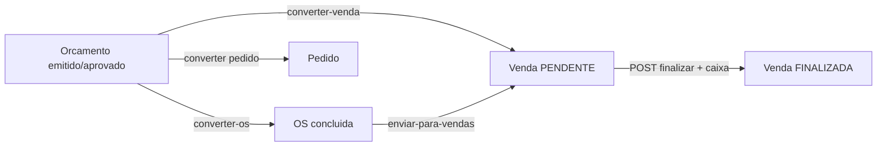
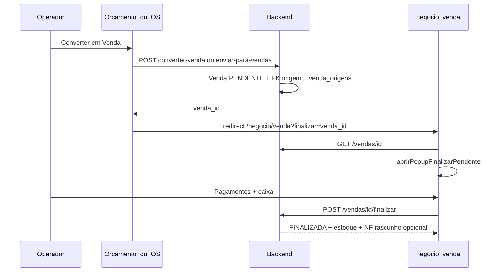

# Plano revisado: Orçamento · OS · Venda (nível profissional)

## Veredicto sobre o plano anterior

O plano em `[.cursor/plans/plano_alinhamento_orcamento_os_venda.plan.md](.cursor/plans/plano_alinhamento_orcamento_os_venda.plan.md)` está **direcionalmente correto** (funil, reutilizar APIs existentes, popup de pagamento). Porém, após validação no código, há **lacunas técnicas, imprecisões de RBAC e itens ausentes** que impediriam execução profissional sem surpresas em produção.

Este documento **substitui** o plano anterior como referência de implementação.

---

## Decisões de produto (confirmadas)


| Decisão                                | Escolha                                                                                                           |
| -------------------------------------- | ----------------------------------------------------------------------------------------------------------------- |
| Menu Converter no Orçamento            | **OS** e **Venda** no menu principal; **Pedido** em submenu **Avançado**                                          |
| Cliente na conversão Orçamento → Venda | **Opcional** (mantém regra atual da API)                                                                          |
| Cliente na conversão Orçamento → OS    | **Obrigatório** (já enforced em `[orcamento_conversao_service.py](app/services/orcamento_conversao_service.py)`)  |
| Escopo multi-brand                     | Funil Orç/OS/Venda = módulo `**core`** — **Ibix e Solumática**; marketplace **fora** deste plano (403 Solumática) |


---

## Conformidade multi-brand (Ibix · Solumática)

Referência: [MAPA_MULTIBRAND.md](MAPA_SISTEMA/MAPA_MULTIBRAND.md), regras `.cursor/rules/multibrand-no-hardcode.mdc`, `modulo-gating.mdc`, `tenant-rls.mdc`, `conflito-dados-migracao.mdc`.

### Escopo por marca


| Marca             | Módulo                 | Orçamento · OS · Venda                                   |
| ----------------- | ---------------------- | -------------------------------------------------------- |
| **Ibix** (origem) | `core` + `marketplace` | Funil completo em `/negocio/`*                           |
| **Solumática**    | `**core` apenas**      | **Mesmo funil** (PDV local); vitrine/marketplace **403** |


Conversões e pagamento são **PDV/negócios locais** — não dependem de `marketplace`. Não redirecionar para Ibix em erro; **403 explícito** se módulo indisponível.

### Três portas (gating)


| Porta                                                            | O que validar neste plano                                                             |
| ---------------------------------------------------------------- | ------------------------------------------------------------------------------------- |
| **Menu HTML**                                                    | Itens Orçamento/OS/Venda visíveis quando `core` ∈ `brand_module_slugs` (ambas marcas) |
| **Rotas HTML** `/negocio/orcamentos`, `/ordem-servico`, `/venda` | RBAC `negocios.`*; **sem** gate marketplace                                           |
| **API** `/api/v1/orcamentos`, `/ordens-servico`, `/vendas`       | Escopo tenant (`ClienteScope`) + RBAC; conversão **nunca** cross-tenant/cross-brand   |


### Branding (sem hardcode)

**Proibido** em templates/JS deste escopo: literais `"Ibix"`, `"PDV Ibix"`, `"Solumática"`, URLs fixas de logo.

**Obrigatório:**

- Contexto PDV via `get_template_context` → `{{ brand.nome_exibicao }}`, `{{ brand.logo_url }}`, `{{ brand.favicon_url }}` (`[base.html](app/templates/base.html)`)
- Corrigir títulos hardcoded hoje, ex.: `[orcamentos/index.html](app/templates/meu_negocio/orcamentos/index.html)`, `[ordem_de_servico/index.html](app/templates/meu_negocio/ordem_de_servico/index.html)`, `[vendas/index.html](app/templates/meu_negocio/vendas/index.html)` — usar `Orçamentos | {{ brand.nome_exibicao }}` (ou só o sufixo, respeitando `base.html`)
- PDF/impressão (Fase 5): **somente** `brand.`* + empresa fiscal do tenant — nunca asset Ibix fixo

### Tenant, RLS e migrações (tabelas novas)

Tabelas `**venda_origens`** e `**documento_impressao_templates`**:


| Requisito           | Detalhe                                                                                                                                                             |
| ------------------- | ------------------------------------------------------------------------------------------------------------------------------------------------------------------- |
| `tenant_id`         | NOT NULL + FK + índice composto iniciando por `tenant_id`                                                                                                           |
| RLS                 | Política `rls_{tabela}_tenant` **na mesma migration** que cria a tabela (`ENABLE ROW LEVEL SECURITY` explícito — br35 não aplica automaticamente a tabelas futuras) |
| Sessão DB           | `open_db_session()` / `get_db` — `SET LOCAL app.current_tenant`; **nunca** `SessionLocal()` cru em workers                                                          |
| Workers Celery      | `worker_db_session(tenant_id=...)` se houver job de PDF/backfill                                                                                                    |
| Validação conversão | Orçamento, OS e venda devem pertencer ao **mesmo tenant**; rejeitar 403/404 cross-tenant                                                                            |
| Pré-migração        | `scripts/audit_multibrand_pre_migration.py` antes de constraints estruturais                                                                                        |
| Expand-contract     | Colunas nullable → backfill → NOT NULL (`[conflito-dados-migracao.mdc](.cursor/rules/conflito-dados-migracao.mdc)`)                                                 |


`ordem_servico` **não** tem `tenant_id` hoje — escopo via `cliente_id` + `ClienteScope`; ao gravar `orcamento_origem_id`, validar que orçamento e OS compartilham escopo de estabelecimento/tenant lógico.

### Cookies, CORS e redirect pós-conversão

- Redirect `/negocio/venda?finalizar=` permanece **no mesmo host** (cookie host-only — `[brand_cookie.py](app/core/brand_cookie.py)`)
- Não usar `APP_URL` fixo quando `brand.seo_base_url` estiver definido

### Matriz de QA multi-brand (obrigatória)


| Cenário                                    | Ibix               | Solumática |
| ------------------------------------------ | ------------------ | ---------- |
| Funil Orç → Venda + popup pagamento        | ✅                  | ✅          |
| Funil Orç → OS → Venda + rastreio cadeia   | ✅                  | ✅          |
| PDF orçamento/OS com logo/nome da marca    | ✅                  | ✅          |
| `/loja` ou API marketplace                 | ✅ (se entitlement) | **403**    |
| Tenant marca A não vê dados tenant marca B | ✅ RLS              | ✅ RLS      |


---

## Estado atual validado (as-is)




| Item                                         | Status real no código                                                                                                                                                                         |
| -------------------------------------------- | --------------------------------------------------------------------------------------------------------------------------------------------------------------------------------------------- |
| APIs de conversão                            | Implementadas: `[orcamentos.py](app/api/v1/orcamentos.py)` L397–435, `[ordens_servico.py](app/api/v1/ordens_servico.py)` L384–409                                                             |
| Validação expirado                           | **Sim** — `data_validade < today` em converter-os/venda/pedido                                                                                                                                |
| Orçamento → Venda                            | Cria `PENDENTE`, FK `vendas.orcamento_id`, **sem baixa de estoque** (`[orcamento_conversao_service.py](app/services/orcamento_conversao_service.py)` L101–166)                                |
| OS → Venda                                   | Cria `PENDENTE`, FK `ordem_servico_id` unique, vincula `nota_servico_id` rascunho se existir (`[ordem_servico_venda_service.py](app/services/ordem_servico_venda_service.py)`)                |
| Popup pagamento                              | Existe: `abrirPopupFinalizarPendente(venda)` em `[vendas/index.html](app/templates/meu_negocio/vendas/index.html)` L1582 — **exige objeto venda** (`id`, `desconto`, `acrescimo`)             |
| Deep-link `?finalizar=`                      | **Não implementado**                                                                                                                                                                          |
| Origem na listagem Vendas                    | Só **OS** (`ordem_servico_codigo`); **orçamento ausente**; cadeia Orç→OS→Venda **perdida** (OS sem FK orçamento)                                                                              |
| Rastreio estruturado                         | FKs parciais em `vendas` (`orcamento_id`, `ordem_servico_id`); **sem** tabela de cadeia; origem indireta só em texto (`observacoes`)                                                          |
| UI Orçamento modal                           | Alinhado à OS via `[_modal_orcamento.html](app/templates/meu_negocio/orcamentos/_modal_orcamento.html)`                                                                                       |
| UI Nova Venda                                | Modal próprio, visual diferente (`[vendas/index.html](app/templates/meu_negocio/vendas/index.html)`)                                                                                          |
| Audit log conversão                          | OS → Venda **sim** (`audit_action`); Orçamento → Venda/OS **não**                                                                                                                             |
| Permissão `negocios.orcamento:converter`     | **Não existe** — seed só `:visualizar` e `:criar` (`[ww33xx137n3x1_seed_permissoes_orcamento_pedido.py](app/database/migrations/versions/ww33xx137n3x1_seed_permissoes_orcamento_pedido.py)`) |
| Permissão `negocios.venda:finalizar`         | **Não existe** — só `:visualizar` no seed; gate atual = `forbid_cliente_access` + escopo                                                                                                      |
| PDF / impressão Orçamento                    | **Parcial** — `GET /orcamentos/{id}/pdf` com HTML **fixo** em `[pdf_orcamento_pedido.py](app/services/pdf_orcamento_pedido.py)`; botão PDF na listagem                                        |
| PDF / impressão OS (Negócios)                | **Inexistente** — sem endpoint `/ordens-servico/{id}/pdf` nem botão Imprimir na UI                                                                                                            |
| Template configurável pelo usuário           | **Não existe** para Orçamento/OS de Negócios (diferente de `ManutencaoTemplateOS` do módulo referência/form builder)                                                                          |
| Redirect pós-conversão Orç→Venda             | **Não** — `[orcamentos/index.html](app/templates/meu_negocio/orcamentos/index.html)` usa `alert` + `carregar()` (L252–254)                                                                    |
| Redirect pós-conversão OS→Venda              | **Não** — `[ordem_de_servico/index.html](app/templates/meu_negocio/ordem_de_servico/index.html)` redireciona só para `/negocio/venda` (L3073, L3119), **sem** `?finalizar=`                   |
| Menu Converter orçamento                     | **Pedido ainda no menu principal** (L169–171); label **"Venda pendente"** em vez de "Venda"                                                                                                   |
| Redirect pós Orç→OS                          | **Não** — só `alert` + recarrega listagem (L276–279); sem link para abrir a OS criada                                                                                                         |
| Modal converter OS (orçamento)               | Ainda **Bootstrap Modal** (`bootstrap.Modal`) — inconsistente com regra de modais custom                                                                                                      |
| RLS tabelas novas pós-`br35`                 | Migrações **posteriores** a `br35_rls_policies` devem incluir `ENABLE ROW LEVEL SECURITY` + política **explicitamente** (br35 não re-varre tabelas futuras)                                   |
| `tenant_id` em backfill `venda_origens`      | `vendas` **não** tem `tenant_id` — resolver via `usuarios.tenant_id` do `vendedor_id` (ou `current_user.tenant_id` na conversão)                                                              |
| Registro origem venda manual                 | `POST /vendas/pedido-pendente` tem `audit_action` mas **sem** `venda_origens` — todos os pontos de criação de venda precisam chamar `registrar_origem_venda`                                  |
| Router `documentos-impressao`                | **Não existe** — registrar em `[main.py](main.py)` na Fase 5                                                                                                                                  |
| Deep-link OS "Finalizar venda" (modal caixa) | Fluxo `finalizarVendaCaixaOS` conclui OS + envia vendas + redirect — **segundo** fluxo `enviarOrdemParaVendas` — **ambos** precisam `?finalizar=`                                             |
| **UX Orçamento vs sistemas atuais / OS**     | Formulário tem obs./condições/itens; **listagem mínima**; **sem modal Detalhes** read-only; sem vendedor, cabeçalho emitente, rastreio conversão na UI                                        |


---

## Lacunas corrigidas (o que faltava no plano original)

### 1. Deep-link não pode chamar o popup só com `venda_id`

`abrirPopupFinalizarPendente(venda)` precisa do **objeto completo**. Implementação correta na Fase 1:

1. Ler `?finalizar={id}` em `[vendas/index.html](app/templates/meu_negocio/vendas/index.html)`
2. `GET /api/v1/vendas/{id}` (404 se fora do escopo — **segurança OK**)
3. Validar `status === 'PENDENTE'`
4. Chamar `abrirPopupFinalizarPendente(vendaJson)`
5. `history.replaceState` para limpar query param (evitar reabrir ao F5)

### 2. Caixa aberto é pré-requisito real da finalização

`[finalizar_venda_pendente](app/api/v1/vendas.py)` L871 chama `_validar_turno_caixa_venda`: exige **turno aberto**, **empresa fiscal** e caixa da mesma empresa. O popup já chama `carregarCaixasPopup()`, mas o plano deve incluir:

- Mensagem clara se **nenhum caixa aberto** (link para `/negocio/caixa`)
- Teste de aceite: conversão com caixa fechado → venda fica PENDENTE, operador abre caixa e finaliza depois

### 3. Bug de totais na conversão Orçamento → Venda

Header da venda usa `o.desconto` (muitas vezes **0**), enquanto descontos estão em `orcamento_itens.desconto_valor`. Corrigir em `[converter_orcamento_em_venda_pendente](app/services/orcamento_conversao_service.py)`: recalcular `subtotal`, `desconto`, `total` a partir dos itens antes de persistir.

### 4. Rastreio de origem da venda (Orçamento · OS · cadeia)

**Problema:** FKs em `vendas` cobrem só o **pai imediato**. Venda via **Orçamento → OS → Venda** perde o orçamento (OS não tem `orcamento_id`; serviço OS→Venda não propaga `orcamento_id`). Relatórios e listagem não conseguem responder “esta venda veio de qual orçamento?”.

**Autorização:** criar **novas tabelas** e rodar **migração Alembic** no ambiente virtual (`source .venv/bin/activate && alembic upgrade head`).

#### 4.1 Modelo de dados (migration)

**A) Coluna em `ordem_servico` (propagação na cadeia)**


| Coluna                | Tipo                    | Quando preencher                                                                                                  |
| --------------------- | ----------------------- | ----------------------------------------------------------------------------------------------------------------- |
| `orcamento_origem_id` | FK `orcamentos.id` NULL | Conversão Orçamento → OS em `[converter_orcamento_em_ordem_servico](app/services/orcamento_conversao_service.py)` |


Índice `(tenant_id, orcamento_origem_id)` se `ordem_servico` tiver `tenant_id`; senão `(cliente_id, orcamento_origem_id)`.

**B) Nova tabela `venda_origens`** (rastreio imutável, tenant + RLS)


| Campo           | Descrição                                                            |
| --------------- | -------------------------------------------------------------------- |
| `id`            | PK                                                                   |
| `tenant_id`     | NOT NULL + FK `tenants.id` + política RLS `rls_venda_origens_tenant` |
| `venda_id`      | FK `vendas.id` NOT NULL                                              |
| `tipo_origem`   | `manual`                                                             |
| `documento_id`  | ID do documento origem (NULL se `manual`)                            |
| `documento_ref` | Número/código denormalizado (`ORC-2026-00042`, `OS-2026-001`)        |
| `papel`         | `imediata` (pai direto)                                              |
| `usuario_id`    | Quem executou a conversão                                            |
| `created_at`    | Timestamp da conversão                                               |


Índices: `(tenant_id, venda_id)`, `(tenant_id, tipo_origem, documento_id)`.

**Regras de preenchimento (services de conversão):**


| Fluxo                             | `vendas.`* FK                                       | Linhas em `venda_origens`                                 |
| --------------------------------- | --------------------------------------------------- | --------------------------------------------------------- |
| Venda manual (balcão)             | —                                                   | 1× `manual`, papel `imediata` (= `raiz`)                  |
| Orçamento → Venda                 | `orcamento_id`                                      | 1× `orcamento`, papel `imediata` + `raiz` (mesmo doc)     |
| Orçamento → OS                    | `ordem_servico.orcamento_origem_id`                 | (ainda sem venda)                                         |
| OS → Venda (OS manual)            | `ordem_servico_id`                                  | 1× `ordem_servico`, papel `imediata` + `raiz`             |
| OS → Venda (OS veio de orçamento) | `ordem_servico_id` + `**orcamento_id`** (propagado) | 2 linhas: `ordem_servico`/`imediata` + `orcamento`/`raiz` |


Função central: `registrar_origem_venda(db, venda, *, usuario_id, imediata, raiz=None)` em `conversao_venda_service.py` — **validar mesmo tenant** em toda a cadeia (multi-brand).

**C) Backfill (mesma migration ou script idempotente)**

- Vendas com `orcamento_id` → inserir linha `orcamento`/`raiz`+`imediata`
- Vendas com `ordem_servico_id` → linha `ordem_servico`/`imediata`; se OS tem `orcamento_origem_id` (após coluna), linha `orcamento`/`raiz` + preencher `vendas.orcamento_id` onde NULL
- Demais → `manual`/`imediata`

#### 4.2 API e UI

`**VendaResponse` / listagem SQL** — expor:

```python
origem_imediata_tipo: Optional[str]      # orcamento | ordem_servico | manual
origem_imediata_ref: Optional[str]         # ORC-… | OS-…
origem_raiz_tipo: Optional[str]
origem_raiz_ref: Optional[str]
orcamento_id: Optional[int]
numero_orcamento: Optional[str]
ordem_servico_id: Optional[int]
ordem_servico_codigo: Optional[str]
origem_cadeia: Optional[list[dict]]      # breadcrumb ordenado para detalhe
```

**Listagem vendas** (`[vendas/index.html](app/templates/meu_negocio/vendas/index.html)`): badge/link de origem:

- `Origem: Orçamento ORC-2026-00042` (link `/negocio/orcamentos?detalhe={id}` quando aplicável)
- `Origem: OS OS-2026-001` (link ordem de serviço)
- Cadeia: `Orçamento ORC-… → OS OS-… → Venda` no modal Detalhes

**Detalhe venda:** seção **Rastreio de origem** com cadeia completa + timestamps de conversão (de `venda_origens.created_at`).

**Relatórios (opcional Fase 2b):** filtro `origem_tipo` na listagem API.

#### 4.3 Auditoria

- `audit_action` nas conversões de orçamento (paridade com OS → Venda)
- Payload audit inclui `venda_id`, `origem_imediata`, `origem_raiz`

### 5. RBAC — usar permissões reais


| Ação                | Permissão efetiva hoje             | Recomendação                                                 |
| ------------------- | ---------------------------------- | ------------------------------------------------------------ |
| Converter orçamento | `:criar` + `forbid_cliente_access` | Manter; **não** criar `:converter` sem migration             |
| Enviar OS → venda   | escopo + `forbid_cliente_access`   | Manter                                                       |
| Finalizar venda     | escopo + caixa                     | Documentar; opcional futuro: seed `negocios.venda:finalizar` |


### 6. Auditoria e idempotência

- Adicionar `audit_action` nas conversões de orçamento (paridade com OS)
- UI: desabilitar botão Converter durante `POST` (evitar duplo clique)
- Estado terminal: orçamento `convertido` **não reverte** se operador abandona popup — venda PENDENTE permanece; finalizar ou `POST /cancelar` depois

### 7. Fiscal

- OS → Venda: propaga `nota_servico_id` (NFS-e rascunho) — **manter**
- Orçamento → Venda: sem NF automática hoje; ao finalizar, `_criar_rascunho_nfe_ao_finalizar_venda` pode criar NF-e rascunho — **documentar**, não inventar sucesso SEFAZ
- `origem_documento` fiscal: usar `orcamento` / `ordem_servico` quando aplicável (fase posterior)

### 8. Caminhos de partial compartilhado

Corrigir paths do plano anterior: usar `app/templates/meu_negocio/_partials/` (novo) em vez de `negocios/`.

### 9. Lacunas adicionais (revisão plano × código)


| #    | Lacuna                                                                                                                         | Correção no plano                                                                                                                                                                             |
| ---- | ------------------------------------------------------------------------------------------------------------------------------ | --------------------------------------------------------------------------------------------------------------------------------------------------------------------------------------------- |
| 9.1  | `**GET /vendas/{id}`** retorna `dict` (não `VendaResponse`); inclui `desconto`, `acrescimo`, `itens` — suficiente para o popup | Deep-link usar `**authFetch('/api/v1/vendas/' + id)`** (padrão já usado em `[vendas/index.html](app/templates/meu_negocio/vendas/index.html)`)                                                |
| 9.2  | Venda **não PENDENTE** em `?finalizar=`                                                                                        | Toast informativo + limpar query; **não** abrir popup                                                                                                                                         |
| 9.3  | `**orcamento_origem_id` na OS** após `OrdemServicoService.criar_ordem` (commit interno)                                        | `UPDATE ordem_servico SET orcamento_origem_id = :oid WHERE id = :os_id` **antes** de marcar orçamento `convertido`                                                                            |
| 9.4  | Backfill `**ordem_servico.orcamento_origem_id`** histórico                                                                     | `UPDATE ordem_servico os SET orcamento_origem_id = o.id FROM orcamentos o WHERE o.convertido_em_ordem_servico_id = os.id`                                                                     |
| 9.5  | Backfill `**venda_origens.tenant_id`**                                                                                         | `JOIN usuarios u ON u.id = v.vendedor_id` → `u.tenant_id`; registros sem tenant → log + revisão manual (fail-safe, não chute)                                                                 |
| 9.6  | Unicidade `**venda_origens`**                                                                                                  | `UNIQUE (venda_id, papel, tipo_origem, documento_id)` — evita duplicata em retry                                                                                                              |
| 9.7  | **Todos os entry points** de criação de venda                                                                                  | `registrar_origem_venda` em: `pedido-pendente`, conversão orçamento, OS→venda; venda balcão finalizada direto → `manual` no commit                                                            |
| 9.8  | Escopo multi-estabelecimento                                                                                                   | Orçamento: `cliente_id` = estabelecimento emissor; venda convertida usa `destinatario_id` como `cliente_id` — manter `_venda_visivel_no_escopo` e validar produtos do estabelecimento correto |
| 9.9  | `**VendaResponse`** não expõe `orcamento_id`, `ordem_servico_id`                                                               | Estender schema **e** `_venda_response_orm` na Fase 2 (não só SQL da listagem)                                                                                                                |
| 9.10 | Permissão conversão orçamento                                                                                                  | Endpoints usam `forbid_cliente_access` + escopo; **não** checam `:criar` explicitamente — manter; documentar que Subcliente/Técnico bloqueados pelo middleware                                |
| 9.11 | Pós Orç→OS UX                                                                                                                  | Após sucesso: confirmar **"Abrir ordem de serviço?"** → `/negocio/ordem-servico` (selecionar OS por `ordem_servico_id` retornado) — **não** converter auto para venda                         |
| 9.12 | PDF orçamento atual                                                                                                            | `[_dados_orcamento_para_pdf](app/api/v1/orcamentos.py)` ainda tem labels fixos (`titulo_unidade`) — refatorar na Fase 5 com template + brand                                                  |


### 10. Orçamento — listagem e detalhes (paridade ERP / OS)

**Veredicto:** o **formulário** (modal Novo/Editar) está **parcialmente** alinhado a sistemas atuais (cliente, validade, observações, condições de pagamento, itens, resumo financeiro). A **listagem** e a **visualização de proposta emitida** **não** estão no padrão de ERP/OS do próprio sistema.

#### 10.1 O que sistemas atuais (e a OS) exibem vs orçamento hoje


| Bloco                                                   | OS (`preencherDetalhesOrdem`)       | Orçamento hoje                                                                                 |
| ------------------------------------------------------- | ----------------------------------- | ---------------------------------------------------------------------------------------------- |
| **Cabeçalho / emitente (CA = estabelecimento emissor)** | Cliente da OS                       | Listagem: coluna **Unidade** (`cliente_nome`); form: **oculto** (`orcamentoCatalogoClienteId`) |
| **Consumidor / cliente final**                          | Nome no detalhe                     | Listagem + form autocomplete ✓                                                                 |
| **Responsável / vendedor**                              | `responsavel_nome`                  | **Ausente** (API não expõe `vendedor_nome` na listagem)                                        |
| **Identificação**                                       | Código OS + status                  | Número ORC + status ✓ (listagem)                                                               |
| **Datas**                                               | Abertura / conclusão                | Só **Criado** + **Validade** — **sem data emissão** dedicada                                   |
| **Itens**                                               | Lista read-only no detalhe          | Só no modal editável; **sem detalhe read-only**                                                |
| **Financeiro**                                          | Subtotal / desconto / total         | Resumo só no modal; listagem só **Total**                                                      |
| **Observações**                                         | Seção dedicada no detalhe           | Campo no form ✓; **não aparece** na listagem/detalhe                                           |
| **Condições comerciais**                                | —                                   | Campo no form ✓; **não aparece** na listagem/detalhe                                           |
| **Rastreio conversão**                                  | `venda_id`, ações                   | IDs crus na coluna consumidor (`#123`) — sem links/números amigáveis                           |
| **Ação Detalhes**                                       | Modal `#modalDetalhesOrdemOSCustom` | **Inexistente** — emitido/aprovado só **PDF** ou converter                                     |
| **Marca (multibrand)**                                  | —                                   | Título `                                                                                       |


#### 10.2 Lacunas de API (`OrcamentoListResponse` / detalhe)

Campos existentes no model/schema `**OrcamentoResponse`** mas **ausentes na listagem**:

- `vendedor_id` / `**vendedor_nome`** (join `usuarios`)
- `observacoes`, `condicoes_pagamento` (truncar na listagem; completos no detalhe)
- `subtotal`, `desconto`, `acrescimo` (listagem pode mostrar total + badge desconto)
- `**qtd_itens`** (count)
- Conversão: `**numero_orcamento`**, códigos OS/venda/pedido destino (não só IDs)

Opcional (ERP maduro): `data_emissao` preenchida em `POST /emitir` (hoje só muda `status`).

#### 10.3 Entrega planejada — Fase 3 (Orçamento)

**A) Modal Detalhes** (`#modalDetalhesOrcamentoCustom`) — espelhar layout OS (`resumo-os-card`):

1. **Cabeçalho:** número, status, validade (+ alerta se expirado/próximo)
2. **Emitente (CA/unidade):** `cliente_nome` + contexto marca (`{{ brand.nome_exibicao }}` no shell)
3. **Consumidor:** `destinatario_nome`
4. **Responsável:** vendedor
5. **Datas:** criado, validade, conversão (se `convertido`)
6. **Peças e serviços:** tabela read-only (código, descrição, qtd, unit., subtotal)
7. **Resumo financeiro:** subtotal, desconto, total
8. **Condições de pagamento** e **Observações** (seções separadas, `white-space: pre-wrap`)
9. **Rastreio:** links para Pedido / OS / Venda convertidos
10. **Footer ações:** PDF · Editar (só rascunho) · Emitir (rascunho) · Converter · Fechar

**B) Listagem** `[orcamentos/index.html](app/templates/meu_negocio/orcamentos/index.html)`:

- Botão **Detalhes** em todas as linhas (abre modal read-only)
- Colunas sugeridas: Número · Unidade · Consumidor · **Vendedor** · Validade · Status · **Itens** · Total · Criado · Ações
- Tooltip ou sublinha com **observações** truncadas (opcional)
- Filtros adicionais: **período** (validade/criado), **busca** consumidor/número (query API)

**C) Form Novo/Editar** (ajuste leve):

- Exibir **Unidade emissora** read-only (nome do estabelecimento CA — `cliente_id` resolvido), não só hidden
- Exibir **Vendedor** read-only (usuário logado / `vendedor_nome` ao editar)

**DoD §10:** Orçamento emitido consultável no **Detalhes** com mesma riqueza da OS (dados, obs., condições, itens, totais, rastreio) — sem depender só do PDF.

---

## Arquitetura alvo

### Funil comercial


| Origem                                     | Destinos                                 | Regra                              |
| ------------------------------------------ | ---------------------------------------- | ---------------------------------- |
| Orçamento (emitido/aprovado, não expirado) | OS **ou** Venda **ou** Pedido (Avançado) | Uma conversão por orçamento        |
| OS (concluída)                             | Venda                                    | 1:1 (`uq_vendas_ordem_servico_id`) |
| Venda PENDENTE                             | FINALIZADA                               | Pagamento + caixa + estoque        |


### Fluxo unificado conversão → pagamento




---

## Fases de implementação

### Fase 1 — Conversão com pagamento imediato (prioridade, 1–2 dias)

**Orçamento** `[orcamentos/index.html](app/templates/meu_negocio/orcamentos/index.html)`:

- Reorganizar dropdown Converter: **Ordem de serviço**, **Venda**; **Pedido** em submenu **Avançado** (hoje Pedido está no menu principal — L169)
- Renomear label **"Venda pendente"** → **"Venda"**
- Após `POST /converter-venda`: `window.location.href = '/negocio/venda?finalizar=' + msg.venda_id` (substituir `alert` + `carregar()` — L252–254)
- Após `POST /converter-os`: opcional confirm **"Abrir ordem de serviço?"** → redirect `/negocio/ordem-servico` com OS selecionada (`ordem_servico_id` da resposta)
- Migrar `#modalConverterOs` de Bootstrap Modal para overlay custom (ou adiar para Fase 3 se bloquear — **documentar**)

**OS** `[ordem_de_servico/index.html](app/templates/meu_negocio/ordem_de_servico/index.html)`:

- `**enviarOrdemParaVendas`** (L3119): redirect `?finalizar={payload.id}`
- `**finalizarVendaCaixaOS`** (L3073): idem após `enviar-para-vendas`
- Validar botão **Enviar para vendas** no modal Detalhes quando OS `concluida` e sem `venda_id`

**Vendas** `[vendas/index.html](app/templates/meu_negocio/vendas/index.html)`:

- No `DOMContentLoaded`, ler `?finalizar=` → `authFetch('/api/v1/vendas/' + id)` → se `status === 'PENDENTE'`, `abrirPopupFinalizarPendente(venda)`; senão toast
- `history.replaceState` para limpar query param
- Tratar caixa fechado com mensagem acionável (link `/negocio/caixa`)

**DoD Fase 1:** Orçamento e OS → popup de pagamento sem busca manual; **dois** fluxos OS cobertos.

---

### Fase 2 — Backend, rastreio de origem e rastreabilidade (2–3 dias)

**Migração Alembic** (autorizada — rodar no venv):

1. `ordem_servico.orcamento_origem_id` (FK nullable) + índice `(cliente_id, orcamento_origem_id)`
2. Tabela `venda_origens` + `**ENABLE ROW LEVEL SECURITY`** + política `rls_venda_origens_tenant` + índices + `UNIQUE (venda_id, papel, tipo_origem, documento_id)`
3. Backfill idempotente: `orcamento_origem_id` via join `orcamentos.convertido_em_ordem_servico_id`; `venda_origens` via FKs existentes + `usuarios.tenant_id`

**Ordem da revisão Alembic:** confirmar `down_revision` = head atual antes de criar revision; rodar `alembic upgrade head` no venv.

**Services:**

1. `**app/services/conversao_venda_service.py`** — extrair lógica de `[orcamento_conversao_service](app/services/orcamento_conversao_service.py)` e `[ordem_servico_venda_service](app/services/ordem_servico_venda_service.py)`; endpoints delegam ao service
2. `**registrar_origem_venda`** — gravar `venda_origens` em toda conversão; propagar `orcamento_id` na venda quando OS veio de orçamento
3. Atualizar `converter_orcamento_em_ordem_servico` → preencher `orcamento_origem_id` na OS
4. **Corrigir totais/desconto** na conversão orçamento → venda
5. **API listagem/detalhe vendas:** join `orcamentos` + `venda_origens`; campos `origem_`*, `origem_cadeia`; estender `**VendaResponse`** + `_venda_response_orm`
6. `**audit_action`** nas conversões de orçamento (paridade OS→Venda; incluir `tenant_id` de `current_user`)
7. `**registrar_origem_venda`** também em `POST /vendas/pedido-pendente` (origem `manual`)

**DoD Fase 2:**

- Listagem vendas mostra origem **imediata** e **raiz** (OS, Orçamento, ou cadeia Orç→OS→Venda)
- Venda convertida via OS-originada-de-orçamento tem `vendas.orcamento_id` preenchido
- Migration aplicada no ambiente virtual sem erro
- Totais da venda convertida batem com orçamento

---

### Fase 3 — UI idêntica nos três módulos + detalhes orçamento (3–5 dias)

Extrair partials em `app/templates/meu_negocio/_partials/`:


| Arquivo                     | Conteúdo                                            |
| --------------------------- | --------------------------------------------------- |
| `modal_negocio_shell.css`   | Classes `modal-os-`*, autocomplete, scroll          |
| `modal_pecas_servicos.html` | Seção peças (busca, tabelas, resumo desconto)       |
| `modal_pecas_servicos.js`   | Estado itens, lock valor, `/api/v1/vendas/produtos` |


Refatorar consumidores:

- `[_modal_orcamento.html](app/templates/meu_negocio/orcamentos/_modal_orcamento.html)` — já ~90% alinhado
- `[ordem_de_servico/index.html](app/templates/meu_negocio/ordem_de_servico/index.html)` — referência
- `[vendas/index.html](app/templates/meu_negocio/vendas/index.html)` — modal Nova Venda no mesmo shell

**Multi-brand (mesma fase):** remover `| PDV Ibix` hardcoded nos `` dos três módulos; usar `{{ brand.nome_exibicao }}`. Confirmar sidebar/menu com gating `core`.

**Orçamento — listagem e detalhes (§10):**

- Modal `**#modalDetalhesOrcamentoCustom`** + `preencherDetalhesOrcamento()` (paridade `preencherDetalhesOrdem`)
- Enriquecer `**OrcamentoListResponse`** + listagem (vendedor, qtd itens, botão Detalhes)
- Unidade emissora visível no form (read-only)

Campos plug-in por módulo: Orçamento (validade, condições), OS (tipo), Venda (pagamento inline no finalizar).

Seguir `[MAPA_DE_REGRAS.md](MAPA_SISTEMA/MAPA_DE_REGRAS.md)`: modais custom (`display` + overlay), sem Bootstrap Modal para novos fluxos.

**DoD Fase 3:** Checklist visual passa nos três modais; orçamento emitido abre **Detalhes** com CA/unidade, consumidor, vendedor, itens, totais, observações e condições.

---

### Fase 4 — Documentação e QA (0,5–1 dia)

- Atualizar `[MAPA_DO_SISTEMA.md](MAPA_SISTEMA/MAPA_DO_SISTEMA.md)` §11 (status frontend/conversões)
- Atualizar `[MAPA_DE_API.md](MAPA_SISTEMA/MAPA_DE_API.md)` §18 e § Negócios (origem orçamento na venda; rotas `documentos-impressao`)
- Atualizar `[MAPA_MULTIBRAND.md](MAPA_SISTEMA/MAPA_MULTIBRAND.md)` — tabelas `venda_origens`, templates impressão, funil core Ibix/Solumática
- Atualizar `[MAPA_FLUXO/FLUXO_FINANCEIRO.md](MAPA_FLUXO/FLUXO_FINANCEIRO.md)` se existir trecho de conversão
- Documentar placeholders e RBAC de templates de impressão (Orçamento + OS)

---

### Fase 5 — Templates de impressão configuráveis (Orçamento + OS) (2–4 dias)

**Objetivo:** permitir que o **Cliente Administrador** defina o **formato de impressão/PDF** de Orçamento e Ordem de Serviço (Negócios), com **mesmo motor** e **mesma UX**, substituindo o HTML hardcoded atual do orçamento e criando impressão para OS.

**Não confundir** com `[ManutencaoTemplateOS](app/models/manutencao.py)` / `[templates_os.py](app/api/v1/referencia/templates_os.py)` — aquele módulo é form builder de **manutenção/referência**, não documento comercial de Negócios.

#### 5.1 Modelo de dados (tenant + RLS)

Nova tabela `documento_impressao_templates` (nome sugerido):


| Campo                       | Descrição                                    |
| --------------------------- | -------------------------------------------- |
| `tenant_id`                 | NOT NULL + FK + RLS                          |
| `tipo_documento`            | `orcamento`                                  |
| `nome`                      | Ex.: "Padrão A4", "Proposta comercial"       |
| `conteudo_html`             | Corpo Jinja/HTML (placeholders documentados) |
| `css_extra`                 | Opcional                                     |
| `is_padrao`                 | Um padrão por tenant+tipo                    |
| `ativo`                     | bool                                         |
| `created_at` / `updated_at` | auditoria                                    |


Índice composto `(tenant_id, tipo_documento, is_padrao)`.

Seed/migration: **2 templates sistema** (orcamento + OS) por tenant na criação ou backfill; conteúdo equivalente ao PDF atual; branding resolvido em runtime via `brand.`* (tenant → `tenants.brand_id` → `BrandContext`).

Registrar router em `[main.py](main.py)`: `documentos_impressao` em `/api/v1`.

#### 5.2 Motor de renderização unificado

Novo `[app/services/documento_impressao_service.py](app/services/documento_impressao_service.py)`:

- `montar_contexto_orcamento(orcamento, brand, empresa_fiscal) -> dict`
- `montar_contexto_ordem_servico(ordem, brand, empresa_fiscal) -> dict`
- `renderizar_html(tipo, template, contexto) -> str` (Jinja2 sandbox)
- `gerar_pdf_bytes(html) -> bytes` — reutilizar padrão WeasyPrint lazy de `[pdf_orcamento_pedido.py](app/services/pdf_orcamento_pedido.py)` (`ImportError`/`OSError` → erro explícito)

**Branding (multibrand):** logo e nome via `brand.logo_url`, `brand.nome_exibicao` + dados da empresa fiscal do tenant — **sem** URLs/nomes hardcoded (`[.cursor/rules/multibrand-no-hardcode.mdc](.cursor/rules/multibrand-no-hardcode.mdc)`).

**Placeholders mínimos (documentar na UI):**

- Cabeçalho: `{{ brand.nome_exibicao }}`, `{{ empresa.razao_social }}`, `{{ empresa.cnpj }}`
- Documento: `{{ documento.numero }}`, `{{ documento.data }}`, `{{ documento.validade }}` (orçamento), `{{ documento.status }}`
- Partes: `{{ cliente.nome }}`, `{{ consumidor.nome }}` (orçamento), `{{ os.tipo }}`, `{{ os.codigo }}`
- Itens: loop `` — código, descrição, qtd, unitário, subtotal
- Totais: `{{ totais.subtotal }}`, `{{ totais.desconto }}`, `{{ totais.total }}`
- Rodapé: `{{ documento.observacoes }}`, `{{ documento.condicoes_pagamento }}` (orçamento)

#### 5.3 APIs


| Método | Rota                                                         | Função                                         |
| ------ | ------------------------------------------------------------ | ---------------------------------------------- |
| GET    | `/api/v1/documentos-impressao/templates?tipo=orcamento       | ordem_servico`                                 |
| POST   | `/api/v1/documentos-impressao/templates`                     | Criar                                          |
| PUT    | `/api/v1/documentos-impressao/templates/{id}`                | Editar                                         |
| POST   | `/api/v1/documentos-impressao/templates/{id}/definir-padrao` | Marcar padrão                                  |
| POST   | `/api/v1/documentos-impressao/preview`                       | Preview HTML/PDF com dados mock                |
| GET    | `/api/v1/orcamentos/{id}/pdf`                                | **Refatorar** — usar template padrão do tenant |
| GET    | `/api/v1/ordens-servico/{id}/pdf`                            | **Novo** — mesma engine                        |


Query opcional: `?template_id=` para impressão avulsa com template não padrão.

RBAC: reutilizar `negocios.orcamento:visualizar` / `negocios.ordem-servico:visualizar` para download; CRUD de templates restrito a Admin/CA (`negocios` + escopo tenant).

#### 5.4 UI

**Configuração (CA):**

- Tela ou seção em Configurações / Negócios: **"Formatos de impressão"**
- Abas: **Orçamento** | **Ordem de serviço**
- Editor HTML (textarea) + lista de placeholders + botão **Visualizar preview**
- Ações: Salvar, Definir como padrão, Restaurar modelo do sistema

**Operação (dia a dia):**

- Orçamentos: manter botão **PDF** na listagem — passa a usar template configurado
- OS: adicionar **PDF / Imprimir** no modal **Detalhes** e na coluna Ações (paridade com orçamento)
- Opcional Fase 5b: `window.print()` com CSS `@media print` gerado a partir do mesmo HTML (sem segundo layout)

#### 5.5 Integração com o funil comercial

- Orçamento emitido → operador pode **PDF** antes ou depois da conversão
- OS concluída → **PDF** da OS para entrega ao cliente; depois **Enviar para vendas**
- Após conversão, rastreio no PDF: rodapé opcional "Origem: orçamento {numero}" quando OS veio de conversão (campo já em observações da OS)

**DoD Fase 5:**

1. CA edita template de orçamento e OS sem deploy
2. PDF de orçamento e OS usam o **mesmo serviço** e branding por marca
3. Sem template customizado → fallback seed do sistema (fail-safe, não erro 500)
4. Botão PDF funcional em Orçamentos e OS

---

## Matriz de erros (comportamento profissional)


| Situação                                    | Resposta esperada                                             |
| ------------------------------------------- | ------------------------------------------------------------- |
| Orçamento expirado                          | 400 "Orçamento expirado"                                      |
| Orçamento já convertido                     | 400 "Orçamento já convertido"                                 |
| OS não concluída                            | 400 status inválido                                           |
| OS já tem venda                             | 409 conflito                                                  |
| Estoque insuficiente                        | 400 no **finalizar**, não na conversão                        |
| Caixa fechado                               | 400 no finalizar; venda permanece PENDENTE                    |
| Sem empresa fiscal                          | 400 com link para `/fiscal/empresa`                           |
| `?finalizar=` inválido/fora escopo          | 404; toast na listagem vendas                                 |
| `?finalizar=` venda já FINALIZADA/CANCELADA | Toast; não abrir popup; limpar query                          |
| Backfill sem `tenant_id` resolvível         | Log de auditoria; registro não inserido (não inventar tenant) |


Sem fallback silencioso entre marcas/tenants (regras multibrand).

---

## Cronograma sugerido


| Fase            | Entrega                                                     | Esforço   |
| --------------- | ----------------------------------------------------------- | --------- |
| **1**           | Deep-link + redirect (Orç/OS, 2 fluxos JS) + menu Converter | 1–2 dias  |
| **2**           | Migration rastreio + `conversao_venda_service` + API origem | 2–3 dias  |
| **3**           | Partials UI + multibrand títulos                            | 3–5 dias  |
| **4**           | MAPA_SISTEMA / API / MULTIBRAND / FLUXO + QA manual         | 0,5–1 dia |
| **5**           | Templates impressão + router + PDF OS                       | 2–4 dias  |
| **Transversal** | QA Ibix + Solumática em toda entrega                        | contínuo  |


---

## Roteiro de testes (manual — repositório sem `tests/`)

1. Orçamento emitido → Converter Venda → popup abre → finalizar PIX/dinheiro → estoque baixa
2. Orçamento → OS (com cliente) → concluir OS → Enviar vendas → mesmo popup
3. Orçamento expirado → conversão bloqueada
4. Converter e fechar popup → venda PENDENTE na listagem → finalizar depois
5. Converter e cancelar venda pendente
6. Origem exibida: OS, Orçamento e cadeia **Orçamento → OS → Venda**
7. Caixa fechado → mensagem clara
8. Permissão Subcliente → 403 nas conversões (`forbid_cliente_access`)
9. Venda via OS-originada-de-orçamento: `origem_raiz` = orçamento na API e na listagem
10. Backfill: vendas antigas com `orcamento_id`/`ordem_servico_id` aparecem com origem correta
11. Editar template de orçamento → PDF reflete alteração; OS idem
12. Tenant A não vê/edita template do tenant B (RLS)
13. **Solumática:** funil Orç/OS/Venda funciona; `/loja` retorna **403**
14. **Ibix e Solumática:** PDF e títulos de página usam `brand.nome_exibicao` (sem literal Ibix)
15. Dois fluxos OS (`enviarOrdemParaVendas` + `finalizarVendaCaixaOS`) abrem popup via `?finalizar=`
16. Orç→OS: opção de abrir módulo OS após conversão
17. `?finalizar=` com venda FINALIZADA → toast, sem popup
18. Backfill migration: OS históricas com `orcamento_origem_id`; vendas com `venda_origens`
19. Orçamento emitido: **Detalhes** exibe unidade (CA), consumidor, vendedor, obs., condições e itens sem abrir PDF

---

## Riscos e mitigações


| Risco                                      | Mitigação                                                                                                                      |
| ------------------------------------------ | ------------------------------------------------------------------------------------------------------------------------------ |
| Operador abandona pagamento após converter | Venda PENDENTE rastreável; ação "Registrar pagamento" na listagem                                                              |
| Totais divergentes orçamento/venda         | Fase 2 recalcula totais no service                                                                                             |
| Duplo clique em Converter                  | Disable button + idempotência backend (já convertido → 400)                                                                    |
| Escopo multi-estabelecimento               | Manter `ClienteScope` em todos os services                                                                                     |
| Cadeia Orç→OS→Venda incompleta             | `orcamento_origem_id` na OS + `venda_origens` + propagar `orcamento_id` na venda                                               |
| HTML de template inválido quebra PDF       | Jinja sandbox + validação no save; preview obrigatório antes de definir padrão                                                 |
| WeasyPrint indisponível no servidor        | Mesmo tratamento de `[pdf_orcamento_pedido.py](app/services/pdf_orcamento_pedido.py)`: erro explícito, não fallback silencioso |
| Backfill sem tenant_id                     | Script idempotente + log; não inserir linha orphan                                                                             |
| RLS esquecido em tabela nova               | Checklist migração: ENABLE RLS + policy explícita pós-br35                                                                     |
| Dois fluxos JS OS divergentes              | Fase 1 corrige **ambos** os redirects                                                                                          |


---

## Critérios de aceite finais

1. Orçamento emitido → **Converter → Venda** abre popup de pagamento (via redirect + fetch)
2. OS concluída → **Enviar para vendas** abre o **mesmo** popup
3. Venda finalizada com estoque baixado e **origem visível** (imediata, raiz e cadeia Orç→OS→Venda)
4. Orçamento → OS funciona; orçamento marcado `convertido`
5. Modais Novo Orçamento / Nova OS / Nova Venda estruturalmente iguais (Fase 3)
6. **Orçamento emitido:** modal **Detalhes** lista emitente (CA/unidade), consumidor, vendedor, itens, totais, observações e condições (paridade OS/ERP)
7. Pedido permanece em **Avançado**; cliente na venda direta **opcional**
8. Tenant/RLS/RBAC/**multibrand** respeitados; sem hardcode de marca; funil `core` em Ibix **e** Solumática
9. **Orçamento e OS** imprimem via **template configurável pelo usuário** (CA), com PDF unificado e botões na UI
10. Rastreio de origem **não vaza** dados entre tenants/marcas (RLS + validação na conversão)

---

## Referências principais

- Conversão: `[app/services/orcamento_conversao_service.py](app/services/orcamento_conversao_service.py)`, `[app/services/ordem_servico_venda_service.py](app/services/ordem_servico_venda_service.py)`
- APIs: `[app/api/v1/orcamentos.py](app/api/v1/orcamentos.py)`, `[app/api/v1/ordens_servico.py](app/api/v1/ordens_servico.py)`, `[app/api/v1/vendas.py](app/api/v1/vendas.py)`
- UI: `[app/templates/meu_negocio/orcamentos/_modal_orcamento.html](app/templates/meu_negocio/orcamentos/_modal_orcamento.html)`, `[app/templates/meu_negocio/ordem_de_servico/index.html](app/templates/meu_negocio/ordem_de_servico/index.html)`, `[app/templates/meu_negocio/vendas/index.html](app/templates/meu_negocio/vendas/index.html)`

