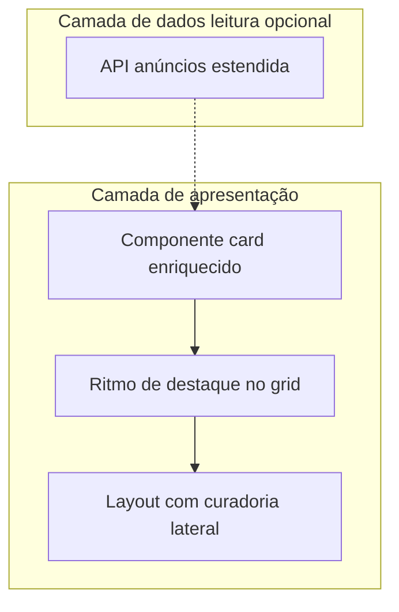

# Programa de elevação da Vitrine

## 1. Objetivo

Elevar o padrão da **Vitrine** (experiência pública de listagem e detalhe de anúncios — rotas sob `/loja` e API `/api/v1/loja`), de um **catálogo organizado** para uma **vitrine com intenção comercial clara**: hierarquia de informação, destaque de ofertas, chamadas à ação perceptíveis e sensação de loja profissional, sem comprometer integridade de dados nem conformidade SaaS.

O **marketplace** no sentido amplo (pedidos, CA, fiscal) permanece fora do núcleo deste programa, exceto quando o contrato de leitura da Vitrine precisar ser estendido.

## 2. Baseline de produto

| Dimensão | Situação atual |
|----------|----------------|
| Home da Vitrine | [app/templates/loja/index.html](app/templates/loja/index.html): categorias, hero (`marketing_vitrine.mostrar_hero_carrossel`), faixa `#loja-faixa-destaques`, ofertas `#loja-ofertas`, listagem `#loja-anuncios` com ordenação e “Carregar mais”, seções opcionais “Em alta” e “Lojas em destaque”. |
| Marketing | `GET /api/v1/marketing-vitrine/vitrine-home` consumido por [app/static/js/vitrine.js](app/static/js/vitrine.js) (`getMarketingVitrineHome`); payload inclui `config`, `destaques`, `ofertas_semana` (ver [app/services/marketing_vitrine_service.py](app/services/marketing_vitrine_service.py)). |
| Catálogo | `GET /api/v1/loja/anuncios` com `skip`, `limit`, `sort`, `somente_promocao`, filtros de categoria, `q`, `loja_slug`, `cliente_ids` — implementado em [app/api/v1/loja.py](app/api/v1/loja.py). |
| Modelo de item | [app/schemas/marketplace.py](app/schemas/marketplace.py) — `AnuncioVitrineResponse`: `id`, `titulo`, `preco_*`, `imagens`, `estoque_atual`, `frete_gratis`, etc. **Não inclui `vendas`.** |
| Diagnóstico UX | [.cursor/v2visual.md](.cursor/v2visual.md): hierarquia, preço, selos, herói no grid, lateral de curadoria, microcopy condicionada a dados. |

## 3. Princípios de governança

- **Dados verificáveis:** mensagens comerciais só com suporte no payload; seguir [`.cursor/skills/saas-golden-rules/SKILL.md`](.cursor/skills/saas-golden-rules/SKILL.md).
- **Configuração:** textos e destaques administráveis via marketing/admin quando existir fluxo; evitar hardcode de campanha no template.
- **Documentação:** alterações de contrato público em [MAPA_SISTEMA/MAPA_DO_SISTEMA.md](MAPA_SISTEMA/MAPA_DO_SISTEMA.md) e [MAPA_SISTEMA/MAPA_DE_API.md](MAPA_SISTEMA/MAPA_DE_API.md).

## 4. Verificação de alinhamento (objetivos × código)

### 4.1 O que já está coerente com o plano

- **Objetivo “vitrine em zonas”:** a home já separa hero, faixa de destaques, ofertas e catálogo geral — alinhado à estrutura recomendada no `v2visual.md` (áreas A/B/C), embora **sem coluna lateral de curadoria** ainda.
- **API para ofertas/recortes:** `somente_promocao=true` e `sort` existem; o fallback de ofertas em [app/templates/loja/index.html](app/templates/loja/index.html) (`loadOfertasFromAnunciosPromocao`) usa esses parâmetros — coerente com a Fase D (sidebar) alimentada por API.
- **Card único na listagem principal:** a verdade do HTML do grid é `renderCardHtml` + `appendCardToGrid` no mesmo ficheiro — qualquer evolução V2 deve partir daqui.
- **Schema:** campos usados no JS (`frete_gratis`, `estoque_atual` para “últimas unidades” via `Vitrine.isEstoqueBaixo`) existem no modelo de resposta.

### 4.2 Lacunas e desalinhamentos identificados

| # | Lacuna | Detalhe no código | Impacto no programa |
|---|--------|-------------------|----------------------|
| L1 | **Superfícies múltiplas do mesmo card** | O mesmo padrão visual é repetido em [app/templates/loja/produto.html](app/templates/loja/produto.html) (semelhantes) com markup próprio; existe [app/templates/loja/_card_anuncio_vitrine.html](app/templates/loja/_card_anuncio_vitrine.html) documentado como espelho do JS, mas **a listagem principal não usa SSR** — risco de **deriva** entre ficheiros. | Plano não está “100% fechado” até definir **fonte única** (componentizar helpers JS, ou macro Jinja incluída em todos os sítios, ou só CSS partilhado com checklist de ficheiros). |
| L2 | **Segundo front (`vitrine_raiz`)** | [vitrine_raiz/templates/index.html](vitrine_raiz/templates/index.html) duplica lógica de card com diferenças (ex.: badge “Oferta” vs. percentagem). | Se esse pacote for publicado, a Vitrine **não** fica uniforme só com alterações em `app/templates/loja`. Incluir **paridade** ou **declaração de escopo** (só `app/`). |
| L3 | **Seção “Em alta” vs. copy** | Em [app/templates/loja/index.html](app/templates/loja/index.html) (~886–907), a secção chama `getAnuncios` com `sort: "recent"` e depois **embaralha** os itens aleatoriamente. | O subtítulo sugere curadoria/atenção; o comportamento é **aleatório** — desalinhado de “dados verificáveis” se interpretado como ranking real. Exige **ajuste de copy**, **mudança de fonte** (API com métrica), ou **remoção do shuffle**. |
| L4 | **Herói “a cada N” com paginação** | `appendItems` apenas faz `appendCardToGrid` sem índice global; “Carregar mais” soma `skip` em blocos. | Para ritmo **consistente** no grid completo, o índice do herói deve ser **`skip` acumulado + posição no lote** (ou regra explícita “só na primeira página”). Documentar a regra na implementação. |
| L5 | **`vendas` e sort “mais vendidos”** | Confirmado: `AnuncioVitrineResponse` na listagem **não expõe vendas**. | A Fase E do programa permanece **válida e necessária** para microcopy/ordenção baseada em vendas. |
| L6 | **Cache de estilos** | [app/templates/loja/base_loja.html](app/templates/loja/base_loja.html) referencia `loja.css?v=...`. | Após alterações relevantes em CSS, **incrementar query string** para invalidar cache em clientes. |

### 4.3 Sobre “100% alinhado”

Não há alinhamento total enquanto **L1–L3** não estiverem resolvidos ou explicitamente aceites (escopo técnico + integridade de messaging). O restante do programa (card V2, herói no grid, lateral, API opcional) **mantém-se alinhado** aos objetivos do `v2visual.md` e ao código atual da home principal.

## 5. Arquitetura da solução (visão)

## 6. Fases de entrega

### Fase A — Sistema de cards da Vitrine

**Arquivos:** [app/static/css/loja.css](app/static/css/loja.css), `renderCardHtml` em [app/templates/loja/index.html](app/templates/loja/index.html); alinhar [app/templates/loja/produto.html](app/templates/loja/produto.html) (semelhantes); validar uso de [app/templates/loja/_card_anuncio_vitrine.html](app/templates/loja/_card_anuncio_vitrine.html) em rotas SSR.

**Entregas:** preço primário; selos de desconto por faixa; CTA com estados hover/foco; microcopy só com dados do item.

### Fase B — Destaque programático no grid principal

**Onde:** `appendItems` / `load()` em [app/templates/loja/index.html](app/templates/loja/index.html).

**Entregas:** variante `featured` com índice **global** coerente com “Carregar mais”; CSS responsivo; regra de seleção documentada.

### Fase C — Consolidação dos blocos existentes

Harmonizar faixa de destaques, ofertas e hero com o novo card; conteúdos institucionais via marketing quando aplicável.

### Fase C2 — Integridade da secção “Em alta” (recomendado)

Corrigir **L3**: ou dados reais (API), ou copy que não implique ranking, ou remoção do embaralhamento — alinhado às golden rules.

### Fase D — Curadoria em coluna lateral

Layout duas colunas no desktop; conteúdo via marketing ou `getAnuncios` com filtros documentados.

### Fase E — Extensão de API (opcional)

Incluir campo acordado (ex.: `vendas`) e parâmetro de ordenação em [app/api/v1/loja.py](app/api/v1/loja.py) + [app/schemas/marketplace.py](app/schemas/marketplace.py); atualizar MAPA.

### Fase F — Roadmap: agrupamento de variações

Iniciativa separada (modelo de família / atributos).

## 7. Ordem de execução recomendada

1. Fase A (cards + paridade produto/SSR)  
2. Fase B (grid)  
3. Fase C  
4. Fase C2 (Em alta) — pode ser paralela a C se prioridade de integridade  
5. Fase D  
6. Fase E (aprovação produto)  
7. Fase F  

## 8. Critérios de aceite

- Hierarquia visual clara (destaque, preço, desconto, CTA).
- **Integridade:** sem claims não suportados por dados (incl. secção “Em alta” após Fase C2).
- Responsividade e acessibilidade nas áreas alteradas.
- **Paridade:** superfícies listadas em L1/L2 atualizadas ou escopo documentado.

## 9. Dependências e riscos

- **Deriva entre JS e templates:** mitigar com lista explícita de ficheiros a alterar por mudança de classe CSS.
- **Duas bases de template (`app` vs `vitrine_raiz`):** risco de experiência divergente — ver L2.
- **Hero institucional vs. herói de produto:** evitar competição visual; testar em mobile.
