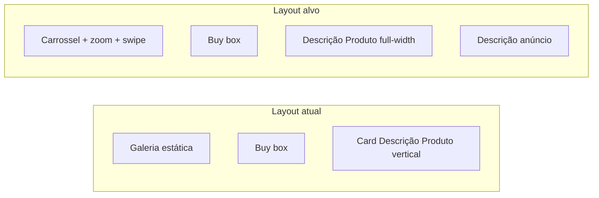

# Plano: carrossel + zoom + swipe e card de descrição único

## Contexto atual

- O HTML do detalhe é montado em [`app/templates/loja/produto.html`](app/templates/loja/produto.html) na função `renderAnuncio`: galeria em `.loja-produto-gallery` com imagem `#loja-produto-img-main`, miniaturas `.loja-produto-thumb` quando `imagens.length > 1`, e listeners que só trocam `src` da imagem principal (sem autoplay nem swipe).
- Lista de fotos na API: `imagens` via `_imagens_anuncio_ou_fallback`; **`og_image_url` é campo separado** — `imagemPrincipalAnuncio()` em [`app/static/js/vitrine.js`](app/static/js/vitrine.js) usa OG **em primeiro lugar** se existir, senão a primeira de `imagens`.
- Duplicação percebida: o card **«Descrição do Produto»** (`produto_ca_descricao`) está na coluna direita [`.loja-produto-desc-side`](app/templates/loja/produto.html); junto ao bloco **«Descrição do anúncio»** (`.loja-produto-desc`) gera sensação de dois cards de descrição.

---

## Lacunas corrigidas nesta validação (checklist técnico)

Estes pontos não estavam explícitos no plano anterior e são necessários para ficar **coerente com o código existente**:

1. **Ordem e composição dos slides** — Não usar só `ensureImagensArray(anuncio.imagens)` sem alinhar a [`imagemPrincipalAnuncio`](app/static/js/vitrine.js): se existir `og_image_url` e **não** estiver na lista de `imagens` (comparar URLs normalizadas / dedupe), **inserir como primeiro slide**; caso contrário a primeira foto do carrossel diferirá da «principal» usada em SEO, carrinho e pré-visualização. Se `imagens` vier vazio mas houver OG, slides = `[og]`; se tudo vazio, um slide com `PLACEHOLDER_IMG`.
2. **Partilha (Instagram)** — [`openInstagramShareProduct`](app/static/js/vitrine.js) usa fallback `document.getElementById("loja-produto-img-main")`. Após o carrossel, ou **mantém um único `#loja-produto-img-main` na imagem visível** (atributo `src` atualizado ao mudar slide) ou o handler do botão Instagram passa **`imageUrl` explícito** com a URL do índice ativo (preferível: não depender do id no DOM). O listener atual passa `imgPrincipal` fixo — deve passar a usar **URL do slide atual** no momento do clique.
3. **Cleanup do autoplay** — Guardar referência ao `setInterval` e **limpar** ao reexecutar `renderAnuncio`, ao fechar erro, ou antes de navegar (evita timers órfãos em SPA-like reloads ou se o mesmo script for reutilizado).
4. **Acessibilidade mínima** — Região do carrossel com `aria-roledescription="carousel"` (ou padrão equivalente), slides com `aria-hidden` conforme visibilidade; lightbox: **foco** no botão fechar ao abrir, devolver foco ao gatilho ao fechar, `Escape` e scroll lock em `body`.
5. **Card horizontal «Descrição do Produto»** — Ao mover para o fluxo, usar **apenas** o padrão `.loja-produto-desc` (como «Descrição do anúncio»), **não** `loja-buy-box` + `loja-produto-desc-ca-box`, para não parecer segundo «buy box».
6. **Sticky da galeria** — `.loja-produto-gallery` tem `position: sticky` ([`loja.css`](app/static/css/loja.css)). Confirmar em QA que `overflow: hidden` no viewport do carrossel **não** quebra o sticky (normalmente OK se o overflow estiver **dentro** do bloco sticky; testar Safari iOS).
7. **`<noscript>` em produto.html** — Continua com uma única `ssr_imagem`; aceitável sem carrossel sem JS. Opcional: mencionar na QA que utilizadores sem JS veem foto única SSR.
8. **`vitrine_raiz`** — O ficheiro [`vitrine_raiz/templates/produto.html`](vitrine_raiz/templates/produto.html) é uma **versão mais antiga** (sem sharing completo, sem card CA lateral, markup diferente). «Espelhar» implica **copiar/portar** blocos desde `app/templates/loja/produto.html` ou aceitar divergência documentada — não é cópia 1:1 automática.

---

## 1. Remover card vertical e manter só o horizontal

- Na string montada por `renderAnuncio`, **eliminar** a coluna `
…
` e o uso exclusivo de `descricaoCaHtml` nessa coluna.
- **Ajustar a grade Bootstrap** da primeira linha para duas colunas (ex.: `col-md-5 col-lg-5` galeria + `col-md-7 col-lg-7` buy box).
- **Inserir uma única secção horizontal** para «Descrição do Produto» com classe **`.loja-produto-desc`** (sem `loja-buy-box`), após `caracteristicasHtml` e **antes** de `descHtml`. Reutilizar `descricaoCaConteudo` / mensagem vazia existente.
- Limpar CSS órfão: [`.loja-produto-desc-side`](app/static/css/loja.css), regras só para coluna lateral; ajustar `.loja-produto-desc-ca-box` se deixar de ser usada.

## 2. Carrossel automático (todas as galerias)

- Montar array **`slideUrls`** conforme secção «Lacunas» acima (imagens + OG + dedupe + placeholder).
- Viewport (ex.: `.loja-produto-carousel`) + track com um slide por URL; **um slide**: sem autoplay ou intervalo inerte (índice 0 fixo).
- **Autoplay**: `setInterval` (ex. 4–5 s), loop; **pausar** se `prefers-reduced-motion`, **pausar ao hover** na galeria, **clearInterval** no teardown.
- Miniaturas sincronizadas com índice; clique reinicia opcionalmente o temporizador.
- Selos (desconto / frete): overlay **fixo** no wrapper do viewport (fora do track), para não duplicar por slide.

## 3. Zoom ao clicar na foto

- Lightbox com imagem em grande; não abrir se o gesto anterior foi swipe.
- Ícone «ampliar» opcional; `cursor: zoom-in` na área clicável.

## 4. Mobile: arrastar para mudar de foto

- Touch com limiar horizontal vs vertical; flag «foi swipe» para suprimir zoom no `touchend`.

## 5. CSS ([`app/static/css/loja.css`](app/static/css/loja.css))

- Track: `display: flex` + `transform` + `transition` para slide.
- Lightbox + `body.loja-produto-zoom-open { overflow: hidden; }` (ou classe equivalente).
- Dots opcionais se thumbs não couberem em mobile estreito.

## 6. Paridade `vitrine_raiz`

- Avaliar se o deploy usa este pacote; se sim, alinhar implementação (pode exigir substituir gradualmente o template pelo mesmo JS/CSS de `app/templates/loja/produto.html`).

## Ficheiros principais

| Ficheiro | Alteração |
|----------|-----------|
| [`app/templates/loja/produto.html`](app/templates/loja/produto.html) | `renderAnuncio`: slides, carrossel, zoom, swipe, layout desc, listener partilha com URL ativo |
| [`app/static/css/loja.css`](app/static/css/loja.css) | Carrossel, lightbox, limpeza layout |
| [`app/static/js/vitrine.js`](app/static/js/vitrine.js) | **Só se** optar por centralizar lista de URLs num helper reutilizável; caso contrário manter lógica inline no template com comentário — o fallback `#loja-produto-img-main` em `openInstagramShareProduct` continua válido **se** o elemento existir com `src` atualizado |

**API:** sem alteração obrigatória; atenção ao contrato já existente (`imagens`, `og_image_url`, `produto_ca_descricao`).

**Testes automatizados:** não há testes atuais ligados a `produto.html`; validação recomendada por QA manual (desktop + iOS/Android) nos fluxos carrossel, zoom, partilha e leitura de descrição.
