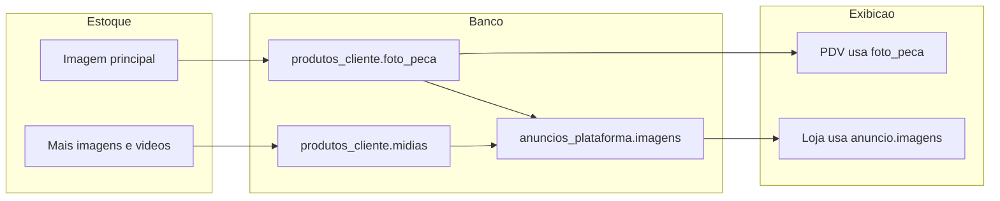

# Plano: Fluxo de imagens (Estoque → PDV → Loja) e label "Imagem para marketplace"

## Diagnóstico

### Fluxo atual de dados

- **Origem:** Em [app/templates/meu_negocio/estoque/index.html](app/templates/meu_negocio/estoque/index.html) o usuário envia:
  - **Imagem principal do produto** → API persiste em `produtos_cliente.foto_peca` (path relativo: `uploads/produtos/{cliente_id}/{produto_id}/foto_xxx.jpg`).
  - **Mais imagens e vídeos (opcional)** → API persiste em `produtos_cliente.midias` (JSON: `[{ "tipo": "imagem"|"video", "url": "..." }]`).
- **PDV (/negocio/venda/pdv):** A API [app/api/v1/vendas.py](app/api/v1/vendas.py) (`GET /api/v1/vendas/produtos`) já retorna `foto_peca` por produto. O front [app/static/js/pdv.js](app/static/js/pdv.js) já exibe a imagem: monta URL como `/static/${produto.foto_peca}` e usa placeholder (ícone caixa) quando não há foto. **Conclusão:** o PDV já está preparado para mostrar a imagem; se não aparece, é porque o produto não tem `foto_peca` preenchido ou o path está incorreto.
- **Loja (/loja):** A vitrine consome `GET /api/v1/loja/anuncios` e `GET /api/v1/loja/anuncios/{id}`. A resposta usa o campo `**anuncio.imagens`** (coluna `anuncios_plataforma.imagens`). O front em [app/templates/loja/index.html](app/templates/loja/index.html) e [app/templates/loja/produto.html](app/templates/loja/produto.html) usa `item.imagens`/`anuncio.imagens`; se vazio, mostra o placeholder "Sem imagem".

### Por que a imagem não aparece na loja

1. **Preenchimento só na criação do anúncio:** Em [app/api/v1/marketplace.py](app/api/v1/marketplace.py), ao **criar** anúncio (POST), se `body.imagens` não for enviado, o backend chama `_galeria_produto_para_imagens(prod)` e grava em `anuncio.imagens`. Ou seja, no momento da publicação o produto precisa já ter `foto_peca` e/ou `midias` para o anúncio ganhar imagens.
2. **Anúncios antigos ou produto editado depois:** Se o anúncio foi criado quando o produto ainda não tinha foto, ou se o usuário adicionou/alterou a imagem no estoque **depois** de publicar, a coluna `anuncios_plataforma.imagens` não é atualizada (permanece NULL ou antiga).
3. **PATCH do anúncio não re-sincroniza imagens:** No `atualizar_anúncio` (PATCH), apenas os campos enviados no body são aplicados; não há fallback para repopular `imagens` a partir do produto quando o cliente não envia `imagens`.

Resumo: **a loja depende de `anuncios_plataforma.imagens`**, que hoje só é preenchido na criação e não é atualizado quando o produto ganha ou muda imagens depois.

### Escopo: imagens vs vídeos

- **Imagens:** O plano garante que **todas as imagens** anexadas pelo CA apareçam no marketplace: (1) a **imagem principal** (`foto_peca`) e (2) todas as entradas de **midias** com `tipo == "imagem"` (o bloco "Imagem para marketplace"). A função `_galeria_produto_para_imagens` já monta essa lista; o fallback na API da loja repete essa lógica quando `anuncio.imagens` estiver vazio. Na vitrine, listagem e página do produto exibem essa galeria de fotos (primeira como destaque, demais como miniatura).
- **Vídeos:** Hoje a vitrine **não exibe vídeos**. A tabela `anuncios_plataforma` só tem a coluna `imagens`; a API da loja e o front (`/loja`, `/loja/produto/{id}`) só trabalham com lista de URLs de imagem (``). Os vídeos enviados em "Imagem para marketplace" (midias com `tipo == "video"`) ficam gravados em `produtos_cliente.midias`, mas não são enviados para o anúncio nem renderizados na loja. Incluir vídeos no marketplace seria escopo adicional: expor midias (ou um campo `videos`) na API da loja e implementar player de vídeo na página do produto.

---

## Ações recomendadas

### 1. Renomear label no estoque (trivial)

- **Arquivo:** [app/templates/meu_negocio/estoque/index.html](app/templates/meu_negocio/estoque/index.html) (por volta da linha 381).
- **Alterar:** O texto do `<label>` de **"Mais imagens e vídeos (opcional)"** para **"Imagem para marketplace"**.
- **Opcional:** Ajustar o parágrafo de ajuda abaixo (ex.: manter a explicação de limite de imagens/vídeos e que a primeira mídia é destaque na vitrine), para não perder informação útil.

### 2. Fazer a imagem aparecer na loja (principal)

Duas frentes complementares:

**2.1 Fallback em tempo de leitura na API pública da loja**

- **Arquivo:** [app/api/v1/loja.py](app/api/v1/loja.py).
- **Ideia:** Ao montar a resposta de listagem (`listar_anuncios_vitrine`) e de detalhe (`obter_anuncio_vitrine`), se `anuncio.imagens` for `None` ou (após parse) lista/string vazia, **não** devolver lista vazia; em vez disso, carregar o produto (`ProdutoCliente` por `anuncio.produto_ca_id`) e montar a lista de imagens a partir dele (mesma lógica de `_galeria_produto_para_imagens`: `foto_peca` + itens de `midias` com `tipo == "imagem"`).
- **Implementação:** Extrair ou reutilizar a lógica de galeria (ex.: mover `_galeria_produto_para_imagens` para um módulo compartilhado, como `app/services/` ou em `loja.py` importar de `marketplace` e usar). Em seguida, na construção de cada item de anúncio:
  - `imgs = _imagens_as_list(anuncio.imagens)`
  - Se `imgs` estiver vazio, buscar produto, chamar galeria, converter resultado (JSON string) para lista de URLs e passar por `_normalize_image_url` (ou equivalente) para devolver URLs no mesmo formato (`/static/...`).
- **Efeito:** Anúncios já existentes sem `imagens` passam a exibir as fotos do produto na vitrine sem migração de dados; produtos que ganharam imagem depois da publicação também passam a aparecer com foto.

**2.2 (Opcional) Re-sincronizar imagens ao atualizar anúncio**

- **Arquivo:** [app/api/v1/marketplace.py](app/api/v1/marketplace.py), endpoint `atualizar_anuncio` (PATCH).
- **Ideia:** Se no body de atualização o campo `imagens` **não** vier no payload (`exclude_unset`), antes de dar commit, preencher `anuncio.imagens` a partir do produto (`_galeria_produto_para_imagens(prod)`). Assim, ao editar título/descrição/preço etc. sem tocar em imagens, o anúncio passa a refletir o estado atual do produto (foto_peca + midias).
- **Efeito:** Mantém o banco consistente e evita depender só do fallback em leitura para anúncios que são editados depois.

### 3. PDV: garantir robustez da URL da imagem (opcional)

- **Arquivo:** [app/static/js/pdv.js](app/static/js/pdv.js).
- **Atual:** `const foto = produto.foto_peca ?` /static/${produto.foto_peca} `: "";`
- **Risco:** Se em algum momento a API retornar `foto_peca` já com prefixo (ex.: `/static/uploads/...`), a concatenação vira `/static//static/...`. Para evitar quebra, normalizar: se `foto_peca` já começar com `/`, usar como está; senão, prefixar com `/static/`. Mesma regra já usada no template de estoque (linha 818/1071).

---

## Ordem sugerida

1. Renomear o label em estoque.
2. Implementar o fallback de imagens na API da loja (listagem + detalhe do anúncio).
3. (Opcional) Re-sincronizar imagens no PATCH do anúncio.
4. (Opcional) Normalizar URL da foto no PDV para paths que já venham com `/`.

---

## Arquivos envolvidos (resumo)

| Objetivo                        | Arquivo                                                                                      |
| ------------------------------- | -------------------------------------------------------------------------------------------- |
| Label "Imagem para marketplace" | [app/templates/meu_negocio/estoque/index.html](app/templates/meu_negocio/estoque/index.html) |
| Imagens na loja (fallback)      | [app/api/v1/loja.py](app/api/v1/loja.py)                                                     |
| Re-sincronizar imagens no PATCH | [app/api/v1/marketplace.py](app/api/v1/marketplace.py)                                       |
| URL da foto no PDV              | [app/static/js/pdv.js](app/static/js/pdv.js)                                                 |

Nenhuma alteração de modelo ou migração de banco é necessária; a coluna `anuncios_plataforma.imagens` continua existindo e o fallback apenas preenche a resposta da API quando ela estiver vazia.