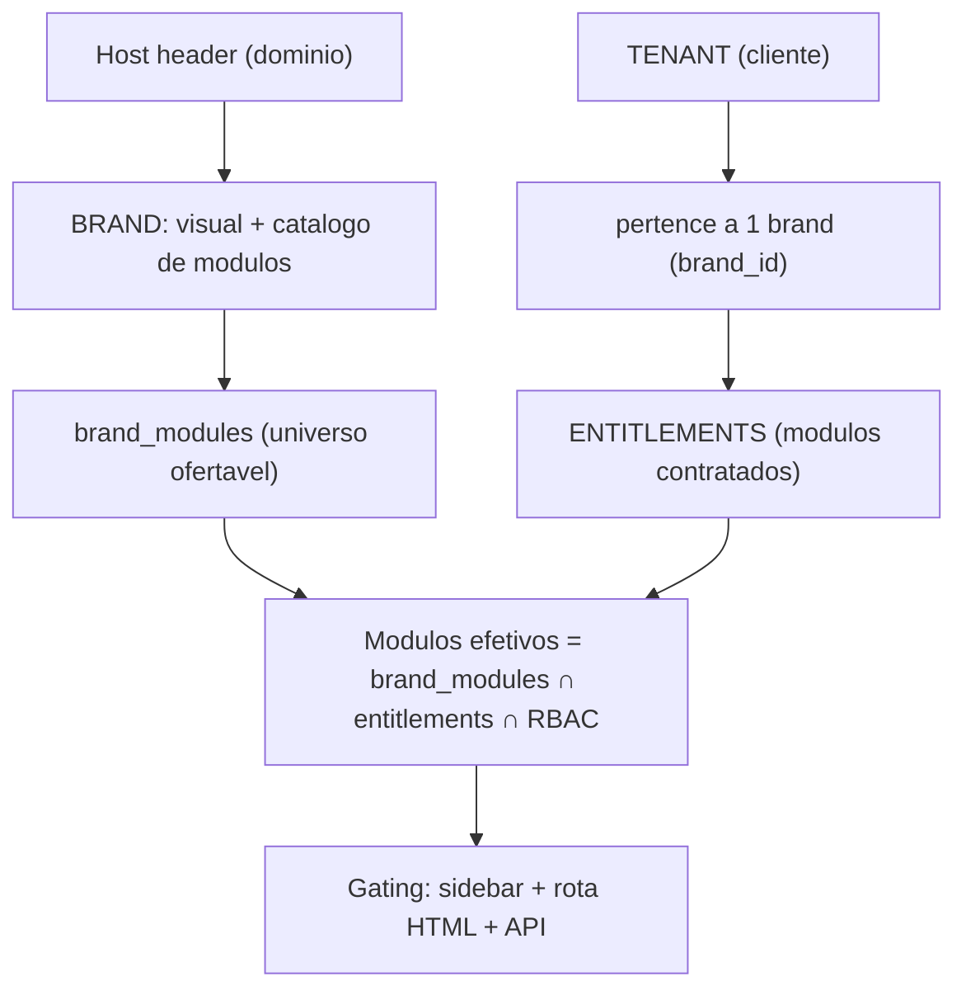

# Multi-brand + Módulos + Segurança (Ibix como origem)  
  
**IGNORAR BACKUP, JA FOI REALIZADO SNPACHOT DO SERVIDOR)

## Escopo

- **AGORA:** Ibix + Solumática a partir de **uma codebase, uma API e um banco**. Marketplace permanece exclusivo Ibix; Solumática = branding + core, sem marketplace.
- **DEPOIS (fora deste ciclo):** marca Certipeso e modulo de certificados/calibracao. A estrutura (catalogo de modulos por marca) ja fica preparada, mas o modulo de certificado NAO sera implementado agora.
- **RLS:** br35 + **efetivo em producao** (`pdv_app`, `RLS_ENABLED=true` desde 2026-06-18).

## Estado de implementacao (atualizado 2026-06-18 — pos-auditoria ambiente)

**Alembic head:** `br35_rls_policies`  
**Testes:** 108 passed (`test_rls_integration` ativo com RLS_ENABLED)  
**Producao validada:** health 200; gating Ibix OK / Solumatica marketplace 403; Gunicorn + Celery active; Nginx Ibix OK.

**Auditoria servidor (2026-06-18):** ver secao **Auditoria ambiente** abaixo.

### Resumo por fase

| Fase                | Status                              | % estimado                       |
| ------------------- | ----------------------------------- | -------------------------------- |
| 1 Brand             | Concluida (codigo)                  | ~85% — lacunas visuais P2-1      |
| 1.5 Governanca      | Pendente                            | 0%                               |
| 2 Modulos           | Concluida                           | ~100%                            |
| 3 RLS               | Estrutura OK / **efetivo pendente** | ~~70% codigo / **~~0% producao** |
| 3.1 Conflito dados  | Concluida                           | ~100%                            |
| 3.2 Desempenho      | Concluida (codigo)                  | ~90% — EXPLAIN pos-RLS pendente  |
| 4 LGPD              | Parcial                             | ~75% codigo                      |
| 5 Hardening         | Codigo OK / deploy parcial          | ~85% codigo / ~50% operacional   |
| 6 Migracoes/rollout | Estrutura OK / rollout parcial      | ~75% codigo / ~35% operacional   |
| 7 Regras Cursor     | **Concluida**                       | 100%                             |
| 8 Mapas             | **Concluida**                       | 100%                             |
| 9 Enterprise        | Codigo OK / ops pendente            | ~85% codigo / ~25% operacional   |

**Estimativa global do plano:** ~**75–80%** (codigo forte; RLS efetivo, backup e Nginx HTTP Solumatica atrasados).

---

## Auditoria ambiente (2026-06-18 — servidor solumatica)

> Snapshot validado em producao. Atualizar ao fechar cada item.

### O que esta OK

| Item                     | Evidencia                                                                                                 |
| ------------------------ | --------------------------------------------------------------------------------------------------------- |
| App + Celery             | `systemctl` active; health 200; Redis connected                                                           |
| Alembic + RLS estrutural | head `br35`; 26 politicas; verify script OK                                                               |
| Multi-brand DB           | brands ibix+solumatica; 8 dominios em `brand_domains`; modulos ibix=[core,marketplace], solumatica=[core] |
| Gating marketplace       | API Solumatica → 403 `"Módulo marketplace indisponível"`                                                  |
| HTTPS Solumatica         | Cert Let's Encrypt `www.solumatica.com.br`; app responde em 443                                           |
| HTTPS Ibix               | Nginx `solumatica.conf`; `/metrics` deny externo (allow 127.0.0.1)                                        |
| Testes locais            | 99 passed; CI workflow criado (`.github/workflows/ci.yml`)                                                |
| Fases 7–9 codigo         | regras Cursor, MAPA_MULTIBRAND, worker_db_session, tenant-lifecycle API, DR runbook                       |

### O que esta pendente (validado agora)

| ID        | Pendencia                                                                          | Evidencia / acao                                                               |
| --------- | ---------------------------------------------------------------------------------- | ------------------------------------------------------------------------------ |
| **P0-1**  | `RLS_ENABLED=false` (ausente no `.env`)                                            | Politicas nao filtram queries                                                  |
| **P0-2**  | `DB_USER=postgres` super + BYPASSRLS; role `pdv_app` **nao existe**                | `scripts/sql/create_pdv_app_role.sql`                                          |
| **P0-3**  | Teste integracao RLS so skipped                                                    | Rodar com `TEST_DATABASE_URL` ou pos P0-2                                      |
| **P1-1**  | Backup **desatualizado** — ultimo em **12/05/2026** (~37 dias)                     | Dir real: `/central_solumatica/backup/` (doc cita `Backup`)                    |
| **P1-2a** | Nginx **HTTP :80** Solumatica → pagina **default Nginx**, nao redireciona para app | `curl -H "Host: www.solumatica.com.br" http://127.0.0.1/` → 200 HTML 615 bytes |
| **P1-2b** | `solumatica.conf` ativo so `ibix.com.br` / `www.ibix.com.br`                       | Falta bloco `server_name` Solumatica (repo: `solumatica-brand.conf`)           |
| **P5-1**  | `.env` `CORS_ORIGINS` so Ibix                                                      | Runtime merge 11 origens via DB — env explicito recomendado                    |
| **P5-2**  | CSP `connect-src` wildcard `*.com.br`                                              | [hardening.py](app/core/hardening.py)                                          |
| **P3-1**  | **395** consumidores `tenant_id IS NULL`                                           | Backfill/reconciliacao Ibix                                                    |
| **P3-5**  | **0 tenants** com `brand_id=2` (Solumatica)                                        | Marca existe; sem clientes SaaS Solumatica ainda                               |
| **P6-1**  | **~114 arquivos** alterados localmente, **nao commitados**                         | Fases 5–9 + docs — risco de perda/deploy                                       |
| **P6-2**  | CI GitHub **nao executado** (workflow so local)                                    | `git push` para ativar pipeline                                                |
| **P6-3**  | `ENTERPRISE_STRICT_STARTUP` / `SECRETS_DIR` ausentes                               | Fase 9 ops                                                                     |
| **P6-4**  | WAF/Cloudflare **nao verificado**                                                  | Camada 1 anti-DDoS                                                             |
| **P6-5**  | Restore DR trimestral **nao evidenciado**                                          | `scripts/dr/runbook_dr.md` + teste homolog                                     |
| **P4-***  | LGPD backfill segredos, PII clientes, FISCAL_CERT                                  | Ver tabela P4 abaixo                                                           |
| **P2-***  | Hardcodes visuais, dashboard SuperAdmin brand_id, billing por marca                | Governanca 1.5                                                                 |

### Infraestrutura observada

- PostgreSQL e Redis via **Docker** (localhost:5432/6379) — systemd `postgresql`/`redis-server` inactive
- Segundo produto **Auto Ibix** na porta **8001** (`auto.solumatica.com.br`)
- Disco 9% usado; RAM confortavel; **swap 0**

---

## Compatibilidade app mobile — Ibix Market (restricao obrigatoria)

> **Diretriz:** qualquer mudanca deste plano (RLS, roles DB, gating, Nginx, OAuth, LGPD) **nao pode quebrar** o app React Native em [mobile_marketplace/](mobile_marketplace/) (`com.ibix.market`). Contexto: [mobile_marketplace/AGENTS.md](mobile_marketplace/AGENTS.md), [plano_app_mobile_marketplace.plan.md](.cursor/plans/plano_app_mobile_marketplace.plan.md).

### Perfil do app (o que proteger)

| Aspecto               | Valor atual                                                                           |
| --------------------- | ------------------------------------------------------------------------------------- |
| Produto               | **Ibix Market** — marketplace consumidor final (marca origem Ibix apenas)             |
| API                   | `EXPO_PUBLIC_API_BASE_URL` → `/api/v1/loja/*` + `/api/v1/marketing-vitrine/*`         |
| Auth                  | JWT Bearer + `POST /loja/refresh-token`; header `X-Client: mobile` (sem cookie)       |
| WebSocket             | `wss://…/ws/loja/consumidor?token=` (PIX, chat, notificacoes)                         |
| Build prod (eas.json) | `https://www.ibix.com.br/api/v1` + `wss://www.ibix.com.br` (**corrigido 2026-06-18**) |
| Fallback codigo       | `config.ts` deriva WS do host da API automaticamente                                  |

### Impacto por pendencia do plano

| Pendencia                                           | Risco mobile                                                                                                                                                            | Severidade            | Acao antes de aplicar                         |
| --------------------------------------------------- | ----------------------------------------------------------------------------------------------------------------------------------------------------------------------- | --------------------- | --------------------------------------------- |
| **P0 RLS** (`RLS_ENABLED` + `pdv_app`)              | ~~Rotas `/loja/*` sem contexto RLS~~ → `**ensure_marketplace_loja_rls`** em [marketplace_rls.py](app/core/marketplace_rls.py)                                           | **Mitigado (codigo)** | Smoke pos-ativacao P0 ainda obrigatorio       |
| **P3-1** consumidores orfaos (395 `tenant_id NULL`) | Contas platform-wide sem pedido — **OK** com bypass RLS loja; script [backfill_consumidor_tenant_orphans.py](scripts/backfill_consumidor_tenant_orphans.py) idempotente | **Baixo**             | Rodar periodicamente; nao bloqueia mobile     |
| **P2 gating / Solumatica**                          | Mobile so Ibix; `assert_marketplace_ibix_brand` + modulo marketplace — **OK** se Host cair na origem                                                                    | Baixo                 | Manter fallback Host desconhecido → Ibix      |
| **P5 CORS/CSP**                                     | App nativo **nao** usa CORS/CSP do browser                                                                                                                              | Nenhum                | N/A                                           |
| **P1-2 Nginx Solumatica**                           | Mobile nao usa dominio Solumatica                                                                                                                                       | Nenhum                | N/A                                           |
| **P4 LGPD** (cifra PII consumidor)                  | Endpoints `/loja/minha-conta/*` devem manter contrato JSON                                                                                                              | Medio                 | Regressao P-M4 apos backfill                  |
| **P6 commit/deploy**                                | Reinicio Gunicorn/Celery durante uso ativo                                                                                                                              | Medio                 | Deploy em janela; validar push/WS pos-restart |

### Lacunas validadas agora (2026-06-18)

| ID       | Lacuna                         | Evidencia / status                                                                 |
| -------- | ------------------------------ | ---------------------------------------------------------------------------------- |
| **P-M1** | ~~eas.json `api.ibix.com.br~~` | **Concluido** → `www.ibix.com.br`                                                  |
| **P-M2** | Subdominios API opcionais      | **Cancelado** — decisao: usar `www.ibix.com.br` (sem subdominio API)               |
| **P-M3** | ~~RLS sem contexto `/loja/*~~` | **Concluido** — [marketplace_rls.py](app/core/marketplace_rls.py)                  |
| **P-M4** | ~~Sem testes contrato mobile~~ | **Concluido** — [test_mobile_loja_contract.py](tests/test_mobile_loja_contract.py) |
| **P-M5** | ~~WS `SessionLocal` cru~~      | **Concluido** — `open_db_session(bypass_rls=True)`                                 |
| **P-M6** | ~~WS URL eas.json~~            | **Concluido** — alinhado com P-M1 + `config.ts` deriva WS                          |

### Checklist smoke mobile (obrigatorio antes de P0-1/P0-2)

Executar contra host de producao (`www.ibix.com.br`) com header `X-Client: mobile`:

- [ ] `GET /api/v1/loja/categorias` → 200 + array
- [ ] `GET /api/v1/loja/anuncios?limit=5` → 200
- [ ] `GET /api/v1/marketing-vitrine/vitrine-home` → 200
- [ ] `GET /api/v1/loja/app-version` → 200 (force update)
- [ ] `POST /api/v1/loja/login` (conta teste) → `access_token` no body
- [ ] `GET /api/v1/loja/meus-pedidos` com Bearer → 200
- [ ] `POST /api/v1/loja/refresh-token` → novos tokens
- [ ] WebSocket `/ws/loja/consumidor?token=…` → conecta + `ping`/`pong`
- [ ] Repetir **todos** acima com `RLS_ENABLED=true` + `DB_USER=pdv_app` em homolog/staging

**Gate:** P0 (RLS efetivo) so apos checklist 100% + correcao P-M1/P-M3.

### Ordem segura (mobile-first)

1. **P-M1** — alinhar [eas.json](mobile_marketplace/eas.json) production/preview para `https://www.ibix.com.br/api/v1` (ou criar Nginx + DNS + `brand_domains` para `api.ibix.com.br`)
2. **P3-1** — backfill consumidores orfaos
3. **P-M3** — codigo RLS nas rotas marketplace consumidor
4. Smoke checklist (homolog com RLS)
5. **P0-2 → P0-1** — role + RLS em producao
6. Smoke checklist producao + validacao manual Expo (1 fluxo Android minimo)

---

## Registro de pendencias consolidado (controle — 2026-06-18 pos-auditoria)

> **Fonte unica de backlog** deste plano. Atualizar ao fechar cada item. Detalhe validado em **Auditoria ambiente** acima.

### P-M — App mobile Ibix Market (gate antes de P0)

| ID   | Pendencia                    | Onde / acao                                                        | Status        |
| ---- | ---------------------------- | ------------------------------------------------------------------ | ------------- |
| P-M1 | eas.json → `www.ibix.com.br` | [mobile_marketplace/eas.json](mobile_marketplace/eas.json)         | **Concluido** |
| P-M2 | Subdominio API dedicado      | Cancelado (usa www)                                                | **N/A**       |
| P-M3 | RLS rotas `/loja/*`          | [marketplace_rls.py](app/core/marketplace_rls.py)                  | **Concluido** |
| P-M4 | Smoke/contrato mobile CI     | [test_mobile_loja_contract.py](tests/test_mobile_loja_contract.py) | **Concluido** |
| P-M5 | WS `open_db_session`         | [ws_loja.py](app/api/v1/ws_loja.py)                                | **Concluido** |
| P-M6 | WS URL alinhada              | eas.json + config.ts                                               | **Concluido** |

### P0 — Bloqueia isolamento real (Fase 3/6)

| ID   | Pendencia                             | Onde / acao                                                                                   | Status audit                          |
| ---- | ------------------------------------- | --------------------------------------------------------------------------------------------- | ------------------------------------- |
| P0-0 | **Gate mobile** — checklist smoke P-M | Secao *Compatibilidade app mobile*                                                            | **Concluido** pos-RLS                 |
| P0-1 | `RLS_ENABLED=true` no `.env`          | Adicionar `RLS_ENABLED=true` apos role pdv_app **e P-M3**                                     | **Concluido** 2026-06-18              |
| P0-2 | Role DB `pdv_app` sem BYPASSRLS       | [scripts/sql/create_pdv_app_role.sql](scripts/sql/create_pdv_app_role.sql); `DB_USER=pdv_app` | **Concluido** 2026-06-18              |
| P0-3 | Teste **integracao RLS** PostgreSQL   | [tests/test_rls_integration.py](tests/test_rls_integration.py) + `TEST_DATABASE_URL`          | **Concluido** (2 tests com RLS)       |
| P0-4 | Workers Celery `SessionLocal()` cru   | Migrar para `worker_db_session()`                                                             | **Concluido** Fase 9 (tasks/nfse/geo) |

### P1 — Fechar Fase 6 operacional

| ID   | Pendencia                                    | Onde / acao                                                                    | Status audit                           |
| ---- | -------------------------------------------- | ------------------------------------------------------------------------------ | -------------------------------------- |
| P1-1 | Backup **desatualizado** (ultimo 12/05/2026) | Rodar `scripts/backup_pdv-solumatica.sh`; PITR                                 | **Adiado** (pedido usuario 2026-06-18) |
| P1-2 | Rollout Nginx Solumatica                     | [solumatica-brand.conf](scripts/deploy/nginx/solumatica-brand.conf) HTTP→HTTPS | **Concluido**                          |
| P1-3 | **EXPLAIN** pos-RLS em queries quentes       | [scripts/explain_rls_hot_queries.sh](scripts/explain_rls_hot_queries.sh)       | **Concluido** (script)                 |
| P1-4 | **CI GitHub**                                | [.github/workflows/ci.yml](.github/workflows/ci.yml) — falta push              | Criado local                           |
| P1-5 | **~30 tabelas `cliente_id`** sem RLS         | Decisao em [MAPA_MULTIBRAND.md](MAPA_SISTEMA/MAPA_MULTIBRAND.md) §6            | **Documentado**                        |

### P1 — Fechar Fase 5 operacional

| ID   | Pendencia                        | Onde / acao                                                                          | Status audit  |
| ---- | -------------------------------- | ------------------------------------------------------------------------------------ | ------------- |
| P5-1 | `.env` `CORS_ORIGINS` Solumatica | Incluir dominios Solumatica                                                          | **Concluido** |
| P5-2 | **CSP `connect-src`** por marca  | [app/core/hardening.py](app/core/hardening.py) — hosts da marca, nao wildcard global | **Concluido** |
| P5-3 | TLS multi-dominio                | Cert + Nginx HTTP redirect Solumatica                                                | **Concluido** |

### P1 — Fechar Fase 4 codigo (LGPD)

| ID   | Pendencia                                        | Arquivo                                                                                          |
| ---- | ------------------------------------------------ | ------------------------------------------------------------------------------------------------ |
| P4-1 | Backfill `enc:v1:` segredos billing legados      | [scripts/backfill_billing_secrets_enc.py](scripts/backfill_billing_secrets_enc.py)               |
| P4-2 | Escrever `webhook_secret_encrypted`              | [payments.py](app/api/v1/payments.py)                                                            |
| P4-3 | PII RBAC/audit em clientes, entregadores         | [clientes.py](app/api/v1/clientes.py), [admin_entregadores.py](app/api/v1/admin_entregadores.py) |
| P4-4 | `FISCAL_CERT_PASSWORD_SECRET` no `.env` producao | `.env`                                                                                           |
| P4-5 | Audit PATCH consentimentos consumidor            | [loja_lgpd.py](app/api/v1/loja_lgpd.py)                                                          |
| P4-6 | Filtro `brand_id` em relatorios/exportacoes      | [relatorios.py](app/api/v1/relatorios.py)                                                        |

### P2 — Fases 1 / 1.5 (governanca)

| ID   | Pendencia                                                  | Status                                 |
| ---- | ---------------------------------------------------------- | -------------------------------------- |
| P2-1 | Hardcodes visuais Ibix (sidebar, rodape, auth, entregador) | **Concluido** 2026-06-18               |
| P2-2 | SuperAdmin dashboard filtro `brand_id`                     | **Concluido** 2026-06-18               |
| P2-3 | Billing/relatorios segmentados por `brand_id`              | **Concluido** 2026-06-18               |
| P2-4 | Regras Cursor Fase 7                                       | **Concluido** 2026-06-18               |
| P2-5 | `MAPA_MULTIBRAND.md` + mapas Fase 8                        | **Concluido** 2026-06-18               |
| P2-6 | Dominios Solumatica fora de `SEO_REDIRECT_LEGACY_HOSTS`    | **Confirmado** — var ausente no `.env` |

### P3 — Dados operacionais (nao bloqueante)

| ID   | Pendencia                                   | Status audit            |
| ---- | ------------------------------------------- | ----------------------- |
| P3-1 | **395** consumidores `tenant_id NULL`       | **Confirmado**          |
| P3-2 | `statement_timeout` via `worker_db_session` | OK pos Fase 9           |
| P3-3 | Auditoria global paginacao/joinedload (N+1) | Aberto                  |
| P3-4 | Particionamento — gatilho em br33           | Documentado             |
| P3-5 | **0 tenants** `brand_id=2` (Solumatica)     | Marca sem clientes SaaS |

### P6 — Fase 9 operacional + deploy (novo — auditoria 2026-06-18)

| ID   | Pendencia                                                    | Onde / acao                                                         |
| ---- | ------------------------------------------------------------ | ------------------------------------------------------------------- |
| P6-1 | **Commit/push** alteracoes locais (~114 arquivos, Fases 5–9) | Git + ativar CI                                                     |
| P6-2 | Executar `create_pdv_app_role.sql` + trocar `.env`           | **Concluido** 2026-06-18                                            |
| P6-3 | `ENTERPRISE_STRICT_STARTUP=true` apos RLS OK                 | `.env` — **Concluido** 2026-06-18                                   |
| P6-4 | Restore DR trimestral testado                                | [scripts/dr/runbook_dr.md](scripts/dr/runbook_dr.md)                |
| P6-5 | WAF/Cloudflare na borda                                      | Infra (doc MAPA_MULTIBRAND §13)                                     |
| P6-6 | Vault/KMS real (hoje env + `SECRETS_DIR`)                    | [secrets_provider.py](app/core/secrets_provider.py) extensao futura |

### Checklist pre-RLS (atualizado 2026-06-18 pos-auditoria)

- [x] Migracao RLS br35 aplicada (26 tabelas + `tenants.rls_tenants_scope`)
- [x] `SET LOCAL` integrado a [open_db_session](app/database/connection.py)
- [x] Celery migrado para [worker_db_session](app/worker/db_task.py) (Fase 9)
- [x] [scripts/audit_multibrand_pre_migration.py](scripts/audit_multibrand_pre_migration.py) sem ERRO
- [x] [scripts/verify_rls_policies.py](scripts/verify_rls_policies.py) OK
- [ ] Backup completo **recente** (ultimo 12/05/2026 — **adiado** por pedido)
- [ ] **PITR / restore** testado e documentado
- [x] Role PostgreSQL `pdv_app` **sem BYPASSRLS**
- [x] `RLS_ENABLED=true` + restart app/celery
- [x] EXPLAIN em queries quentes pos-RLS (`scripts/explain_rls_hot_queries.sh`)
- [x] Teste integracao RLS com role real (nao so mocks)
- [x] Nginx HTTP Solumatica → redirect HTTPS
- [x] **Smoke mobile** (secao *Compatibilidade app mobile*)

### Ordem recomendada de execucao (backlog atualizado)

1. **P-M1, P-M3** — URLs EAS + contexto RLS rotas `/loja/`* (gate mobile)
2. **P6-1** — commit/push alteracoes locais (preservar Fases 5–9)
3. **P1-1** — backup imediato + agendar cron
4. **P3-1** — backfill consumidores orfaos (395)
5. **Smoke mobile** checklist em homolog com RLS
6. **P0-2 → P0-1 → restart → P0-3** (RLS efetivo + `ENTERPRISE_STRICT_STARTUP`)
7. **Smoke mobile** producao pos-deploy
8. **P1-2** — Nginx Solumatica HTTP→HTTPS + `server_name` dedicado
9. **P4-1…P4-6** (LGPD 100%)
10. **P5-1, P5-2** (CORS env + CSP)
11. **P1-3, P1-4, P6-4** (EXPLAIN, CI remoto, DR trimestral)
12. **P2-*, P3-5** (governanca + dados)

---

### Fase 1 — Brand (concluida no codigo; lacunas visuais)

**Implementado:**

- Tabelas `brands`, `brand_domains`; seed Ibix (`is_origem`) + Solumatica
- Middleware `brand_resolution_middleware` → `request.state.brand` + cache Redis
- `brand_modules`, gating marketplace (Fase 2 acoplada)
- `vitrine_brand.py`, assets `app/static/img/{ibix,solumatica}/`
- Migracoes `br01`–`br03`

**Pendente:**

- Hardcodes visuais "Ibix" em sidebar, rodape e telas de auth (`base.html`, login, cadastro)
- Confirmar dominios Solumatica ativos em `brand_domains` e **fora** de `SEO_REDIRECT_LEGACY_HOSTS` (redirect 301 indevido)
- `APP_DISPLAY_NAME` / titulos ainda podem vazar literal "Ibix" em pontos nao migrados

---

### Fase 1.5 — Governanca (pendente)

- SuperAdmin com dimensao `brand_id` no dashboard plataforma ([admin_dashboard.py](app/api/v1/admin_dashboard.py))
- Billing/relatorios segmentados por `brand_id`
- Separacao gestao CA/usuarios/clientes garantida por RLS (depende Fase 3)

---

### Fase 2 — Modulos (concluida)

**Implementado:**

- `brand_modules`: Ibix=[core,marketplace], Solumatica=[core]
- Gating 3 portas: sidebar, HTML (`marketplace_brand_gate_middleware`, `check_html_module_permission`), API 403
- Ordem middlewares corrigida (brand antes do gate)
- `RESERVED_ROOT_SLUGS` inclui `/dashboard`
- Testes: `test_brand_module_gating.py`, `test_brand_marketplace_middleware.py`

---

### Fase 3 — RLS PostgreSQL (implementado via br35; ativar com RLS_ENABLED=true)

**Implementado (Fase 6 / br35_rls_policies):**

- `ENABLE ROW LEVEL SECURITY` + políticas em 26 tabelas com `tenant_id` + `tenants.rls_tenants_scope`
- `SET LOCAL app.current_tenant` / `app.current_brand` / `app.bypass_rls` em [db_session_scope.py](app/core/db_session_scope.py)
- Superadministrador: `app.bypass_rls = on`
- Flag `RLS_ENABLED` (default false até rollout operacional)

**Pendente operacional:**

- Role PostgreSQL app sem `BYPASSRLS` (infra)
- EXPLAIN em queries quentes pós-RLS com `RLS_ENABLED=true`
- PITR off-site testado em produção

---

### Fase 3.1 — Conflito de dados (concluida)

**Implementado:**

- Migracoes `br31`, `br32`
- Script [scripts/audit_multibrand_pre_migration.py](scripts/audit_multibrand_pre_migration.py)
- Cookies host-only ([brand_cookie.py](app/core/brand_cookie.py))
- Testes `test_brand_scope_fase31.py`

**Dado operacional (nao bloqueante):**

- ~395 consumidores com `tenant_id IS NULL` (escopo platform-wide Ibix; backfill parcial via pedidos)

---

### Fase 3.2 — Desempenho (concluida no codigo; lacunas)

**Implementado:**

- Migracao `br33_performance_indexes` (indices compostos)
- `open_db_session()` + `SET LOCAL statement_timeout` via `get_db` e middlewares principais
- Slow query log com `brand_slug`/`tenant_id` ([db_session_scope.py](app/core/db_session_scope.py))
- Contexto HTML: `populate_pdv_user_context` em `add_user_to_request`
- Metricas Prometheus `pdv_http`_* com label `brand_slug` ([multibrand_metrics.py](app/core/multibrand_metrics.py))
- Vars `.env`: `DB_STATEMENT_TIMEOUT_MS`, `DB_SLOW_QUERY_MS`

**Pendente:**

- `statement_timeout` em workers Celery que usam `SessionLocal()` direto ([tasks.py](app/worker/tasks.py), geo/nfse)
- Metricas com label `tenant_id` (cardinalidade — decisao: so logs, nao Prometheus)
- EXPLAIN pos-RLS (depende Fase 3)
- Auditoria global de paginacao obrigatoria e `joinedload` (N+1)
- Particionamento: apenas gatilho documentado em br33

---

### Fase 4 — LGPD (parcial ~75%)

**Implementado:**

- [app/core/billing_secrets.py](app/core/billing_secrets.py) — prefixo `enc:v1:` + Fernet (`PAYMENT_CREDENTIALS`_*)
- Cifra ao salvar billing admin; GET billing **sem** tokens completos (so mascarados)
- `encrypt_text()` + fail-fast prod ([credentials.py](app/services/payments/credentials.py), [main.py](main.py))
- Permissao `pii:visualizar` (migracao `br34`) — Superadmin + Administrador
- PII usuarios: mascaramento listagem/detalhe, audit `pii_acesso_usuario` / `pii_alteracao_usuario` ([usuarios.py](app/api/v1/usuarios.py))
- LGPD consumidor: export/exclusao + audit + escopo Ibix ([loja_lgpd.py](app/api/v1/loja_lgpd.py), [lgpd_service.py](app/services/lgpd_service.py))
- LGPD admin tenant: `GET/POST /api/v1/admin/lgpd/tenant/{id}/export|offboarding` ([admin_lgpd.py](app/api/v1/admin_lgpd.py))
- Worker diario `lgpd_purge_consumidores` (anonimiza apos 30 dias)
- Testes [tests/test_lgpd_fase4.py](tests/test_lgpd_fase4.py)
- `.env.example` documenta `PAYMENT_CREDENTIALS`_*, `FISCAL_CERT_`*

**Pendente (fecha 100% Fase 4 codigo):**

1. **Backfill segredos billing** — registros em `configuracoes` ainda em texto plano (`billing_mp_access_token`, `billing_mp_webhook_secret`, etc.); cifra so no proximo POST admin. Criar script one-shot ou migracao de dados.
2. `**webhook_secret_encrypted`** em `payment_provider_configs` — coluna existe, leitura em [factory.py](app/services/payments/factory.py), **nunca escrita** em [payments.py](app/api/v1/payments.py).
3. **PII ampliado** — `clientes.py` (CPF/CNPJ), `criar_usuario` (retorno/audit sem mascara), entregadores/divulgadores sem RBAC PII.
4. `**FISCAL_CERT_PASSWORD_SECRET`** ausente no `.env` de producao (cifra certificado A1 depende da var).
5. **Relatorios/exportacoes gerais** — sem filtro `brand_id` em modulos de relatorio ([relatorios.py](app/api/v1/relatorios.py)); so consumidor + tenant admin LGPD cobertos.
6. **Audit consentimentos** consumidor — PATCH consentimentos sem `audit_action`.
7. **Infra (fora codigo):** volume PostgreSQL cifrado em repouso; Vault/KMS/Secret Manager (Fase 9 estende).

---

### Fase 5 — Hardening (~85% codigo; deploy operacional pendente)

**Implementado:**

- [app/core/hardening.py](app/core/hardening.py) — CORS (env + `brand_domains`), CSP por marca, guard `/metrics` localhost, origem OAuth por request
- Rate limit login/cadastro/loja por `brand_slug`; cookies HttpOnly; HSTS; testes [test_hardening_fase5.py](tests/test_hardening_fase5.py)
- Scripts: [obter-certificado-multibrand.sh](scripts/deploy/obter-certificado-multibrand.sh), [solumatica-brand.conf](scripts/deploy/nginx/solumatica-brand.conf)

*Pendente (ver P5- no Registro de pendencias):**

- `CORS_ORIGINS` no `.env` so Ibix (falta Solumatica explicito)
- CSP `connect-src` inclui `https://*.com.br` (corrigir hardening.py)
- Deploy Nginx/Certbot Solumatica em producao
- Fix boot logger CORS — **corrigido 2026-06-18** ([main.py](main.py) f-string)

---

### Fase 6 — Migracoes, testes, rollout (~70% — estrutura OK, efetivo pendente)

**Implementado:**

- Cadeia Alembic br01–**br35**; backfill `tenant.brand_id → ibix`
- 26 politicas RLS + [app/core/rls.py](app/core/rls.py)
- Testes unitarios [test_tenant_isolation.py](tests/test_tenant_isolation.py) (mocks; sem DB real)
- Scripts: [backup_pre_rls.sh](scripts/backup_pre_rls.sh), [verify_rls_policies.py](scripts/verify_rls_policies.py), [rollout_multibrand_fase6.sh](scripts/rollout_multibrand_fase6.sh)

**Pendente (ver P0/P1 no Registro de pendencias):**

- RLS **inefetivo**: `RLS_ENABLED` off + role `postgres` BYPASSRLS
- PITR/backup off-site + restore testado
- Rollout Ibix → Solumatica (Nginx multi-`server_name`)
- Teste integracao RLS no CI
- Tabelas `cliente_id` (~30) fora do RLS br35

**Ativar RLS (runbook):** backup → role `pdv_app` → `RLS_ENABLED=true` → restart → `./scripts/rollout_multibrand_fase6.sh rls-on` → smoke + EXPLAIN

---

### Fase 7 — Regras Cursor (concluída 2026-06-18)

- `.cursor/rules/`: `multibrand-no-hardcode.mdc`, `modulo-gating.mdc`, `tenant-rls.mdc`, `conflito-dados-migracao.mdc`, `seguranca-dominio.mdc`
- Referência em [AGENTS.md](AGENTS.md) (regras-síntese + satélites) e [saas-golden-rules](.cursor/skills/saas-golden-rules/SKILL.md) § 6

---

### Fase 8 — Mapas (concluída 2026-06-18)

- Criado [MAPA_MULTIBRAND.md](MAPA_SISTEMA/MAPA_MULTIBRAND.md)
- Atualizados MAPA_DO_SISTEMA (Multi-brand Parte 2), MAPA_RBAC § 0.13, MAPA_DE_API § 20, MAPA_DEPLOY_SERVICOS § 2.1, INDICE, AGENTS.md
- Planos legados Solumática/Certipeso marcados superados em MAPA_MULTIBRAND § 11

---

### Fase 9 — Enterprise (concluída 2026-06-18 — código + docs)

- `app/core/enterprise_checks.py`, `secrets_provider.py`, `structured_log_context.py`
- `app/worker/db_task.py` — Celery migrado de `SessionLocal` cru
- `app/services/tenant_lifecycle_service.py` + `/api/v1/admin/tenant-lifecycle/`*
- `scripts/sql/create_pdv_app_role.sql`, `verify_enterprise_readiness.`*, DR runbook
- `.github/workflows/ci.yml`, testes Fase 9 + property + integração RLS (opcional)
- MAPA_MULTIBRAND § 13, MAPA_DE_API § 21

**Pendente operacional:** role `pdv_app` + `RLS_ENABLED` (P0); backup (P1-1); Nginx HTTP Solumatica (P1-2); commit/push (P6-1); Vault/KMS/WAF/DR trimestral (P6-4…P6-6)

---

### Proximos passos recomendados (ordem — alinhado ao Registro de pendencias)

1. **P0:** role `pdv_app` + `RLS_ENABLED=true` + teste integracao RLS
2. **P0-4:** Celery `open_db_session` com tenant
3. **P4:** fechar LGPD (backfill segredos, webhook, PII clientes)
4. **P5 + P1-2:** CORS/CSP fix + deploy Solumatica
5. **P1-1, P1-3:** PITR + EXPLAIN
6. **P2:** governanca dashboard + mapas (Fases 1.5, 7, 8)

Servir os produtos a partir de **uma codebase, uma API e um banco**, resolvendo:

- **Marca** (logo, nome, telefone, cores, dominio) pelo Host da requisicao.
- **Modulos** por produto: `marketplace` so Ibix; `core` em todos. (`certificados`/`calibracao` previstos no modelo, implementacao adiada.)
- **Isolamento e seguranca** de dados entre marcas/clientes (LGPD + anti-invasao).

Ibix e a **origem (base canonica)**: codebase, SuperAdmin/plataforma, marketplace e defaults de marca nascem do Ibix; Solumática (e futuramente Certipeso) sao derivados por **configuracao**, nunca por fork.

## Principios (do AGENTS.md / golden rules)

- Sem hardcode de marca no front; dados dinamicos via banco.
- Sem fallback de dado de negocio: escopo invalido = erro explicito (4xx/5xx).
- RBAC + tenant; defesa em profundidade (aplicacao + banco).
- Validade juridica: nada de sucesso sem confirmacao real.

## Arquitetura (dois eixos ortogonais)

| Produto            | brand origem     | core | marketplace | certificados/calibracao |
| ------------------ | ---------------- | ---- | ----------- | ----------------------- |
| Ibix               | raiz (is_origem) | sim  | sim         | nao                     |
| Solumática         | herda Ibix       | sim  | nao         | nao                     |
| Certipeso (DEPOIS) | herda Ibix       | sim  | nao         | sim (etapa futura)      |

Escopo deste ciclo: linhas Ibix e Solumática. A linha Certipeso fica documentada no modelo, mas sua implementacao (incl. modulo certificados/calibracao) e adiada.

## Governanca e separacao entre produtos (decisoes confirmadas)

- **SuperAdmin: 1 papel global com filtro por marca.** Mantem o unico `Superadministrador` ([app/core/scope.py](app/core/scope.py) `is_superadmin` = nao filtrar) como operador de plataforma (Ibix dono), enxergando todas as marcas, com **dimensao `brand_id`** para recorte por produto. Nao se cria SuperAdmin por produto. (Papel "Operador de marca" escopado fica como evolucao futura, se houver equipes separadas.)
- **Dados de gestao (CA, usuarios, clientes, RBAC): separados por produto automaticamente** via `tenant.brand_id` (tenant exclusivo de uma marca) + RLS. CA de uma marca nao existe/aparece em outra; cadastro/login escopados por marca.
- **Dashboard do CA** (`/dashboard`, `/api/v1/negocios/dashboard`): ja isolado por tenant/`cliente_id` -> automaticamente por marca; garantir escopo, sem vazamento entre produtos.
- **Dashboard da plataforma/SuperAdmin** ([app/api/v1/admin_dashboard.py](app/api/v1/admin_dashboard.py)): hoje global; adicionar **dimensao `brand_id`** — visao consolidada (todos os produtos) + filtro/recorte por marca (KPIs Ibix vs Solumática).
- **Billing: engine unificada com recorte por marca.** Mesma infraestrutura de assinatura/cobranca; relatorios e metricas segmentados por `brand_id`. Precos/descontos continuam configuraveis (e podem variar por marca via escopo), sem duplicar a engine.

## Estado atual do codigo (pos Fases 1–4 parcial)

> Detalhamento completo na secao **Estado de implementacao** (topo). Resumo:

| Item                                            | Status                                                                                   |
| ----------------------------------------------- | ---------------------------------------------------------------------------------------- |
| `brands` / middleware Host / gating marketplace | Resolvido                                                                                |
| `tenant.brand_id` + slug por marca              | Resolvido                                                                                |
| RLS PostgreSQL                                  | **br35 OK** — **inefetivo** (postgres BYPASSRLS; ver P0-1/P0-2)                          |
| Celery RLS-ready                                | **worker_db_session** (Fase 9) — OK                                                      |
| Hardcodes visuais Ibix (sidebar/rodape/auth)    | **Pendente** (P2-1)                                                                      |
| Dashboard SuperAdmin filtro `brand_id`          | **Pendente** (P2-2)                                                                      |
| Segredos billing cifrados no DB                 | **Parcial** (P4-1, P4-2)                                                                 |
| PII RBAC + audit                                | **Parcial** — usuarios OK; clientes pendente (P4-3)                                      |
| LGPD consumidor + tenant admin                  | Implementado                                                                             |
| CORS/CSP/TLS multi-dominio                      | Codigo OK; HTTPS Solumatica OK; **HTTP :80 default Nginx** (P1-2); CSP `*.com.br` (P5-2) |
| MAPA_MULTIBRAND + Fase 9 codigo                 | **Concluido** (2026-06-18)                                                               |
| Backup / DR                                     | **Ultimo 12/05/2026** — P1-1 / P6-4                                                      |
| Git deploy                                      | **~114 arquivos** nao commitados — P6-1                                                  |

### Conflitos de dados (pos 3.1)

- `Tenant.slug`: resolvido — `UniqueConstraint(brand_id, slug)` (br31).
- Consumidores: login Ibix-only; ~395 orfaos `tenant_id NULL` (permitido).
- `LojaMarketplace.slug`: global (so Ibix — aceitavel).
- Cookies: host-only via [brand_cookie.py](app/core/brand_cookie.py).
- Modulos legados reconciliados em br32.

## Fase 1 - Camada de Marca (Brand), Ibix como base

- Tabela `brands` (`slug, nome_exibicao, logo_url, favicon_url, telefone, whatsapp, email_remetente, cor_primaria, cor_secundaria, seo_base_url, is_origem, ativo`) + `brand_domains` (dominios -> brand, allowlist).
- Seed **Ibix `is_origem = true`** como fonte de defaults; Solumática/Certipeso herdam campos nulos de Ibix (default de marca controlado, nao fallback de negocio).
- Middleware de marca em [main.py](main.py) (junto ao ~618): `host -> brand -> request.state.brand`; host desconhecido cai na brand origem (Ibix). **Cache da brand por host em Redis** (com invalidacao ao editar brand) para nao consultar o banco a cada request.
- Refatorar hardcode para ler `brand`: [app/core/vitrine_brand.py](app/core/vitrine_brand.py), `_landing_base_url()` em [main.py](main.py), e contexto de templates (`_loja_context`, `get_template_context`) -> `base.html`/`base_loja.html` usam `{{ brand.* }}`.
- Assets por marca em `app/static/img/{ibix,solumatica,certipeso}/` (ja existe `certipeso.css`).
- Seguranca: validacao estrita do Host via allowlist (`brand_domains`) para evitar Host header injection.

## Fase 2 - Catalogo de Modulos + Entitlements

- Modernizar `modules`/`tenant_entitlements`; slugs canonicos: `core`, `marketplace` (este ciclo) + `certificados`, `calibracao` cadastrados no catalogo mas SEM implementacao agora.
- Nova juncao `brand_modules` (universo ofertavel por marca): Ibix=[core,marketplace]; Solumática=[core]. (Certipeso=[core,certificados,calibracao] fica como dado futuro.)
- Resolucao efetiva: `brand_modules(brand) ∩ entitlements(tenant) ∩ RBAC`.
- Gating deste ciclo: garantir que **Solumática NAO acessa marketplace** nas 3 portas (reuso de `check_html_module_permission`): sidebar/menu; rotas HTML (`marketplace` em `/loja`, `/negocio/marketplace`); API (403 explicito fora do catalogo da marca). Rotas de `certificados` ainda nao existem (etapa futura).

## Fase 3 - Banco: separacao e isolamento

- `brand_id` em [app/models/tenant.py](app/models/tenant.py); cadastro/login/vitrine escopados por marca.
- Integridade: `tenant_id` NOT NULL nas tabelas de negocio, FKs coerentes, indices compostos iniciando por `tenant_id`.
- **Row-Level Security (PostgreSQL)** como 2a barreira: politicas por `tenant_id` (e `brand_id` onde aplicavel); mantem [app/core/scope.py](app/core/scope.py) como 1a barreira.
  - **RLS correto com pool de conexoes (erro nº1 a evitar):** usar `SET LOCAL app.current_tenant`/`app.current_brand` DENTRO de transacao (nunca `SET` de sessao, que vaza entre tenants no PgBouncer transaction mode). Role da app **sem `BYPASSRLS`**; role separada com privilegio elevado so para migracao/jobs administrativos. Validar comportamento com o pool atual ([app/database/connection.py](app/database/connection.py)).
- Modulo Certipeso (certificados/calibracao) no mesmo schema, com dados so para tenants Certipeso (sem banco separado).

## Fase 3.1 - Resolucao de conflito de dados (sem perdas)

Objetivo: introduzir marca/modulos sem quebrar unicidade existente nem misturar dados entre produtos. Toda mudanca e aditiva e idempotente; nada e apagado.

- **Slug por marca, nao global:** trocar `unique=True` global de `Tenant.slug` por `UniqueConstraint(brand_id, slug)`. Migracao: criar nova constraint composta, depois remover a global; backfill `brand_id = ibix` antes. Mesmo tratamento avaliado para `LojaMarketplace.slug` (hoje so Ibix usa, manter global e aceitavel mas documentar).
- **Consumidor travado a marca:** `consumidores_marketplace` permanece com `UNIQUE(tenant_id, LOWER(email))`; como marketplace e exclusivo Ibix, garantir no cadastro/login que o consumidor so e resolvido sob a marca Ibix (nao permitir login cross-brand). Backfill de `tenant_id IS NULL` (orfaos) atribuido a Ibix.
- **Reconciliacao de modulos (idempotente):** migracao `INSERT ... ON CONFLICT (slug) DO NOTHING` para `core, marketplace, certificados, calibracao`; manter `fiscal`/`qualidade`/`clientes-equipamentos` legados ate decisao de mapeamento; nunca `DELETE` de modulo com entitlement vinculado.
- **Backfill em ordem segura (zero-downtime / expand-contract):** (1) criar `brands` + seed Ibix; (2) adicionar `brand_id` nullable; (3) backfill todos os tenants -> Ibix; (4) so entao `brand_id` NOT NULL + constraints compostas + RLS. Cada passo em migracao reversivel.
  - **Evitar lock em producao:** `CREATE INDEX CONCURRENTLY`; FK adicionada como `NOT VALID` e depois `VALIDATE CONSTRAINT`; `NOT NULL` via `CHECK ... NOT VALID` + validacao posterior (evita rewrite/lock longo em tabelas grandes). Trocar unicidade global de slug por composta tambem em expand-contract (criar a nova, migrar, remover a antiga).
- **Cookie/sessao:** definir `Domain` do cookie por host (sem dominio compartilhado entre marcas) para nao cruzar sessao; nome do cookie pode permanecer, isolado por dominio.
- **Dados globais Ibix:** marcar `marketing_vitrine`_*, marketplace e config de plataforma como pertencentes a Ibix; vitrines de Solumática/Certipeso nao consultam esses dados (gating de modulo + filtro por brand).
- **Verificacao pre-migracao:** script de auditoria (read-only) que detecta slugs duplicados potenciais e consumidores orfaos antes de aplicar constraints, evitando falha de migracao em producao.

## Fase 3.2 - Desempenho em uso compartilhado (multi-tenant, foco velocidade)

Garantir que o banco/API compartilhados sejam rapidos mesmo com varios clientes e marcas no mesmo schema.

- **Indices liderados por tenant:** indices compostos comecando por `tenant_id` (e `brand_id` onde aplicavel) cobrindo as queries quentes (vendas, pedidos, listagens). Reaproveitar `ix_vendas` e padrao de paginacao ja existentes.
- **RLS com custo controlado:** politica simples baseada em `current_setting('app.current_tenant')` sobre coluna `tenant_id` indexada; evitar subqueries/joins dentro da policy (senao penaliza toda query). Validar planos com EXPLAIN apos ativar RLS.
- **Pooling correto:** revisar `pool_size`/`max_overflow` ([app/database/connection.py](app/database/connection.py)) ao introduzir `SET LOCAL`; manter formula total_conexoes = (gunicorn+celery) x (pool_size+max_overflow) < max_connections. `SET LOCAL` e compativel com PgBouncer transaction mode (ao contrario de `SET` de sessao).
- **Cache de resolucao:** brand por host (Redis, ja na Fase 1) + cache de `brand_modules`/modulos efetivos por request (`request.state`) e Redis; reutilizar `PermissionCache` (MAPA_RBAC Ap. A) em vez de novas queries.
- **Higiene de query:** paginacao obrigatoria, evitar N+1 (usar `joinedload`), `statement_timeout` por request, log de slow query com `tenant_id`/`brand_id`.
- **Noisy neighbor:** monitorar consumo por tenant; `statement_timeout` e limites para um cliente nao degradar os demais.
- **Particionamento (gatilho documentado):** quando tabelas grandes (vendas, pedidos, logs) crescerem, avaliar particionamento declarativo por data/tenant — nao agora, mas com gatilho por metrica de carga.
- **Observabilidade de performance:** `/metrics` Prometheus ja existe; adicionar labels por brand/tenant com cardinalidade controlada.

## Fase 4 - Dados sensiveis (LGPD)

**Status: parcial (~75% codigo).** Migracao `br34_lgpd_fase4`. Ver secao *Estado de implementacao* para lista completa.

- Criptografia em repouso (volume do banco); manter senha de certificado A1 cifrada e estender a tokens de gateway.
- PII (CPF, RG, `documento_path`): acesso restrito por RBAC + auditoria.
- Segregacao por marca em relatorios/exportacao/exclusao (direito ao esquecimento) por `brand_id`/`tenant_id`.
- Segredos fora do codigo (env/secret manager); fail-fast de `SECRET_KEY` ja existe em [app/core/config.py](app/core/config.py).

### Arquivos Fase 4 (referencia)

| Area     | Arquivos                                                                                                                                                   |
| -------- | ---------------------------------------------------------------------------------------------------------------------------------------------------------- |
| Segredos | [billing_secrets.py](app/core/billing_secrets.py), [credentials.py](app/services/payments/credentials.py), [admin_billing.py](app/api/v1/admin_billing.py) |
| PII      | [pii.py](app/core/pii.py), [pii_access.py](app/core/pii_access.py), [usuarios.py](app/api/v1/usuarios.py)                                                  |
| LGPD     | [lgpd_service.py](app/services/lgpd_service.py), [loja_lgpd.py](app/api/v1/loja_lgpd.py), [admin_lgpd.py](app/api/v1/admin_lgpd.py)                        |
| Worker   | [tasks.py](app/worker/tasks.py) `lgpd_purge_consumidores`, [celery_app.py](app/worker/celery_app.py) beat 05:00                                            |
| Testes   | [test_lgpd_fase4.py](tests/test_lgpd_fase4.py)                                                                                                             |

## Fase 5 - Hardening anti-invasao

- TLS por dominio (Certbot com ibix + solumatica + certipeso); manter HSTS/TLS1.2-1.3.
- CORS: incluir novos dominios na allowlist de producao (hoje fixa em ibix.com.br); nunca wildcard em producao.
- CSP por marca se assets/CDNs diferirem; manter headers OWASP (2 camadas).
- Cookies `Secure`+`HttpOnly`+`SameSite`; rate limiting estendido a login/cadastro por marca; validacao Pydantic e bind params (padrao atual de [app/core/scope.py](app/core/scope.py)).
- OAuth/pagamento por marca: origens/redirect Google por dominio; conta/gateway correto por marca.
- Rede: UFW 22/80/443, DB/Redis localhost, `/metrics` so localhost (ja em [MAPA_SISTEMA/MAPA_DEPLOY_SERVICOS.md](MAPA_SISTEMA/MAPA_DEPLOY_SERVICOS.md)).

## Fase 6 - Migracoes, testes, rollout

- Cadeia Alembic unica: `brands`, `brand_domains`, `brand_modules`, `brand_id` em tenants, politicas RLS, indices.
- Backfill: todos os tenants existentes -> `brand = ibix`.
- Ampliar [tests/test_tenant_isolation.py](tests/test_tenant_isolation.py): tenant de uma marca nao acessa dados/modulos de outra; RLS ativo; 403 de modulo fora do catalogo.
- Backup criptografado off-site + PITR (WAL) + teste de restauracao antes da Fase 3.
- Rollout faseado deste ciclo: Ibix (sem mudanca visivel) -> Solumática (branding + core, sem marketplace). Certipeso entra em ciclo posterior.

## Decisoes (confirmadas) e pendencias

- **Escopo:** Ibix + Solumatica agora; Certipeso e modulo de certificados/calibracao ADIADOS (estrutura preparada, sem implementar). [CONFIRMADO]
- **RLS:** br35 + codigo app OK; **efetivo em producao pendente** (P0-1, P0-2). [CONFIRMADO parcial 2026-06-18]
- Tenant exclusivo de uma marca: **assumido sim** (`brand_id` em tenant). [IMPLEMENTADO br31]
- `tenant_entitlements`/`plans`: **assumido reaproveitar e modernizar** (nao redesenhar do zero).
- Pendente para o ciclo futuro: forma de liberacao do certificado (por marca vs por aquisicao) — decidir quando Certipeso entrar.

### Checklist operacional pre-RLS (Fase 3/6)

> Detalhe item a item no **Registro de pendencias consolidado** (secao acima). Resumo:

- [x] Migracao br35 + verify_rls_policies OK
- [x] SET LOCAL em open_db_session
- [x] audit_multibrand sem ERRO
- [ ] Backup + PITR verificado
- [ ] Role sem BYPASSRLS
- [ ] RLS_ENABLED=true
- [ ] EXPLAIN pos-RLS
- [ ] Teste integracao RLS (DB)

### Checklist fechar Fase 4 (codigo)

> Ver tabela **P4-*** no Registro de pendencias.

## Fase 7 - Regras a criar (governanca para nao reintroduzir acoplamento)

Criar regras Cursor (`.cursor/rules/`) e estender [AGENTS.md](AGENTS.md) / [.cursor/skills/saas-golden-rules/SKILL.md](.cursor/skills/saas-golden-rules/SKILL.md) para que codigo futuro respeite o modelo multi-brand. Regras propostas:

- **regra-multibrand:** proibido hardcode de marca (string "Ibix"/"PDV Ibix", `/static/img/ibix/cab.png`) em templates/codigo; sempre `request.state.brand` / `{{ brand.* }}`. Ibix e a origem, mas tratada como uma brand-row, nao como literal.
- **regra-modulo-gating:** toda rota HTML/API de funcionalidade opcional (marketplace, certificados, calibracao) deve passar por `check_html_module_permission`/guard de API; bloqueio fora do catalogo da marca = 403, sem fallback.
- **regra-tenant-rls:** toda tabela de negocio nova nasce com `tenant_id NOT NULL`, `brand_id` quando aplicavel, indice composto iniciando por `tenant_id`, e politica RLS; queries nunca confiam so no filtro de aplicacao.
- **regra-conflito-dados:** unicidade de dados de tenant deve ser escopada por `(brand_id, ...)` e nao global; migracoes aditivas e idempotentes (`ON CONFLICT DO NOTHING`), sem `DELETE` de dado com vinculo.
- **regra-seguranca-dominio:** Host validado por allowlist (`brand_domains`); CORS/CSP/cookies por marca; segredos fora do codigo.

Estas regras entram no fluxo obrigatorio do [AGENTS.md](AGENTS.md) (Regras-sintese) para serem lidas antes de implementar.

## Fase 8 - Atualizacao dos mapas (fonte unica, sem perda de informacao)

Manter a doutrina do projeto: cada mapa e fonte unica de verdade; atualizacao objetiva, com data e changelog no [MAPA_SISTEMA/INDICE.md](MAPA_SISTEMA/INDICE.md). Mudancas:

- **Novo mapa satelite `MAPA_MULTIBRAND.md`:** modelo de marca (brands/brand_domains/brand_modules), resolucao por Host, heranca de defaults a partir de Ibix (origem), matriz produto x modulo, e regra "Ibix dono da plataforma".
- **[MAPA_SISTEMA/MAPA_DO_SISTEMA.md](MAPA_SISTEMA/MAPA_DO_SISTEMA.md):** Parte 2 (banco) com tabelas `brands`, `brand_domains`, `brand_modules`, coluna `tenant.brand_id`, RLS; nota de conflito de slug e reconciliacao de modulos.
- **[MAPA_SISTEMA/MAPA_RBAC.md](MAPA_SISTEMA/MAPA_RBAC.md):** gating de modulo por marca (marketplace/certificados/calibracao) e como o catalogo da marca limita entitlements.
- **[MAPA_SISTEMA/MAPA_DE_API.md](MAPA_SISTEMA/MAPA_DE_API.md):** endpoints de brand/modulos e guards de API por modulo.
- **[MAPA_SISTEMA/MAPA_DEPLOY_SERVICOS.md](MAPA_SISTEMA/MAPA_DEPLOY_SERVICOS.md):** novos dominios (solumatica/certipeso), Nginx multi server_name -> mesmo upstream, Certbot multi-dominio, CORS/CSP por marca, cookie Domain por host.
- **[MAPA_SISTEMA/INDICE.md](MAPA_SISTEMA/INDICE.md):** adicionar `MAPA_MULTIBRAND.md` ao quadro de satelites, palavras-chave (brand, multi-brand, brand_id, brand_modules, certipeso, solumatica, gating de modulo) e linha de changelog com a data.
- **[AGENTS.md](AGENTS.md):** referenciar as novas regras e o novo mapa no fluxo obrigatorio.
- **Consolidar historico existente:** revisar planos legados de Solumática/Certipeso (`landing_solumatica_a_partir_do_certipeso`, `rebrand_pdv_solumatica_e_deploy`, `escopo_projeto_solumatica_auto`) e marcar como superados por este plano, evitando fontes divergentes.

## Fase 9 - Endurecimento nivel enterprise (paridade com grandes players)

Itens que elevam o plano ao nivel de Shopify Plus / Salesforce Experience Cloud / Auth0. Os 3 primeiros sao nao-negociaveis; os demais sao incrementais e faseaveis.

- **(NN) RLS com pooling/roles corretos:** ver Fase 3 — `SET LOCAL` em transacao, role da app sem `BYPASSRLS`, role separada de migracao. Sem isso, RLS da falsa sensacao de seguranca.
- **(NN) Migracao zero-downtime:** ver Fase 3.1 — expand-contract, `CONCURRENTLY`, `NOT VALID`+`VALIDATE`, sem locks longos.
- **(NN) Segredos e PII com cofre + envelope encryption:** segredos em cofre (Vault/AWS Secrets Manager/KMS) com rotacao; PII e tokens com envelope encryption (chave mestra + data keys), idealmente chave por tenant. Estende a Fase 4.
- **Observabilidade por tenant/brand:** log estruturado com `tenant_id`/`brand_id` em todo evento; trilha de auditoria de acesso a PII; alertas e exportacao para SIEM.
- **Borda (WAF/DDoS/bot):** colocar WAF + protecao DDoS/bot (ex.: Cloudflare) a frente do Nginx; rate limit de app vira 2a camada.
- **DR formal:** metas de RPO/RTO definidas, runbook de DR testado periodicamente, backup cross-region.
- **Ciclo de vida do tenant:** provisionamento, suspensao e offboarding com export + exclusao auditavel (direito ao esquecimento end-to-end por `brand_id`/`tenant_id`).
- **Testes de isolamento no CI:** suite continua anti-cross-tenant (incl. property/fuzz tests) rodando no pipeline, nao so manual.
- **Caminho de escala documentado:** banco unico agora; definir o gatilho (metricas de carga/noisy neighbor) para evoluir a cell-based / shard-per-tenant no futuro — sem implementar agora.

Risco conceitual a vigiar: a **heranca de defaults do Ibix** vale apenas para campos visuais de marca; nunca pode virar fallback de dado de negocio (mantem a regra de ouro "sem fallback").

## Pre-requisitos e ordem segura

1. Backup completo + verificar PITR antes de qualquer migracao estrutural (RLS).
2. Rodar auditoria read-only de conflitos (slugs, consumidores orfaos) — script existente.
3. Executar Fases na ordem 1 → 8; **Fase 3 (RLS) e o proximo marco estrutural critico** — **somente apos gate mobile** (secao *Compatibilidade app mobile*).
4. Fase 4: fechar backfill segredos antes de considerar LGPD "100%" em producao.
5. Fase 5–6: hardening + rollout Nginx/Certbot apos RLS e LGPD estaveis.

### Cadeia Alembic multi-brand (implementada)

`br01` → `br02` → `br03` → `br31` → `br32` → `br33` → `br34` → `**br35_rls_policies` (head)**

**Proximas migracoes esperadas (dados, nao estrutura):** backfill billing `enc:v1:` (Fase 4); eventual RLS em tabelas `cliente_id` (decisao P1-5).