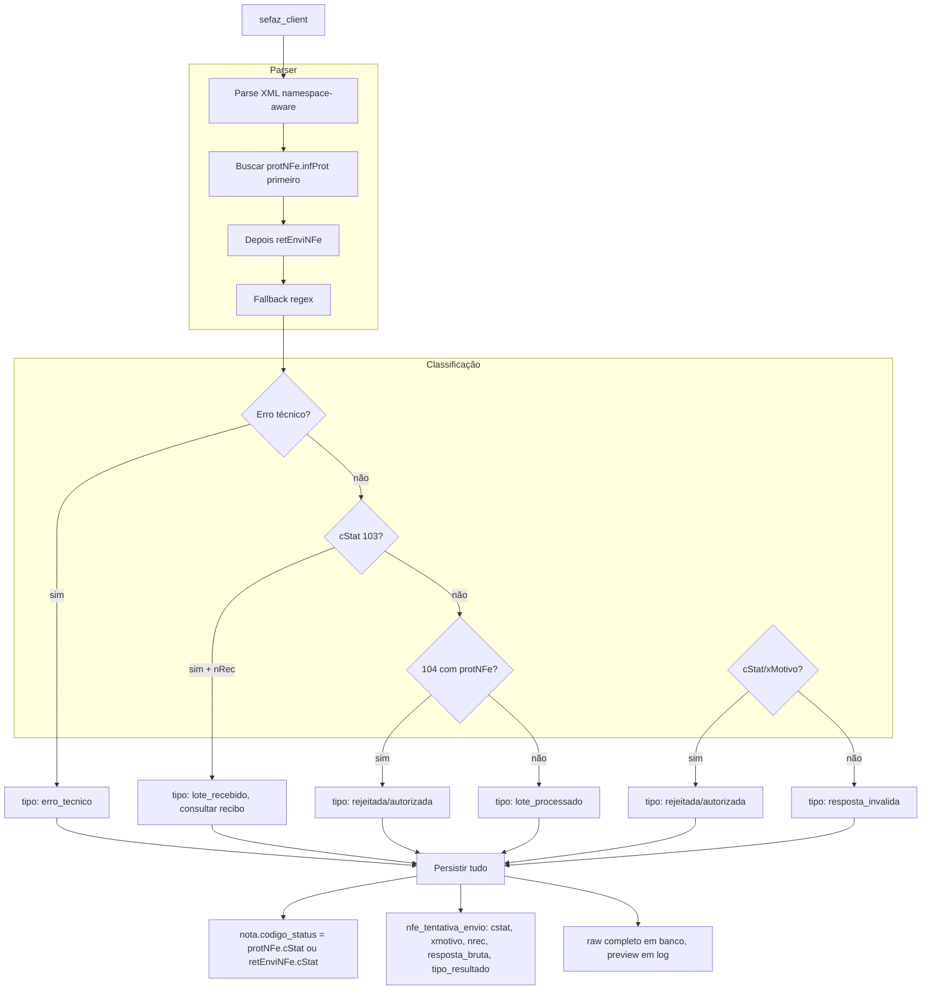

# Correção: Emissão NF-e - Diagnóstico SEFAZ e Mensagens

## Ponto central da correção

**Priorizar o resultado de protNFe.infProt sobre retEnviNFe.**  
O status final real da NF (100, 204, 539, etc.) normalmente está em `protNFe.infProt`; 103/104 são status do lote. Isso evita salvar 104 na nota quando o problema real foi, por exemplo, rejeição 539.

---

## Contexto do problema

Os logs mostram `status_http=400` com mensagem genérica "A SEFAZ não autorizou a nota. O motivo detalhado não foi informado." Isso ocorre porque:

1. O parser não prioriza `protNFe.infProt` sobre `retEnviNFe`
2. Parser depende só de regex; respostas com namespace variado podem quebrar
3. `raw_response` truncado em 2000 chars; não há separação entre resposta completa (auditoria) e amostra (log)
4. `nota.codigo_status` nunca é preenchido
5. 103 e 104 são tratados igualmente (incorreto)
6. `nfe_tentativa_envio` não tem colunas suficientes para diagnóstico
7. Exceções técnicas são mascaradas com mensagem genérica

## Arquivos principais

- [app/services/fiscal/sefaz_client.py](app/services/fiscal/sefaz_client.py) - parser, mensagem genérica, retorno
- [app/services/fiscal/provedor_local.py](app/services/fiscal/provedor_local.py) - chama `enviar_nfe_autorizacao`, grava XML
- [app/services/fiscal/emissao_service.py](app/services/fiscal/emissao_service.py) - `enviar_nfe`, atualiza nota, `NFeTentativaEnvio`
- [app/models/nota_fiscal.py](app/models/nota_fiscal.py) - `codigo_status`, `mensagem_retorno`
- [app/models/nfe_tentativa_envio.py](app/models/nfe_tentativa_envio.py) - deve virar fonte principal de diagnóstico

---

## Regras obrigatórias

### 1. Diferença entre 103 e 104

- **103** = lote recebido com sucesso → existe `nRec` → **consultar recibo** (NFeRetAutorizacao)
- **104** = lote processado. Antes de tratar como pendente, tentar extrair o resultado final da NF em `protNFe.infProt`. Só considerar inconclusivo se não houver cStat final da NF.

### 2. nota.codigo_status – status final mais relevante

Ordem de prioridade:

1. `protNFe.infProt.cStat` (status da NF)
2. `retEnviNFe.cStat` (status do lote)
3. null

Tipo: string curta, não inteiro (cStat vem como texto da SEFAZ; evita conversões desnecessárias).

Valores como 100, 204, 539, etc. são status da NF; 103/104 são status do lote. Evitar salvar 104 na nota quando o problema real foi 539.

### 3. Parser: XML primeiro, regex como fallback

- **Biblioteca obrigatória:** usar `lxml` se o projeto já tiver dependência; senão, `xml.etree.ElementTree` (stdlib). Escolher uma, não deixar aberto.
- Parser namespace-aware para buscar tags por caminho lógico (`protNFe/infProt`, `retEnviNFe`)
- Regex apenas como fallback quando o XML não parsear ou a estrutura for inesperada

### 4. Persistência completa vs amostra para log

- **raw_response_completa** → persistir completa no banco até o limite do campo
- Se exceder o limite da coluna: salvar em arquivo e gravar `resposta_bruta_preview` + `resposta_bruta_path` em `nfe_tentativa_envio`
- **raw_response_preview** → primeiros 500–1000 chars para log (evita explodir logs)

### 5. nfe_tentativa_envio – fonte principal de diagnóstico

Campos a incluir (migration):

- status_http, cstat, xmotivo, nrec, protocolo, url, ambiente
- resposta_bruta (completa até limite do campo)
- resposta_bruta_path (quando exceder; XML em arquivo)
- erro_tecnico (texto da exceção, se houver)
- tipo_resultado: `erro_tecnico` | `lote_recebido` | `lote_processado` | `autorizada` | `rejeitada` | `resposta_invalida`

Regra semântica de tipo_resultado:

- **Resultado da NF:** `autorizada`, `rejeitada`
- **Resultado do lote:** `lote_recebido`, `lote_processado`
- **Resultado do canal/parser:** `erro_tecnico`, `resposta_invalida`

Facilita dashboard e suporte.

### 6. Mensagem genérica só como último fallback

"A SEFAZ não autorizou a nota. O motivo detalhado não foi informado." **só** pode aparecer quando:

- não houve erro técnico identificável
- não houve cStat
- não houve xMotivo
- não houve nRec
- **e** o raw já foi persistido em `nfe_tentativa_envio`

### 7. XML de retorno em disco – obrigatório em rejeição

Gravar XML de retorno em arquivo não só em sucesso, mas também em:

- rejeição
- retorno de lote (103/104)
- resposta inesperada com XML válido

---

## Ordem de implementação

### Etapa 1 — Parser + retorno enriquecido (sefaz_client.py)

- Parser robusto: priorizar `protNFe.infProt` (lxml ou ElementTree, namespace-aware), depois `retEnviNFe`, regex como fallback
- Extrair `nRec`, `cstat`, `xmotivo`, `protocolo`, `chave`
- Retornar tudo: `cstat`, `xmotivo`, `nrec`, `protocolo`, `chave`, `raw_response_completa` (não truncar no retorno interno)
- Classificar resultado em `tipo_resultado`
- Log estruturado com `raw_response_preview` (500–1000 chars)

### Etapa 2 — Persistência (emissao_service + nfe_tentativa_envio)

- Migration: adicionar `cstat`, `xmotivo`, `nrec`, `protocolo`, `url`, `ambiente`, `erro_tecnico`, `tipo_resultado`, `resposta_bruta_path` em `nfe_tentativa_envio`
- Preencher `nota.codigo_status` (string) pela regra: protNFe.infProt.cStat > retEnviNFe.cStat > null
- Preencher `nota.mensagem_retorno` com mensagem formatada (nunca genérica quando houver cStat)
- Gravar `resposta_bruta` completa (ou em arquivo com `resposta_bruta_path` se exceder limite)
- Gravar status_http, cstat, xmotivo, nrec, url, ambiente, tipo_resultado

### Etapa 3 — Fluxo de recibo

- **103 + nRec** → consultar recibo (NFeRetAutorizacao)
- **104** → extrair resultado final de `protNFe` antes de marcar pendência; só usar mensagem de 104 sem resultado quando não houver cStat da NF
- Implementar antes da gravação em disco para não alterar interpretação depois

### Etapa 4 — Gravação de XML em disco

- Salvar XML de retorno em rejeição, lote (103/104) e resposta inesperada com XML válido
- Em [provedor_local.py](app/services/fiscal/provedor_local.py): gravar `xml_retorno_path` sempre que houver corpo XML válido

### Etapa 5 — Testes

- Autorização
- Rejeição com cStat/xMotivo
- Lote 103 (recibo)
- Lote 104 com rejeição final
- Timeout
- XML inesperado
- Resposta HTML/erro proxy

---

## Mensagens finais ao usuário

| Cenário                      | Exemplo de mensagem                                                                                                             |
| ---------------------------- | ------------------------------------------------------------------------------------------------------------------------------- |
| Rejeição fiscal              | `Rejeição 539: Duplicidade de NF-e.`                                                                                            |
| Erro técnico                 | `Falha técnica na comunicação com a SEFAZ: certificado digital inválido`                                                        |
| Lote 103, recibo             | `Lote recebido pela SEFAZ. Recibo: 123456789012345. Aguardando processamento`                                                   |
| 104 sem resultado em protNFe | `Lote processado pela SEFAZ, mas sem resultado final identificável no retorno. Verifique a tentativa de envio.`                 |
| Sem cStat (último fallback)  | `A SEFAZ não autorizou a nota. O motivo detalhado não foi informado. Verifique nfe_tentativa_envio.resposta_bruta (nota_id=X).` |

A última mensagem **só** quando: nenhum erro técnico, nenhum cStat, nenhum xMotivo, nenhum nRec, e raw já persistido.

---

## Diagrama do fluxo desejado

