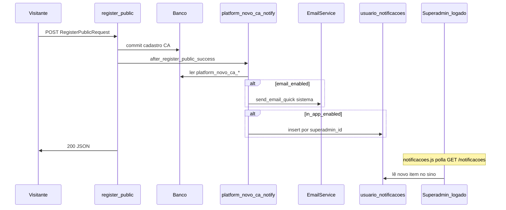

# Plano profissional — Notificação de novo CA, convite e configurações Superadmin

## 1. Validação (fonte de verdade)

| Etapa | Onde | Situação atual |
|--------|------|----------------|
| Cadastro CA | `POST /api/v1/auth/register/public` → [`AuthService.register_public`](app/services/auth_service.py) | Cria Cliente, Usuario (CA), Tenant, Subscription; `audit_action("cadastro_publico")` |
| E-mail Superadmin | — | **Não existe** |
| Alerta in-app (sino) | [`GET /api/v1/notificacoes`](app/api/v1/notificacoes.py) + [`base.html`](app/templates/base.html) + [`notificacoes.js`](app/static/js/notificacoes.js) | Qualquer usuário logado vê `UsuarioNotificacao`; Superadmin usa o mesmo sino, mas **nenhuma linha é criada** no cadastro de CA |
| Convite e-mail | — | **Não existe** |

Conclusão: é necessário **orquestrar** e-mail + inbox no mesmo fluxo pós-sucesso do cadastro, respeitando **feature flags** em banco (regra de ouro SaaS: parâmetros em DB + API + front).

---

## 2. Alinhamento front / back (contrato)

### 2.1 Query string do cadastro público

- **Canônico:** apenas `codigo_promocional` (nome idêntico ao campo JSON do `RegisterPublicRequest`).
- Front [`register_public.html`](app/templates/auth/register_public.html): ao carregar, `new URLSearchParams(location.search).get("codigo_promocional")` → preenche `#codigo_promocional` e dispara validação existente (`blur`) se valor presente.
- Back do convite: montar `cadastro_url` = `{get_app_url(db)}/cadastro?codigo_promocional={encodeURIComponent(codigo)}` (sem código quando vazio).

### 2.2 API de convite (resposta tipada)

- `POST /api/v1/admin/.../convite-lojista` (superadmin).
- Response JSON estável, ex.: `{ "ok": true, "email": "...", "cadastro_url": "https://..." }` para o front exibir “link copiável” e confirmar envio — **mesma URL** enviada no corpo do e-mail.

### 2.3 API de configuração (espelho do que o front grava)

- `GET /api/v1/admin/platform/novo-ca-notificacoes` → `{ "email_enabled": bool, "in_app_enabled": bool }` (sempre booleanos explícitos; leitura com defaults da migration se chave ausente em bancos antigos).
- `PATCH` com o mesmo corpo (parcial permitido só se documentado; preferível PATCH substituindo os dois campos para simplicidade).
- Front só altera estado via esse PATCH (sem hardcode de comportamento).

---

## 3. Persistência — chaves `Configuracao`

Sugestão de chaves (prefixo claro `platform_`):

- `platform_novo_ca_email_enabled` — `"true"` / `"false"`
- `platform_novo_ca_in_app_enabled` — `"true"` / `"false"`

**Migration** insere defaults `"true"` para ambos (comportamento atual equivalente “ligado” após deploy). Superadmin desliga o que não quiser pela UI.

Leitura no serviço de notificação: se chave ausente (banco legado), tratar como `true` **uma única vez** no helper de leitura OU garantir migration idempotente que faz upsert — preferível **migration com INSERT ... ON CONFLICT DO NOTHING** ou equivalente para não depender de fallback em runtime (alinhar ao rigor do projeto).

---

## 4. In-app: alerta no sino do Superadmin logado

- Modelo existente [`UsuarioNotificacao`](app/models/usuario_notificacao.py), constraint `uq_usuario_notif_user_tipo_ref` (`usuario_id`, `tipo`, `ref_id`).
- **Constante de tipo:** ex. `platform_novo_cadastro_ca` (≤ 60 caracteres).
- **`ref_id`:** `user.id` do **novo** CA (garante **idempotência**: reenvio acidental do mesmo evento não duplica linha por superadmin).
- Para **cada** `Usuario` superadmin ativo: `get_or_create` / “insert se não existe” com mesmo `tipo` + `ref_id`.
- Campos: `titulo` curto (“Novo cadastro de lojista”), `mensagem` com empresa + CNPJ + e-mail, `link` para rota admin já usada (ex. `/admin/billing/tenant/{tenant_id}` ou lista tenants), `icone`/`cor` coerentes com o restante do sistema.
- **Não** alterar [`notificacoes.js`](app/static/js/notificacoes.js) se o payload já seguir o formato de [`_serializar_ucca`](app/api/v1/notificacoes.py) (já compatível).

Execução: no mesmo orquestrador pós-`commit` do cadastro; se `in_app_enabled`, gravar notificações + `commit`; falha isolada em `try/except` + log — **nunca** falhar o HTTP de cadastro público.

---

## 5. E-mail (mantém plano anterior, condicionado à flag)

- Destinatários: todos `Usuario` ativos com `role.nome == "Superadministrador"`.
- [`send_email_quick`](app/services/email_service.py) com `funcao="sistema"` ([`email_funcoes.py`](app/core/email_funcoes.py)).
- Só enviar se `platform_novo_ca_email_enabled`.

---

## 6. UI Superadmin — configurações da função

- Nova seção **“Notificações — novo cadastro de lojista (CA)”** em página já restrita a Superadmin:
  - **Opção A:** [`billing_config.html`](app/templates/admin/billing_config.html) (junto de APP_URL; mesmo fluxo de token em cookie).
  - **Opção B:** card em [`dashboard_super_admin.html`](app/templates/admin/dashboard_super_admin.html) com link “Configurar notificações de cadastro”.
- Conteúdo mínimo profissional: dois switches (E-mail aos Superadmins / Alerta no painel), texto de ajuda (“usa SMTP em Configurações”; “o sino atualiza em poucos segundos”), botão Salvar chamando `PATCH`.
- **Convidar lojista:** formulário (e-mail, mensagem opcional, código promocional opcional) na mesma seção ou em [`billing_tenants.html`](app/templates/admin/billing_tenants.html) — importante que o **mesmo** `cadastro_url` retornado pela API seja exibível/copiável.

---

## 7. Orquestração no backend (um serviço)

Arquivo sugerido: `app/services/platform_novo_ca_notify_service.py` (nome ajustável) com função única, ex. `after_register_public_success(db, *, novo_usuario, cliente, tenant)`:

1. Lê flags em `Configuracao`.
2. Se e-mail: monta corpo + envia (try/except).
3. Se in-app: insere `UsuarioNotificacao` por superadmin (try/except, idempotente).
4. Não propaga exceções para `register_public`.

---

## 8. Diagrama

---

## 9. RBAC e impacto

- Config + convite: `require_superadmin()` apenas.
- Cadastro público continua anônimo; apenas gancho interno após sucesso.
- Não desativar fluxos existentes: mudanças localizadas em novo serviço + rotas admin + migration + templates admin/cadastro.

---

## 10. Documentação

- [`MAPA_FLUXO/FLUXO_NOVO_CLIENTE_ADMINISTRADOR.md`](MAPA_FLUXO/FLUXO_NOVO_CLIENTE_ADMINISTRADOR.md): e-mail opcional, inbox, flags, URL convite.
- [`MAPA_SISTEMA/MAPA_DE_API.md`](MAPA_SISTEMA/MAPA_DE_API.md) (ou seção existente de admin): documentar GET/PATCH e POST convite.

---

## Onde encontrar este plano

- **No repositório:** [`.cursor/plans/notificacao_ca_e_convite_superadmin.plan.md`](.cursor/plans/notificacao_ca_e_convite_superadmin.plan.md)
- **No Cursor (painel Plans):** plano “Notificação CA e convite” (arquivo em `.cursor/plans/` do ambiente Cursor).
