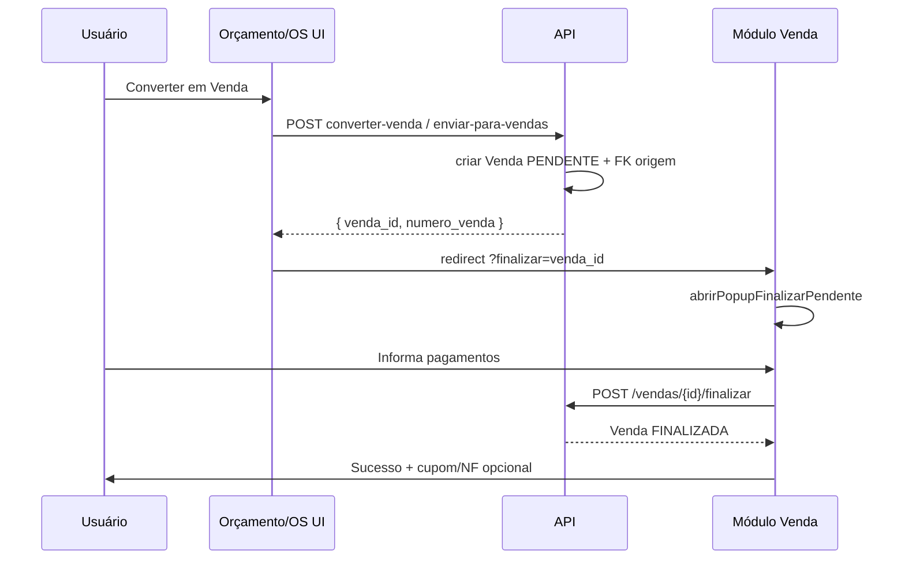

# Plano: alinhamento Orçamento · Ordem de Serviço · Venda

> **Plano revisado (referência principal):** [`.cursor/plans/alinhamento_orç_os_venda_fa43bd74.plan.md`](.cursor/plans/alinhamento_orç_os_venda_fa43bd74.plan.md) — lacunas técnicas validadas no código (§9), multi-brand, rastreio `venda_origens`, templates impressão.

**Última revisão de lacunas:** 2026-06-18 — auditoria plano × código (redirects, 2 fluxos OS, RLS pós-br35, backfill tenant_id, entry points venda).

**Objetivo:** Três módulos com **mesma linguagem visual**, **mesmo fluxo de peças/cliente** e **funil comercial único**, no modelo **multi-brand** (`core` em Ibix e Solumática):

```
Orçamento ──► OS ──► Venda (pagamento + estoque + NF)
     │              ▲
     └──────────────┴──► Venda direta (pagamento + estoque + NF)
```

**Regra de ouro (MAPA_DE_REGRAS / golden rules):** conversão **nunca** inventa sucesso de pagamento; venda só finaliza com `POST /vendas/{id}/finalizar`. **Multi-brand:** branding via `{{ brand.* }}`; gating `core` (Ibix + Solumática); RLS em tabelas novas; sem fallback silencioso entre marcas.

---

## 1.1 Multi-brand (Ibix · Solumática)

| Tema | Regra neste plano |
|------|-------------------|
| Módulo | Orç/OS/Venda = **`core`** — disponível em **ambas** marcas |
| Marketplace | **Fora** do escopo; Solumática → **403** em `/loja` |
| UI/PDF | `brand.nome_exibicao`, `brand.logo_url` — remover `\| PDV Ibix` hardcoded |
| Tabelas novas | `tenant_id` + RLS (`venda_origens`, `documento_impressao_templates`) |
| Conversão | Validar mesmo tenant; redirect pós-conversão no **mesmo host** |
| QA | Matriz Ibix **e** Solumática no roteiro de testes |

Detalhe completo: plano revisado, seção **Conformidade multi-brand**.

---

## 1. Estado atual (inventário)

| Capacidade | Orçamento | OS | Venda |
|------------|-----------|-----|-------|
| Modal peças/cliente padronizado | ✅ Parcial (`_modal_orcamento.html` ≈ OS) | ✅ Referência | ⚠️ Modal próprio (`index.html`) |
| Conversão implementada | ✅ OS, Venda pendente, Pedido | ✅ → Venda pendente | — |
| Pagamento na conversão | ❌ Só cria `PENDENTE` | ❌ Redireciona para `/negocio/venda` | ✅ `finalizar` + popup pagamentos |
| Rastreio origem | `convertido_em_*`, `vendas.orcamento_id` | `vendas.ordem_servico_id` | Exibe origem na listagem |
| Service backend | `orcamento_conversao_service.py` | `ordem_servico_venda_service.py` | `vendas.py` |

**APIs existentes (não recriar):**

- `POST /api/v1/orcamentos/{id}/converter-os` — body `{ tipo_id }`
- `POST /api/v1/orcamentos/{id}/converter-venda` — cria venda `PENDENTE`, FK `orcamento_id`
- `POST /api/v1/ordens-servico/{id}/enviar-para-vendas` — cria venda `PENDENTE`, FK `ordem_servico_id`
- `POST /api/v1/vendas/{id}/finalizar` — pagamentos, baixa estoque, status finalizada

**Lacunas principais:**

1. Conversão para venda **para no meio do caminho** (usuário precisa achar a venda pendente manualmente).
2. Orçamento → Venda **não abre** o popup de pagamento da Nova Venda.
3. UI de conversão no orçamento ainda mistura **Pedido** (legado do módulo Orçamento/Pedido) com OS/Venda.
4. Modal de **Nova Venda** ainda difere visualmente do modal OS/Orçamento.
5. MAPA_DO_SISTEMA §11 desatualizado (marca frontend 0% — já há telas).
6. **Impressão/PDF:** Orçamento HTML fixo; OS sem PDF; sem template CA.
7. **Redirect pós-conversão:** Orç→Venda usa `alert`; OS→Venda vai a `/negocio/venda` **sem** `?finalizar=` (2 funções JS).
8. **Menu Converter:** Pedido ainda no menu principal; label "Venda pendente".

Ver plano revisado § **Estado atual** e § **9. Lacunas adicionais** para lista completa.

---

## 2. Visão alvo

### 2.1 Funil comercial

| Origem | Destinos permitidos | Quando |
|--------|---------------------|--------|
| **Orçamento** (emitido/aprovado) | **OS** ou **Venda** | Uma conversão por orçamento (já enforced) |
| **OS** (concluída) | **Venda** | 1:1 (`uq_vendas_ordem_servico_id`) |
| **Venda** | — | Terminal do funil (caixa, NF opcional) |

**Pedido** permanece no backend para compatibilidade, mas **sai do menu de conversão principal** (ou fica em “Avançado”) até decisão de produto.

### 2.2 Experiência unificada de conversão → venda

Fluxo desejado (Orçamento ou OS):

1. Usuário confirma conversão.
2. Backend cria venda `PENDENTE` (como hoje).
3. Frontend **abre imediatamente** o mesmo popup **`abrirPopupFinalizarPendente(venda)`** usado em `/negocio/venda`.
4. Usuário registra pagamento(s) → `POST /finalizar`.
5. Tela de sucesso + opção imprimir cupom / emitir NF (já existente).

Parâmetro opcional na URL: `/negocio/venda?finalizar={venda_id}` para deep-link após conversão.

### 2.3 Experiência unificada de formulário

Extrair **partial compartilhado** (Jinja + JS):

| Bloco | Conteúdo |
|-------|----------|
| `negocios/_modal_pecas_cliente.css` | Classes `modal-os-*`, autocomplete, scroll tabelas |
| `negocios/_modal_pecas_cliente.html` | Seções Informações gerais + Peças (sem campos específicos) |
| `negocios/_modal_pecas_cliente.js` | Busca produtos `/vendas/produtos`, itens selecionados, resumo desconto |

**Campos específicos por módulo (plug-in):**

| Módulo | Extra no header |
|--------|-----------------|
| Orçamento | Validade, Condições pagamento |
| OS | Tipo OS, equipamentos (fora do partial) |
| Venda | Caixa/PDV, pagamento inline |

Referência visual: modal **Nova OS** (`ordem_de_servico/index.html` → `#modalNovaOSCustom`).

---

## 3. Modelo de dados e rastreabilidade

**Manter (já correto):**

- `orcamentos.convertido_em_ordem_servico_id` / `convertido_em_venda_id`
- `vendas.orcamento_id`, `vendas.ordem_servico_id` (unique 1:1 OS)
- `origem_documento` fiscal: `orcamento`, `ordem_servico`, `venda_balcao`

**Novas estruturas (Fase 2 — migration autorizada no venv):**

- `ordem_servico.orcamento_origem_id` — FK quando OS nasce de orçamento
- Tabela **`venda_origens`** — cadeia imutável (`imediata` + `raiz`), tenant + RLS
- Propagação: OS→Venda preenche `vendas.orcamento_id` quando OS tem `orcamento_origem_id`
- Backfill idempotente para vendas já existentes

**Melhorias sugeridas (mesma fase):**

- Preencher `vendas.desconto` / totais na conversão orçamento (header hoje fixa `desconto=0`)
- API/UI: `origem_imediata_*`, `origem_raiz_*`, `origem_cadeia` (breadcrumb Orç→OS→Venda)

---

## 4. Backend — ajustes por fase

### Fase A — Consolidar serviço de conversão para venda

Criar **`app/services/conversao_venda_service.py`**:

```python
def criar_venda_pendente_de_orcamento(db, orcamento, usuario_id) -> Venda
def criar_venda_pendente_de_os(db, ordem, usuario_id) -> Venda  # move de ordem_servico_venda_service
```

- Validações centralizadas: escopo tenant, status, itens, não duplicar conversão.
- Retorno sempre **`VendaResponse`** (id, numero_venda, total, status).
- Opcional: query param `?abrir_pagamento=1` só no front; backend não muda contrato.

**Orcamento → Venda direta:** manter endpoint; delegar ao service unificado.

**OS → Venda:** manter endpoint; delegar ao service unificado.

### Fase B — Endpoint auxiliar (opcional)

`GET /api/v1/vendas/{id}/contexto-finalizacao` — retorna payload mínimo para o popup (itens, total, cliente, origem) sem carregar página inteira.

### Fase C — Conversão orçamento → OS (já OK)

Manter `converter_orcamento_em_ordem_servico`; exigir `destinatario_id` (cliente consumidor).

Após OS criada: UI pergunta **“Abrir ordem de serviço?”** (redirect `/negocio/ordem-servico?os={id}`) — não converte automaticamente para venda.

---

## 5. Frontend — ajustes por fase

### Fase 1 — Conversão com pagamento imediato (prioridade)

**Orçamento (`orcamentos/index.html`):**

- Submenu **Converter:** apenas **Ordem de serviço** e **Venda**.
- Ao converter venda:
  1. `POST /converter-venda`
  2. `window.location.href = '/negocio/venda?finalizar=' + venda_id`
- Modal OS: manter (tipo obrigatório).

**OS (`ordem_de_servico/index.html`):**

- Botão **Enviar para vendas** → após sucesso:
  - `window.location.href = '/negocio/venda?finalizar=' + venda_id` (em vez de só listagem)
- Habilitar botão quando OS `concluida` e sem `venda_id` (corrigir se `d-none` permanece).

**Venda (`vendas/index.html`):**

- No `DOMContentLoaded`, ler `?finalizar=` e chamar `abrirPopupFinalizarPendente(venda)`.
- Listagem: badge **Pendente** + origem (OS / Orçamento).

### Fase 2 — UI idêntica + detalhes orçamento (CA, dados, obs.)

1. Extrair CSS/JS compartilhado do modal OS.
2. Refatorar `_modal_orcamento.html` para usar partial.
3. Refatorar modal Nova Venda para usar o mesmo shell (`modal-os-overlay` / `modal-os-container`).
4. **Modal Detalhes orçamento** (paridade OS) — plano revisado §10.
5. Checklist visual: header, seções, tabelas, resumo financeiro, botões footer.

### Fase 3 — Ações na listagem alinhadas

| Tela | Ações padrão |
|------|----------------|
| Orçamentos | **Detalhes** · PDF · Emitir · **Converter** (OS \| Venda) · Editar (rascunho) |
| OS | Detalhes · Editar · Finalizar · **Converter em venda** |
| Vendas | Detalhes · **Registrar pagamento** (pendente) · Estornar |

### Fase 4 — Templates de impressão (Orçamento + OS)

Permitir que o **CA** configure o **formato de impressão/PDF** de Orçamento e Ordem de Serviço (Negócios):

- Tabela `documento_impressao_templates` (tenant + RLS), tipos `orcamento` | `ordem_servico`
- Motor unificado `documento_impressao_service.py` (Jinja + WeasyPrint), branding via `brand.*`
- CRUD API `/api/v1/documentos-impressao/templates` + UI **Formatos de impressão** (Configurações / Negócios)
- Refatorar `GET /orcamentos/{id}/pdf`; criar `GET /ordens-servico/{id}/pdf`
- Botão PDF na OS (modal Detalhes + listagem); orçamento passa a usar template do tenant
- Seed com 2 modelos sistema (fallback); placeholders documentados na UI

**Não confundir** com `ManutencaoTemplateOS` (módulo referência/manutenção).

Detalhamento completo: plano revisado, **Fase 5**.

---

## 6. RBAC e gating

| Ação | Permissão sugerida |
|------|-------------------|
| Criar/editar orçamento | `negocios.orcamento:criar` |
| Converter orçamento | `negocios.orcamento:converter` (ou `:criar` + `:emitir`) |
| Criar OS | `negocios.ordem-servico:criar` |
| Enviar OS → venda | `negocios.ordem-servico:editar` + `negocios.venda:criar` |
| Finalizar venda / pagamento | `negocios.venda:finalizar` + caixa aberto quando exigido |

Validar escopo `ClienteScope` em todos os services (já parcialmente aplicado).

---

## 7. Regras de negócio (checklist)

- [ ] Orçamento só converte se **emitido** ou **aprovado** e **não expirado**.
- [ ] Orçamento → OS exige **cliente (consumidor)** selecionado.
- [ ] Orçamento → Venda: itens com `produto_cliente_id`; estoque validado só no **finalizar**.
- [ ] OS → Venda: OS **concluída**; uma venda por OS.
- [ ] Finalizar venda: soma pagamentos ≥ total; troco calculado; baixa estoque por item.
- [ ] Sem fallback silencioso: erro 4xx/5xx explícito (sem redirecionar para outra marca/tenant).

---

## 8. Diagrama de sequência (conversão → pagamento)



---

## 9. Cronograma sugerido

| Fase | Entrega | Esforço |
|------|---------|---------|
| **1** | Deep-link `?finalizar=` + redirect pós-conversão Orçamento/OS | 1–2 dias |
| **2** | Migration `venda_origens` + `orcamento_origem_id` + service rastreio + API/UI origem | 2–3 dias |
| **3** | Partial UI compartilhado + Nova Venda no shell OS | 3–5 dias |
| **4** | Origem na listagem vendas + desconto header orçamento | 1 dia |
| **5** | Templates impressão Orçamento + OS (CRUD, motor PDF, UI) | 2–4 dias |
| **6** | Atualizar MAPA_DO_SISTEMA §11, MAPA_DE_API §18, FLUXO_* + doc templates | 0,5–1 dia |

---

## 10. Critérios de aceite

1. Orçamento emitido → **Converter → Venda** abre popup de pagamento sem passos manuais extras.
2. OS concluída → **Enviar para vendas** abre o **mesmo** popup de pagamento.
3. Venda finalizada aparece como **Finalizada**; estoque baixado; origem visível.
4. Orçamento → **Converter → OS** cria OS com itens e cliente; orçamento `convertido`.
5. Modais Novo Orçamento / Nova OS / Nova Venda **indistinguíveis** na estrutura (mesmas seções e tabelas).
6. Nenhum hardcode de marca; tenant/RLB/RBAC respeitados.
7. **Orçamento e OS** imprimem via **template configurável pelo CA** (PDF unificado, botões na UI).
8. Venda exibe **rastreio de origem** (imediata, raiz e cadeia Orç→OS→Venda) na listagem e no detalhe.
9. Funil validado em **Ibix e Solumática** (`core`); PDF/títulos com branding da marca corrente; RLS entre tenants.

---

## 11. Referências no repositório

- `app/services/orcamento_conversao_service.py`
- `app/services/ordem_servico_venda_service.py`
- `app/api/v1/orcamentos.py` (converter-os, converter-venda)
- `app/api/v1/ordens_servico.py` (enviar-para-vendas)
- `app/api/v1/vendas.py` (finalizar, pedido pendente)
- `app/templates/meu_negocio/orcamentos/_modal_orcamento.html`
- `app/templates/meu_negocio/ordem_de_servico/index.html` (#modalNovaOSCustom)
- `app/templates/meu_negocio/vendas/index.html` (popup finalizar)
- `.cursor/plans/orcamento_modulo_profissional.plan.md` (plano anterior — parcialmente implementado)

---

**Última atualização:** 2026-06-18
