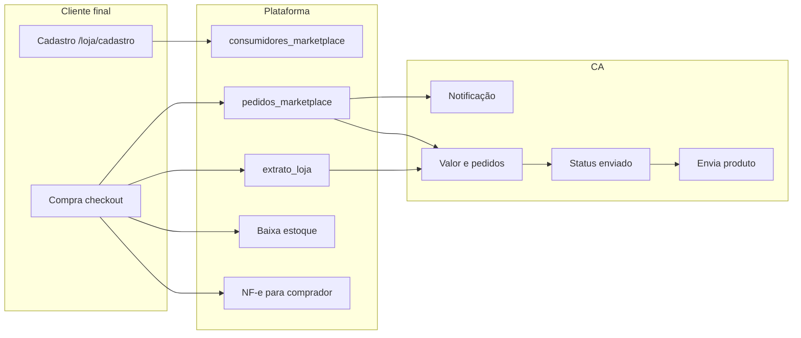

# Plano: Marketplace e ecossistema

Princípio: **uma fonte de verdade, sem duplicar tabela ou informação**. O estoque compartilhado (`produtos_cliente.quantidade_atual`) é alimentado pela entrada NFe (detalhes em [plano_unificado_estoque_nfe_ecossistema.md](plano_unificado_estoque_nfe_ecossistema.md) — Parte I) e pelo checkout da loja quando anúncio sincronizado.

---

## 1.0 Marketplace: integração 100% pelo front, 100% funcional, sem hardcode

A **integração da loja no marketplace** (ativar loja, anúncios, sync estoque, pedidos, extrato) deve ser **100% pelo front**, **100% funcional e operacional**, **sem hardcode**. Não deve haver configuração ou informação apenas no backend. O front deve oferecer **interfaces completas** (botões, formulários, listagens) que chamam as APIs — **nada de "use a API POST …" ou lista de endpoints como instrução para o usuário**. Ex.: botão "Ativar minha loja" que chama POST loja com o cliente_id do contexto; formulários para anúncios e sync estoque; pedidos e extrato em tabelas com ações. A integração é **pela interface**, não pelo usuário chamar endpoints manualmente. **Sem hardcode:** nenhum valor fixo no código (cliente_id, loja_id); o front obtém contexto e usa nas chamadas.

- **Loja:** Ativar, nome, descrição, tipo de entrega, raio, taxas — via **telas/forms no front** (GET/POST/PATCH loja). Botão "Ativar minha loja" quando não existe loja (front chama POST com cliente_id do contexto).
- **Anúncios:** Publicar, editar, pausar, preço, estoque — via **front** (formulários + anúncios e sync/estoque). Listagem e botão "Sincronizar estoque" na interface.
- **Pedidos e extrato:** Listagem, status, valor — na tela Minha loja (tabelas + PATCH status). Tudo operável só pelo front.
- **Notificações:** Quando houver configuração, tela no front; backend só envia conforme regra.
- **Dados fiscais do comprador (NF-e):** Vêm do checkout; correções futuras via front.

**Regra:** Integração da loja no marketplace **100% pelo front**, **100% funcional e operacional**, **sem hardcode**. O backend expõe apenas APIs; toda a experiência do CA acontece na interface. Listas de endpoints não são substituto de UI; eventual referência apenas como "referência para desenvolvedores".

**Estrutura de páginas (CA vs vitrine central):**
- **Página do CA (seu negócio, sua loja):** O CA tem a página do **seu negócio** / **da sua loja** — onde gerencia dados da loja, anúncios, pedidos e extrato (ex.: Minha loja, `/negocio/marketplace/minha-loja`). Contexto do vendedor: apenas produtos e vendas daquele estabelecimento.
- **Página central (Solumatica):** A **página central** da plataforma (ex.: vitrine pública `/loja`) mostra **todos os produtos de todos os CAs juntos** — marketplace único. O consumidor vê ofertas de todas as lojas em um só lugar.
- **Evoluções posteriores:** Ajustes futuros na vitrine central: **perto de mim** (proximidade), **priorizar pagos** (destaque/planos pagos), etc. A base atual é listar todos juntos; filtros e priorização vêm em seguida.

## 1.1 Princípio: uma fonte de verdade

- **Estoque:** `produtos_cliente.quantidade_atual` (+ `movimentacoes_estoque`). PDV, entrada NFe (plano unificado Parte I) e checkout da loja (anúncio sincronizado) atualizam essa mesma coluna.
- **Vitrine:** `anuncios_plataforma` com FK `produto_ca_id` → `produtos_cliente`; estoque no anúncio espelhado (sync) ou manual. Não criar outra tabela de estoque.
- **Pedidos cliente final:** apenas `pedidos_marketplace` e `pedido_itens_marketplace`; valor em `extrato_loja` e `lojas_marketplace.faturamento_total`. Não duplicar.

## 1.2 Fluxo: João → cadastro → compra → NF-e → CA notificação/valor → baixa → envio

## 1.3 Cadastro e compra do cliente final

- **Cadastro:** `consumidores_marketplace`; POST `/api/v1/loja/cadastro`, página `/loja/cadastro`. Manter; não duplicar com `clientes`.
- **Compra:** POST `/api/v1/loja/checkout` já cria pedido, baixa estoque (anúncio + `produtos_cliente` se sincronizado), atualiza loja e extrato. Garantir consistência da baixa; não duplicar lógica.

## 1.4 Emissão automática de NF-e para o comprador

Quando o cliente final compra na plataforma, emitir **automaticamente** a nota fiscal para o mesmo (destinatário = comprador).

- **Vínculo:** Coluna `pedido_marketplace_id` em `notas_fiscais` (FK `pedidos_marketplace.id`); enum `VENDA_MARKETPLACE` em `OrigemDocumentoFiscalEnum`.
- **Destinatário:** Não criar `clientes` para o comprador. Se `nota.pedido_marketplace_id` preenchido e `nota.cliente_id` nulo, montar dict destinatário a partir de `PedidoMarketplace`: `comprador_nome`, `comprador_documento`, `endereco_entrega`, `comprador_email`, `comprador_telefone`. Helper `_destinatario_from_pedido_marketplace(pedido)` em [app/services/fiscal/emissao_service.py](app/services/fiscal/emissao_service.py).
- **Criação da nota:** Novo serviço que, a partir de `PedidoMarketplace` (itens + anúncios + `produtos_cliente` para NCM/CFOP), cria `NotaFiscal` (rascunho) + `NotaFiscalItem`; empresa emissora = `Empresa` onde `cliente_id == loja.cliente_id`.
- **Disparo:** Após `db.commit()` do checkout em [app/api/v1/loja.py](app/api/v1/loja.py), enfileirar task Celery `emitir_nfe_pedido_marketplace` que cria a nota e chama `FiscalEmissaoService.enviar_nfe(nota_id)`. Se falhar, nota fica em rascunho para retentativa.
- **Requisitos:** NCM (e preferencialmente CFOP) em `produtos_cliente`; endereço comprador (hoje `endereco_entrega` é texto — usar como endereço único ou parse para cidade/UF/CEP).

## 1.5 CA recebe notificação e valor

- **Notificação:** Ao concluir o checkout, enfileirar task que envia e-mail ao CA (ou usuários com `marketplace:gerenciar_pedidos`) com resumo do pedido. Opcional: tipo "novo_pedido_marketplace" em notificações in-app.
- **Valor:** Já implementado — `extrato_loja` e `loja.faturamento_total`; GET `/api/v1/marketplace/loja/{id}/extrato`. Não duplicar em outra tabela.

## 1.6 Baixa no estoque e envio

- **Baixa:** Feita uma vez no checkout (anúncio + `produtos_cliente` se sincronizado). CA não precisa confirmar baixa de novo.
- **Envio:** PATCH `/api/v1/marketplace/pedidos/{id}` atualiza `status_pedido` (ex.: enviado). Status em `pedidos_marketplace`; não criar tabela de envios.

## 1.7 Tela Minha loja (CA) — ✅ implementado

**Requisito:** Em [app/templates/marketplace/minha_loja.html](app/templates/marketplace/minha_loja.html): listagem de pedidos (GET loja/{id}/pedidos) com status e ação PATCH; resumo ou link para extrato (GET loja/{id}/extrato).

**Estado atual:** Implementado: contexto `minha_loja_cliente_id` na rota; carregamento da loja por cliente_id; listagem de pedidos com tabela (data, comprador, total, status pedido/pagamento) e botão "Alterar status" que abre modal com select (aguardando_pagamento, preparando, enviado, entregue, cancelado) e PATCH; listagem de extrato (tipo, descrição, valor bruto/líquido, status). Mensagens quando não há estabelecimento ou loja não ativada.

**Alinhado a 1.0:** Pedidos e extrato são configurados/visualizados/corrigidos pelo front. Qualquer tela futura de configuração da loja (dados da loja, anúncios, preferências de notificação) deve ser no front, consumindo as APIs existentes; nenhuma configuração do marketplace deve ficar apenas no backend.

## 1.8 Resumo: o que NÃO duplicar

| Dado | Fonte única | Onde não criar |
|------|-------------|----------------|
| Estoque | `produtos_cliente.quantidade_atual` (+ movimentacoes_estoque) | Segunda tabela de estoque |
| Pedido cliente final | `pedidos_marketplace` + itens | Replicar em vendas |
| Valor loja | `extrato_loja` + faturamento_total | Outra tabela financeira |
| Cadastro comprador | `consumidores_marketplace` | clientes ou usuarios |
| Status/envio | `pedidos_marketplace.status_pedido` | Tabela de envios |
| Destinatário NF marketplace | Dados em `pedidos_marketplace` | Criar `clientes` por comprador |

---

# Ordem de implementação (marketplace)

1. **NF-e automática (comprador):** Migration `pedido_marketplace_id` e enum VENDA_MARKETPLACE; serviço criar NotaFiscal + itens a partir de PedidoMarketplace; em emissao_service, destinatário a partir do pedido quando `nota.pedido_marketplace_id`; no checkout enfileirar task Celery que cria nota e envia à SEFAZ.
2. **Notificação CA:** No checkout, enfileirar task que envia e-mail ao CA com resumo do pedido.
3. **UI Minha loja:** Listagem de pedidos e extrato; botão/modal para PATCH de status.
4. **Documentação:** MAPA_DO_SISTEMA (e MAPA_DE_API se aplicável): fluxo ecossistema (João → compra → NF-e automática → notificação CA → valor → baixa → envio); reforçar estoque fonte única e não duplicar tabelas.

---

# Arquivos a alterar (marketplace)

| Área | Arquivos e alteração |
|------|----------------------|
| **NF-e comprador** | [app/models/nota_fiscal.py](app/models/nota_fiscal.py): coluna `pedido_marketplace_id`, enum VENDA_MARKETPLACE; migration; [app/services/fiscal/emissao_service.py](app/services/fiscal/emissao_service.py): destinatário a partir de PedidoMarketplace; novo serviço criar NotaFiscal a partir de PedidoMarketplace; [app/api/v1/loja.py](app/api/v1/loja.py): enfileirar task após checkout; [app/worker/tasks.py](app/worker/tasks.py): task `emitir_nfe_pedido_marketplace`. |
| **Notificação CA** | [app/api/v1/loja.py](app/api/v1/loja.py): enfileirar task e-mail; [app/worker/tasks.py](app/worker/tasks.py): task envio e-mail; serviço de e-mail existente. |
| **UI Minha loja** | [app/templates/marketplace/minha_loja.html](app/templates/marketplace/minha_loja.html): listagem pedidos + extrato; JS para PATCH status. |
| **Documentação** | MAPA_SISTEMA/MAPA_DO_SISTEMA.md: fluxo ecossistema (marketplace, NF-e comprador, notificação, valor, baixa, envio). MAPA_DE_API.md se aplicável. |

---

# Revisão: necessidade estilo Amazon

Necessidade resumida: (1) consumidor vê produto com preço em área pública (tipo Amazon); (2) na área pública aparecem todos os produtos de todos os CAs; (3) consumidor se cadastra, compra e paga pelo produto; (4) o dono do produto (CA) recebe o valor conforme configuração de gateway e recebe notificação de venda.

## O que o plano cobre e o que já existe

| Necessidade | No plano? | No código? | Observação |
|-------------|-----------|------------|------------|
| Consumidor vê produto com preço em área pública | Sim (vitrine, anúncios publicados) | Sim | GET `/api/v1/loja/anuncios` (público) retorna `preco_original`, `preco_promocional`. Páginas `/loja`, `/loja/produto/{id}`, `/loja/busca`, etc. |
| Todos os produtos de todos os CAs na área pública | Sim (vitrine central) | Sim | Sem `loja_slug`, a API lista anúncios de todas as lojas ativas (`LojaMarketplace.status == "ativo"`, `AnuncioPlataforma.status == "publicado"`). |
| Consumidor se cadastra | Sim | Sim | POST `/api/v1/loja/cadastro`, página `/loja/cadastro`. |
| Consumidor compra (checkout) | Sim | Sim | POST `/api/v1/loja/checkout` cria pedido, baixa estoque, atualiza extrato e faturamento da loja, dispara NF-e e notificação. |
| CA recebe notificação de venda | Sim | Sim | Task `notificar_ca_novo_pedido` após checkout (e-mail para responsáveis da loja). |
| CA vê o valor (extrato/faturamento) | Sim | Sim | `extrato_loja`, `lojas_marketplace.faturamento_total`, tela Minha loja com pedidos e extrato. |

## Lacunas: o que o plano não detalha e ainda não atende

| Necessidade | No plano? | No código? | Lacuna |
|-------------|-----------|------------|--------|
| Consumidor **paga** pelo produto (pagamento real: cartão/PIX) | Só "compra"/checkout | Parcial | Checkout só cria o pedido com `status_pagamento="pendente"`. Não há integração com gateway no checkout da vitrine (nada chama `/api/v1/payments/process` ou similar). O consumidor "fecha o pedido", mas o pagamento eletrônico não é processado na hora. |
| CA **recebe o valor** "baseado na sua configuração de gateway" | Só "CA recebe o valor" (extrato/faturamento) | Não | O plano fala em "receber o valor" via extrato e faturamento. Não fala em: (1) pagamento no checkout usando gateway; (2) repasse/split para a conta de cada CA conforme config de gateway do CA. Hoje existe `payment_provider_configs` por estabelecimento para PDV/vendas, não fluxo "pagamento na vitrine → dinheiro na conta do CA". O modelo já tem `gateway_pagamento`, `transaction_id`, `split_info` no pedido, mas o fluxo de pagamento na vitrine não está implementado. |

## Carrinho com várias lojas (estilo Amazon)

Hoje o checkout é **por loja:** `PedidoCheckoutCreate` tem um único `loja_id`; cada pedido é de uma loja. Se na vitrine o consumidor ver produtos de vários CAs e montar um **carrinho único** com itens de várias lojas, o plano/código não definem: se são **vários checkouts** (um pedido por loja) ou **um checkout com split** de pagamento entre CAs. Para "um carrinho, vários vendedores", o plano (e a API) precisam deixar explícito esse fluxo (ex.: um checkout que gera N pedidos por loja e/ou um pagamento com split).

## Evolução recomendada

- **Integração de pagamento no checkout da vitrine:** Gateway (cartão/PIX) no fluxo do checkout; por loja ou com split quando multi-vendedor.
- **Uso da configuração de gateway por CA:** Repasse para a conta do CA conforme `payment_provider_configs` (e, se for o caso, regras de split) para que o dono do produto de fato **receba o valor na conta configurada**, não só no extrato.

---

**Conclusão:** Este plano cobre o marketplace e ecossistema (vitrine, Minha loja, checkout, NF-e comprador, notificação/valor ao CA, baixa e envio). Área pública tipo Amazon (todos os CAs, com preço), cadastro, compra (checkout), notificação e "ver o valor" estão no plano e implementados. **Não estão atendidos ainda:** pagamento real no checkout da vitrine e repasse do valor para a conta do CA via gateway; carrinho multi-loja (um carrinho, vários vendedores) precisa ser definido. Todas as configurações e correções do marketplace são feitas pelo front; o backend expõe APIs e persiste dados (ver 1.0). A correção da quantidade NFe na entrada (estoque) está no [plano unificado](plano_unificado_estoque_nfe_ecossistema.md) (Parte I).
