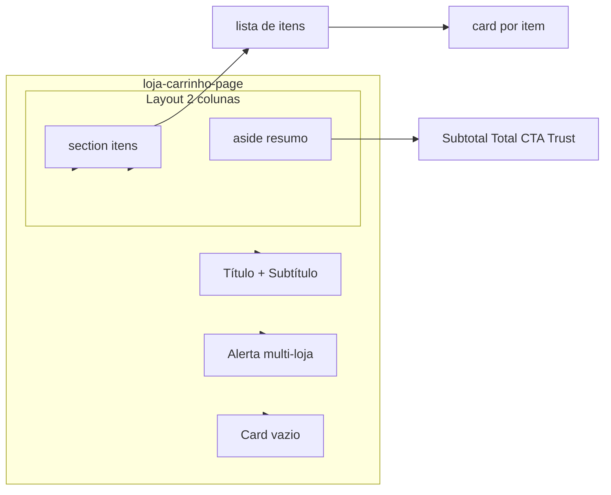

# Redesign visual do carrinho da loja

## Regras de execução (obrigatórias)

- **Desktop:** duas colunas com resumo sticky à direita.
- **Mobile:** uma coluna; resumo abaixo da lista (sem sticky).
- **Subtotal e total:** manter os dois campos separados no DOM, mesmo que iguais nesta fase (permite plugar frete, cupom ou desconto depois).
- **imagem_url:** opcional no localStorage; incluir apenas ao enriquecer o payload no `addToCart`.
- **Placeholder de imagem:** reutilizar o mesmo fallback da vitrine — `window.Vitrine.PLACEHOLDER_IMG` (data URI SVG já existente em [app/static/js/vitrine.js](app/static/js/vitrine.js)) no carrinho, para não criar dois padrões.

## Ordem de implementação

1. [app/templates/loja/carrinho.html](app/templates/loja/carrinho.html) — estrutura visual e script de render.
2. [app/static/css/loja.css](app/static/css/loja.css) — estilos do carrinho e responsivo.
3. [app/static/js/vitrine.js](app/static/js/vitrine.js) — campo opcional `imagem_url` no item.
4. [app/templates/loja/produto.html](app/templates/loja/produto.html) — passar primeira imagem no `addToCart`.

## Contexto atual

- **Template:** [app/templates/loja/carrinho.html](app/templates/loja/carrinho.html) — título `h4`, alerta multi-loja, lista via `#loja-carrinho-list` (Bootstrap `list-group`), bloco vazio simples, footer com total e botão soltos.
- **CSS:** [app/static/css/loja.css](app/static/css/loja.css) — não há regras específicas para o carrinho; a página herda apenas estilos gerais da loja.
- **Comportamento:** O script inline no próprio template preenche `#loja-carrinho-list` com HTML gerado (cada item é um `list-group-item` com link, quantidade, input, preço e botão Remover), e mostra/oculta `#loja-carrinho-empty` e `#loja-carrinho-footer`.

## Objetivo

Passar da estrutura “tudo solto” para:

- Container central com largura controlada (`max-width: 1100px`).
- Layout em 2 colunas: **esquerda** = lista de itens em cards; **direita** = resumo do pedido (subtotal, total, CTA, mensagem de segurança), em card sticky.
- Cada item como **card horizontal** (thumb 88×88, título, info, preço, quantidade, remover).
- Estado vazio como **card central** com ícone e botão “Continuar comprando”.
- Título + subtítulo e CTA em destaque (botão largo/alto).

---

## 1. Alterar o template HTML ([app/templates/loja/carrinho.html](app/templates/loja/carrinho.html))

- Envolver o conteúdo em `<div class="loja-carrinho-page">`.
- Título: `<h1 class="loja-page-title">Carrinho</h1>`.
- Subtítulo: `<p class="loja-page-subtitle">Revise seus itens antes de finalizar o pedido</p>`.
- Manter o alerta multi-loja logo abaixo (dentro do container).
- Criar o layout em 2 colunas:
  - **Coluna esquerda:** `<section class="loja-carrinho-itens">` contendo um wrapper onde o JS injetará os itens (ex.: `<div id="loja-carrinho-list"></div>`).
  - **Coluna direita:** `<aside class="loja-carrinho-resumo">` com:
    - `<h2>Resumo do pedido</h2>`
    - Linha de subtotal (`.loja-resumo-linha`): texto “Subtotal” + valor.
    - Bloco de total (`.loja-resumo-total`): “Total” + valor (usar `#loja-carrinho-total`).
    - Link/botão primário largo: “Ir ao checkout” (`href="/loja/checkout"`, classes `btn btn-primary btn-lg w-100`).
    - Mensagem de segurança: “Compra segura • Finalização rápida” (texto pequeno, discreto).
- O bloco de resumo (aside) deve ser exibido/ocultado junto com a lógica atual do “footer” (só quando há itens). O estado vazio não deve mostrar o aside.
- **Estado vazio:** substituir o bloco atual por um card central (ex. `.loja-carrinho-empty-card`) com ícone (Feather ou ícone de carrinho vazio), texto principal “Seu carrinho está vazio”, texto secundário “Adicione produtos para continuar sua compra.” e link/botão “Continuar comprando” para `/loja`. Manter `id="loja-carrinho-empty"` para o JS mostrar/esconder.
- **Alerta multi-loja:** manter comportamento e texto atuais; posicionar dentro de `.loja-carrinho-page` e **acima** do grid (`.loja-carrinho-layout`), para preservar a regra de checkout por loja sem ambiguidade.

Estrutura alvo (resumida):

```html
<div class="loja-carrinho-page">
  <h1 class="loja-page-title">Carrinho</h1>
  <p class="loja-page-subtitle">...</p>
  <div id="loja-carrinho-multi-loja" ...>...</div>
  <div id="loja-carrinho-empty" class="loja-carrinho-empty-card" style="display:none;">Ícone + Seu carrinho está vazio. + Adicione produtos para continuar sua compra. + Continuar comprando</div>
  <div class="loja-carrinho-layout" id="loja-carrinho-layout">
    <section class="loja-carrinho-itens">
      <div id="loja-carrinho-list"></div>
    </section>
    <aside class="loja-carrinho-resumo">
      <h2>Resumo do pedido</h2>
      <div class="loja-resumo-linha"><span>Subtotal</span><strong id="loja-carrinho-subtotal">...</strong></div>
      <div class="loja-resumo-total"><span>Total</span><strong id="loja-carrinho-total">...</strong></div>
      <a href="/loja/checkout" class="btn btn-primary btn-lg w-100">Ir ao checkout</a>
      <p class="loja-resumo-trust">Compra segura • Finalização rápida</p>
    </aside>
  </div>
</div>
```

- O JS deve passar a mostrar `#loja-carrinho-layout` quando houver itens e `#loja-carrinho-empty` quando não houver; o subtotal pode ser o mesmo que o total por enquanto (ou calculado no mesmo `render()`).

---

## 2. Ajustar o script de render no mesmo template

- **IDs:** Manter referências a `listEl`, `emptyEl`, `totalEl`, `multiLojaEl`. Adicionar referência ao wrapper do layout (ex. `layoutEl`) e ao aside de resumo para exibir/ocultar.
- **Cálculo:** No `render()`, calcular subtotal/total como hoje; atualizar `#loja-carrinho-total` e, se existir, `#loja-carrinho-subtotal` (pode ser o mesmo valor).
- **HTML de cada item:** Em vez de `list-group-item`, gerar para cada item um bloco com as classes do card horizontal:
  - Container: `div.loja-carrinho-item` com `data-anuncio-id`.
  - Coluna 1: `div.loja-carrinho-thumb` — se o item tiver `imagem_url`, ``; senão, usar **o mesmo placeholder da vitrine**: `window.Vitrine.PLACEHOLDER_IMG` (data URI SVG já exposto em vitrine.js), para fallback unificado.
  - Coluna 2: `div.loja-carrinho-info` com `h3` (título com link para `/loja/produto/{id}`) e `p` opcional (ex.: “Qtd: x” ou preço unitário).
  - Coluna 3: `div.loja-carrinho-acoes` com preço do item (`.loja-carrinho-preco`), input numérico de quantidade e botão “Remover”.
- **Eventos:** Manter os listeners em `input[type=number]` e nos botões de remover, reatachando após cada `render()`.
- **Estado vazio:** `emptyEl.style.display = "block"` e `layoutEl.style.display = "none"` (ou ocultar o aside); com itens: `emptyEl.style.display = "none"` e `layoutEl.style.display = ""`.

---

## 3. Incluir imagem no item do carrinho (opcional mas recomendado)

- **Vitrine (localStorage):** Em [app/static/js/vitrine.js](app/static/js/vitrine.js), em `addToCart`, aceitar e persistir um campo opcional `imagem_url` (string) no objeto do item.
- **Página de produto:** Em [app/templates/loja/produto.html](app/templates/loja/produto.html), ao chamar `window.Vitrine.addToCart({...})`, incluir `imagem_url: (anuncio.imagens && anuncio.imagens[0]) ? anuncio.imagens[0] : null`.
- No carrinho, ao montar o HTML do item, usar `item.imagem_url` para o `src` da thumb; se ausente, usar `window.Vitrine.PLACEHOLDER_IMG` (placeholder unificado com a loja).

Assim o card do item fica com thumb real quando disponível.

---

## 4. Adicionar CSS em [app/static/css/loja.css](app/static/css/loja.css)

Inserir no final do arquivo (após os `@media` da listagem/produto) um bloco comentado tipo `/* ---- Carrinho ---- */` com:

- **Página:** `.loja-carrinho-page` (max-width 1100px, margin 2rem auto, padding 0 1rem).
- **Título e subtítulo:** `.loja-page-title`, `.loja-page-subtitle` (tamanho, peso, cor, margens).
- **Layout 2 colunas:** `.loja-carrinho-layout` (grid: `1.7fr 0.9fr`, gap, align-items start).
- **Cards:** `.loja-carrinho-itens` e `.loja-carrinho-resumo` (fundo branco, borda, border-radius 14px, box-shadow; padding; resumo com `position: sticky; top: 1rem`).
- **Resumo:** `.loja-carrinho-resumo h2`, `.loja-resumo-linha`, `.loja-resumo-total` (flex space-between, linhas, destaque do total em fonte maior).
- **Card do item (desktop):** `.loja-carrinho-item` (grid 88px 1fr auto, gap, padding, border-bottom); `.loja-carrinho-thumb` (88×88, border-radius, overflow hidden, img object-fit contain + padding); `.loja-carrinho-info h3`, `.loja-carrinho-info p`; `.loja-carrinho-acoes` (flex, gap); `.loja-carrinho-preco`.
- **Card do item (mobile):** não manter 88px 1fr auto em telas pequenas. Quebrar em duas linhas: **linha 1** = thumb + infos (título, etc.); **linha 2** = preço + quantidade + remover (ex.: grid ou flex que coloca ações na segunda linha), para carrinho estável em mobile.
- **Estado vazio:** `.loja-carrinho-empty-card` (card centralizado, padding generoso, ícone, texto principal, texto secundário “Adicione produtos para continuar sua compra.”, botão).
- **Mensagem de segurança:** `.loja-resumo-trust` (fonte pequena, cor secundária, margin-top após o botão).
- **Responsivo layout:** Em viewport estreito (ex. `max-width: 768px`): `.loja-carrinho-layout` em uma coluna (`grid-template-columns: 1fr`), resumo abaixo da lista (sem sticky).

Usar as variáveis já existentes (`--loja-primary`, `--certipeso-dark`, etc.) onde fizer sentido.

---

## 5. Arquivos a modificar (resumo)

Ordem recomendada: **1 → 2 → 3 → 4**.


| Ordem | Arquivo                                                              | Ação                                                                                                                   |
| ----- | -------------------------------------------------------------------- | ---------------------------------------------------------------------------------------------------------------------- |
| 1     | [app/templates/loja/carrinho.html](app/templates/loja/carrinho.html) | Nova estrutura HTML + script que gera itens em card e controla layout/empty/resumo                                     |
| 2     | [app/static/css/loja.css](app/static/css/loja.css)                   | Inserir bloco de estilos do carrinho (página, layout, itens, resumo, empty, responsivo com item em 2 linhas no mobile) |
| 3     | [app/static/js/vitrine.js](app/static/js/vitrine.js)                 | Aceitar `imagem_url` opcional no objeto do item em `addToCart`                                                         |
| 4     | [app/templates/loja/produto.html](app/templates/loja/produto.html)   | Passar `imagem_url` (primeira de `anuncio.imagens`) ao chamar `addToCart`                                              |


---

## 6. Fluxo visual resultante




- Com itens: título, alerta (se >1 loja), layout com lista de cards à esquerda e resumo fixo à direita.
- Sem itens: título, card central “Carrinho vazio” + “Continuar comprando”.

Nenhuma alteração na rota ou na API; apenas template, CSS e JS do front (incluindo persistência opcional de `imagem_url` no localStorage do carrinho).