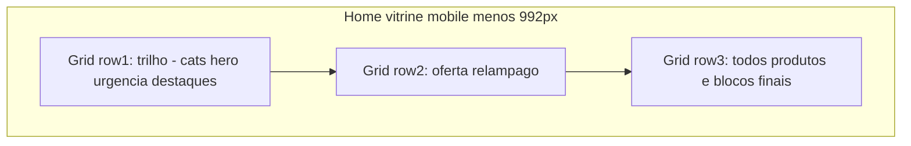

# Vitrine mobile-first: plano profissional (reanálise ampliada)

## Resumo executivo

A vitrine pública do PDV Ibix concentra layout em [`app/static/css/loja.css`](app/static/css/loja.css) e templates em [`app/templates/loja/`](app/templates/loja/) (19 arquivos, todos estendem [`base_loja.html`](app/templates/loja/base_loja.html)). A análise detalhada (subagente + leitura de código) mostra **base sólida** (grid shell, tokens Ibix, breakpoint 767/768 alinhado a [`vitrine.js`](app/static/js/vitrine.js)), porém com **gaps que impedem classificar a experiência como “100% mobile profissional”**: padding empilhado, alvos de toque abaixo de 44px no hero, ausência de safe-area iOS, carrosséis com comportamentos distintos, risco de colisão com `dashboard.css`, e ordem DOM vs ordem visual no grid da home.

**Decisão de produto reafirmada:** manter **impacto de marketing** — categorias e hero no topo da home; o trabalho foca em **refino mobile** (clareza, previsibilidade, toque, inclusão e performance percebida), não em inverter ofertas acima do hero.

---

## Objetivos e definição de pronto (Definition of Done)

- **Layout:** Nenhum overflow horizontal intencional fora de carrosséis; gutters coerentes entre trilho, ofertas, listagem e blocos finais; tablet 768–991px sem “meio termo” quebradiço.
- **Toque:** Controles interativos primários (setas de hero onde existirem, dots, chips de categoria, botões de faixa quando visíveis, CTAs de card) com área mínima **44×44px** (ou hitbox invisível), salvo exceção documentada.
- **Dispositivos com entalhe:** `env(safe-area-inset-*)` aplicado ao header fixo, conteúdo principal, rodapé e overlay do modal de geolocalização ([`base_loja.html`](app/templates/loja/base_loja.html)).
- **Acessibilidade:** `scroll-padding-top` para âncoras (`#loja-ofertas`, `#inicio-vitrine`, etc.) com header sticky; `prefers-reduced-motion` respeitado no carrossel do hero (hoje parcial em outros blocos).
- **Consistência de carrossel:** “Destaques”, “Em alta” e “Perto de você” com mesma política de snap / passo de scroll (substituir **280px fixo** em “Perto” por cálculo dinâmico alinhado a `initFaixaNav`).
- **Escopo além da home:** Todas as páginas `loja/*.html` passam na **mesma matriz de QA mobile** (sem regressão no desktop).
- **Operação:** Após alterações em assets estáticos, incrementar query string de [`loja.css`](app/templates/loja/base_loja.html) e [`vitrine.js`](app/templates/loja/base_loja.html) para bust de cache.

---

## Escopo

- **Dentro:** `app/static/css/loja.css`, `app/static/js/vitrine.js`, templates em `app/templates/loja/`, ajustes pontuais em `base_loja.html` (viewport meta complementar apenas se necessário, safe-area, versionamento de assets).
- **Fora (a menos de bloqueio crítico):** Refatorar todo o carregamento de `dashboard.css` na vitrine (recomendado como **fase opcional** de auditoria; pode ser scoping/split em passo separado).
- **Dados de marketing:** Sem novos textos/arrays hardcoded no JS; conteúdo configurável continua vindo de SSR/API ([MAPA_SISTEMA](MAPA_SISTEMA/MAPA_DO_SISTEMA.md) / regras de hardcode).

---

## Inventário (fonte: análise repositório)

- **Templates `loja/`:** `base_loja`, `index`, `produto`, `categoria_local`, `carrinho`, `checkout`, `login`, `cadastro`, `completar_cadastro`, `esqueci_senha`, `redefinir_senha`, `minha_conta`, `meus_pedidos`, `acompanhar_pedido`, `obrigado`, `pagamento_sucesso`, `pagamento_cancelado`, `termos-de-uso`, partial `_card_anuncio_vitrine`.
- **CSS/JS críticos:** `loja.css` (v≈36), `vitrine.js` (v≈18), Feather; `index` adiciona Bootstrap Icons no bloco `seo_extra`.
- **CSS carregado em todas as páginas loja:** `dashboard.css` (carregamento assíncrono mas **global**), `certipeso.css`, `landing/header.css` — risco de **valores colidentes** com a vitrine em mobile.
- **Breakpoint oficial:** `max-width: 767px` mobile / `min-width: 768px` desktop, consistente com `body.loja-mobile` em `vitrine.js`.

---

## Análise baseada em evidências (principais achados)

1. **Shell da home (`.loja-vitrine-page-shell`):** Em <992px o grid coloca o **trilho** (categorias → hero → faixas) na **linha 1**, **ofertas** na **linha 2**, **conteúdo principal** na **linha 3** — enquanto o **DOM** declara o aside de ofertas **antes** do trilho. Isto cria descompasso **visual vs ordem no leitor de tela**; exige decisão: mover DOM, `tabindex`/`aria-flowto` (não padrão), ou documentar e aceitar com teste.
2. **Padding em camadas:** `container-fluid` em `main` + rails + ajuste global de `.container` em ≤767px (12px) e ≤576px (10px) + `.secao-vitrine` — pode gerar **gutters aparentemente aleatórios** entre seções.
3. **Destaques — dois modos:** `applyDestaqueChrome` em `vitrine.js` alterna `loja-faixa-destaques--grade` e estilos inline de overflow/snap; no CSS, carrossel mobile usa **largura ~82%** por slide e **min-height alta** no card — sensação de **instabilidade** entre modos.
4. **Hero mobile:** Setas do carrossel em **~24px**; recomenda-se **área mínima 44px** com hitbox. `touch-action: pan-y` no carrossel — validar conflito com swipe horizontal.
5. **#loja-ofertas sticky:** `z-index: 35` vs header `1000`; `max-height` com `dvh` — pode haver **scroll aninhado** desconfortável no iOS; requer teste em Safari.
6. **Três densidades de grid de produtos:** 2 colunas (401–767px), 1 coluna (≤400px) — intenção correta; pode parecer **inconsistente** se tipografia/altura de card não forem reequilibradas.
7. **Categorias:** Setas ocultas &lt;767px; falta pista visual de “arraste” para usuários que não percebem scroll horizontal.
8. **Segurança de layout:** `overflow-x: hidden` em `html, body` mascara overflow real — preferir corrigir causas e manter o overflow só onde necessário.
9. **Modal geo em `base_loja`:** `z-index: 9999` e estilos inline — deve participar do mesmo **sistema de safe-area** e foco.
10. **Páginas fora da home:** Carrinho, checkout, PDP já têm blocos `@media` dedicados, mas exigem **regressão explícita** após mudanças globais em cards/container.

---

## Fases de entrega

### Fase 0 — Baseline e matriz de testes

- Congelar lista de **URLs e viewports** (360, 390, 414, 576, 768, 992) e dispositivos com **entilhe e iOS Safari**.
- Para cada template `loja/*`, anotar: dependência de `loja.css`, `dashboard`, componentes com `style=` inline, modais.

### Fase 1 — Fundação: espaçamento e tokens

- Definir **escala única** de espaçamento vertical entre `.secao-vitrine` e padding horizontal do conteúdo (priorizar seletores `main.loja-main .loja-vitrine-page-shell` em vez de ampliar ainda mais regras globais de `.container` se houver efeito colateral em outras rotas).
- Revisar **barra de urgência** (`.barra-urgencia`) com classe e tipografia alinhada ao trilho.

### Fase 2 — Toque, motion e safe-area

- Aumentar **área de toque** (hero, dots, faixas, chips) mantendo o visual; adicionar **safe-area** no header, main, footer e modal geo.
- Propagar **prefers-reduced-motion** ao track do hero e animações de card que ainda não respeitam (ex.: `scale` em destaques, se aplicável).

### Fase 3 — Carrosséis e listas horizontais

- Unificar comportamento: **Perto de você** usa passo **dinâmico** (como as demais faixas), não 280px fixo.
- Opcional: indicador visual de “arraste” na strip de categorias (sem setas) — padrão leve (gradiente/fade) para não poluir o marketing first.

### Fase 4 — Cards e densidade

- Reavaliar `min-height` agressivo de `.produto-card` no mobile; alinhar alturas entre **grade 2 colunas** e carrossel 82% para o mesmo padrão de conteúdo.
- Ajustar **listagem** e header de ordenação (576–767px); select `width: auto` pode estourar — usar `min-width: 0` e `max-width: 100%` no flex.

### Fase 5 — Sticky, âncoras e a11y

- Testar **sticky ofertas**; se problemático, **desativar sticky &lt;992px** ou afinar `top` com altura real do header compacto.
- `scroll-behavior` / `scroll-padding-top` no `html` para âncoras.
- Tratar **ordem DOM vs visual**: preferência por **reordenar DOM** para coincidir com a ordem visual (melhor leitores de tela) — avaliar impacto no CSS grid.

### Fase 6 — Auditoria cruzada de CSS e rotas irmãs

- Revisar **dashboard.css** (e conflitos) em páginas carrinho/checkout/conta; corrigir ou documentar exceção.
- **QA completo** em todas as 19 rotas; regressão **desktop** ≥992px (sidebar de ofertas em duas colunas).

### Fase 7 — Entrega

- Bump **versão** de `loja.css` e `vitrine.js` em [`base_loja.html`](app/templates/loja/base_loja.html).
- Resumo de mudanças e **matriz de testes** assinada (checklist).

---

## Riscos e mitigação

- **Mudanças globais em `.container`:** Podem quebrar checkout ou conta. *Mitigação:* escopar a home com `.loja-vitrine-page-shell` e, se necessário, `main.loja-main` antes de tocar no global.
- **`dashboard.css` na vitrine:** Pode reintroduzir bugs. *Mitigação:* auditoria Fase 6 ou remoção condicional (trabalho separado).
- **Reordenar DOM:** Pode exigir retocar o grid. *Mitigação:* testar home em um branch isolado.
- **MAPA / hardcode:** Não adicionar listas de produtos ou textos de campanha no JS; manter parâmetros via backend existente.

---

## Referências de arquivo (âncora de implementação)

- Shell e sticky: `loja.css` (aprox. linhas 188–375, 231–246).
- Bloco mobile cards e faixas: `loja.css` (aprox. 4033–4337).
- Hero mobile: `loja.css` (aprox. 893–944).
- Listagem: `loja.css` (aprox. 2626–2700).
- `applyDestaqueChrome` / Perto: `vitrine.js` (regiões ~505–527 e ~1406–1409, confirmar após `grep` no momento da implementação).
- Header inline e mobile: `base_loja.html` (aprox. 99–185, 188+).

---

## Nota de método

Esta reanálise incorpora varredura assistida (subagente) e leitura direta de **`loja.css`**, **`base_loja.html`**, **`index.html`**, **`vitrine.js`**. Objetivo: plano **acionável e verificável**, com critérios de aceite **mensuráveis** para entregar uma vitrine **apta 100% ao uso mobile** no sentido de **padrão profissional** (não apenas “responsiva”), alinhada ao tráfego e às regras do repositório.
