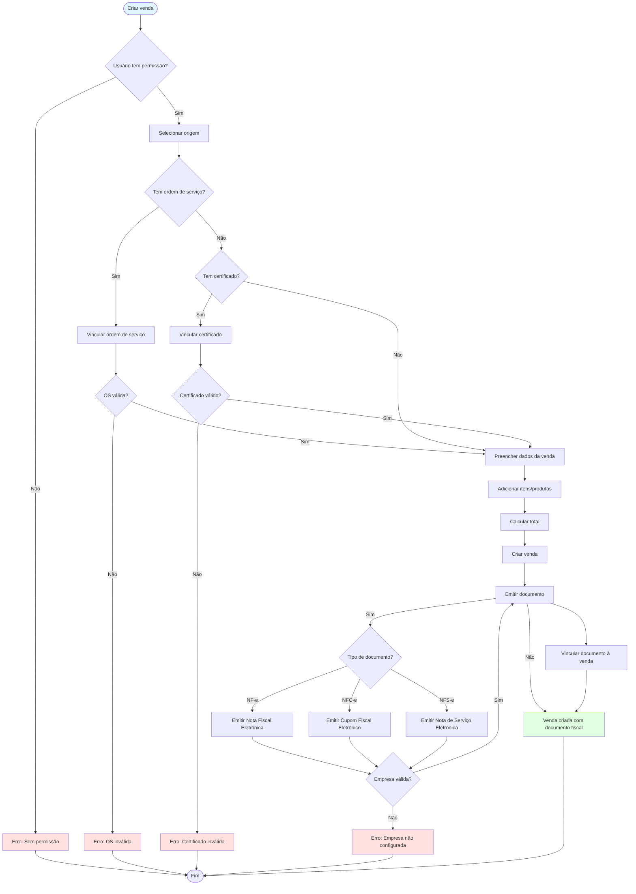
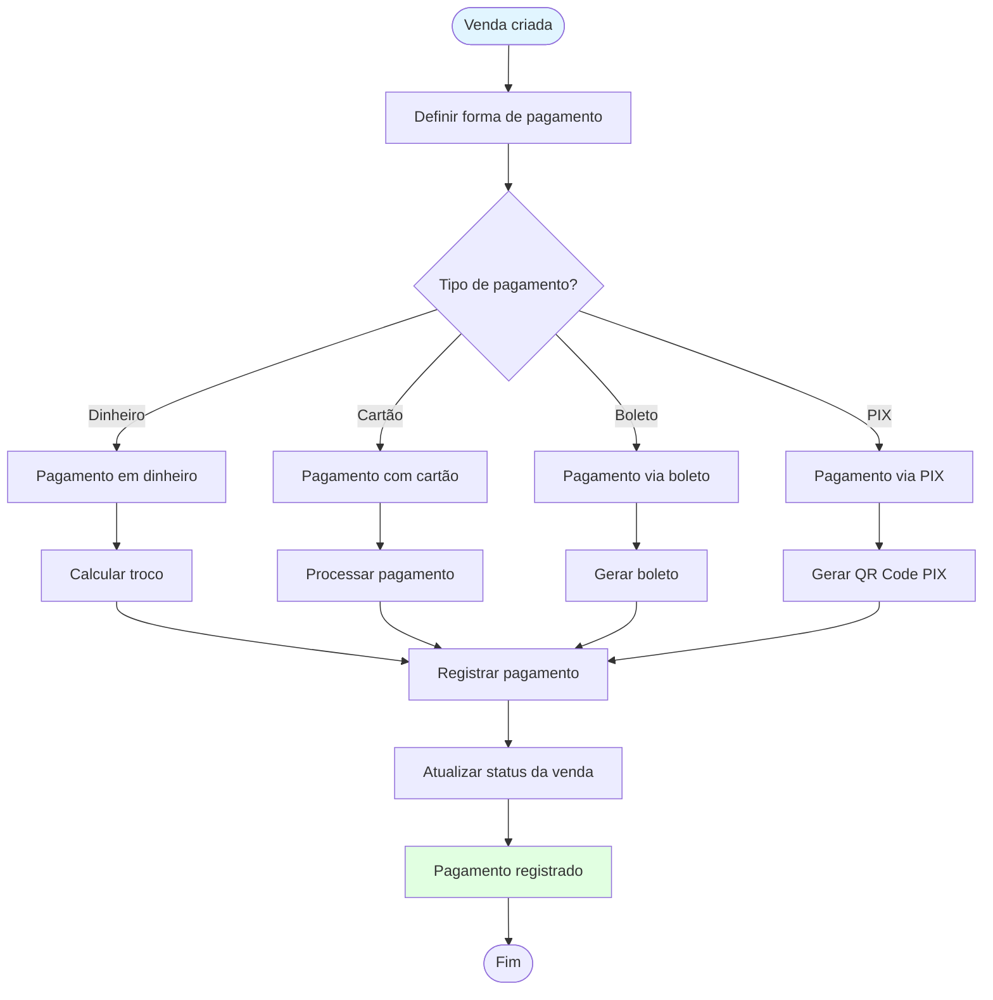
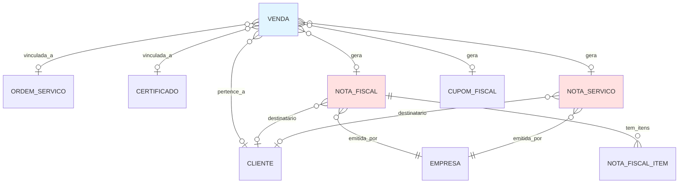

# FLUXO FINANCEIRO

## Visão Geral

Este documento detalha o fluxo completo do módulo financeiro no PDV Ibix, incluindo vendas, notas fiscais (NF-e/NFC-e), notas de serviço (NFS-e) e cupons fiscais.

**Modelos:** `app/models/venda.py`, `app/models/nota_fiscal.py`, `app/models/nota_servico.py`, `app/models/cupom_fiscal.py`  
**APIs:** `app/api/v1/vendas.py`, `app/api/v1/notas_fiscais.py`, `app/api/v1/notas_servico.py`, `app/api/v1/cupons_fiscais.py`

---

## Pré-requisitos

- Empresa cadastrada (obrigatório para emissão fiscal) — dados do **emissor** (Cliente = Empresa Fiscal)
- Cliente cadastrado (opcional, pode ser venda avulsa) — quando informado, representa o **destinatário** (Subcliente)
- Ordem de serviço ou certificado (opcional)
- Usuário autenticado com permissão para criar vendas/notas

**Uso fiscal (emissor/destinatário):** Na emissão de notas, o **emissor** é a Empresa Fiscal (Cliente Administrador; dados em `empresa`); o **destinatário** é o Subcliente (`nota_fiscal.cliente_id`, `nota_servico.cliente_id`).

---

## Fluxo Principal: Venda → Documento Fiscal



---

## Tipos de Documentos Fiscais

### Nota Fiscal Eletrônica (NF-e)
- **Modelo:** 55
- **Uso:** Vendas de produtos
- **Obrigatório:** Empresa configurada, cliente (opcional)

### Cupom Fiscal Eletrônico (NFC-e)
- **Modelo:** 65
- **Uso:** Vendas no varejo
- **Obrigatório:** Empresa configurada

### Nota de Serviço Eletrônica (NFS-e)
- **Uso:** Prestação de serviços
- **Obrigatório:** Empresa configurada, cliente (opcional)

---

## Campos Obrigatórios

### Venda
| Campo | Tipo | Descrição |
|-------|------|-----------|
| `numero_venda` | String(50) | Número único da venda |
| `data_venda` | DateTime | Data da venda |
| `vendedor_id` | Integer | FK para `usuarios.id` |
| `subtotal` | Decimal(10,2) | Subtotal |
| `total` | Decimal(10,2) | Total |

### Nota Fiscal
| Campo | Tipo | Descrição |
|-------|------|-----------|
| `numero` | String(20) | Número da nota |
| `serie` | String(10) | Série da nota |
| `tipo` | Enum | Tipo: NFe, NFCe |
| `modelo` | String(5) | Modelo: 55 ou 65 |
| `data_emissao` | DateTime | Data de emissão |
| `empresa_id` | Integer | FK para `empresa.id` — **emissor** (Empresa Fiscal) |
| `cliente_id` | Integer | FK para `clientes.id` — **destinatário** (Subcliente) |
| `valor_total` | Decimal(10,2) | Valor total |

---

## Fluxo de Pagamento



---

## Relacionamentos



---

## APIs Envolvidas

### Criar Venda
```
POST /api/v1/vendas
Content-Type: application/json

{
  "cliente_id": 1,
  "vendedor_id": 1,
  "subtotal": 1000.00,
  "desconto": 0.00,
  "total": 1000.00,
  "tipo_pagamento": "cartao"
}

Response: 201 Created
```

### Emitir Nota Fiscal
```
POST /api/v1/notas-fiscais
Content-Type: application/json

{
  "venda_id": 1,
  "empresa_id": 1,
  "cliente_id": 1,
  "tipo": "NFe",
  "modelo": "55",
  "itens": [...]
}

Response: 201 Created
```

---

## Regras de Negócio

1. **Empresa Obrigatória:** Documentos fiscais requerem empresa configurada
2. **Cliente Opcional:** Venda pode ser avulsa (sem cliente)
3. **Vinculação:** Venda pode estar vinculada a OS ou certificado
4. **Documento Fiscal:** Venda pode gerar NF-e, NFC-e ou NFS-e
5. **Pagamento:** Venda pode ter múltiplas formas de pagamento

---

## Referências

- [INDICE.md](INDICE.md) - Índice dos fluxos
- [FLUXO_ORDEM_SERVICO.md](FLUXO_ORDEM_SERVICO.md) - Fluxo de ordens de serviço
- [FLUXO_CERTIFICACAO_CALIBRACAO.md](FLUXO_CERTIFICACAO_CALIBRACAO.md) - Certificados e calibração
- MAPA_SISTEMA/MAPA_DO_SISTEMA.md - Estrutura do banco (Parte 2)

---

**Última Atualização:** 2026-02-08 (Terminologia emissor/destinatário: Empresa Fiscal = emissor, Subcliente = destinatário)
