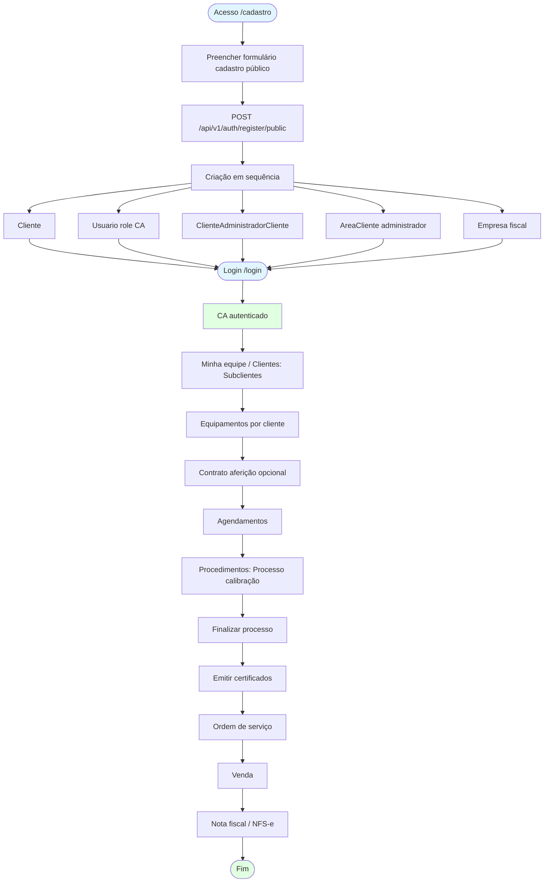
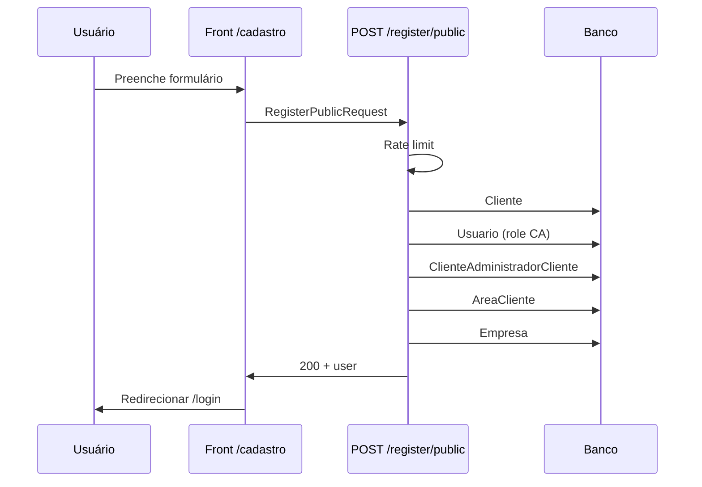
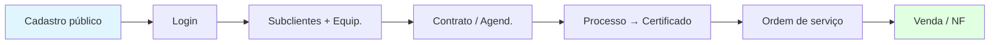

# FLUXO — Novo Cliente Administrador (CA)

Do cadastro público até emissão de certificado, ordem de serviço e faturamento.

**Referências:** `app/services/auth_service.py` (register_public), `app/api/v1/auth.py`, MAPA_RBAC.md (Apêndice B — Acesso por Role), FLUXO_CADASTROS.md, FLUXO_CERTIFICACAO_CALIBRACAO.md, FLUXO_ORDEM_SERVICO.md, FLUXO_FINANCEIRO.md.

**Terminologia:** Cliente = Empresa Fiscal (emissor de notas); Subcliente = cliente da Empresa Fiscal (destinatário). Role **Cliente Administrador** representa o Cliente.

---

## Visão geral

Fluxo completo para um **novo CA**: cadastro público (empresa + usuário CA) → login → cadastro de subclientes e equipamentos → (opcional) contratos e agendamentos → processo de calibração → emissão de certificado → ordem de serviço → venda e faturamento (NF/NFS-e).

---

## Diagrama do fluxo completo



---

## Etapa 1 — Cadastro público (novo CA)

### Visão

Qualquer pessoa acessa a página de cadastro e cria em um único passo: **Cliente** (empresa), **Usuario** com role Cliente Administrador e vínculos (escopo + área + empresa fiscal).

### Rotas e API

| Item | Valor |
|------|--------|
| Rota HTML | `GET /cadastro` |
| Template | `app/templates/auth/register_public.html` |
| API | `POST /api/v1/auth/register/public` |
| Rate limit | Aplicado (check_register_rate_limit) |
| Pós-sucesso (plataforma) | Opcional: e-mail e notificação no sino (`usuario_notificacoes`) para usuários com role **Superadministrador**, conforme flags `platform_novo_ca_email_enabled` e `platform_novo_ca_in_app_enabled` (Configuração em **Cobranças > Config**). Implementação: `app/services/platform_novo_ca_notify_service.py`. |
| Convite Superadmin | Aba **Convidar comércio (cadastro)** em **`/clientes`** — chama `POST /api/v1/admin/billing/onboarding/convite-lojista` (link com query `codigo_promocional` quando informado). |
| Cadastro com código na URL | `GET /cadastro?codigo_promocional=...` (ou `?codigo=`) pré-preenche o campo no template `register_public.html`. |

### O que é criado (register_public)

1. **Cliente** (`clientes`) — nome_empresa, CNPJ, CEP, endereço, cidade, UF, contato, telefone, email
2. **Usuario** — nome, email, senha (hash), role **Cliente Administrador**
3. **ClienteAdministradorCliente** — usuario_id (CA), cliente_id (escopo)
4. **AreaCliente** — usuario_id, cliente_id, nome_area=`"administrador"`, ativo
5. **Empresa** (`empresa`) — dados fiscais do emissor (cliente_id, razão social, CNPJ, endereço, etc.; ambiente homologação)

### Validações

- Email único no sistema
- CNPJ válido e único (`app/utils/cnpj_validator.py`)
- Schema: `RegisterPublicRequest` — nome, email, password, confirm_password, nome_empresa, cnpj, cep, endereco, cidade, uf, contato, telefone, dados bancários/PIX, **`categorias_vitrine_ids`** (ao menos uma; categorias ativas da vitrine = `material_categoria`, mesma lista de `GET /api/v1/loja/categorias`)
- Superadmin: **`GET /api/v1/clientes/{id}/perfil-lojista`** e botão «ver» em `/clientes` exibem empresa, responsável CA, bancário, categorias, tenant e loja marketplace

### Diagrama cadastro público



---

## Etapa 2 — Após o cadastro (CA ativo)

O CA faz **login** em `/login`. Escopo: apenas clientes em `cliente_administrador_clientes`; gestão de Subclientes e técnicos em **Minha equipe** (`/minha-equipe`). Não acessa `/usuarios` nem `/configuracoes`.

---

## Etapa 3 — Subclientes e equipamentos

| Ação | Onde | API / Observação |
|------|------|-------------------|
| Criar Subcliente | Minha equipe ou módulo Clientes | `POST /api/v1/minha-equipe/clientes` ou `POST /api/v1/clientes` (escopo CA) |
| Criar equipamento | Equipamentos | `POST /api/v1/equipamentos` com `cliente_id` (Subcliente) |

Detalhes: [FLUXO_CADASTROS.md](FLUXO_CADASTROS.md).

---

## Etapa 4 — Contrato e agendamento (opcional)

- **Contrato:** `POST /api/v1/contratos-afericao` (cliente_id, numero_contrato, datas, periodicidade, valor).
- **Agendamento:** `POST /api/v1/agendamentos` (cliente_id, equipamento_id, data/hora, tipo_servico; opcional contrato_afericao_id ou justificativa avulso).

Detalhes: [FLUXO_CONTRATOS_AGENDAMENTO.md](FLUXO_CONTRATOS_AGENDAMENTO.md).

---

## Etapa 5 — Processo e certificado

- **Processo:** Procedimentos → Calibração: dados iniciais → dados por balança (pesos, equip. aux., ambientais) → inspetor/aprovador → ensaios → finalizar.
- **Finalizar:** `POST /api/v1/processos/{id}/finalizar`.
- **Emitir certificado:** `POST /api/v1/processos/{id}/certificados` (cria Certificado + CertificadoSnapshot; PDF em background). Página: `/procedimentos/emitir-certificados/{id}`.

Detalhes: [FLUXO_CERTIFICACAO_CALIBRACAO.md](FLUXO_CERTIFICACAO_CALIBRACAO.md).

---

## Etapa 6 — Ordem de serviço

- **Criar:** `POST /api/v1/ordens-servico` (cliente_id, codigo, tipo, prioridade; opcional agendamento_id, processo_relacionado_id).
- **Status:** aberta → em_andamento → concluida (ou cancelada). OS concluída pode gerar venda.

Detalhes: [FLUXO_ORDEM_SERVICO.md](FLUXO_ORDEM_SERVICO.md).

---

## Etapa 7 — Faturamento

- **Venda:** `POST /api/v1/vendas` (pode vincular OS ou certificado).
- **Documento fiscal:** emissor = Empresa Fiscal (CA); destinatário = Subcliente. NF-e, NFC-e, NFS-e conforme módulo fiscal.

Detalhes: [FLUXO_FINANCEIRO.md](FLUXO_FINANCEIRO.md).

---

## Resumo visual (etapas em linha)



---

## Como deixar este fluxo visual no frontend

Três opções principais:

### 1. Página de documentação com Mermaid (recomendado)

- Criar rota HTML (ex.: `/fluxo-novo-ca` ou `/ajuda/fluxo-novo-ca`) que renderize este markdown ou apenas os blocos Mermaid.
- Usar **Mermaid.js** no browser: incluir `<script src="https://cdn.jsdelivr.net/npm/mermaid/dist/mermaid.min.js"></script>`, inicializar com `mermaid.initialize({ startOnLoad: true })` e colocar os diagramas em `<div class="mermaid">` com o conteúdo do código Mermaid (copiar dos blocos acima).
- O mesmo arquivo `FLUXO_NOVO_CLIENTE_ADMINISTRADOR.md` pode ser lido pelo backend e enviado ao template (ou só os trechos entre ```mermaid e ```) para manter uma única fonte de verdade.

### 2. Componente “Passo a passo” (stepper)

- Criar uma página ou modal com etapas numeradas (Cadastro → Login → Subclientes → … → Faturamento), cada uma com título, texto curto e link para a tela correspondente (ex.: “Cadastro” → `/cadastro`, “Equipamentos” → `/certificacao/equipamentos`). Sem Mermaid; apenas HTML/CSS (e opcionalmente ícones).

### 3. Dashboard / “Onboarding” para CA

- No primeiro login do CA, exibir um card ou seção “Seu próximo passo” com o fluxo resumido e o passo atual destacado (ex.: “Cadastre um subcliente”), com botão para a ação. Os passos podem ser os mesmos deste documento; a “visualização” é guiada por estado (ex.: tem subcliente? tem equipamento?).

**Implementação mínima (opção 1):** nova rota em `main.py`, template que estende `base.html`, inclui Mermaid.js e um ou mais `<div class="mermaid">` com os fluxos deste arquivo; sem dados do banco, apenas conteúdo estático.

---

**Última atualização:** 2026-02-10
