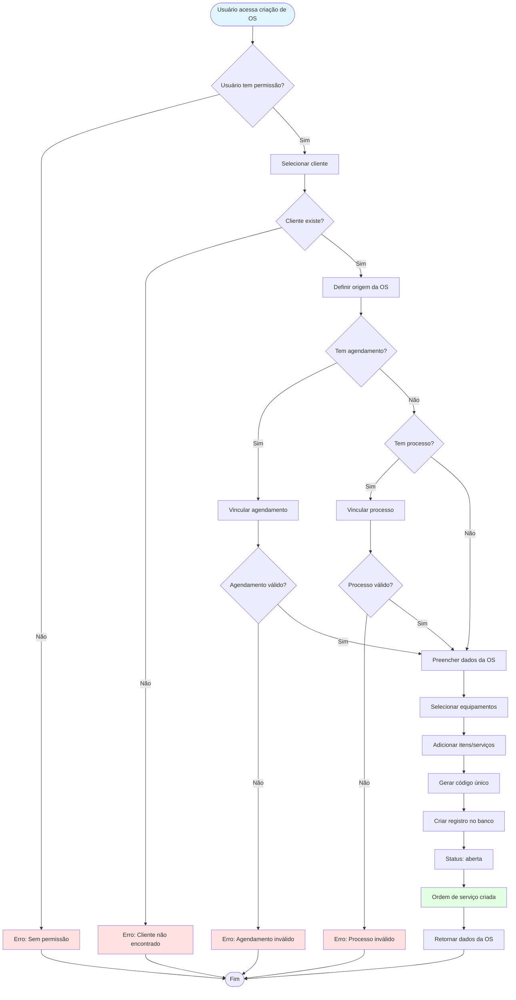
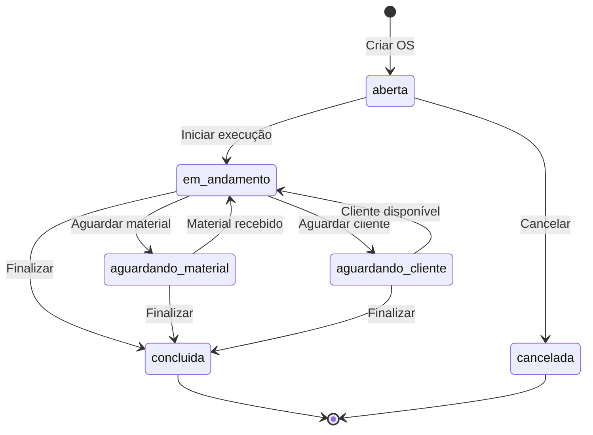
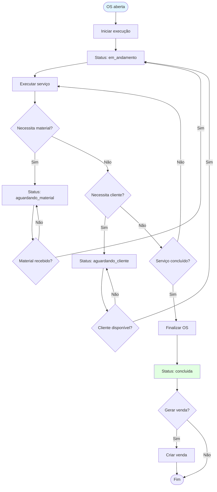
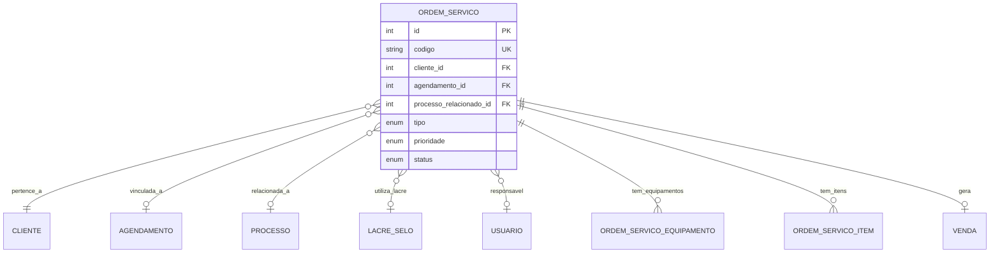

# FLUXO DE ORDENS DE SERVIÇO

## Visão Geral

Este documento detalha o fluxo completo de criação, execução e fechamento de ordens de serviço no PDV Ibix. Ordens de serviço podem estar vinculadas a agendamentos, processos e clientes, e podem gerar vendas e notas fiscais.

**Modelo:** `app/models/ordem_servico.py`  
**API:** `app/api/v1/ordens_servico.py`  
**Tabela:** `ordem_servico`

---

## Pré-requisitos

- Cliente cadastrado no sistema (obrigatório)
- Equipamento(s) cadastrado(s) (opcional, mas recomendado)
- Agendamento ou Processo (opcional)
- Usuário autenticado com permissão para criar/editar ordens de serviço

---

## Fluxo Principal de Criação



---

## Campos Obrigatórios

| Campo | Tipo | Descrição | Validação |
|-------|------|-----------|-----------|
| `cliente_id` | Integer | ID do cliente | Obrigatório, FK para `clientes.id` |
| `codigo` | String(30) | Código único da OS | Obrigatório, único |
| `tipo` | Enum | Tipo de OS | Obrigatório: instalacao, manutencao, calibracao, afericao, reparo, visita, outro |
| `prioridade` | Enum | Prioridade | Obrigatório: baixa, media, alta, critica (default: media) |
| `status` | Enum | Status | Obrigatório: aberta, em_andamento, aguardando_material, aguardando_cliente, concluida, cancelada (default: aberta) |

### Campos Opcionais

| Campo | Tipo | Descrição |
|-------|------|-----------|
| `agendamento_id` | Integer | FK para `agendamentos.id` |
| `processo_relacionado_id` | Integer | FK para `processos.id` |
| `responsavel_id` | Integer | FK para `usuarios.id` |
| `lacre_utilizado_id` | Integer | FK para `lacres_selos.id` |
| `data_prevista` | DateTime | Data prevista de conclusão |
| `observacoes` | Text | Observações da OS |

---

## Status e Transições



---

## Fluxo de Execução



---

## Relacionamentos

### Relacionamentos da Ordem de Serviço



---

## APIs Envolvidas

### Criar Ordem de Serviço
```
POST /api/v1/ordens-servico
Content-Type: application/json

{
  "cliente_id": 1,
  "agendamento_id": 1,
  "tipo": "calibracao",
  "prioridade": "alta",
  "observacoes": "Calibração de balança"
}

Response: 201 Created
{
  "id": 1,
  "codigo": "OS-2026-0001",
  "status": "aberta",
  ...
}
```

### Atualizar Status
```
PUT /api/v1/ordens-servico/{id}
Content-Type: application/json

{
  "status": "em_andamento"
}

Response: 200 OK
```

---

## Regras de Negócio

1. **Cliente Obrigatório:** OS deve estar sempre vinculada a um cliente
2. **Código Único:** Código da OS deve ser único no sistema
3. **Status Inicial:** OS é criada com status "aberta"
4. **Equipamentos:** OS pode ter múltiplos equipamentos (N:N)
5. **Itens:** OS pode ter múltiplos itens (materiais, serviços, lacres)
6. **Geração de Venda:** OS concluída pode gerar venda automaticamente

---

## Referências

- [INDICE.md](INDICE.md) - Índice dos fluxos
- [FLUXO_CONTRATOS_AGENDAMENTO.md](FLUXO_CONTRATOS_AGENDAMENTO.md) - Agendamentos
- [FLUXO_CERTIFICACAO_CALIBRACAO.md](FLUXO_CERTIFICACAO_CALIBRACAO.md) - Calibração
- [FLUXO_FINANCEIRO.md](FLUXO_FINANCEIRO.md) - Fluxo financeiro
- MAPA_SISTEMA/MAPA_DO_SISTEMA.md - Estrutura do banco (Parte 2)

---

**Última Atualização:** 2026-01-23
