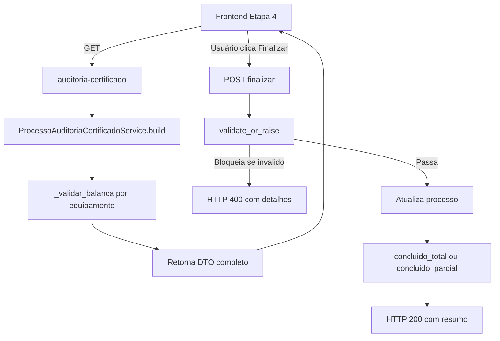

# MAPA DO SISTEMA - PDV Ibix

## Visão Geral

O **PDV Ibix** é uma plataforma completa de gestão comercial e operacional (PDV, caixa, estoque, fiscal, marketplace), desenvolvida com arquitetura SaaS, sistema RBAC completo e isolamento de dados por módulo. **Produtos Ibix:** PDV Ibix (este repositório) e Auto Ibix (produto distinto; se no mesmo servidor, usar outro unit e outra porta).

**Posicionamento:** O foco do produto é gestão comercial (PDV, caixa, estoque, fiscal, marketplace). As seções deste MAPA que citam certificação, calibração, balanças ou equipamentos de pesagem referem-se a módulos opcionais/legado existentes no código; não fazem parte da descrição comercial do sistema.

**Versão:** 1.0  
**Porta:** 8000  
**Ambiente:** Desenvolvimento/Produção

**Entrada da documentação:** [INDICE.md](INDICE.md) — abra **um** mapa por tarefa. Ponto de entrada do repositório: [README.md](../README.md) (humano) e [AGENTS.md](../AGENTS.md) (IA).

---

## Sumário rápido

Use este sumário em vez de ler o arquivo inteiro. **Legado** (certificação, balanças, calibração): § 2, § 6 e Apêndices A–C — não usar para tarefas PDV/marketplace atuais.

| Seção | Tópico |
|-------|--------|
| [§ 11](#11-módulo-orçamento-e-pedido) | Orçamento e Pedido |
| [§ 12](#12-módulo-marketplace-e-vitrine-loja) | Marketplace, vitrine `/loja`, checkout, notificações |
| [§ 13](#13-módulo-frete--logística-local-entregador) | Frete / logística entregador |
| [§ 14](#14-módulo-geolocalização-proximidade-vitrine) | Geolocalização, «Perto de você» |
| [Parte 2](#parte-2--estrutura-do-banco-de-dados) | Banco de dados, migrações, backup |
| [Ap. D](#apêndice-d--deploy) | Deploy geral |
| [Ap. E](#apêndice-e--etapas-de-desenvolvimento) | Etapas e changelog |

**Outros mapas:** API → `MAPA_DE_API.md` · Regras → `MAPA_DE_REGRAS.md` · RBAC → `MAPA_RBAC.md` · Pagamento → `MAPA_PAGAMENTO.md` · NF-e XML → `MAPA_FATURAMENTO.md`

---

## Arquitetura do Sistema

### Stack Tecnológico

#### Backend
- **Framework:** FastAPI (Python 3.11+)
- **ORM:** SQLAlchemy 2.0
- **Banco de Dados:** PostgreSQL
- **Autenticação:** JWT (JSON Web Tokens)
- **Validação:** Pydantic

#### Frontend
- **Templates:** Jinja2
- **Framework CSS:** Bootstrap 5
- **JavaScript:** Vanilla JS + Chart.js
- **Template Base:** AdminKit (Customizado PDV Ibix)
- **Template PDV Ibix:** Baseado no AdminKit mas completamente customizado
- **Ícones:** Feather Icons
- **Tipografia:** Inter Font
- **⚠️ REGRA CRÍTICA OBRIGATÓRIA:** NUNCA usar dados hardcoded no frontend. 
  - ❌ Valores fixos (números, textos, arrays) em código JavaScript/HTML
  - ❌ Elementos de layout duplicados (breadcrumbs, sidebars, navbars)
  - ❌ Fallbacks hardcoded em vez de buscar do banco de dados
  - ✅ SEMPRE buscar dados do banco via APIs REST
  - ✅ SEMPRE usar blocos do base.html para elementos comuns
  - Ver detalhes completos em: [MAPA_DE_REGRAS.md - Dados Hardcoded](MAPA_DE_REGRAS.md#dados-hardcoded-no-frontend---proibido)

**Template Base Obrigatório:**
- **TODAS as páginas** devem herdar de `app/templates/base.html`
- **Sidebar obrigatória** com menu completo (estrutura em **Estrutura do sidebar**, abaixo)
- **Navbar superior** com botão hamburger
- **Footer padrão** em todas as páginas
- **Branding "PDV Ibix"** em todo o sistema
- **Segurança (clickjacking):** `base.html` inclui `<meta http-equiv="Content-Security-Policy" content="frame-ancestors 'self';">` para restringir embedding em iframe; ver MAPA_DE_REGRAS § 4 (Proteção contra clickjacking).
- Ver detalhes em: [MAPA_DE_REGRAS.md - Template PDV Ibix](MAPA_DE_REGRAS.md#template-pdv-solumatica---estrutura-obrigatória)

**Estrutura do sidebar (menu lateral)** — fonte: `app/templates/components/sidebar.html`. Ordem atual (2026-03-17):
- **Principal:** Dashboard, Planos, Assinatura (por role); Super Admin: Dashboard Super Admin, Cobranças (Admin), **E-mail** (`/admin/email` — apenas Superadministrador).
- **Gestão:** E-mail por cliente, Clientes, Pagamentos.
- **Negócios:** Ponto de venda / Venda, PDVs, Caixa, Estoque, **Financeiro** (`/negocio/financeiro` — resumo financeiro; SuperAdmin: repasses e taxas plataforma), Ordem de Serviço, Orçamentos, Pedidos, **Marketplace** (`/negocio/marketplace` — visível para quem tem `marketplace:visualizar`).
- **Fiscal:** Notas Fiscais, Área do Contador.
- **Relatórios:** Um único item **Relatórios** → `/negocio/relatorios` (visível para quem tem `negocios.relatorios:visualizar` ou `negocios.venda:visualizar`). A rota `/relatorios` redireciona (302) para `/negocio/relatorios` (unificação).
- **Configurações** (seção): Configurações (`/configuracoes`), **Empresa Fiscal** (`/fiscal/empresa` — SuperAdmin define **Modo de Recebimento** por empresa: direto = CA recebe no gateway; plataforma = plataforma recebe e repassa; e taxas da plataforma), **Emissão NF** (`/fiscal/emissao-nf` — abas: Configuração NFS-e, Pendências NFS-e, Regras Fiscais ICMS; URLs legadas `/fiscal/nfse-config`, `/fiscal/nfse-pendencias`, `/fiscal/regras-fiscais-icms` redirecionam). Visível por permissão `fiscal.empresa` (itens fiscais); Superadmin/Admin para Configurações.
- **Sistema:** Gerenciamento de Usuários, Hierarquia (Superadmin), Assinatura (Cliente Administrador).
- **Ao final do sidebar (apenas Cliente Administrador):** Minha equipe (`/minha-equipe`).

**Itens removidos do sidebar:** Resumo financeiro (link `/negocio/dashboard`). Relatórios (Certificação) unificado em um único **Relatórios** → `/negocio/relatorios`.

#### Infraestrutura
- **Servidor:** Uvicorn / Gunicorn (produção, porta 8000)
- **Porta:** 8000
- **Protocolo:** HTTP/HTTPS
- **Reverse proxy (produção):** Nginx (TLS, gzip, cache estático, rate limit). **Upstream pdv_solumatica:** `127.0.0.1:8000` (Gunicorn). Domínio: www.ibix.com.br. Certificados: Let's Encrypt. Configs em `scripts/deploy/nginx/`. Ver **Apêndice D — Deploy** (este documento).
- **Systemd (produção):** Serviços `pdv_solumatica.service` (Gunicorn, porta 8000) e `pdv_solumatica-celery.service` (Celery worker). Apenas esses units; não há mais pdv-automscale. Unit inclui ExecStartPre para liberar porta 8000 antes de iniciar e TimeoutStopSec=30. Instalação: `sudo ./scripts/install_systemd.sh` ou cópia manual dos units em `scripts/deploy/systemd/` para `/etc/systemd/system/` (ver MAPA_DEPLOY_SERVICOS.md); ativar: `systemctl enable --now pdv_solumatica pdv_solumatica-celery`. Ver **Apêndice D — Deploy** e MAPA_DEPLOY_SERVICOS.md.

#### Ferramentas e Utilitários
- **Migrações:** Alembic (controle de versão do banco)
- **Validação:** Pydantic para schemas
- **Autenticação:** JWT (python-jose)
- **Hash de Senhas:** bcrypt
- **Geração de PDF:** ReportLab ou similar; tarefas pesadas (PDF certificados/relatórios) delegadas ao **Worker (Celery)**
- **Validação CNPJ:** Validador interno (`app/utils/cnpj_validator.py`)
- **Busca CEP:** API externa (ViaCEP ou similar)

#### Worker assíncrono (implementado)
- **Celery** + **Redis** (ou RabbitMQ): `app/worker/celery_app.py`, `app/worker/tasks.py`
- **Broker/backend:** `CELERY_BROKER_URL` ou `REDIS_URL` no `.env`
- **Tasks:** `gerar_pdf_certificado`, `gerar_pdf_relatorio` (placeholders; ver `app/worker/tasks.py`)
- **Execução:** `celery -A app.worker.celery_app worker -l info` — ver **Apêndice D — Deploy** (este documento)

#### Logs e observabilidade
- **Logs estruturados:** correlação `request_id`, `tenant_id`, `user_id` em todas as requisições (middleware em `main.py`; `app/core/logging.py`: `log_struct`, `log_error(..., request_id=, tenant_id=, user_id=)`).
- **Header:** `X-Request-ID` em resposta (gerado ou repassado do cliente).
- **Arquivos de log:** `logs/pdv_solumatica.log`, `logs/errors.log`, `logs/audit.log`, **`logs/security.log`** (eventos de segurança: login_sucesso, login_falha, logout, senha_alterada, permission_denied), **`logs/database.log`** (erros de conexão/query SQLAlchemy; em DEBUG também as SQL). Variável de ambiente opcional **`LOG_DIR`** para override do diretório (ex.: `/var/log/pdv_solumatica`). Se o diretório não puder ser criado, apenas console é usado. O arquivo **`logs/errors.log`** acumula entradas históricas; após correções (ex.: mapper SQLAlchemy), a ausência de **novas** linhas de erro indica que o problema foi resolvido. Para acompanhar após reinício: `journalctl -u pdv_solumatica -n 50` ou `tail -f logs/pdv_solumatica.log` / `tail -f logs/errors.log`.
- **Log de segurança:** `log_security(evento, ip, user, details)` em `app/core/logging.py`; chamado em auth_service (login sucesso/falha), auth.py (logout, troca de senha) e middleware (403 por permissão). Grava em `logs/security.log` e no logger principal.
- **Log de banco:** Logger `sqlalchemy.engine` com handler para `logs/database.log`; configurado em `setup_database_logging()` (chamado no startup em `main.py`). Nível WARNING em produção (só erros), INFO em DEBUG (SQL).
- **Auditoria:** `app/core/audit.py` — helper `audit_action(db, acao, user_id, tenant_id, recurso_tipo, recurso_id, ip, request_id, detalhes)` persiste em `audit_log` e grava em arquivo. Tabela `audit_log` com `tenant_id` (nullable); ações críticas (login, venda, caixa, sangria/suprimento, usuario, permissões) auditadas.
- **Redação de token em access log:** JWT não deve aparecer em syslog/arquivos. Filtro `RedactTokenFilter` em `app/core/logging.py` redige o parâmetro `token=eyJ...` para `token=***` nos loggers `uvicorn.access` e `gunicorn.access`; `install_redact_token_filter()` é chamado em `main.py` ao carregar a app.
- **Access log (classificação de visitantes):** Tabela `access_log` registra IP, user_agent, path e `tipo_visitante` (HUMANO, BOT, CLOUD). Classificação em `app/utils/visitante.py` (`classificar_visitante(ip, user_agent)`). Critérios: BOT = UA contém bot/crawler/spider/checker/gptbot; CLOUD = IP com prefixos 34., 104., 136., 35., 52., 54.; HUMANO = padrão. Middleware `access_log_middleware` em `main.py` chama task Celery `log_access_task` (assíncrono, não bloqueia). Rotas ignoradas: `/static/`, `/api/`, `/metrics`, `/api/health`, `/favicon*`. Env `ACCESS_LOG_ENABLED` (default true). Migration `kk00mm136b6`. **Agregação vitrine pública (Super Admin):** `app/services/vitrine_access_analytics_service.py` — filtro paths `/loja`, `/loja/*`, `/categoria/*`, `/lojas-parceiras`, `/{slug}` (slug não reservado); cards e rankings em **GET** `/api/v1/admin/dashboard` (`visitantes_vitrine`, `visitantes_vitrine_analytics` com `incluir_analytics=true`); UI `/admin/dashboard`. Pageview = requisição HTML SSR (não inclui APIs da vitrine).

#### Performance em rotas HTML (auth/RBAC)
- **Referência obrigatória:** [MAPA_RBAC.md — Apêndice A](MAPA_RBAC.md#apêndice-a--performance-authrbac-e-rotas-html). Ao criar ou alterar rotas HTML, seguir o padrão: **um** `get_template_context` por request; usar `context["user_role"]` e `context["user_permissions"]` para 403/redirecionamento; **não** repetir `verify_token`, query Usuario nem query Permissão na rota.
- **Rotas de referência (padrão aplicado):** `/dashboard`, `/configuracoes`, `/configuracoes/email/templates`, `/negocio/estoque`, `/negocio/financeiro`. `check_auth_for_html` e `get_template_context` preenchem `request.state` (user_id, user_payload, user, user_permissions) para reuso na mesma requisição. APIs que usam `require_permission` utilizam **PermissionCache** (TTL 5 min).

#### Tecnologias Recomendadas (Futuro)
- **Cache:** Redis (já usado como broker do Celery). **Uso na aplicação:** `app/core/redis_client.py` (cliente único com pool), `redis_cache.py` (subscription_blocked, permissões, blacklist de tokens, loja categorias), `rate_limiter.py` (rate limit distribuído). **Boas práticas:** prefixo de chaves (`REDIS_KEY_PREFIX`, default `pdv:`), pool com `REDIS_MAX_CONNECTIONS`, `REDIS_TIMEOUT` para não travar; fallback em memória/DB quando Redis indisponível. Liberação manual de chaves de rate limit no Redis deve respeitar o mesmo prefixo (`REDIS_KEY_PREFIX`). **Plano futuro:** cache de regras fiscais ICMS por empresa (`.cursor/plans/redis_motor_tributario_regras_fiscais.plan.md`). Ver `.env.example` (REDIS_KEY_PREFIX, REDIS_TIMEOUT, REDIS_MAX_CONNECTIONS).
- **Containerização:** Docker
- **Monitoramento:** Sentry, Prometheus + Grafana, Loki (structlog)
- **CI/CD:** GitHub Actions
- **Testes automatizados:** O diretório `tests/` foi removido do repositório; validação por pytest fica a critério da equipe (branch separada ou pipeline externo). Ver **Apêndice D — Deploy** e **Apêndice E — Etapas de Desenvolvimento** (este documento).

---

## Tecnologias Obrigatórias

### Backend
- **Python 3.11+** com **FastAPI** (obrigatório)
- **PostgreSQL** (porta 5432)
- **SQLAlchemy 2.0** para ORM
- **Pydantic** para validação de dados

### Frontend
- **HTML, CSS, JavaScript**
- **Bootstrap 5** para interface responsiva
- **Template PDV Ibix** baseado no AdminKit (OBRIGATÓRIO)
- **Jinja2** para templates
- **Template Base:** `app/templates/base.html` (OBRIGATÓRIO)

### Banco de Dados
- **PostgreSQL** (porta 5432)
- **Alembic** para migrações (obrigatório)
- **RBAC (Role-Based Access Control)** obrigatório
- **Arquitetura SaaS Multi-Tenancy** obrigatória
- **Isolamento de dados** por módulo obrigatório

#### Modelo Tenant ↔ Clientes (2026-02)
- **Tenant (1)** representa a organização contratante da assinatura SaaS (tabela `tenants`).
- **Clientes (N):** Um tenant pode ter múltiplos clientes (estabelecimentos/empresas fiscais). Tabela `clientes`.
- **Cliente Administrador (CA)** pertence a um tenant; gerencia clientes via `ClienteAdministradorCliente` e `AreaCliente`.
- **Escopo:** APIs comerciais filtram por `cliente_id` via `ClienteScope` (`get_allowed_cliente_ids`). SuperAdmin não filtra.
- **Campo `tenant_id`:** `usuarios.tenant_id`; `audit_log.tenant_id` (nullable para ações SuperAdmin).
- **Configuração auth:** `app/core/config.py` (pydantic-settings) é a fonte única para `SECRET_KEY` e `ACCESS_TOKEN_EXPIRE_MINUTES`; ver `app/core/auth.py`.

**Definição obrigatória (sem ambiguidade) — CA x CF/Subcliente:**
- **CA (Cliente Administrador) = cliente do SaaS**. É a empresa contratante da plataforma e corresponde ao contexto da **Empresa Fiscal (emissor)**.
- **CF/Subcliente = cliente do CA**. É o cliente final atendido pelo CA e atua como **destinatário** em notas/fluxos fiscais.
- Em módulos como **Empresa Fiscal**, **Estabelecimentos Fiscais**, **Pagamentos** e **E-mail por cliente**, o contexto principal deve ser o do **CA (empresa cliente SaaS / emissor)**, nunca tratar CF/Subcliente como CA.

**Empresa Fiscal obrigatória (modelo de negócio):** A **Empresa Fiscal** é **obrigatória** e faz parte do sistema: é cadastrada **no ato da assinatura**; não existe possibilidade de o CA não ter Empresa Fiscal. Operações fiscais (criação de rascunho de nota a partir de venda, emissão de NF-e) usam **exclusivamente** a Empresa Fiscal do CA, obtida por `get_empresa_fiscal_empresa` / `get_empresa_fiscal_cliente_id`. **Sem fallback:** não usar outra empresa (ex.: primeira do escopo ou do cliente da venda). Ver MAPA_DE_REGRAS § 0 (Modelo de negócio — Empresa Fiscal obrigatória).

#### Estrutura Comercial — Fase 2 (2026-02)

**Modelo de Preço por Licença:**
- Tabela `precos_pdv`: `valor_base_centavos` (R$ 170 default), `valor_pdv_adicional_centavos` (R$ 70 default), `vigencia_inicio`, `ativo`.
- Fórmula: `valor_mensal = valor_base + (qtd_pdvs - 1) × valor_pdv_adicional`. Valores nunca hardcoded.

**Contrato Comercial:**
- Tabela `contrato_comercial`: `tenant_id`, `vigencia_inicio`, `vigencia_fim`, `qtd_pdvs_contratados`, `valor_mensal_centavos`, `status`.
- Tabela `contrato_aditivos`: registra alterações formais (adicionar PDVs, alterar valor) com histórico completo.
- APIs CRUD: `POST /api/v1/contratos-comerciais/`, `POST .../aditivos`.

**Checagem de limite de PDVs:**
- Campo `subscriptions.qtd_pdvs_contratados` (default 1).
- `POST /api/v1/pdvs/` verifica `COUNT(pdvs) >= qtd_pdvs_contratados` → HTTP 402 se limite atingido.
- `billing_service._valor_centavos_para_tenant` prioriza contrato ativo sobre valor admin.

**Códigos de Desconto e Divulgadores:**
- Tabela `codigos_desconto`: `codigo`, `tipo_promocao`, descontos % primeira parcela / mensalidade, `meses_desconto`, `divulgador_id` (FK divulgadores; todo código deve estar vinculado a um divulgador que representa um Administrador).
- Tabela `divulgadores`: nome, CPF/CNPJ, email, `usuario_id` (FK usuarios — Representante/Administrador). O divulgador pode ser criado manualmente ou automaticamente ao criar código por Representante.
- Tabela `divulgador_regras`: `percentual_plano_ativo`, `recebe_primeira_parcela`, `percentual_comissao`.
- API pública: `GET /api/v1/codigos-desconto/validar/{codigo}` para usar no cadastro/checkout. Normalização do código (unquote, strip, upper). Só retorna 200 se o código estiver ativo e vinculado a um representante (divulgador com `usuario_id`); caso contrário 404 com mensagem específica: "Código ativo, mas não vinculado a um representante. O administrador deve vincular o código a um Representante em Códigos de desconto."
- **Criação de código (2026-03-02):** O código deve ser vinculado a um Representante (Administrador). Na tela `/admin/billing/codigos-desconto`, o modal "Novo Código" exibe dropdown **Representante (Administrador)** com a lista de usuários com função Administrador (`usuarios_administradores` no contexto). O front envia `representante_usuario_id`; o backend encontra um divulgador com esse `usuario_id` ou cria um ("Representante - {nome}") e associa ao código. Assim o CA que se cadastrar com o código fica vinculado a esse Representante (e à comissão).
- **Listagem e edição de códigos (2026-03-02):** No card "Códigos", a tabela inclui coluna **Representante** (nome do Administrador vinculado ao divulgador do código); a API `GET /api/v1/codigos-desconto` retorna `representante_nome` por código (joinedload divulgador.usuario). Para Superadministrador, coluna **Ações** com botão **Editar**: abre o mesmo modal em modo edição (título "Editar Código de Desconto"), carrega o código via `GET /api/v1/codigos-desconto/{id}`, campo Código somente leitura, checkbox **Ativo** visível; ao salvar envia `PATCH /api/v1/codigos-desconto/{id}` com tipo, descontos, meses, `representante_usuario_id` e `ativo`. Schema `CodigoDescontoUpdate` aceita `representante_usuario_id`; o backend resolve divulgador por representante (função `_resolver_divulgador_por_representante`) e atualiza `divulgador_id`.

**API meus-limites:**
- `GET /api/v1/billing/meus-limites` retorna `max_pdvs`, `pdvs_usados`, `pdvs_disponiveis`, `pode_criar_pdv`.
- Frontend consome e exibe badge "PDVs: X de Y" na página de PDVs; desabilita botão "Novo PDV" ao atingir limite.

**UI Admin (Fase 2):**
- `/admin/billing/precos-pdv` — gerenciar preços de licença PDV (criar, desativar).
- `/admin/billing/codigos-desconto` — CRUD de códigos de desconto e divulgadores; listagem com coluna Representante; edição de códigos (botão Editar por linha para Super Admin, modal Editar/Novo com Ativo na edição).
- `/admin/billing/preco` (Valor e descontos): opção ao aplicar valor a todas as assinaturas — **Respeitar códigos promocionais** ou **Substituir em todas (ignorar códigos)** (body `respeitar_codigos_promocionais`). No escopo **Específico**, o select "Tenants com desconto" é carregado com GET tenants `apenas_com_ca=true` (apenas tenants com Cliente Administrador, C; não CF).

#### Escalabilidade — Fase 3 (2026-02-20)

**Paginação real nas APIs:**
- Padrão: `skip` (offset, default 0) + `limit` (default 100, max 1000) + retorno `{ items/vendas/ordens, total, skip, limit }`.
- APIs paginadas: vendas, produtos-cliente, aberturas-caixa, movimentacoes-estoque, ordens-servico.
- Vendas: filtros `data_inicio`/`data_fim`; query unificada SQL com COUNT separado para total real.
- Estoque já possuía paginação (skip/limit max 1000).

**Migration de índices** (`pp55rr681x1`):
- `vendas`: `ix_vendas_cliente_id`, `ix_vendas_data_venda`, `ix_vendas_cliente_data` (composto), `ix_vendas_status`.
- `estoque`: `ix_estoque_cliente_id`.
- `ordem_servico`: `ix_ordem_servico_cliente_id`, `ix_ordem_servico_status`.
- `aberturas_caixa`: `ix_aberturas_caixa_pdv_id`.
- `payment_transactions`: `ix_payment_transactions_created_at`.

#### Marketing — Fase 4 (2026-02-20)

**Página inicial (raiz) — vitrine/marketplace ou redirect para dashboard:**
- Rota HTML: `GET /` e `GET /index.html` — página inicial: vitrine/marketplace ou redirect para `/dashboard` se usuário autenticado.
- **Comportamento:** Lê cookie `pdv_solumatica_token`; se token válido (JWT com `sub`) → `RedirectResponse` 302 para `/dashboard`; caso contrário → vitrine (`app/templates/loja/index.html`). Aplica-se a **todos** os usuários autenticados (Superadministrador, Administrador, Cliente Administrador, Técnico, Subcliente etc.), sem distinção por role na raiz. No `/dashboard`, Subcliente é redirecionado para `/portal`.
- **Domínios:** Sem distinção por host — www.ibix.com.br, auto.ibix e demais usam o mesmo comportamento. URL base para canonical/OG/sitemap: `_landing_base_url(request)` usa o host da requisição. `_loja_context()` inclui `base_url` no contexto para URLs absolutas nos meta tags.
- **Formulário Fale conosco:** envia POST para `POST /api/v1/landing/fale-conosco`. O backend envia e-mail para info@certilog.com.br (assunto `[PDV Ibix Landing] Fale conosco - <nome>`). Código: `app/api/v1/landing.py`.

**SEO do Marketplace (vitrine):**
- **Rotas HTML públicas no raiz (loja e categoria local):** `GET /{slug}` — vitrine da loja quando `lojas_marketplace.status == "ativo"` e slug válido (histórico de slug antigo pode redirecionar 301). `GET /categoria/{categoria}-{cidade}` — listagem de lojas ativas cuja combinação normalizada coincide com `slug_categoria_cidade` no banco (resolução por dado persistido, não por split ingênuo da URL). Templates: `app/templates/loja/index.html` e `app/templates/loja/categoria_local.html`. Motor de meta (title, description, canonical, OG) e texto mínimo: funções em `main.py` (ex.: `_build_store_seo`, `_build_category_seo`).
- **Exibição do nome da loja:** preferência por `nome_fantasia` quando preenchido; caso contrário `nome_loja` (ver modelo `LojaMarketplace` e migração `seo03_nf_desc` em `app/database/migrations/versions/`).
- **Superadmin — SEO avançado (telas internas):** `GET /admin/marketplace-seo-lojas` — edição apenas de `seo_title`, `seo_description`, `og_image_url`, `seo_enabled`, textos e nome fantasia por loja, com seletor (`GET /api/v1/marketplace/lojas`); apenas Superadministrador; consome `app/api/v1/marketplace.py`. **Transporte/frete saiu desta tela**: toda a configuração de modo de entrega, taxa fixa, entrega grátis e áreas por cidade está unificada em `GET /negocio/marketplace/areas-entrega` (rebatizada **«Transporte»**; mesmo template para CA e Superadmin). Sidebar: item **SEO vitrine (lojas)**.
- **Template base:** `app/templates/loja/base_loja.html` — contém canonical, Open Graph (og:type, og:title, og:description, og:url, og:image, og:locale, og:site_name), Twitter Card (summary_large_image), JSON-LD (WebSite com SearchAction + Organization), keywords e meta description focados em marketplace. Blocos Jinja (`seo_description`, `seo_og_title`, `seo_og_description`, `seo_keywords`, `seo_extra`) permitem override por página filha.
- **SSR parcial (produto):** Rota `GET /loja/produto/{id}` busca dados do anúncio no servidor (`AnuncioPlataforma`) e passa `ssr_titulo`, `ssr_descricao`, `ssr_imagem`, `ssr_preco` ao template. Inclui JSON-LD `Product` (preço, disponibilidade) para rich results no Google. Fallback `<noscript>` com título, imagem e preço para crawlers sem JS.
- **Detalhe do produto (UX vitrine):** Em `GET /loja/produto/{id}`, abaixo da galeria: um único card **Descrição** (unifica `produtos_cliente.descricao` / `produto_ca_descricao` e `anuncios_plataforma.descricao`; se equivalentes ou um contido no outro, exibe uma vez; se distintos de verdade, ambos no mesmo card) e card **Produtos semelhantes** (mesma categoria de estoque, aleatórios, excluindo o anúncio atual) via `GET /api/v1/loja/anuncios/{anuncio_id}/semelhantes`.
- **Sitemap dinâmico:** `GET /sitemap.xml` inclui home, páginas estáticas relevantes, categorias ativas (`CategoriaPlataforma.ativa`), produtos publicados (`AnuncioPlataforma.status == "publicado"`, limite 5.000), URLs `/{slug}` de lojas ativas e URLs `/categoria/...` por combinações distintas em `slug_categoria_cidade` (além do legado `/loja/categoria/{slug}` quando aplicável).
- **robots.txt:** `GET /robots.txt` — permite indexação de páginas públicas; bloqueia `/dashboard`, `/api/`, `/admin/`; aponta para `Sitemap: {base}/sitemap.xml`.
- **Handler 404:** Retorna HTML amigável (`errors/404.html`) para browsers e JSON para APIs. Registrado via `@app.exception_handler(404)`.
- **Performance:** Logo otimizada (WebP + PNG fallback via `<picture>`); `dashboard.css` não-bloqueante (`media="print" onload`); scripts com `defer`; preload de CSS crítico.
- **Documentação:** `docs/SEO_LANDING.md` — referência técnica completa de SEO.

**Landing de preços (pública):**
- Rota HTML: `GET /precos` — página standalone (sem auth) com planos Start/Pro/Enterprise, preços do banco via `GET /api/v1/precos/vigente`, FAQ, CTA para cadastro.
- Endpoint público: `GET /api/v1/precos/vigente` (sem auth) — retorna `PrecoPdvResponse`.

**Página de planos (autenticada):**
- Rota HTML: `GET /planos` — dentro do app, exibe plano atual, PDVs contratados vs usados (barra de progresso), valor mensal, preços de referência do banco. Sem dados hardcoded.

#### Plataforma Multipropósito — Fase 5 (2026-02-22)

**Integração técnica por tenant (evento de venda):**
- Evento de negócio implementado: `venda.fechada` (emitido após criação/finalização da venda em `app/api/v1/vendas.py`).
- Dispatch assíncrono via Celery: task `app.worker.tasks.dispatch_venda_fechada_webhook` com retry/backoff para falhas transitórias.
- Configuração do webhook no módulo de configurações (`app/api/v1/configuracoes.py`) com escopo por `tenant_id`:
  - `GET /api/v1/configuracoes/integracoes/webhook-venda-fechada/?tenant_id={id}`
  - `PUT /api/v1/configuracoes/integracoes/webhook-venda-fechada/?tenant_id={id}`
- Regras de segurança e consistência:
  - somente Superadministrador altera configuração da integração;
  - sem fallback: se integração estiver ativa sem URL, retorna erro explícito;
  - isolamento multi-tenant obrigatório: chaves de configuração separadas por tenant (`...tenant_{id}`).

#### Visualização de Hierarquia — Superadmin (2026-02-22)

**Página de hierarquia do sistema (Superadmin only):**
- Rota HTML: `GET /admin/hierarquia` — apenas `Superadministrador`. Link no dashboard admin (botão "Hierarquia").
- Template: `app/templates/admin/hierarquia.html` (extends `base.html`).
- API: `GET /api/v1/admin/hierarquia` — retorna árvore completa do sistema. Dependency: `require_superadmin()`.
- **E-mail (Super Admin):** Rota HTML `GET /admin/email` — apenas Superadministrador. Template `app/templates/admin/email.html`. Configuração SMTP e teste de envio (reutiliza APIs `/api/v1/configuracoes/email/`). Item no sidebar: **E-mail** (apenas quando `user_role == 'Superadministrador'`).
- Arquivo: `app/api/v1/admin_hierarquia.py`.

**Dados retornados pela API:**
- **`tenants`**: lista de tenants, cada um com:
  - Dados do tenant (id, nome, slug, ativo)
  - Subscription (status, period_end, qtd_pdvs)
  - `usuarios_por_role`: agrupamento por role (Superadministrador, Administrador, Cliente Administrador, Técnico, Contador, Operador PDV, Subcliente)
  - Para cada **Administrador**: `clientes_vinculados` (via `administrador_clientes`), `cas_vinculados` (via `administrador_cliente_administradores`)
  - Para cada **Cliente Administrador**: `clientes_vinculados` (via `cliente_administrador_clientes`), `tecnicos_vinculados` (via `cliente_administrador_tecnicos`)
  - Para cada **Contador**: `vinculado_a_ca` (via `contador_vinculado_cliente_administrador_id`)
- **`orphan_users`**: usuários sem tenant_id
- **`stats`**: totais (tenants, usuários, clientes, roles, usuários por role)
- **`roles`**: lista de roles ativas (id, nome)

**Interface (features):**
- Cards de estatísticas no topo (total tenants, usuários, clientes, contagem por role)
- Legenda de cores por role (badges coloridos)
- Árvore expansível/recolhível: Tenant → Roles → Usuários → Vínculos
- Sub-boxes coloridos para vínculos (azul=Clientes, verde=CAs, roxo=Técnicos, laranja=CA do Contador)
- Busca em tempo real (filtra por texto em tenant, usuário, cliente)
- Botões "Expandir tudo" / "Recolher tudo"
- Seção "Usuários sem Tenant" para órfãos

### Scripts e Utilitários
- **Scripts auxiliares** apenas em `Scripts_auxiliares/`
- **Nomenclatura:** snake_case com prefixos descritivos
- **Documentação:** Comentários obrigatórios em cada script

---

## Módulos do Sistema

### 1. Módulo de Autenticação e RBAC
**Rota Base:** `/api/v1/auth`

**Responsabilidades:**
- Autenticação de usuários (JWT)
- Gestão de usuários e permissões
- Sistema RBAC (Role-Based Access Control)
- Níveis administrativos hierárquicos
- Multi-tenancy e isolamento de dados

**Componentes:**
- `app/api/v1/auth.py` - APIs de autenticação
- `app/core/auth.py` - Serviço de autenticação
- `app/core/rbac.py` - Sistema RBAC
- `app/models/usuario.py` - Modelos de usuários
- `app/schemas/auth.py` - Schemas de validação

### 2. Módulo de Certificação Digital
**Rota Base:** `/api/v1/certificados`  
**Interface:** `/certificacao/*`

**Responsabilidades:**
- Gestão completa de certificados de calibração
- **ISO 17025:** Certificados surgem exclusivamente de procedimentos completos (config `iso_17025_certificados_apenas_processo`). POST `/certificados` bloqueado quando ativo; emissão via `POST /processos/{id}/certificados`.
- Snapshot XML oficial imutável: criado automaticamente na emissão por processo; POST `/certificados/{id}/emitir` para certificados legados com processo. Download via GET `/snapshot`.
- Geração automática de certificados em PDF
- Numeração sequencial inteligente e personalizável
- Controle de validade com alertas de vencimento
- Renovação simplificada de certificados
- Registro completo de todos os dados técnicos

**Componentes:**
- `app/api/v1/certificados.py` - APIs do módulo (inclui endpoints de PDF e snapshot XML)
- `app/models/certificado.py` - Modelos de dados
- `app/models/certificado_snapshot.py` - Snapshot XML oficial (imutável)
- `app/services/certificado_xml_service.py` - Montagem e hash do XML
- `app/schemas/certificado.py` - Schemas de validação
- `app/services/pdf_certificado_job.py` - Serviço de geração de PDF (job assíncrono)
- `app/adapters/storage.py` - Interface e implementação de storage (IStorage, FilesystemStorage)
- `app/templates/certificacao/` - Templates HTML

**Entidades Principais:**
- Certificados (certificados)
- Certificado Snapshot (certificado_snapshot) — XML oficial imutável do certificado emitido; migração x23yy125l0u7
- Certificados Peso (certificados_peso)
- Certificados Auxiliares (certificados_auxiliares)
- Processos (processos)
- Ensaios (ensaios_excentricidade, ensaios_mobilidade, resultados_ensaios)
- Condições Ambientais (condicoes_ambientais)
- Assinaturas (assinaturas)
- Inspetores e Aprovadores (inspetores_aprovadores)

### 3. Módulo de Clientes
**Rota Base:** `/api/v1/clientes`  
**Interface:** `/certificacao/clientes/*`

**Responsabilidades:**
- Cadastro completo com validação automática de CNPJ
- Busca automática de endereço por CEP
- Histórico completo de certificados por cliente
- Gestão de múltiplos equipamentos por cliente
- Relatórios personalizados

**Componentes:**
- `app/api/v1/clientes.py` - APIs do módulo
- `app/models/cliente.py` - Modelos de dados
- `app/schemas/cliente.py` - Schemas de validação
- `app/services/cliente_service.py` - Serviço de validação CNPJ/CEP
- `app/templates/certificacao/clientes/` - Templates HTML

**Entidades Principais:**
- Clientes (clientes)
- Áreas do Cliente (area_cliente)
- Downloads do Cliente (downloads_cliente)

### 4. Módulo de Equipamentos
**Rota Base:** `/api/v1/equipamentos`  
**Interface:** `/certificacao/equipamentos/*`

**Responsabilidades:**
- Cadastro detalhado de balanças e equipamentos
- Dados técnicos completos (capacidade, resolução, patrimônio)
- Rastreamento por número de série
- Histórico de todas as aferições e calibrações
- Controle de localização física
- Gestão de tipos de equipamento

**Componentes:**
- `app/api/v1/equipamentos.py` - APIs do módulo
- `app/api/v1/tipo_equipamento.py` - APIs de tipos
- `app/models/equipamento.py` - Modelos de dados
- `app/models/tipo_equipamento.py` - Modelos de tipos
- `app/schemas/equipamento.py` - Schemas de validação
- `app/templates/certificacao/equipamentos/` - Templates HTML

**Entidades Principais:**
- Equipamentos (equipamentos)
- Tipos de Equipamento (tipo_equipamento)
- Histórico de Aferições (historico_afericoes)

### 5. Módulo de Processos de Negócio
**Documentação:** MAPA_FLUXO/INDICE.md (índice) e 5 fluxos consolidados:
- MAPA_FLUXO/FLUXO_CADASTROS.md - Cliente e equipamento
- MAPA_FLUXO/FLUXO_CONTRATOS_AGENDAMENTO.md - Contrato e agendamento
- MAPA_FLUXO/FLUXO_CERTIFICACAO_CALIBRACAO.md - Certificado e calibração
- MAPA_FLUXO/FLUXO_ORDEM_SERVICO.md - Ordem de serviço
- MAPA_FLUXO/FLUXO_FINANCEIRO.md - Financeiro

**Responsabilidades:**
- Documentação completa de fluxos de negócio
- Diagramas de fluxo (Mermaid) para cada processo
- Validações e regras de negócio
- Relacionamentos entre entidades
- APIs e endpoints envolvidos

---

### 6. Módulo de Aferições e Calibrações

> **Atualização (fev/2025):** Módulo **removido**. APIs `/api/v1/afericoes` e `/api/v1/contratos-afericao` removidas. Tabelas **droppadas** (migration hh77jj803z3): `afericoes_programadas`, `comprovantes_afericao`, `contratos_afericao`. Rotas `/contratos*` e itens sidebar **Contratos** e **Agendamento** removidos.

**Rota ativa:**
- Agendamentos: `/api/v1/agendamentos` (sem vínculo a contratos; coluna `contrato_afericao_id` removida)

**Responsabilidades:**
- Registro de condições ambientais (temperatura, umidade, pressão)
- Documentação de pesos padrão utilizados
- Ensaios de excentricidade e mobilidade
- Resultados detalhados de todos os testes
- Gestão de processos de certificação

**Componentes:**
- `app/api/v1/agendamentos.py` - APIs de agendamentos (contratos_afericao removido)
- `app/api/v1/ensaios.py` - APIs de ensaios
- `app/api/v1/processos_v1.py` - APIs de processos
- `app/models/processo.py` - Modelos de processos

**Entidades Principais:**
- Histórico de Aferições (historico_afericoes)
- Processos (processos)
- Ensaios de Excentricidade (ensaios_excentricidade)
- Ensaios de Mobilidade (ensaios_mobilidade)
- Resultados de Ensaios (resultados_ensaios)
- Condições Ambientais (condicoes_ambientais)
- Pesos Padrão (pesos_padrao)

### 6. Módulo de Certificados Auxiliares

O sistema possui **3 tipos de certificados auxiliares** gerenciados através do sidebar:

#### 6.1. TERMOBAROHIGROMETRO
**Rota Base:** `/api/v1/certificados-auxiliares`  
**Interface:** `/certificados/termobarohigrometro`  
**Tabela:** `certificados_auxiliares` (com `tipo = 'equipamento'`)

**Responsabilidades:**
- Certificação de termômetros, barômetros e higrômetros
- Gestão de equipamentos auxiliares utilizados na calibração
- Controle de validade e calibração
- Documentação técnica completa (PDF)

**Componentes:**
- `app/api/v1/certificados_auxiliares.py` - APIs do módulo
- `app/models/certificado_auxiliar.py` - Modelos de dados
- `app/schemas/certificado_auxiliar.py` - Schemas de validação
- `app/templates/certificados/termobarohigrometro/` - Templates HTML

**Relacionamentos:**
- `usuarios` (responsável) - 1:N
- `processo_balanca_equipamentos_auxiliares` - N:N (tabela intermediária)

#### 6.2. PESO
**Rota Base:** `/api/v1/certificados-auxiliares/peso`  
**Interface:** `/certificados/peso`  
**Tabela:** `certificados_pesos` → **Estrutura Unificada:** `aux_cadastros` (categoria **PESO**)

**Responsabilidades:**
- Certificação de pesos utilizados na calibração
- Gestão de identificação, valor nominal, unidade e classe
- Controle de validade e calibração
- Upload e download de PDFs

**Componentes:**
- `app/api/v1/certificados_auxiliares.py` - Endpoints específicos para peso
- `app/models/aux_cadastro.py` - Modelo unificado
- `app/schemas/aux_cadastro_adapters.py` - Adaptadores
- Cadastro unificado: `/certificados-auxiliares/cadastro` (categoria PESO)

**Relacionamentos:**
- `processo_balanca_aux_cadastros` - N:N (papel `peso_padrao`, campo `ordem`)

**Diferença em relação a PESOPADRAO:** PESO é uma categoria distinta; não possui os campos carga/sobrecarga.

---

#### 6.2.1. PESOPADRAO (Peso Padrão)
**Código da categoria:** `PESOPADRAO` (sem underscore)  
**Nome exibido:** PESO PADRAO  
**Interface:** `/certificados-auxiliares/cadastro` (selecionar categoria "PESO PADRAO")  
**Tabela:** `aux_cadastros` (categoria_id → aux_categorias.codigo = PESOPADRAO)

**Responsabilidades:**
- Cadastro de pesos padrão com valor nominal, unidade e classe
- **Campos exclusivos em `atributos_json`:** `carga_kg` e `sobrecarga_kg` (gravados em JSON para uso posterior)
- Upload de PDF do certificado
- Vinculação à balança via `processo_balanca_aux_cadastros` (papel `peso_padrao`)

**Conteúdo de `atributos_json` (PESOPADRAO):**
| Campo           | Tipo   | Descrição                    |
|-----------------|--------|------------------------------|
| valor_nominal   | number | Valor nominal (obrigatório)  |
| unidade         | string | Ex.: kg (obrigatório)        |
| classe          | string | Ex.: E1, E2, M1, M2, M3      |
| carga_kg        | number | Carga em kg (opcional)       |
| sobrecarga_kg   | number | Sobrecarga em kg (opcional)  |

**Componentes:**
- `app/templates/certificados_auxiliares/cadastro.html` - Bloco `#camposPesoPadrao` (Carga e Sobrecarga)
- `app/static/js/certificados-auxiliares-cadastro.js` - Exibição/coleta apenas quando categoria === `PESOPADRAO`
- API unificada: `POST/PUT /api/v1/aux-cadastros` com `atributos_json` contendo os campos acima

**Relacionamentos:**
- `processo_balanca_aux_cadastros` - N:N (papel `peso_padrao`)

---

#### 6.3. INSPETORES/APROVADORES
**Rota Base:** `/api/v1/inspetores-aprovadores`  
**Interface:** `/certificados/inspetores`  
**Tabela:** `inspetores_aprovadores` (legado) → **Estrutura Unificada:** `aux_cadastros` (categoria INSPETOR_APROVADOR)

**Responsabilidades:**
- Cadastro de inspetores e aprovadores de certificados
- Gestão de dados pessoais, profissionais e credenciamento
- Assinaturas digitais e certificados digitais (armazenadas em `aux_arquivos`)
- Vinculação com usuários do sistema (opcional)

**Componentes:**
- `app/api/v1/inspetores_aprovadores.py` - APIs do módulo (fachada)
- `app/models/inspetor_aprovador.py` - Modelos de dados (legado)
- `app/models/aux_cadastro.py` - Modelo unificado
- `app/schemas/inspetor_aprovador.py` - Schemas de validação
- `app/schemas/aux_cadastro_adapters.py` - Adaptadores entre estruturas
- `app/templates/certificados/inspetores/` - Templates HTML

**Relacionamentos:**
- `usuarios` (opcional) - N:1
- `certificados` (inspetor_aux_cadastro_id, aprovador_aux_cadastro_id) - 1:N
- `processo_balanca_aux_cadastros` - N:N (estrutura unificada, papel='inspetor' ou 'aprovador')
- `aux_arquivos` - N:1 (assinaturas digitais)

**Uso no Certificado (2026-01-27):**
- **Quantidade:** 1 inspetor e 1 aprovador por balança/certificado
- **Campo do nome:** `aux_cadastros.nome_titulo` (não `atributos_json.nome`)
- **Assinatura:** Armazenada em `aux_arquivos` com `tipo_arquivo='assinatura'` e `principal=True`
- **Recuperação:** Via `certificado.inspetor_aux_cadastro.arquivos` e `certificado.aprovador_aux_cadastro.arquivos`

**Entidades Principais:**
- Certificados Auxiliares (certificados_auxiliares) - TERMOBAROHIGROMETRO
- Certificados Pesos (certificados_pesos) - PESO
- **PESOPADRAO** - Peso Padrão (aux_cadastros, categoria codigo PESOPADRAO; atributos_json: valor_nominal, unidade, classe, carga_kg, sobrecarga_kg)
- Inspetores e Aprovadores (inspetores_aprovadores) - INSPETOR_APROVADOR

**Tabelas Intermediárias:**
- `processo_balanca_equipamentos_auxiliares` - Relaciona balanças com equipamentos auxiliares
- `processo_balanca_certificados_peso` - Relaciona balanças com pesos (com ordem)
- `processo_balanca_inspetores` - Relaciona balanças com inspetores
- `processo_balanca_aprovadores` - Relaciona balanças com aprovadores

### 7. Módulo de Configurações
**Rota Base:** `/api/v1/configuracoes`  
**Interface:** `/certificacao/configuracoes/*`

**Responsabilidades:**
- Gestão de usuários, roles e permissões
- Configuração de email SMTP
- Configurações gerais do sistema
- Gestão de inspetores e aprovadores
- Templates de contratos

**Componentes:**
- `app/api/v1/configuracoes.py` - APIs do módulo
- `app/api/v1/usuarios.py` - APIs de usuários
- `app/api/v1/roles.py` - APIs de roles
- `app/api/v1/permissoes.py` - APIs de permissões
- `app/api/v1/inspetores_aprovadores.py` - APIs de inspetores/aprovadores
- `app/templates/configuracoes/` - Templates HTML (index.html, email_cliente.html, templates_email.html)
- `app/static/css/configuracoes.css` - Estilos compactos da página (2026-02-12: reduz espaçamentos, layout em mais colunas)

**Layout da página `/configuracoes` (2026-02-12):** Layout compacto com menos espaçamento entre linhas. Seções densas em mais colunas: Notificações e Alertas em 4 colunas; Ativar/Desativar Notificações com switches em 2 colunas; formulário WhatsApp em 2 colunas.

**Entidades Principais:**
- Usuários (usuarios)
- Roles (roles)
- Permissões (permissoes)
- Role-Permissões (role_permissoes)
- Inspetores e Aprovadores (inspetores_aprovadores)
- Configurações (configuracoes)
- Templates de Contratos (templates_contratos)

### 7.1 Chat no cabeçalho e Integração WhatsApp

**Interface:** Botão WhatsApp na navbar (à esquerda do sino de alertas), com ícone SVG verde (#25D366) identificável; painel slide-over em `base.html`; configurações em `/configuracoes` (seção visível apenas para Superadministrador). **Dashboard** e demais páginas autenticadas usam o layout modularizado de `base.html` (mesmo cabeçalho com WhatsApp, alertas, dropdown do usuário e painel de chat).

**Responsabilidades:**
- **Botão WhatsApp no header:** item fixo na navbar, à frente (à esquerda) do dropdown de alertas (sino). Ícone SVG do WhatsApp (cor #25D366). Ao clicar abre o painel de chat sem abrir dropdown. O ícone de chat que ficava ao lado do nome do usuário em `user_dropdown.html` foi removido para evitar duplicidade.
- Painel de chat: slide-over à direita com título "WhatsApp" e formulário "Enviar por WhatsApp" (número com DDI + mensagem). Mensagens enviadas incluem identificação do usuário e da empresa (cliente) em cada texto.
- Configurações da integração WhatsApp (Phone Number ID, token, verify token, Business Account ID) armazenadas em `configuracoes` (chaves `whatsapp.*`). Acesso **apenas Superadministrador** (API e seção na página). A role **Superadministrador** possui a permissão `configuracoes:whatsapp` (migração `a78dd581k6l3`), visível na gestão de Funções e Permissões (`/roles`).
- Identificação em mensagens: helper `app/core/chat_context.py` (`get_chat_context`, `ChatContext.prefixo_mensagem`) monta prefixo com nome do usuário e nome do cliente (empresa); se o usuário não tiver cliente (token ou `areas_cliente`), exibe "Sistema".

**Componentes:**
- `app/core/chat_context.py` - Contexto de chat: identificação usuário e empresa (cliente) para mensagens.
- `app/services/whatsapp_service.py` - Envio via WhatsApp Business Cloud API (Meta); lê config em `configuracoes`, adiciona prefixo com identificação e envia para Graph API v18.0.
- `app/api/v1/whatsapp.py` - Webhook GET/POST para Meta; POST `/whatsapp/enviar` (autenticado) para envio com identificação.
- `app/api/v1/configuracoes.py` - GET/POST `/configuracoes/whatsapp/` (apenas Superadministrador).
- `app/templates/base.html` - Navbar com botão WhatsApp (SVG), dropdown de alertas, mensagens, user dropdown; painel chat (slide-over) e overlay. Todas as páginas que estendem `base.html` compartilham esse cabeçalho. **SEO (painel):** `<meta name="description">` padrão definido no `<head>` do base — texto **`IBIX PDV`** (substitui descrições longas herdadas onde não há bloco específico por página).
- `app/templates/dashboard.html` - Estende `base.html` (``); usa o mesmo cabeçalho modularizado (inclui botão WhatsApp). Conteúdo em ``; CSS/JS específicos em `` e ``.
- `app/templates/components/user_dropdown.html` - Apenas avatar, nome e menu (sem ícone de chat).
- `app/static/js/chat.js` - Toggle do painel e envio via POST `/api/v1/whatsapp/enviar`.
- `app/static/js/configuracoes.js` - Carregar/salvar configurações WhatsApp (quando seção visível).

**Chaves em `configuracoes`:** `whatsapp.ativo`, `whatsapp.phone_number_id`, `whatsapp.token`, `whatsapp.verify_token`, `whatsapp.business_account_id`.

### 7.2 E-mail: configuração global, por função e por cliente

**Responsabilidades:**
- Configuração SMTP global (host, porta, usuário, senha, from, from_name, TLS/SSL) em `configuracoes` (chaves `email_*`). Acesso apenas Superadministrador e Administrador (página `/configuracoes`).
- **E-mail por função:** remetente (from_email, from_name) por função (certificados, nota_fiscal, nota_servico, ordem_servico, orcamento, notificacoes, novidades, help_center, sistema). Chaves `email_funcao_{codigo}_from` e `email_funcao_{codigo}_from_name`. Se não preenchido, usa remetente global.
- **E-mail separado por cliente (Cliente Administrador):** flag global `email_separado_por_cliente_ativo` (true/false). Apenas **Superadministrador** pode alterar (GET/PUT `/api/v1/configuracoes/email/separado-por-cliente/`; PUT com `require_superadmin()`). Quando ativa, usuários com role **Cliente Administrador** (e Admin/Superadmin) podem definir from_email e from_name **por cliente** (chaves `email_cliente.{cliente_id}.from` e `email_cliente.{cliente_id}.from_name`). SMTP permanece global; apenas o remetente (from/from_name) varia por cliente.
- **Resolução do remetente no envio:** em `EmailService._get_remetente(funcao, cliente_id)`: se flag ativa e `cliente_id` informado e existir config do cliente, usa remetente do cliente; senão, usa remetente por função ou global (ordem: cliente → função → global).

**Componentes:**
- `app/services/email_service.py` - EmailService: `send_email`, `send_template_email` com parâmetros opcionais `funcao` e `cliente_id`; `_get_remetente(funcao, cliente_id)` consulta flag e config por cliente.
- `app/core/email_funcoes.py` - Constantes e chaves: `CHAVE_EMAIL_SEPARADO_POR_CLIENTE_ATIVO`, `chave_email_cliente_from(cliente_id)`, `chave_email_cliente_from_name(cliente_id)`, funções por função (certificados, nota_fiscal, etc.).
- `app/api/v1/configuracoes.py` - GET/PUT `/configuracoes/email/separado-por-cliente/` (PUT só Superadministrador); GET/POST `/configuracoes/email/funcoes/` (e-mail por função).
- `app/api/v1/email_cliente.py` - Router `/email-cliente`: GET `/` (lista clientes do escopo com from_email/from_name e flag ativo), GET `/{cliente_id}`, PUT `/{cliente_id}`. Acesso: **Superadministrador, Administrador ou Cliente Administrador** (`require_superadmin_or_admin_or_cliente_admin()`); para Cliente Administrador, escopo restrito aos clientes em `cliente_administrador_clientes`.
- Rota HTML `/email-cliente` - Página de configuração de e-mail por cliente; acessível por Superadministrador, Administrador e Cliente Administrador (`main.py`). Se flag desativada, exibe mensagem "Configurações de e-mail por cliente estão desativadas pelo administrador".
- Sidebar: link "E-mail por cliente" na seção **Gestão**; link "Minha equipe" ao **final do sidebar** (apenas Cliente Administrador). Fonte: `app/templates/components/sidebar.html`.
- `app/templates/configuracoes/email_cliente.html`, `app/static/js/email-cliente.js` - Listagem e edição de from_email/from_name por cliente.
- Na página `/configuracoes`: seção "E-mail separado por cliente" (switch + Salvar) visível apenas quando `user_role == 'Superadministrador'`; JS em `configuracoes.js` (carregar/salvar flag).

**Chaves em `configuracoes`:** `email_separado_por_cliente_ativo`; `email_cliente.{id}.from`, `email_cliente.{id}.from_name` (por cliente).

### 8. Módulo de Agendamento

**Rota Base:** `/api/v1/agendamentos`  
**Interface:** `/agendamento`

**Responsabilidades:**
- Sistema completo de agendamento de serviços (calibração, aferição, manutenção, inspeção)
- Vinculação opcional com contratos de aferição
- Suporte a agendamentos avulsos com justificativa
- Controle completo de status (pendente, confirmado, em_andamento, concluido, cancelado)
- Múltiplos equipamentos por agendamento (campo JSON)
- Estatísticas e relatórios de agendamentos
- Integração com processos de calibração

**Componentes:**
- `app/api/v1/agendamentos.py` - APIs do módulo
- `app/models/agendamento.py` - Modelos de dados
- `app/schemas/agendamento.py` - Schemas de validação
- `app/templates/agendamento/` - Templates HTML
- `app/static/js/agendamento.js` - JavaScript do módulo

**Entidades Principais:**
- Agendamentos (agendamentos)
- Relacionamento com clientes, equipamentos, contratos e certificados

**Características Importantes:**
- **Vinculação opcional com contratos:** Permite agendamentos avulsos sem contrato
- **Múltiplos tipos de serviço:** Calibração, aferição, manutenção, inspeção, outro
- **Controle completo de status:** Pendente → Confirmado → Em Andamento → Concluído/Cancelado
- **Campos de auditoria:** created_by, updated_by para rastreamento
- **Suporte a múltiplos equipamentos:** Campo JSON `equipamentos_ids` para agendamentos com vários equipamentos
- **Notificações:** Campo `notificacao_enviada` preparado para sistema futuro

**Diferenças: Agendamento vs Aferições Programadas**

**Tabela `agendamentos` (Padronizada):**
- ✅ Padronizada para qualquer tipo de serviço
- ✅ Inclui: calibração, aferição, manutenção, inspeção
- ✅ Vinculação **opcional** com contratos
- ✅ Campos de data/hora detalhados
- ✅ Controle de status completo
- ✅ Sistema de notificações
- ✅ Auditoria completa

**Tabela `afericoes_programadas` (REMOVIDA — migration hh77jj803z3):**
- ❌ Específica para aferições de contratos
- ❌ Vinculação **obrigatória** com contrato
- ❌ Menos campos de controle
- ❌ Foco em aferições contratuais

**Referência:** Ver `Scripts_auxiliares/AGENDAMENTO_SISTEMA.md` para documentação completa

### 9. Módulo de Processos e Agendamentos
**Rota Base:** `/api/v1/processos` e `/api/v1/agendamentos`  
**Interface:** `/certificacao/processos/*` e `/certificacao/agendamentos/*`

**Responsabilidades:**
- Gestão de processos de certificação completos
- Agendamento de aferições
- Controle de ordens de serviço
- Gestão de contratos de aferição
- Controle de lacres e selos

**Componentes:**
- `app/api/v1/processos_v1.py` - APIs de processos
- `app/api/v1/agendamentos.py` - APIs de agendamentos
- `app/api/v1/ordens_servico.py` - APIs de ordens de serviço (inclui `POST /ordens-servico/{id}/enviar-para-vendas` para criar Venda a partir da OS concluída, 1:1)
- *(contratos_afericao.py removido)*
- `app/api/v1/lacres_selos.py` - APIs de lacres e selos
- `app/models/processo.py` - Modelos de processos
- `app/models/agendamento.py` - Modelos de agendamentos
- `app/templates/certificacao/processos/` - Templates HTML

**Entidades Principais:**
- Processos (processos)
- Agendamentos (agendamentos)
- Ordens de Serviço (ordens_servico)
- ~~Contratos de Aferição~~ *(tabela removida)*
- Lacres e Selos (lacres_selos)
- Histórico de Selos (historico_selos)

#### 9.1. Módulo de Calibração (Procedimentos)

**Interface:** `/procedimentos/calibracao`, `/procedimentos/novo-processo`  
**Objetivo:** Realizar todo o processo de calibração e, ao final, **gerar certificado com todos os vínculos** (pesos padrão, equipamentos auxiliares, inspetor, aprovador, condições ambientais, etc.).

**Componentes:** `app/templates/procedimentos/calibracao.html`, `app/templates/procedimentos/novo_processo.html`; APIs em `app/api/v1/processos_v1.py` (balanças, certificados-peso, inspetores, aprovadores, equipamentos-auxiliares). Vínculos em `processo_balanca_aux_cadastros` (ver `IMPACTO_UNIFICACAO_CERTIFICADOS_AUXILIARES.md`).

**Frontend Novo Processo (segurança e assets):** A página usa `window.authenticatedFetch` para todas as chamadas à API (conforme MAPA_DE_REGRAS). Conteúdo dinâmico gerado em JS (ex.: botão "Configurar" nos cards mobile) segue padrão anti-XSS: `data-equipamento-id` + event delegation no container; objeto obtido em memória. CSS: `app/static/css/novo-processo-mobile.css`, `app/static/css/novo-processo-stepper.css`, `app/static/css/novo-processo-form.css` (stepper, etapas, pesos/ensaios); CSS dos modais permanece no template (padrão de modais obrigatório). Limites de carregamento: agendamentos e lacres com `limit=100`.

**Estado atual:**
- ✅ Listagem de processos em `/procedimentos/calibracao`; estatísticas; filtros; "Novo Processo" e "Continuar".
- ✅ Wizard em `/procedimentos/novo-processo` (3 etapas): cliente/tipo → equipamentos, dados por balança, pesos e equip. aux. → **responsáveis do processo (inspetor/aprovador)**.
- ✅ **Etapa 3 simplificada (2026-01-27):** Apenas seleção de inspetor/aprovador no nível do processo (1 par por processo, replicado para todos os certificados na emissão).
- ✅ Responsáveis persistidos em `processos.inspetor_aux_cadastro_id` e `processos.aprovador_aux_cadastro_id`.
- ✅ "Finalizar" atualiza etapa para `concluido` e redireciona para calibração.
- ✅ Código legado da Etapa 3 removido (funções antigas de listas dinâmicas, datas, conclusão).
- ❌ **Não implementado:** criação de certificado a partir do processo/balança; geração de PDF; uso dos vínculos (pesos, equip. aux., inspetor, aprovador) no certificado. O botão "Gerar Certificado" na listagem exibe apenas alerta.

**Mudanças recentes (2026-01-27):**
- ✅ **Responsáveis no nível do processo:** Inspetor e aprovador definidos uma vez por processo, replicados para todos os certificados na emissão.
- ✅ **Remoção de conclusão manual:** Certificados emitidos são automaticamente "CONFORME" (apenas equipamentos completos são emitidos).
- ✅ **Datas automáticas:** Backend calcula automaticamente data de ajuste (de `data_conclusao`), data de emissão (NOW) e validade (12 meses).
- ✅ **Interface simplificada:** Etapa 3 contém apenas 2 selects (Inspetor/Aprovador), sem listas dinâmicas, sem campos de data, sem conclusão.
- ✅ **Endpoint:** `PATCH /api/v1/processos/{id}/responsaveis` para salvar responsáveis do processo.
- ✅ **Categoria INSPETOR_APROVADOR:** Criada em `aux_categorias` para cadastro unificado.

**Débito técnico conhecido:**
- DELETE de certificados-peso, inspetores e aprovadores ainda usam tabelas antigas; devem usar `processo_balanca_aux_cadastros`. Ver MAPA_FLUXO/FLUXO_CERTIFICACAO_CALIBRACAO.md (Parte 2).
- Página de calibração deve consumir `GET /api/v1/inspetores-aprovadores` para o card Inspetor/Aprovador (dados JSON); **não** usar `/certificados/inspetores` (rota HTML).
- Filtro de status: alinhar opções aos valores de `etapa_atual` do processo (ex.: `concluido`, `reprovado`).

**Referências:** MAPA_FLUXO/FLUXO_CERTIFICACAO_CALIBRACAO.md; Apêndice B (Impacto Unificação) neste documento.

### 10. Módulo de Form Builder (Templates de Formulários)
**Rota Base:** `/api/v1/form-builder`  
**Interface:** (Em desenvolvimento - referência disponível)

**Responsabilidades:**
- Sistema centralizado de criação e renderização de formulários dinâmicos
- Templates JSON para processos, aferições, certificados e outros módulos
- Renderização de formulários baseada em schemas
- Validação de dados de formulários
- Resolução de bindings dinâmicos (processo.numero, usuario.nome, etc.)

**Componentes:**
- `app/api/v1/form_builder.py` - API principal do Form Builder
- `app/services/form_builder_renderer.py` - Serviço de renderização centralizado
- `app/templates/referencia/templates_os/` - Templates de referência (Certilog)
- `app/static/css/referencia/form_builder.css` - Estilos CSS de referência
- `app/static/js/referencia/` - JavaScript de referência

**Arquivos de Referência:**
Os arquivos do sistema Certilog foram copiados para diretórios `referencia/` como referência para futuras implementações:
- Templates HTML: `app/templates/referencia/templates_os/` (editor.html, index.html, visualizar.html)
- CSS: `app/static/css/referencia/form_builder.css`
- JavaScript: `app/static/js/referencia/` (form_builder_editor.js, form_builder_renderer.js, form_builder_templates.js)
- APIs: `app/api/v1/referencia/` (templates_os.py, form_builder_aux.py, catalogo_blocos.py)
- Services: `app/services/referencia/` (template_os_service.py, template_binding_service.py, renderizador_form_builder.py, validacao_form_builder.py, auditoria_form_builder.py)

**Nota Importante:** Os arquivos em `referencia/` são apenas para consulta e não devem ser usados diretamente. Adaptar conforme necessário para o contexto do PDV Ibix.

**Funcionalidades Principais:**
- **Renderização de Formulários:** Converte schemas JSON em HTML renderizado
- **Validação:** Valida dados de formulários com regras customizadas
- **Bindings Dinâmicos:** Resolve referências como `processo.numero`, `usuario.nome`
- **Tipos de Campos:** Suporta text, number, date, textarea, select, boolean
- **Modos de Renderização:** criacao, edicao, visualizacao

**Endpoints Disponíveis:**
- `POST /api/v1/form-builder/render` - Renderizar formulário
- `GET /api/v1/form-builder/templates` - Listar templates
- `GET /api/v1/form-builder/templates/{template_id}` - Obter template
- `POST /api/v1/form-builder/templates` - Criar template
- `PUT /api/v1/form-builder/templates/{template_id}` - Atualizar template
- `DELETE /api/v1/form-builder/templates/{template_id}` - Deletar template
- `POST /api/v1/form-builder/validate` - Validar formulário

**Estado Atual:**
- ✅ Endpoint principal criado e registrado
- ✅ Renderizador centralizado implementado
- ✅ Arquivos de referência copiados do Certilog
- ⚠️ Persistência de templates ainda não implementada (TODO)
- ⚠️ Interface de edição ainda não implementada (referência disponível)

**Referências:** Ver `MAPA_DE_API.md` Seção 15 para documentação completa da API.

### 11. Módulo Orçamento e Pedido

**Objetivo:** Orçamento = proposta comercial temporária (não movimenta estoque nem financeiro). Pedido = compromisso de venda (pode reservar estoque, gera NF). Rastreabilidade orçamento → pedido → NF. Isolamento por `cliente_id` (estabelecimento).

**Status de implementação (revisão das etapas):**

| # | Etapa | Conclusão | Observação |
|---|--------|-----------|------------|
| 1 | Migration | 100% | Tabelas orcamentos, orcamento_itens, pedidos, pedido_itens, pedido_faturamento, pedido_historico, reserva_estoque; notas_fiscais.pedido_id; FKs/ondelete/UNIQUE; migration or01pd02 aplicada. |
| 2 | Models e schemas | 100% | Orcamento, OrcamentoItem, Pedido, PedidoItem, PedidoFaturamento, PedidoHistorico, ReservaEstoque; schemas em app/schemas/orcamento.py, pedido.py. |
| 3 | Serviços | 0% | Nenhum orcamento_service, pedido_service ou geração de PDF. |
| 4 | APIs | ~45% | Listar/criar/emitir/converter orçamento; listar/criar pedido. Faltam PUT/DELETE, reservar/liberar, faturar, relatório, PDF, envio. |
| 5 | Integração comunicação | 0% | Envio email/WhatsApp não implementado. |
| 6 | Permissões e sidebar | 0% | Sem seed de permissões orçamento/pedido; sem itens no menu. |
| 7 | Frontend | 0% | Sem rotas HTML nem templates para orçamentos/pedidos. |
| 9.1 | Execução | ~90% | Documentado; migração aplicada; reinício/logs a cargo do deploy. |

**APIs:** Rotas existentes: GET/POST /orcamentos, GET /orcamentos/{id}, POST emitir, POST converter; GET/POST /pedidos, GET /pedidos/{id}. Pendentes: PUT/DELETE orçamento e pedido, reservar-estoque, liberar-reserva, faturar, relatório conversão, pdf, enviar-email/whatsapp. Ver MAPA_DE_API.md Seção 18.

**Verificação de conexões:** Models↔Banco OK; Schemas↔APIs OK; ClienteScope e forbid_cliente_access aplicados; fluxo Orçamento→Pedido (conversão) OK; pedido criado com orcamento_id marca orçamento como convertido; numeração única por estabelecimento (ORC-ANO-NNNNN, PED-ANO-NNNNN). Pendências: reserva efetiva de estoque, faturamento (NF + pedido_faturamento), histórico de status, uso de NotaFiscal.pedido_id.

**Funil comercial Orçamento · OS · Venda (2026-06):** Conversões `converter-venda`, `converter-os`, `enviar-para-vendas` e `finalizar-venda-caixa` criam venda PENDENTE; UI redireciona para `/negocio/venda?finalizar={id}` e abre popup de pagamento. Rastreio em `venda_origens` (migration `or04`) + `ordem_servico.orcamento_origem_id`; service `conversao_venda_service`. Templates de impressão configuráveis por tenant (`documento_impressao_templates`, migration `or05`). Detalhes: `MAPA_DE_API.md` (vendas origem, orçamentos conversão, documentos-impressao).
- **Relacionamento Pedido ↔ Orçamento (mapper SQLAlchemy):** `Pedido.orcamento` (FK `orcamento_id`) e `Orcamento.convertido_em_pedido` (FK `convertido_em_pedido_id`) são many-to-one independentes. Em `app/models/orcamento.py` não se usa `remote_side` nem import de `Pedido`; em `app/models/pedido.py` não há `back_populates` entre esses dois. Isso evita o erro do mapper *"Pedido.orcamento and back-reference Orcamento.convertido_em_pedido are both of the same direction MANYTOONE"* (que quebrava o login ao inicializar os mappers).

**Ordem sugerida para concluir o módulo:** (6) Permissões e sidebar; (4) Completar APIs; (3) Serviços e PDF; (5) Comunicação; (7) Frontend.

---

### 12. Módulo Marketplace e Vitrine (Loja)

**Objetivo:** Camada de venda em dois canais — **PDV** (presencial/terminal) e **Marketplace** (loja online na raiz do sistema). O CA publica produtos na vitrine; consumidor final (cliente da loja) cadastra-se, navega, compra e acompanha pedidos. Estoque único: `produtos_cliente`; anúncios sincronizam ou gerenciam estoque próprio.

**Tabelas (migrações mk01, mk02 e evoluções SEO):** `lojas_marketplace` (1:1 com estabelecimento/cliente_id; campos de vitrine/SEO locais e `slug_categoria_cidade` em migrações `seo01`/`seo02`; colunas `nome_fantasia`, `descricao_curta`, `descricao_longa` na migração **`seo03_nf_desc`**), `loja_slug_history` (301 de slug antigo), `categorias_plataforma`, `anuncios_plataforma` (FK loja, produto_ca_id → produtos_cliente), `sync_controle`, `consumidores_marketplace`, `enderecos_consumidor`, `pedidos_marketplace`, `pedido_itens_marketplace`, `avaliacoes_marketplace`, `extrato_loja`. Permissões do módulo `marketplace` inseridas por seed (mk02) e atribuídas a Superadministrador, Administrador e Cliente Administrador.

**Permissões:** `marketplace:visualizar`, `marketplace:publicar`, `marketplace:gerenciar_pedidos`, `marketplace:financeiro`, `marketplace:configurar_loja`. Ver MAPA_RBAC.md.

**Gestão (APIs e HTML):** Rotas em `app/api/v1/marketplace.py` (loja/anúncios/categorias/pedidos) e **`app/api/v1/transporte.py`** (configuração e regras públicas de transporte). CRUD categorias plataforma; GET/POST/PATCH loja (por cliente_id no escopo); **GET `/api/v1/marketplace/lojas`** (listagem global, apenas Superadministrador); CRUD anúncios (escopo por loja/cliente); POST sync/estoque; GET loja/{id}/pedidos, PATCH pedidos/{id}; GET loja/{id}/extrato. **PATCH loja em marketplace** rejeita (HTTP 400) campos de transporte — usar **`PATCH /api/v1/transporte/loja/{id}`** (CA salva a própria loja; Superadmin/Administrador com escopo amplo: qualquer loja). SEO avançado (`seo_title`, etc.) continua restrito a Superadministrador em `marketplace.py`. Rotas HTML: `/negocio/marketplace`, `/negocio/marketplace/minha-loja` (exigem auth e `marketplace:visualizar`); **`/admin/marketplace-seo-lojas`** (apenas Superadministrador: SEO avançado por seletor); **`/negocio/marketplace/areas-entrega`** = tela única **«Transporte»** (modo + áreas; mesma página para CA e Superadmin). Escopo: ClienteScope (Superadmin vê tudo; Admin/CA filtram por allowed_ids).

**Clientes PDV (`/clientes`) vs compradores vitrine:** A listagem **`/clientes`** opera sobre a tabela **`clientes`** (cadastro de negócio/fiscal: empresa fiscal, subcliente etc.). O cadastro público **`/loja/cadastro`** cria **`consumidores_marketplace`** (comprador da vitrine), **não** cria linha em `clientes`. Para o **Superadministrador**, a página `/clientes` inclui a aba **«Compradores vitrine (Marketplace)»** (`app/templates/clientes/index.html`, `app/static/js/clientes.js`), que chama **`GET /api/v1/marketplace/consumidores`** com **`somente_cadastro_loja_html=true`**: filtra contas do formulário e-mail/senha da vitrine (`origem_cadastro == 'loja_cadastro'` em `POST /api/v1/loja/cadastro`, ou legado equivalente: `origem_cadastro` nulo + `senha_hash` preenchido + `origem_social_provider` nulo). Demais consumidores do marketplace (checkout guest, login social, app móvel etc.) **não** entram nessa aba. Outras telas que usam o mesmo GET **sem** esse parâmetro listam consumidores conforme o escopo da API (ex.: `/negocio/marketplace/consumidores`).

**Minha loja — `cliente_id` no contexto PDV e Superadmin sem estabelecimento:** A rota HTML **`/negocio/marketplace/minha-loja`** (`main.py`) injeta **`minha_loja_cliente_id`** = `request.state.cliente_id` (JWT do PDV). O template `app/templates/marketplace/minha_loja.html` usa o campo oculto `#minha_loja_cliente_id`; sem valor, o JS mostra *«Nenhum estabelecimento em contexto…»* e não carrega `GET /api/v1/marketplace/loja?cliente_id=…`. **Transporte foi removido desta tela**: o card de entrega exibe apenas uma CTA para `/negocio/marketplace/areas-entrega` («Configuração de entregas»), onde **CA e Superadmin** configuram modo (Retirada / Ambos→Própria grátis|valor|Plataforma), taxas e áreas. Backend (`PATCH /api/v1/transporte/loja/{id}`) aplica o escopo padrão: CA salva a própria loja; Superadmin/Administrador com escopo amplo salva qualquer loja. **Consequência:** o **Cliente Administrador** agora altera o transporte da própria loja na tela única **«Transporte»** (`/negocio/marketplace/areas-entrega`). **Superadministrador** sem `cliente_id` no token **não** obtém loja em Minha loja (não há dropdown de loja nessa página), mas em **`/negocio/marketplace/areas-entrega`** há seletor (carregado de `GET /api/v1/marketplace/lojas`) que cobre modo + áreas; em **`/admin/marketplace-seo-lojas`** apenas SEO avançado. Alternativa programática: **`PATCH /api/v1/transporte/loja/{loja_id}`** para transporte e **`PATCH /api/v1/marketplace/loja/{loja_id}`** (sem campos de transporte) para o resto.

**Frete na vitrine (comprador):** O consumidor **não** configura um «modelo de frete» em cadastro; no **`/loja/checkout`** escolhe **retirada** ou **entrega** conforme a regra da loja/anúncio. Regras e cálculo: `app/services/marketplace_frete_checkout.py` e **`MAPA_Frete_Transporte.md`** § 2.

**Marketing Vitrine (home — config global):** **Regra de produto (gravada):** todos os **cards** de marketing da home (faixa destaques, ofertas da semana / Oferta relâmpago, **Oferta em destaque agora**, cabeçalho de ofertas) são **configurados e parametrizados exclusivamente** pelo **Superadministrador** em **`/admin/marketing-vitrine`**; não há outra tela no sistema para esses registros. Tabelas `marketing_vitrine_config` (singleton `id=1`) e `marketing_vitrine_cards` (blocos `destaque`, `oferta_semana` e `destaque_agora`; cards `livre`, `anuncio` ou `cabecalho_ofertas`; migrações **mv01** + **mv02** + **mv03** (`mv03_mv_sec_defaults`) — flags e títulos das seções da home: hero, faixa destaques, em alta, lojas em destaque; defaults de “em alta” e “lojas” em **true** para manter o mesmo desenho da home anterior). API `app/api/v1/marketing_vitrine.py`: **GET** `/api/v1/marketing-vitrine/vitrine-home` — público, payload `config` + `destaques` + `ofertas_semana` + `destaque_agora` + `generated_at`, cabeçalhos `Cache-Control: no-store`; **GET/PATCH** `/api/v1/marketing-vitrine/config` e **GET/POST/PATCH/DELETE** `/api/v1/marketing-vitrine/cards` — apenas Superadministrador (`require_superadmin`). Serviço: `app/services/marketing_vitrine_service.py`. HTML **`/admin/marketing-vitrine`** (template `app/templates/admin/marketing_vitrine.html`); item de menu no sidebar só Superadmin. A home pública **`/loja`** (`app/templates/loja/index.html`) recebe `marketing_vitrine` em `_loja_context` (servidor) para exibir ou ocultar blocos estáticos (hero, em alta, lojas) e títulos; consome a API via `app/static/js/vitrine.js` (`getMarketingVitrineHome`, `cache: no-store`) para montar destaques, ofertas e «Oferta em destaque agora» (mesmo padrão de cards/cabeçalho/fallback promocional da Oferta relâmpago); pode ocultar a seção «Todos os produtos» conforme `mostrar_todos_produtos`. Ver MAPA_DE_API § 19.

**Vitrine (pública e consumidor):** Rotas em `app/api/v1/loja.py`. Públicas (sem auth PDV): GET categorias, GET anuncios (filtros categoria, loja_slug, busca; apenas publicados e com estoque), GET anuncios/{id}; POST cadastro consumidor, POST login (retorna JWT e seta cookie `loja_consumidor_token`), POST logout. **Login consumidor:** Body opcional `loja_id` (enviado pelo front quando há carrinho ou URL `?loja_id=`). Busca: (1) consumidor com `tenant_id == loja.cliente_id`; (2) se não encontrar, fallback para consumidor platform-wide (`tenant_id IS NULL`). Assim consumidores cadastrados na plataforma (sem tenant) logam mesmo com `loja_id` no contexto. Autenticado consumidor (cookie ou Bearer): GET/PUT minha-conta, GET/POST endereços, GET meus-pedidos; POST pedidos/{id}/avaliar, GET anuncios/{id}/avaliacoes. **Checkout:** POST /api/v1/loja/checkout — cria pedido. **Comprador:** quando consumidor logado, `comprador_nome` e `comprador_email` sempre do consumidor (não do body). Campo opcional `destinatario_nome` quando compra para outra pessoa. Listagem pedidos exibe `comprador_nome`; se `destinatario_nome` presente, complemento "(p/ X)". Itens agrupados por anuncio_id, baixa estoque (anuncio + produtos_cliente quando tipo_estoque=sincronizado), atualiza loja.total_vendas_marketplace e faturamento_total, insere linha em extrato_loja (tipo=venda). Consumidor opcional (visitante ou logado). Token consumidor: `create_consumidor_token(consumidor_id)` (JWT com tipo=consumidor, sem jti); dependency `get_current_consumidor` lê cookie `loja_consumidor_token` ou header Authorization.

**Rotas HTML vitrine:** no domínio raiz, `/{slug}` (loja ativa) e `/categoria/{categoria}-{cidade}` (categoria local); em `/loja`, `/loja/categoria/{slug}`, `/loja/produto/{id}`, `/loja/busca`, `/loja/cadastro`, `/loja/login`, `/loja/logout` (remove cookie e redireciona para /loja). **Login/cadastro:** após sucesso, o front redireciona para `?next=` quando o path está na allowlist (`getSafeLojaRedirectNext` em `vitrine.js`; apenas paths sob `/loja/`), senão para `/`. Links entre login e cadastro propagam `next` e `loja_id`. **Checkout:** visitante que escolhe entrega no endereço da conta vê modal para entrar/cadastrar ou continuar informando CEP (`checkout.html`). `/loja/esqueci-senha`, `/loja/redefinir-senha` (Esqueci minha senha — token na URL), `/loja/minha-conta`, `/loja/meus-pedidos`, `/loja/carrinho`, `/loja/checkout`, `/loja/obrigado`. Templates em `app/templates/loja/` (base_loja.html e páginas da vitrine). Sem sidebar PDV; layout próprio.

**Carrinho (vitrine) — isolamento por usuário:** O carrinho é armazenado em `localStorage` com chave dinâmica conforme o usuário atual. **Visitante anônimo:** `loja_carrinho_anonimo`. **Consumidor logado:** `loja_carrinho_c{consumidor_id}` (ex.: `loja_carrinho_c42`). O template base (`base_loja.html`) injeta `window.LOJA_CONSUMIDOR_ID` (do `_loja_context` via `_loja_consumidor_id`). O script `app/static/js/vitrine.js` usa `getCartKey()` para determinar a chave. Ao fazer login, logout ou trocar de consumidor, a página recarrega e o carrinho exibido passa a ser o do usuário atual — cada sessão mantém itens separados, alinhado ao comportamento de grandes players. Migração: carrinho legado em `loja_carrinho` é migrado uma vez para `loja_carrinho_anonimo` quando o visitante é anônimo.

**Fluxo carrinho → checkout (consumidor logado vs visitante) — atualização 2026-04-30:** O mesmo mecanismo de `localStorage` vale para **visitante** e **logado**; a diferença está nas telas e APIs auxiliares. **Páginas:** `/loja/carrinho` (lista itens, quantidade editável, frete por CEP quando aplicável), `/loja/checkout` (dados do comprador, tipo retirada/entrega, forma de pagamento). **Consumidor logado:** pode pré-preencher nome/e-mail (`getMinhaConta`), buscar endereços em `/api/v1/loja/minha-conta/enderecos`; em **Entrega** usa endereço cadastrado quando existir; se não houver endereço, modal incentiva completar perfil ou preencher CEP manualmente (`checkout.html`). **Visitante:** ao escolher entrega “no endereço da conta”, modal pede login/cadastro ou “continuar sem conta” informando CEP (já documentado acima). **Detalhes da compra (checkout):** na coluna lateral do `checkout.html`, além de subtotal/frete/total, a UI lista **os itens do carrinho** com **quantidade editável** (alteração via `Vitrine.setCartItemQty`, recalcula resumo); em checkout **unificado** (várias lojas), lista todos os itens; em checkout **uma loja**, apenas itens da `loja_id` em contexto.

**Limpeza do carrinho após checkout (correção funcional 2026-04-30):** Antes, ao **Finalizar pedido**, o front limpava ou reduzia o carrinho **assim que a API retornava sucesso**, mesmo quando o fluxo seguia para **redirect** (cartão/boleto no Mercado Pago) ou **modal PIX**. Se o usuário usava **voltar** no navegador antes de concluir o pagamento, o carrinho já estava vazio. **Comportamento atual:** quando `handleCheckoutResponse` trata redirect ou PIX (`app/static/js/vitrine.js`), **não** se altera o `localStorage` na hora; grava-se um pendente em `sessionStorage` na chave **`loja_cart_clear_pending`**: `{ "type": "full" }` (checkout unificado com `session_uuid`) ou `{ "type": "loja", "loja_id": <id> }` (checkout de uma loja). Ao carregar **`/loja/obrigado`** (`obrigado.html`), executa-se **`Vitrine.applyPendingCartClearIfAny()`** (esvaziar carrinho ou remover só itens da loja). Em **`/loja/pagamento/cancelado`** (`pagamento_cancelado.html`), executa-se **`Vitrine.cancelPendingCartClear()`** para quem abandona o gateway sem pagar — o carrinho permanece intacto e o pendente não fica “preso”. Se a resposta **não** for tratada por redirect/PIX (fluxo direto para obrigado), a limpeza continua **no próprio handler** do checkout, como antes. API pública em `vitrine.js`: `setPendingCartClear`, `applyPendingCartClearIfAny`, `cancelPendingCartClear`. Espelho em `vitrine_raiz/js/vitrine.js` e templates equivalentes. Cache-bust do script em `base_loja.html` e `vitrine_raiz/templates/base_loja.html`: `vitrine.js?v=22`.

**Cobertura (histórico):** Vitrine pública, auth consumidor/gestão e checkout estavam documentados com suíte pytest dedicada; o diretório `tests/` foi removido do repositório. Ver MAPA_DE_API.md Seção 19.

**Entrada NFe → estoque (correção quantidade):** Em `app/services/fiscal/nfe_entrada_service.py`, `confirmar_e_lancar_estoque`: validações E.1 (todos itens vinculados) e E.2 (documento não já lançado); bloco principal (movimento + quantidade_atual + flush) separado do bloco fiscal (try/except próprio; falha fiscal não reverte estoque); busca produto com `doc.cliente_id`; log E.3 do saldo. Front conciliar: alert com `detail` completo (array unido com "; "). Ver plano unificado .cursor/plans/plano_unificado_estoque_nfe_ecossistema.md.

**Ecossistema pós-checkout (NF-e automática e notificação CA) — atualização 2026-05-04**

Código: `app/api/v1/loja.py` — rota **POST** `/api/v1/loja/checkout`.

- **Com gateway ativo** (`payment_provider` configurado para o estabelecimento **ou** empresa fiscal do dono da loja em **modo recebimento plataforma**): após criar o pedido e obter sessão/checkout no provedor, a API retorna **`redirect_url`** (e dados PIX/cartão quando aplicável) **sem** passar pelo bloco que enfileira `emitir_nfe_pedido_marketplace` e **`notificar_ca_novo_pedido`**. Nesse fluxo, a loja **não** recebe o e-mail texto curto “Novo pedido…” no instante do POST; o aviso operacional por e-mail à loja é o **HTML rico após pagamento confirmado** (ver subseção seguinte). NF-e automática segue a política já definida para pedido marketplace (task dedicada quando aplicável ao fluxo).

- **Sem gateway** (nem modo plataforma): após **commit** do checkout, enfileiram-se Celery **`emitir_nfe_pedido_marketplace`** (cria NotaFiscal a partir de PedidoMarketplace e envia à SEFAZ; destinatário = dados do pedido, sem criar cliente) e **`notificar_ca_novo_pedido`** (e-mail texto breve aos responsáveis da loja via `AreaCliente` + `Usuario.email`). Falhas ao enfileirar essas tasks podem ser silenciadas por `try/except` vazio nesse trecho — diagnóstico via logs do worker se Celery estiver indisponível.

Notas de venda marketplace: `notas_fiscais.pedido_marketplace_id`, origem VENDA_MARKETPLACE. **Minha loja (100% pelo front):** Tela `/negocio/marketplace/minha-loja` — ativar loja (botão), editar dados da loja (form PATCH), listar/publicar/editar/pausar anúncios, sincronizar estoque, listar pedidos (PATCH status), extrato. Integração sem hardcode; contexto **`minha_loja_cliente_id`** = `cliente_id` do JWT (ver subseção «Minha loja — `cliente_id`…» acima para frete e Superadmin). **Pedidos Marketplace em /negocio/pedidos:** A tela `/negocio/pedidos` possui aba "Pedidos Marketplace" (primeira aba, visível para quem tem `marketplace:visualizar` ou `marketplace:gerenciar_pedidos`), listando pedidos do marketplace do estabelecimento com filtro e alteração de status; a lista de status é global e configurável pelo Superadministrador na mesma tela (tabela `status_pedido_marketplace`; endpoints GET/POST/PATCH e PATCH .../desativar em `/api/v1/marketplace/status-pedido`). Validação: PATCH em pedidos da loja exige que `status_pedido` seja um código ativo em `status_pedido_marketplace`.

**Notificações e e-mails ao comprador (pagamento confirmado, mudança de `status_pedido`, mudança de status da entrega) — atualização 2026-04-30 / e-mail loja rico 2026-05-04**

- **Disparo quando o gateway confirma pagamento:** `dispatch_marketplace_pedido_pagamento_confirmado_notifications` (`app/services/payments/webhook_marketplace_service.py`) enfileira Celery **uma vez por `pedido_id`** após webhook/reconciliação Mercado Pago (também chamado em fluxos de pagamentos quando aplicável). Task **`notificar_marketplace_pagamento_confirmado`**: e-mail HTML aos responsáveis da loja (áreas do cliente) com **comprador completo (nome/e-mail/telefone/documento), itens com snapshot, endereço de entrega (suprimido em retiradas) e forma de pagamento (resolvida via `PaymentTransaction` ativa do pedido ou da `MarketplaceCheckoutSessionPedido` no checkout unificado)** — função `enviar_pedido_pago_loja` em `app/services/marketplace_email_service.py`, template `app/templates/emails/marketplace/inner_pedido_pago_loja.html` + `layout_loja.html`, assunto sobrepônível por `Configuracao.template_marketplace_pedido_pago_loja_assunto`; HTML ao comprador (`enviar_pedido_pago_comprador`); grava **`usuario_notificacoes`** (sino do painel CA, tipo `marketplace_pedido_pago`, dedupe por `usuario_id`+`tipo`+`ref_id`) e **`consumidor_notificacoes`** (app/inbox do consumidor, dedupe por `pedido_id` em `dados_json`). **Pré-requisito:** `pedido.status_pagamento == "pago"`; caso contrário a task encerra sem envio.

- **E-mail ao consumidor no mesmo disparo:** `enviar_pedido_pago_comprador` só tenta enviar se **`pedido.comprador_email`** estiver preenchido; exige template `inner_pedido_pago.html`. Sem e-mail no pedido → não há envio ao comprador (retorno `sent_buyer=0` na task). **Inbox app (consumidor):** se existir `comprador_id`, grava-se linha em `consumidor_notificacoes` com dedupe por pedido — independente do SMTP ter entregue o e-mail.

- **Destinatários da loja (e-mail):** usuários com **`AreaCliente`** ativo para `loja.cliente_id` e **`Usuario.email`** não vazio. Sem e-mails → `sent_ca=0`; não há “fallback” para outro endereço.

- **Auditoria de e-mail transacional:** **não** há tabela dedicada de “e-mails enviados” nem registro em `audit_log` por cada SMTP. Evidências operacionais: (1) estado do negócio — `pedidos_marketplace.status_pagamento`, `payment_transactions`; (2) notificações in-app — `usuario_notificacoes`, `consumidor_notificacoes` (não provam entrega no provedor de e-mail); (3) resultado da task Celery — se o backend de resultados Celery estiver habilitado, o retorno inclui `sent_ca`, `sent_buyer`, `ca_emails`.

- **Diagnóstico quando o e-mail falha:** em **`EmailService.send_email`** e **`send_template_email`** (`app/services/email_service.py`), falhas SMTP/config são registradas com **`log_error`** (mensagem com `funcao`, `cliente_id`, quantidade de destinatários, trecho do assunto; **traceback** via `exc_info`). Nos servidores, buscar nos logs da API e do **worker Celery** por: `EmailService.send_email falhou` ou `EmailService.send_template_email falhou`.

- **Sino CA (painel):** **`GET /api/v1/notificacoes`** (`app/api/v1/notificacoes.py`) lista inbox real em `usuario_notificacoes` (ordenado por `created_at`, limite 80); **`POST /api/v1/notificacoes/{id}/marcar-lido`** marca lida (compatível com ids numéricos da nova tabela). O access log pode suprimir linhas repetidas deste path (`app/core/logging.py`).

- **Inbox do consumidor (app mobile):** **`GET /api/v1/loja/notificacoes`** e **`PATCH /api/v1/loja/notificacoes/lidas`** (`app/api/v1/loja_notificacoes.py`) — autenticação consumidor; dados em `consumidor_notificacoes` via `notificacao_service`.

- **E-mail HTML ao comprador (marca Ibix + cores da vitrine):** Serviço **`app/services/marketplace_email_service.py`** — `build_context_comprador`, `render_email_comprador`; fragmentos em **`app/templates/emails/marketplace/`** (`layout_comprador.html`, `inner_pedido_pago.html`, `inner_pedido_status.html`, `inner_entrega_status.html`). Identidade: cabeçalho **Ibix** (gradiente/cor Ibix); botões e destaques usam **`cor_vitrine` / `cor_vitrine_escura`** da loja com fallback Ibix; nome/logo da loja em destaque secundário (chip). **`Configuracao` (globais):** `marketplace_email_logo_plataforma_url`, `marketplace_email_nome_plataforma`. **Por tenant (opcional):** `marketplace_email_cor_vitrine:{cliente_id}`, `marketplace_email_cor_vitrine_escura:{cliente_id}` — ver `_cfg_tenant` no serviço. **Assuntos opcionais (globais):** chaves `template_marketplace_pedido_pago_comprador_assunto`, `template_marketplace_pedido_status_comprador_assunto`, `template_marketplace_entrega_status_comprador_assunto` (suportam `.format` com variáveis como `numero_pedido`, `headline`, `nome_vitrine` conforme cada fluxo).

- **Identidade visual Ibix (vitrine) — referência única para HTML transacional:** Tokens em **`app/static/css/loja.css`** `:root`: `--ibix-bg` **#FEF7F1**, `--ibix-surface` **#FFFFFF**, `--ibix-text` **#4A627A**, `--ibix-text-strong` **#2F3A44**, `--ibix-action` **#5C6E4A**, `--ibix-action-hover` **#4E5F40**, `--ibix-hover` **#C47A44**, `--ibix-border` **rgba(47,58,68,0.14)**. Tipografia pública da vitrine: **DM Sans** (com **Poppins** em ênfases no cabeçalho — ver **`app/templates/loja/base_loja.html`**). Logo institucional da vitrine / OG / JSON-LD: **`/static/img/landing/logoSfundo.png`**. **Convite por e-mail a lojistas (captação — Superadmin, aba «Convidar comércio» em `/clientes`):** template base **`app/templates/emails/platform_convite_cadastro_lojista.html`** (paleta vitrine; não usar azul Bootstrap `#0d6efd` como identidade principal). **Override opcional:** chave global em **`configuracoes`** `email_template_platform_convite_cadastro_lojista` (HTML completo; obrigatório conter `{{cadastro_url}}`); leitura/gravação em **`app/core/convite_lojista_email_template.py`**; envio usa **`EmailService.send_template_html_string`**. **API (Superadmin):** **GET** `/api/v1/admin/billing/onboarding/convite-lojista-template` (HTML efetivo + `is_custom`), **PATCH** corpo `{ "html": "..." }` para salvar ou `{ "reset_to_default": true }` para voltar ao arquivo; auditoria `convite_lojista_template_atualizado`. **UI:** botão «Template do e-mail» (ícone) no cabeçalho do card da aba. **Logo do convite:** mesmo do header da vitrine — **`/static/img/ibix/cab.png`** (ver **`app/core/vitrine_brand.py`**, `build_vitrine_logo_email_html`; override opcional `marketplace_email_logo_plataforma_url`). Placeholder **`{{logo_html}}`** no template; **`enviar_convite_cadastro_lojista`** substitui `` legado no HTML salvo. Link do **logo:** **`{APP_URL}`** (home, ex. `https://www.ibix.com.br`); bloco opcional «abrir marketplace» usa **`{APP_URL}/loja`**. Sem **`APP_URL`**, logo vira texto «Ibix».

- **Tasks Celery adicionais:** **`notificar_marketplace_pedido_status_email_comprador`** — disparada após **`PATCH /api/v1/marketplace/pedidos/{id}`** quando `status_pedido` muda (delay em `marketplace.py`). **`notificar_marketplace_entrega_status_email_comprador`** — disparada em **`entrega_status_service`** após transição válida de status; **não** envia e-mail para status internos **`aguardando_publicacao`** e **`disponivel`** (evita ruído antes da operação visível ao comprador).

- **Matriz de status:** **`status_pedido`** — códigos e rótulos vêm de **`status_pedido_marketplace`** (Super Admin); cópias amigáveis no e-mail para códigos comuns (`confirmado`, `preparando`, `enviado`/`despachado`, `entregue`, `cancelado`, `aguardando_pagamento`) estão em `_copy_status_pedido`; demais usam mensagem genérica com `status_label`. **Status de entrega** — constantes em `app/core/constants/entrega_status.py`; rótulos para e-mail em `_label_entrega` / `_copy_entrega`.

- **Timeline unificada (pedido + logística):** Tabela **`pedido_status_eventos`** (serviço `pedido_status_evento_service.py`) registra mudanças de `status_pedido` para exibição ao comprador; entrega usa **`entrega_eventos`**. **API consumidor:** **`GET /api/v1/loja/pedidos/{pedido_id}/timeline`** — apenas dono do pedido (`comprador_id`); resposta com eventos de pedido e entrega ordenados por data. Detalhe completo do pedido com `timeline` embutida permanece nas rotas de consulta já existentes em `loja.py` (ver MAPA_DE_API § 19).

- **Transporte / entregador:** Neste ciclo o foco de e-mail transacional foi o **comprador da vitrine**; não há envio automático dedicado ao entregador por mudança de status (evolução futura se necessário).

**Checkout unificado (carrinho multi-loja): Recebíveis, billing SaaS e repasse por tenant — 2026-05-15**

- **Contrato:** `POST /api/v1/loja/checkout-unificado` gera **N** `pedidos_marketplace` (um por `loja_id`) ligados a uma **`marketplace_checkout_sessions`** + linhas em **`marketplace_checkout_session_pedidos`**. O gateway cobra **um único valor**; `PaymentTransaction` guarda o total (`checkout_session_id`), `external_reference` `mcs:{session_uuid}`, e no registro físico aparecem `pedido_id` e `cliente_id` do **pedido âncora** (primeiro da sessão) — insuficiente sozinho para saber “quanto é de cada CA” na listagem.
- **Serviço:** `app/services/payments/marketplace_unified_payment_scope.py` — visibilidade por estabelecimento (`payment_transactions.cliente_id` **ou** pedido na sessão com `pedidos_marketplace.tenant_id` = CA); cálculo de **valor e referência** por tenant (`listagem_sessao_valores_para_tenant`, `amount_payment_transaction_para_estabelecimento`, `overrides_listagem_transacao_para_tenant`).
- **Recebíveis (CA):** `GET /api/v1/payments/transactions?estabelecimentoId=…` — cada participante vê a transação com **`amount`**, **`cliente_id`**, **`numero_pedido`** (vários números concatenados se o mesmo CA tiver mais de um pedido na sessão) e **`pedido_id`** alinhados ao **rateio daquele tenant**. O mesmo critério de escopo aplica-se a `GET /payments/status/{uuid}`, `GET /payments/transactions/{uuid}/comprovante`, `POST /payments/reconcile/{uuid}`, `POST /payments/retry/{uuid}` e à rota HTML de comprovante em `main.py` (evita 403 para CA que não é âncora). O **comprovante HTML** continua refletindo o **pagamento integral** no gateway e o pedido âncora (um PIX/cobrança única).
- **Billing usage (SaaS):** em `webhook_marketplace_service._apply_single_pedido_paid`, **`record_payment_billing`** usa **`cliente_id=pedido.tenant_id`** (por `pedido_id`), não `tx.cliente_id`, para que eventos `payment_confirmed` fiquem **por estabelecimento dono do pedido**.
- **Repasses (SuperAdmin):** `app/api/v1/repasses.py` — listagem filtrada por `cliente_id`, sugestão de repasse e resumo por CA passam a incluir transações em que o CA **participa da sessão** e a aplicar **valor rateado** + taxa da empresa daquele CA (`filter_transactions_query_for_estabelecimento` + helpers acima).

**Estrutura de páginas e endereços:** (1) **Página do CA (seu negócio, sua loja):** `/negocio/marketplace/minha-loja` — gestão da loja, anúncios, pedidos e extrato daquele estabelecimento. (2) **Vitrine central (Ibix):** mesma base URL da aplicação, path **`/loja`** — listagem de todos os produtos de todos os CAs juntos (GET `/api/v1/loja/anuncios` sem `loja_slug`). Subpaths: `/loja/categoria/{slug}`, `/loja/produto/{id}`, `/loja/busca`, `/loja/cadastro`, `/loja/login`, `/loja/carrinho`, `/loja/checkout`, `/loja/obrigado`. Evoluções previstas: filtros "perto de mim", "priorizar pagos". (3) **Endereço da loja cadastrada:** o modelo `LojaMarketplace` não possui campo de endereço; o endereço do estabelecimento está em `clientes.endereco`. A tela Minha loja não exibe nem edita endereço; uso futuro pode ser endereço somente leitura vindo do cliente ou campo dedicado na loja.

**Inventário: o que já existe (não duplicar)** — Tabelas (mk01, nfe06, sp01): `lojas_marketplace`, `categorias_plataforma`, `consumidores_marketplace`, `enderecos_consumidor`, `anuncios_plataforma`, `sync_controle`, `pedidos_marketplace`, `pedido_itens_marketplace`, `avaliacoes_marketplace`, **`marketplace_checkout_sessions`**, **`marketplace_checkout_session_pedidos`** (checkout unificado multi-loja; ver subseção «Checkout unificado… 2026-05-15»), `extrato_loja`, `status_pedido_marketplace` (lista global de status de pedido da loja; configurável pelo Super Admin; sem tenant_id); `notas_fiscais.pedido_marketplace_id` + enum VENDA_MARKETPLACE. Modelos: `app/models/` — LojaMarketplace, CategoriaPlataforma, AnuncioPlataforma, ConsumidorMarketplace, EnderecoConsumidor, PedidoMarketplace, PedidoItemMarketplace, AvaliacaoMarketplace, ExtratoLoja, SyncControle, StatusPedidoMarketplace; NotaFiscal com `pedido_marketplace_id`. Endpoints: gestão em `app/api/v1/marketplace.py` (inclui GET/POST/PATCH e PATCH .../desativar para `/status-pedido`; escrita apenas Super Admin); vitrine em `app/api/v1/loja.py` (ver MAPA_DE_API Seção 19). Telas: Minha loja — `app/templates/marketplace/minha_loja.html`, rota `/negocio/marketplace/minha-loja`, contexto `minha_loja_cliente_id`; Pedidos — `/negocio/pedidos` com aba "Pedidos Marketplace" (primeira) e aba "Pedidos", bloco "Configurar status dos pedidos Marketplace" (Super Admin); vitrine — rotas `/loja`, `/loja/categoria/{slug}`, `/loja/produto/{id}`, `/loja/busca`, `/loja/cadastro`, `/loja/login`, `/loja/carrinho`, `/loja/checkout`, `/loja/obrigado`, `/loja/minha-conta`, `/loja/meus-pedidos`, templates em `app/templates/loja/` (front funcional conforme plano vitrine). Tasks Celery (entre outras): `emitir_nfe_pedido_marketplace`, `notificar_ca_novo_pedido`, **`notificar_marketplace_pagamento_confirmado`**, **`notificar_marketplace_pedido_status_email_comprador`**, **`notificar_marketplace_entrega_status_email_comprador`** em `app/worker/tasks.py` — ver subseção «Notificações e e-mails ao comprador» neste § 12. **Regra "não duplicar" (fonte única):** Não criar nova tabela de estoque (usar `produtos_cliente`); não criar nova tabela de pedidos do consumidor (usar `pedidos_marketplace`); não criar tabela de "envios" (status em `pedidos_marketplace.status_pedido`); não criar tabela `clientes` para comprador (destinatário em PedidoMarketplace); não criar segunda tabela financeira para valor da loja (usar `extrato_loja` + `faturamento_total`). O plano marketplace está **funcional e alinhado** com o sistema atual.

**Título do anúncio na vitrine:** O texto exibido na loja (cards e página do produto) vem de `anuncios_plataforma.titulo`, não de `produtos_cliente.nome`. Se o anúncio foi salvo com título curto (ex.: só "Nobreak"), na vitrine aparece apenas isso. **Como corrigir:** Acesse Minha Loja → localize o anúncio → Editar → no modal, clique em "Usar nome do produto" (abaixo do campo Título) para preencher com o nome completo do cadastro → Salvar. Nos cards da vitrine o título é truncado em 2 linhas com reticências (`-webkit-line-clamp: 2` em `loja.css`).

**Modal anúncio (Minha loja):** Em `app/templates/marketplace/minha_loja.html`. **Novo anúncio:** ao selecionar o produto no select, o campo Título é preenchido automaticamente com `produtos_cliente.nome` (atributo `data-nome` na option; listener `change` no select), evitando títulos curtos. **Editar anúncio:** exibe o link "Usar nome do produto" (GET `/api/v1/produtos-cliente/{id}` e preenche o campo Título) e um **helper com ícone "?"** — botão "Como corrigir o título na vitrine" que abre collapse (Bootstrap) com: (1) Acesse Minha Loja; (2) Localize o anúncio e clique em Editar; (3) No modal, clique em "Usar nome do produto"; (4) Clique em Salvar; e nota sobre truncamento em 2 linhas nos cards.

**Bloco de confiança (vitrine):** Na home da loja (`/loja`), seção com quatro cards: Compra segura, Entrega ou retirada, Lojas parceiras, Acompanhe seus pedidos. Cada card tem ícone (Feather: shield, truck, shopping-bag, clipboard) em quadrado arredondado com cor suave (verde, azul, laranja, roxo) e texto ao lado. Classes CSS em `app/static/css/loja.css`: `.loja-beneficio-card`, `.loja-beneficio-icon`, `.loja-beneficio-verde`, `.loja-beneficio-azul`, `.loja-beneficio-laranja`, `.loja-beneficio-roxo`.

**Suporte — senha do consumidor na loja:** Alteração em `consumidores_marketplace` (não em `usuarios`) em situações excepcionais: usar fluxo **Esqueci minha senha** na vitrine (`/loja/esqueci-senha`) ou procedimento interno/SQL sob política de segurança da empresa.

**Planos de referência:** Correção NFe/estoque (entrada → "Confirmar e lançar"): [.cursor/plans/plano_unificado_estoque_nfe_ecossistema.md](.cursor/plans/plano_unificado_estoque_nfe_ecossistema.md). Marketplace e ecossistema: [.cursor/plans/plano_marketplace.md](.cursor/plans/plano_marketplace.md). **Vitrine loja funcional** (front completo, carrinho, checkout, segurança, desempenho, UX): [.cursor/plans/plano_vitrine_loja_funcional.md](.cursor/plans/plano_vitrine_loja_funcional.md). O plano marketplace inclui **revisão estilo Amazon:** o que já cobre (produto com preço em área pública, todos os CAs, cadastro, compra, notificação, CA vê valor no extrato); lacunas — consumidor **pagar** pelo produto (hoje checkout só cria pedido `status_pagamento=pendente`, sem gateway na vitrine) e CA **receber o valor na conta** via configuração de gateway (hoje só extrato/faturamento; `payment_provider_configs` existe para PDV, não para vitrine); carrinho multi-loja (checkout atual é por `loja_id` único; fluxo "um carrinho, vários vendedores" a definir). Evolução recomendada: integração de pagamento no checkout da vitrine; repasse para conta do CA conforme gateway (e split se multi-loja).

---

### 13. Módulo Frete / Logística local (entregador)

**Objetivo:** Entrega na cidade por entregador próprio (moto/carro): o CA cria e publica a entrega a partir do pedido marketplace; o **entregador** (ator separado, não Usuário/tenant) vê ofertas, aceita a entrega e atualiza o status até entregue. A entidade comercial continua sendo o pedido; a operação logística vive em tabela própria.

**Tabelas (migrações lg01, lg02):** `entregadores` (nome, email UNIQUE, senha_hash, telefone, cpf, tipo_veiculo, ativo, status, tenant_id nullable, cidade; NULL tenant_id = entregador da plataforma), `entregas_marketplace` (pedido_id UNIQUE, tenant_id, entregador_id nullable, status, valor_frete, tipo_veiculo_aceito, endereços JSONB, timestamps aceita_em/retirada_em/entregue_em etc.), `entrega_eventos` (entrega_id, tipo_evento, actor_type, actor_id, payload_json, created_at). Constantes de status e vocabulário em `app/core/constants/entrega_status.py`. Contrato de endereço JSON: cep, logradouro, numero, complemento, bairro, cidade, uf, referencia (schema `EnderecoEntregaJson`).

**Auth entregador:** Token JWT próprio: `create_entregador_token(entregador_id, email)` em `app/core/auth.py` (payload `sub`, `tipo=entregador`); dependency `get_current_entregador` em `app/api/v1/entregador.py` lê cookie **`entregador_token`** ou header Authorization. Rotas do entregador (exceto login) exigem esse token.

**API Entregador (`app/api/v1/entregador.py`, prefix `/api/v1/entregador`):** POST login (email/senha → token + dados entregador); GET entregas-disponiveis (status=disponivel; chama `marcar_entregas_expiradas` sob demanda); POST entregas/{id}/aceitar (lock SELECT FOR UPDATE, 409 se já aceita); GET minhas-entregas; GET entregas/{id}; POST entregas/{id}/status (máquina de estados: aceita→em_retirada→retirada→em_rota→entregue/falha_entrega). Regra de expiração: se `aceita_ate_em < now()` e status disponivel, a entrega é marcada como expirada (service `marcar_entregas_expiradas`).

**API Logística tenant (`app/api/v1/logistica.py`, prefix `/api/v1/logistica`):** POST entregas (criar a partir do pedido; escopo ClienteScope + `marketplace:visualizar`); POST entregas/{id}/publicar; GET entregas (lista do tenant); GET entregas/{id}; POST entregas/{id}/cancelar. Validação de escopo em todas as rotas.

**Services:** `app/services/logistica/entrega_service.py` (criar_entrega, publicar_entrega, cancelar_entrega, marcar_entregas_expiradas); `entrega_aceite_service.py` (aceitar_entrega com lock); `entrega_status_service.py` (atualizar_status_entrega com transições fechadas). Todo evento de status registrado em `entrega_eventos`. Após transições que alteram o status visível ao comprador, pode ser enfileirada a task Celery **`notificar_marketplace_entrega_status_email_comprador`** (e-mail HTML ao comprador; ignorando `aguardando_publicacao` e `disponivel`) — ver § 12 «Notificações e e-mails ao comprador».

**Front entregador (área separada):** Rotas HTML em `main.py`: `/entregador/login`, `/entregador/logout`, `/entregador/disponiveis`, `/entregador/minhas-entregas`, `/entregador/entrega/{id}`. Templates em `app/templates/entregador/` (base_entregador.html, login, disponiveis, minhas_entregas, detalhe). Cookie `entregador_token` após login; 401 redireciona para `/entregador/login`.

**Front tenant (Minha loja + acompanhamento):** Em `app/templates/marketplace/minha_loja.html`, coluna **Entrega** na tabela de pedidos: botão "Criar entrega" (modal valor_frete/observacoes), "Publicar" (entrega aguardando_publicacao), link "Acompanhar" para detalhe. Rota `/negocio/marketplace/logistica/entrega/{id}` — template `logistica/acompanhar_entrega.html` (status, destinatário, timeline de eventos, botão Cancelar entrega). Auth tenant: mesmo token/sessão PDV (`marketplace:visualizar`).

**Modelos:** `app/models/entregador.py`, `entrega_marketplace.py`, `entrega_evento.py` (export em `app/models/__init__.py`). Schemas em `app/schemas/entregador.py` e `app/schemas/entrega_marketplace.py`. Seed mínimo: migração lg02 insere entregador de teste (carlos.moto@teste.com / 123456) se a tabela estiver vazia. Ver **MAPA_Frete_Transporte.md** (§ 6) e plano `.cursor/plans/módulo_frete_logística_entregador_*.plan.md`. Checklist backend: `MAPA_FLUXO/CHECKLIST_BACKEND_FRETE.md`.

### 14. Módulo Geolocalização (proximidade vitrine)

**Objetivo:** Permitir que consumidores vejam e priorizem produtos de lojas mais próximas, com **distância de rota real** (não apenas linha reta) tanto na home (seção "Perto de você") quanto na pós-busca ("Lojas mais próximas que vendem isso").

**Tabelas:**
- **migração geo01:** `clientes` e `enderecos_consumidor` recebem `latitude` (Float, nullable) e `longitude` (Float, nullable) com índices parciais `idx_clientes_lat_lng` e `idx_enderecos_consumidor_lat_lng` (WHERE latitude IS NOT NULL).
- **migração `aa78cc680p7z3_add_geocoding_precision_clientes` (2026-04-27):** `clientes.geocoding_precision` (varchar(20), nullable) — `rooftop|range_interpolated|geometric_center|locality|manual`; índice `idx_clientes_geocoding_precision`. Permite auditar qualidade do geocode da loja e priorizar somente lojas com precisão fina em consultas de roteamento.

**Service geocodificação:** `app/services/geo_service.py`
- `geocode_cep(cep, cidade?, uf?)` — BrasilAPI (primário) + Nominatim/OSM (fallback), timeout 10s, cache Redis 24h (`geo:cep:{cep}`), validação range Brasil (-34≤lat≤6, -74≤lng≤-28). Mantido para compat e fallback.
- **`geocode_address(cep, numero, complemento=None) -> GeocodeResult`** — Geocodificação **precisa** (CEP+número). Cadeia: **Google Geocoding API** (se `GOOGLE_MAPS_API_KEY` setada) → **BrasilAPI + Nominatim** (compõe rua+número e busca por endereço completo). Retorna `lat, lng, precision, cidade, uf, bairro, endereco_formatado, provider`. Cache Redis 30 dias (`geo:addr:{cep}:{numero}` — `_ADDR_CACHE_TTL`). Constante `PRECISIONS_PRECISE = {'rooftop','range_interpolated','geometric_center'}` define o que é aceito como "preciso".
- `haversine_km(lat1, lng1, lat2, lng2)` — distância em linha reta (km).

**Service roteamento:** `app/services/routing_service.py` (novo)
- **`distance_matrix(origin, destinations) -> List[RouteLeg]`** — Calcula distância e duração reais entre 1 origem e N destinos. Cadeia: **Google Distance Matrix** (se key) → **OSRM público** (`router.project-osrm.org/table/v1/driving/...`) → **Haversine** (fallback marcado com `is_estimate=True`).
- Cache Redis 24h por **geohash da origem** (precisão 7 ≈ 150 m), batch de 25 destinos por chamada, log estruturado (`provider`, `count`, `latency_ms`) para auditar custo.
- `RouteLeg(distance_km, duration_min, is_estimate, provider)`; `_encode_geohash(lat,lng,precision)`.

**Variáveis de ambiente (opcionais):**
- `GOOGLE_MAPS_API_KEY` — habilita Google Geocoding + Distance Matrix. Sem a key, sistema usa BrasilAPI+Nominatim+OSRM (gratuitos) sem perda funcional.
- `ROUTING_PROVIDER_OVERRIDE` (opcional) — força `osrm` ou `haversine` para testes.

**Celery task:** `app/worker/geo_tasks.py` — `geocode_endereco(tabela, registro_id, cep)` com autoretry (3x, backoff). Para `clientes`, extrai número do `endereco` via regex e chama `geocode_address(cep, numero, complemento)`; persiste `geocoding_precision`. Fallback para `geocode_cep` quando endereço completo falha. Audit action `geo_coordenadas_atualizadas`.

**Integração automática:** `cliente_service.atualizar_cliente` despacha `geocode_endereco.delay(...)` quando **`cep` ou `endereco`** mudam (não só CEP). EnderecoConsumidor (POST/PATCH em `loja.py`) também enfileira. Backfill: `scripts/backfill_geocode_clientes.py` com flags `--dry-run`, `--apenas-faltantes`, `--limite N`, `--sleep-ms M` para popular `latitude/longitude/geocoding_precision` em registros existentes (chama `geocode_address` com regex de número e atualiza em transação curta).

**APIs públicas (`/api/v1/loja/geo` e `/api/v1/loja/anuncios`):**
- `GET /geo/cidades` (autocomplete), `GET /geo/cidade-proxima`, `GET /geo/reverso` — preservados.
- **`GET /geo/geocodificar?cep=&numero=&complemento=`** — endpoint público para localização do consumidor; `numero`/`complemento` opcionais (a UI atual pede só CEP). Sem `numero`: aceita qualquer precisão e faz fallback automático para `geocode_cep` (centro do CEP) se `geocode_address` falhar. Com `numero`: bloqueia `locality` com 422 (digitação errada). Rate limit 30/min.
- **`GET /anuncios/perto-de-voce?lat=&lng=&limit=12&pool=40`** — home: pool aleatório diverso (máx 2 anúncios por loja) com pré-filtro por bounding box (~50 km Haversine), refinado por `distance_matrix`, ordenado por **duração de rota** crescente.
- **`GET /anuncios/proximos?q=&lat=&lng=&limit=20`** — pós-busca: filtra por `q` em `titulo|descricao|produto.nome|produto.codigo`, agrupa por loja (melhor oferta por preço/promo), top-N Haversine, refina com `distance_matrix` e ordena por rota.
- Helper interno `_montar_anuncio_response(anuncio, loja, leg=None)` em `app/api/v1/loja.py` padroniza a montagem do `AnuncioVitrineResponse` enriquecido.

**Schema:** `AnuncioVitrineResponse` (em `app/schemas/marketplace.py`) ganhou `bairro_loja`, `distancia_rota_km`, `duracao_rota_min`, `rota_estimada` — além dos já existentes `distancia_km`, `cidade_loja`, `uf_loja`.

**Frontend vitrine:**
- **Modal de localização** (`base_loja.html` `#geo-modal`): além de "Usar minha localização" e busca por cidade, campo **CEP** (apenas) com botão "Confirmar CEP" → chama `Vitrine.geocodeAddress({cep})` que persiste `ibix_geo_location` enriquecido (`{lat,lng,cidade,uf,bairro,cep,precision,...}`). O endpoint backend continua aceitando `numero`/`complemento` opcionais (compat para integrações futuras / mobile).
- **`vitrine.js`** novos helpers: `geocodeAddress(cep, numero, complemento)`, `getAnunciosPertoDeVoce({lat,lng,limit,pool})`, `getAnunciosProximosPorBusca({q,lat,lng,limit})`, exportados em `window.Vitrine`.
- **Home (`templates/loja/index.html`):** `loadPertoDeVoce` agora chama `/anuncios/perto-de-voce` quando há lat/lng precisos; senão cai no `/anuncios?sort=proximidade` (compat). Cards exibem badge "X km · Y min" para rota real e "~X km" quando `rota_estimada=true`.
- **Pós-busca:** nova `<section id="loja-busca-proximas">` exibida abaixo da listagem quando `busca_ativa && busca_q`; populada por `loadBuscaProximas()`. Callback global `window._geoOnChange` re-renderiza ambas as seções quando o usuário troca de localização.

**Mobile (paridade — `mobile_marketplace/`, 2026-04-27):**
- **`expo-location`** declarado em `package.json` (~18.0.0) e plugin no `app.json` com `NSLocationWhenInUseUsageDescription` (iOS) e `locationAlwaysAndWhenInUsePermission` (Android).
- **`store/geoStore.ts`** (Zustand) — `lat/lng/cidade/uf/source/updated_at` persistidos em MMKV (`STORAGE_KEYS.GEO_LOCATION = 'ibix_geo_location'`); hidratado no `_layout.tsx`.
- **`hooks/useGeo.ts`** — `requestAndUpdate()` solicita `requestForegroundPermissionsAsync` + `getCurrentPositionAsync(Accuracy.Balanced)` e resolve cidade/UF via `GET /loja/geo/reverso` (Nominatim) com fallback `GET /loja/geo/cidade-proxima`. `setManualLocation({cidade,uf,lat,lng})` para seleção manual.
- **`services/geoService.ts`** — wrappers para `/loja/anuncios/perto-de-voce`, `/loja/anuncios/proximos`, `/loja/geo/cidades`, `/loja/geo/cidade-proxima`, `/loja/geo/reverso` (tipos: `NearbyAd`, `NearbyAdsResponse`, `CityWithCoords`).
- **Componentes (`components/geo/`):** `LocationChip` (chip "Cidade • UF" no header com fallback "Definir localização"), `CitySelectorSheet` (BottomSheet com busca de cidades + botão "Usar GPS" + limpar), `NearbyAdsCarousel` (cards horizontais com badge `km · min` e cidade/loja).
- **Home (`app/(tabs)/index.tsx`):** chip de localização, faixa "Perto de você em {cidade}" entre Categorias e Destaques, e card CTA "Compre perto de você" quando ainda não há localização.
- **Busca (`app/busca.tsx`):** chip de localização e faixa "Mais perto de você que vendem isso" acima do grid de resultados quando há `q≥2` e localização ativa.

**Rate limiting:** `geo_rate_limiter` (30 req/min por IP) em `app/core/rate_limiter.py` — aplicado a `cidade-proxima`, `reverso`, `geocodificar`.

**Detalhes operacionais e custos:** análise completa, decisões de arquitetura, custos de provedores e tradeoffs em **`analise_vitrine_perto_de_voce.md`** (§ 10 — Implementação concluída em 2026-04-27).

---

## Estrutura de Diretórios

### Estrutura Completa do Projeto

```
pdv_solumatica/
├── app/                           # Diretório principal da aplicação
│   ├── __init__.py
│   ├── api/                       # APIs REST do FastAPI
│   │   ├── __init__.py
│   │   ├── v1/                    # Versão 1 das APIs
│   │   │   ├── __init__.py
│   │   │   ├── auth.py           # Autenticação JWT
│   │   │   ├── clientes.py       # API de clientes
│   │   │   ├── equipamentos.py   # API de equipamentos
│   │   │   ├── certificados.py   # API de certificados
│   │   │   ├── certificados_auxiliares.py  # Certificados auxiliares
│   │   │   ├── tipo_equipamento.py  # Tipos de equipamento
│   │   │   ├── (afericoes.py e contratos_afericao.py removidos)
│   │   │   ├── ensaios.py        # API de ensaios
│   │   │   ├── processos_v1.py  # API de processos
│   │   │   ├── agendamentos.py   # API de agendamentos
│   │   │   ├── usuarios.py       # API de usuários
│   │   │   ├── roles.py          # API de roles
│   │   │   ├── permissoes.py    # API de permissões
│   │   │   ├── configuracoes.py  # API de configurações
│   │   │   ├── form_builder.py    # API de Form Builder
│   │   │   ├── referencia/        # Arquivos de referência (Certilog)
│   │   │   └── ...               # Outros módulos
│   │   └── dependencies.py       # Dependências das APIs
│   ├── core/                      # Configurações centrais
│   │   ├── __init__.py
│   │   ├── auth.py               # Autenticação JWT
│   │   ├── rbac.py               # Sistema RBAC
│   │   ├── config.py             # Configurações do sistema
│   │   ├── middleware.py         # Middlewares
│   │   └── logging.py            # Sistema de logs
│   ├── database/                  # Camada de banco de dados
│   │   ├── __init__.py
│   │   ├── base.py               # Base do SQLAlchemy
│   │   ├── connection.py         # Conexão com banco
│   │   └── migrations/            # Scripts de migração Alembic
│   │       ├── __init__.py
│   │       ├── env.py            # Configuração do ambiente
│   │       ├── script.py.mako    # Template de migrações
│   │       └── versions/         # Versões de migrações
│   ├── models/                    # Modelos SQLAlchemy
│   │   ├── __init__.py
│   │   ├── usuario.py           # Modelo Usuário
│   │   ├── cliente.py           # Modelo Cliente
│   │   ├── equipamento.py       # Modelo Equipamento
│   │   ├── certificado.py       # Modelo Certificado
│   │   ├── certificado_auxiliar.py  # Certificados auxiliares
│   │   ├── afericao_programada.py # Modelo Aferição Programada
│   │   ├── processo.py          # Modelo Processo
│   │   └── ...                  # Outros modelos
│   ├── schemas/                   # Schemas Pydantic
│   │   ├── __init__.py
│   │   ├── auth.py
│   │   ├── cliente.py
│   │   ├── equipamento.py
│   │   ├── certificado.py
│   │   └── ...
│   ├── services/                  # Lógica de negócio
│   │   ├── __init__.py
│   │   ├── email_service.py     # Serviços de Email
│   │   ├── certificado_service.py  # Serviços de Certificado
│   │   ├── cliente_service.py   # Serviços de Cliente
│   │   └── ...
│   ├── static/                    # Arquivos estáticos (customizados)
│   │   ├── css/
│   │   │   ├── dashboard.css     # CSS base (AdminKit)
│   │   │   └── certipeso.css    # Customizações PDV Ibix
│   │   ├── js/
│   │   │   ├── app.js           # JavaScript base (AdminKit)
│   │   │   ├── dashboard.js     # JavaScript do dashboard
│   │   │   └── certipeso.js     # Customizações PDV Ibix
│   │   ├── img/
│   │   │   ├── icons/           # Ícones do sistema
│   │   │   └── avatars/         # Avatares de usuários
│   │   └── docs/                 # Documentos gerados
│   │       └── pdfs/            # PDFs gerados
│   ├── templates/                 # Templates Jinja2
│   │   ├── base.html            # Template base (OBRIGATÓRIO)
│   │   ├── dashboard.html       # Dashboard principal
│   │   ├── auth/                # Login, registro
│   │   │   ├── login.html
│   │   │   └── register.html
│   │   ├── certificacao/        # Interface de certificação
│   │   │   ├── clientes/
│   │   │   ├── equipamentos/
│   │   │   ├── certificados/
│   │   │   └── ...
│   │   └── ...
│   └── utils/                     # Utilitários
│       ├── __init__.py
│       ├── cnpj_validator.py    # Validador de CNPJ
│       └── ...
├── Scripts_auxiliares/            # Scripts SQL e utilitários
│   └── ...                       # Scripts de apoio e automação
├── Diretrizes/                    # Documentação e diretrizes
│   ├── MAPA_DIRETRIZES.md       # Índice geral
│   ├── Diretriz.md              # Diretrizes essenciais
│   ├── ESTRUTURA_DIRETORIOS.md  # Estrutura de pastas
│   ├── ETAPAS.md                # Etapas de desenvolvimento
│   └── ...                      # Outras diretrizes
├── MAPA_SISTEMA/                  # Mapas do sistema (fonte única de verdade)
│   ├── INDICE.md                 # Índice para pesquisa (Cursor)
│   ├── MAPA_DO_SISTEMA.md        # Este arquivo (Sistema + Banco + Auditoria + Impactos)
│   ├── MAPA_DE_API.md            # Documentação de APIs
│   ├── MAPA_DE_REGRAS.md        # Regras e padrões
│   ├── MAPA_RBAC.md              # Sistema RBAC
│   └── (conteúdo de deploy e etapas incorporado em MAPA_DO_SISTEMA Apêndices D e E)
├── main.py                        # Aplicação principal FastAPI
├── requirements.txt               # Dependências Python
├── alembic.ini                    # Configuração Alembic
├── CHANGELOG.md                   # Histórico de mudanças
└── README.md                      # Documentação principal
```

### Regras de Estrutura

**✅ OBRIGATÓRIO:**
- Todos os arquivos da aplicação devem estar dentro de `app/`
- Scripts auxiliares apenas em `Scripts_auxiliares/`
- Documentação técnica em `MAPA_SISTEMA/` (fonte única de verdade)
- Diretrizes históricas em `Diretrizes/` (referência)

**✅ TEMPLATE BASE:**
- `app/templates/base.html` é OBRIGATÓRIO para todas as páginas
- Todas as páginas devem herdar de `base.html`
- Ver detalhes em: [MAPA_DE_REGRAS.md - Template PDV Ibix](MAPA_DE_REGRAS.md#template-pdv-solumatica---estrutura-obrigatória)

**✅ ARQUIVOS ESTÁTICOS:**
- CSS base: `app/static/css/dashboard.css` (AdminKit)
- CSS customizado: `app/static/css/certipeso.css` (PDV Ibix)
- Página Novo Processo: `app/static/css/novo-processo-mobile.css`, `novo-processo-stepper.css`, `novo-processo-form.css` (stepper, formulário, pesos/ensaios; modais mantidos no template).
- JS base: `app/static/js/app.js` e `dashboard.js` (AdminKit)
- JS customizado: `app/static/js/certipeso.js` (PDV Ibix; inclui `window.authenticatedFetch`)
- **Formatação de datas no frontend:** Função global `window.formatarDataApenas(dataStr)` em `certipeso.js` formata strings `YYYY-MM-DD` em `dd/mm/yyyy` sem conversão de fuso (evita que datas apareçam com um dia a menos em UTC-3). Obrigatório usar para exibir campos apenas-data da API (data_agendamento, data_inicio, data_fim, data_emissao, etc.). Ver [MAPA_DE_REGRAS.md - Formatação de datas](MAPA_DE_REGRAS.md#formatação-de-datas-no-frontend-data-only-fuso-horário).

---

---

## Sistema Dual - Certificação e Monitoramento

### Visão Geral

O PDV Ibix possui dois módulos independentes com permissões completamente isoladas:

1. **PDV Ibix Certificação** - Sistema de certificação de balanças
2. **PDV Ibix Monitoramento Térmico** - Sistema de monitoramento de temperatura e umidade

### Arquitetura de Acesso

**Página Inicial Obrigatória:**
- `index.html` deve apresentar dois cards de seleção
- Card Certificação (azul) - Link para `/certificacao/dashboard`
- Card Monitoramento (verde) - Link para `/monitoramento/dashboard`
- Interface responsiva com Bootstrap 5
- Branding PDV Ibix em ambos os sistemas

### Permissões Completamente Isoladas

**✅ OBRIGATÓRIO:**
- Usuários separados por sistema (não compartilhados)
- Roles independentes para cada módulo
- Sessões isoladas com cookies diferentes
- Middleware de autenticação separado por sistema
- Dados nunca compartilhados entre os sistemas
- RBAC implementado conforme especificações
- Multi-tenancy para isolamento por cliente/empresa

### Estrutura de URLs Obrigatória

**Certificação:**
- Rotas: `/certificacao/*` (todas as rotas)
- APIs: `/api/v1/certificacao/*` (quando aplicável)
- Templates: `app/templates/certificacao/*`

**Monitoramento Térmico:**
- Rotas: `/monitoramento/*` (todas as rotas)
- APIs: `/api/v1/monitoramento/*` (quando aplicável)
- Templates: `app/templates/monitoramento/*`

**Prefixo obrigatório** em todas as APIs e templates
**Redirecionamento automático** para sistema correto

### Módulos do Sistema de gerenciamento de Certificados e processos

1. **Dashboard** - Estatísticas e gráficos de certificação
2. **Clientes** - Cadastro e gestão de clientes
3. **Equipamentos** - Cadastro e controle de equipamentos
4. **Certificados** - Geração e gestão de certificados
5. **Aferições** - Controle de aferições e calibrações
6. **Usuários** - Gestão de usuários do sistema de certificação
7. **Configurações** - Configurações específicas de certificação

### Módulos do Sistema de Monitoramento Térmico

1. **Dashboard** - Monitoramento em tempo real
2. **Sensores** - Gestão de sensores de temperatura/umidade
3. **Leituras** - Histórico de dados coletados
4. **Alertas** - Sistema de alertas e notificações
5. **Relatórios** - Relatórios ambientais e técnicos
6. **Usuários** - Gestão de usuários do sistema térmico
7. **Configurações** - Configurações específicas de monitoramento

---

## Sistema de Níveis Administrativos

**Documentação Completa:** Consulte [MAPA_RBAC.md](MAPA_RBAC.md) para documentação detalhada sobre RBAC, níveis administrativos, papéis organizacionais, permissões e hierarquia.

### Hierarquia (Modelo Base)

O sistema utiliza modelo hierárquico de níveis administrativos:

1. **SUPER_ADMIN** (Nível 1)
   - Acesso total ao sistema
   - Gerenciamento de todos os tenants
   - Configurações globais

2. **TENANT_ADMIN** (Nível 2)
   - Administrador do tenant
   - Gerenciamento de usuários do tenant
   - Configurações do tenant

3. **TENANT_MANAGER** (Nível 3)
   - Gerente/Gestor
   - Gerenciamento de processos
   - Aprovações e validações

4. **TENANT_OPERATOR** (Nível 4)
   - Operador/Técnico
   - Execução de operações
   - Criação de certificados e aferições

5. **TENANT_VIEWER** (Nível 5)
   - Visualizador
   - Apenas leitura
   - Sem modificações

---

## Sistema RBAC

**Documentação Completa:** Consulte [MAPA_RBAC.md](MAPA_RBAC.md) para documentação completa sobre RBAC.

### Estrutura de Permissões
Formato: `modulo:recurso:acao`

Exemplos:
- `certificacao:certificados:criar` - Criar certificado
- `certificacao:certificados:visualizar` - Visualizar certificados
- `certificacao:equipamentos:gerenciar` - Gerenciar equipamentos
- `certificacao:clientes:visualizar` - Visualizar clientes
- `afericoes:afericoes:criar` - (API removida; legado)

### Verificação de Permissões
1. Extração do usuário do token JWT
2. Busca do nível administrativo
3. Busca de permissões específicas
4. Verificação de escopo (global/tenant/user)
5. Verificação de hierarquia (se aplicável)
6. Autorização ou negação

---

## Multi-Tenancy

### Isolamento de Dados
- **Middleware de tenant detection** em todas as requisições
- **Filtro automático** por `tenant_id` em todas as queries
- **Validação de acesso** ao tenant antes de operações
- **Backup isolado** por tenant

### Estrutura
- Cada tenant possui seus próprios:
  - Usuários
  - Clientes
  - Equipamentos
  - Certificados
  - Aferições
  - Configurações

---

## Fluxo de Gravação de Dados - Processo de Calibração

### Visão Geral

O processo de calibração grava dados em múltiplas tabelas conforme o usuário avança pelas etapas. Este documento detalha onde cada informação é armazenada.

### Estrutura de Dados

O processo de calibração utiliza uma arquitetura em camadas:

1. **Processo** (`processos`) - Nível superior, agrupa tudo
2. **Balança** (`processo_balanca_calibracao`) - Uma por equipamento no processo
3. **Equipamento no Processo** (`processo_equipamentos`) - Dados de ensaios e medições
4. **Rastreabilidade** (`ensaio_pesos_utilizados`) - Pesos utilizados por ponto

### Onde os Dados são Gravados

#### 1. Dados do Equipamento (Modal "Dados do Equipamento")

**Endpoint:** `PATCH /api/v1/processos/{processo_id}/balancas/{balanca_id}`

**Tabela:** `processo_balanca_calibracao`

**Campos Gravados:**
- `local_calibracao` - Local onde será realizada a calibração
- `lacre_retirado` - Número do lacre retirado
- `lacre_lote_id` - FK para `lacres_selos.id` (lote do lacre aplicado)
- `lacre_serial` - Serial do lacre aplicado
- `portaria` - Número da portaria aplicável
- `observacoes` - Observações sobre o equipamento
- `temperatura_inicial`, `temperatura_final` - Condições ambientais
- `umidade_inicial`, `umidade_final` - Condições ambientais
- `pressao_inicial`, `pressao_final` - Condições ambientais
- `massa_ar_inicial`, `massa_ar_final` - Condições ambientais

**Observação:** Campos `afer_tara`, `afer_peso`, `afer_diferenc` foram removidos do modal e são mantidos como `null`.

#### 2. Certificados de Peso (Modal "Certificados de Peso do Equipamento")

**Endpoint:** `POST /api/v1/processos/{processo_id}/balancas/{balanca_id}/aux-cadastros`

**Tabela:** `processo_balanca_aux_cadastros`

**Campos Gravados:**
- `processo_balanca_calibracao_id` - FK para a balança
- `aux_cadastro_id` - FK para `aux_cadastros.id` (peso padrão)
- `papel` - Sempre `'peso_padrao'` para pesos
- `ordem` - Ordem de aplicação do peso na composição (1, 2, 3, … por peça)

**Seleção do conjunto:** Ao "Carregar itens" do conjunto, o frontend vincula **todas as peças** do conjunto à balança: um POST por peça com `aux_cadastro_id`, `papel: 'peso_padrao'` e `ordem: idx + 1`. A "seleção do conjunto" fica representada pelo conjunto de linhas em `processo_balanca_aux_cadastros` (mesmo `certificado_numero` via `aux_cadastros`).

**Restauração do conjunto ao editar (Etapa 1):** O select "Conjunto de Pesos" e as peças são restaurados **a partir dos vínculos da balança** (`GET .../aux-cadastros?papel=peso_padrao`), **independente de medições salvas**. Após `carregarConjuntos()`, o frontend chama `carregarConjuntoSalvoDaBalança()`: obtém o `certificado_numero` do primeiro vínculo, seleciona a opção no select, chama `onConjuntoSelecionado()` e `carregarItensConjunto()`. Assim, ao reabrir o modal, o usuário já vê o conjunto e as peças corretos mesmo sem ter salvo ensaio (ex.: após 422 por pesos vencidos).

**Observação:** A operação é idempotente - se o peso já estiver vinculado, retorna o registro existente com status 200.

#### 3. Thermobarigômetros (Modal "Thermobarigômetro do Equipamento")

**Endpoint:** `POST /api/v1/processos/{processo_id}/balancas/{balanca_id}/aux-cadastros`

**Tabela:** `processo_balanca_aux_cadastros`

**Campos Gravados:**
- `processo_balanca_calibracao_id` - FK para a balança
- `aux_cadastro_id` - FK para `aux_cadastros.id` (thermobarigômetro)
- `papel` - Sempre `'equipamento_auxiliar'` para thermobarigômetros
- `ordem` - Ordem de aplicação (opcional)

#### 4. Composição de Pesos e Ensaios (Etapa 2)

**Fluxo:**
1. Usuário seleciona conjunto de pesos (certificado_numero)
2. Sistema carrega peças do conjunto via `GET /api/v1/aux-cadastros/pesos/itens?certificado_numero={numero}`
3. Ao "Carregar itens", todas as peças do conjunto são vinculadas à balança (ver seção 2)
4. Usuário define carga (ex: 10kg, 20kg, 50kg)
5. Sistema compõe automaticamente via `POST /api/v1/aux-cadastros/pesos/compor` (ou ajuste manual)
6. **Composição atual é salva no processo (Etapa 2):** Após compor ou ajustar manualmente, o frontend chama `salvarComposicaoAtual()` que envia `PUT /api/v1/processos/{processo_id}/balancas/{balanca_id}/composicao-pesos` com `{ carga, certificado_numero, pesos_ids, pesos_resumo }`. O backend grava em `processo_balanca_calibracao.composicao_pesos_json`. Ao salvar o ensaio (Etapa 3), cada medição também inclui carga, pesos_ids, pesos_resumo.

**Armazenamento:** A composição atual (etapa 2) é gravada em `processo_balanca_calibracao.composicao_pesos_json`. O GET da balança retorna `composicao_pesos_atual` para o frontend restaurar carga e peças ao reabrir o modal mesmo sem medições salvas.

**Restauração ao editar:** (1) **Conjunto e peças:** restaurados por `carregarConjuntoSalvoDaBalança()` a partir dos vínculos `peso_padrao` (independente de medições) — **exceto para tipo Mobilidade**, que não usa conjunto. (2) **Carga e composição:** Se houver medições salvas e tipo **não for mobilidade**, restaurados da primeira medição; se não houver medições mas houver `composicao_pesos_atual`, restaurados desse campo. (3) Tipo de ensaio e tabela: preselecionados. (4) **Excentricidade/Indicação:** campos de medição (carga, leitura_1 a leitura_4) preenchidos. (5) **Mobilidade:** bloco `#blocoMobilidadePesopadrao` exibido; certificados PESOPADRAO carregados via `carregarCertificadosPESOPADRAO()`; tabela de uma linha (Carga, Sobrecarga, Leitura antes, Leitura depois, Padrão utilizado) e select restaurados por `preencherMedicoesSalvas()`. Para mobilidade, o GET balança retorna `medicoes_final` a partir de `ensaios_mobilidade_json`. Ver `pesos_ensaios_mobile.js`: `carregarConjuntos`, `carregarConjuntoSalvoDaBalança`, `carregarMedicoesSalvas`, `preencherMedicoesSalvas`, `carregarCertificadosPESOPADRAO`, `preencherCamposMobilidadeDoPadrao`.

#### 5. Medições de Ensaio (Ensaio Final)

**Endpoint:** `POST /api/v1/processos/{processo_id}/balancas/{balanca_id}/ensaios/medicoes-final`

**Tabela:** `processo_equipamentos` (excentricidade/indicação); para **Mobilidade** os dados são gravados também em `processo_balanca_calibracao.ensaios_mobilidade_json`.

**Campo Gravado:** `ensaio_final_medicoes_json` (tipo JSON); para tipo **mobilidade**, além disso o backend grava em `processo_balanca_calibracao.ensaios_mobilidade_json` para restauração (GET balança retorna `medicoes_final` a partir desse campo quando `tipo_ensaio` é mobilidade).

**Tipos de ensaio:** Excentricidade e Indicação usam conjunto/composição e tabela por pontos (Ponto, Carga, Leitura 1–4). **Mobilidade** não usa conjunto: ao selecionar "Mobilidade", o frontend exibe o bloco `#blocoMobilidadePesopadrao` com select de certificados da categoria **PESOPADRAO** (`GET /api/v1/aux-cadastros?categoria_codigo=PESOPADRAO&ativo=true`). A tabela de Mobilidade tem uma linha com colunas: **Carga**, **Sobrecarga**, **Leitura antes**, **Leitura depois**, **Padrão utilizado**. Ao selecionar um PESOPADRAO, o frontend preenche Carga e Sobrecarga a partir de `atributos_json.carga_kg` e `atributos_json.sobrecarga_kg`; Leitura antes e Leitura depois = Carga + Sobrecarga (auto); Padrão utilizado = nome/número do certificado. Payload de mobilidade: uma medição com `ponto: 1`, `carga`, `sobrecarga`, `leitura_antes`, `leitura_depois`, `padrao_utilizado`, `padrao_utilizado_id`. **Excentricidade e Indicação:** sem alteração (tabela com Ponto, Leitura 1–4).

**Estrutura JSON (excentricidade / indicação):**
```json
[
  {
    "ponto": "A",  // ou "1", "2", etc. (depende do tipo de ensaio)
    "carga": 10.000,
    "pesos_ids": [1, 2, 3],
    "pesos_resumo": [ { "id": 1, "valor_nominal": "5.000", "unidade": "kg", "classe": "E2" }, ... ],
    "certificado_numero": "CERT-2024-001",
    "validade_min": "2025-12-31",
    "leitura_1": 10.001,
    "leitura_2": 10.002,
    "leitura_3": 10.001,
    "leitura_4": 0.000,
    "media": 10.0013,
    "erro": 0.0013,
    "erro_percentual": 0.013,
    "dentro_tolerancia": true
  }
]
```

**Estrutura JSON (mobilidade):**
```json
[
  {
    "ponto": 1,
    "carga": "10.000",
    "sobrecarga": "2.500",
    "leitura_antes": "12.500",
    "leitura_depois": "12.500",
    "padrao_utilizado": "Peso Padrão XYZ",
    "padrao_utilizado_id": 42
  }
]
```

**Campos Adicionais Atualizados:**
- `ensaio_final_data` - Data/hora do ensaio final
- `ensaio_final_resultado` - 'aprovado' ou 'reprovado' (baseado em `dentro_tolerancia`)

**Validações Realizadas (bloqueantes):** Aplicam-se a **excentricidade** e **indicação** (uso de conjunto/composição). Para **mobilidade**, não se exige composição nem validação de pesos vencidos.
1. Soma dos `valor_nominal` dos pesos = carga (tolerância 0.001 kg)
2. Todos os pesos pertencem ao mesmo `certificado_numero`
3. Conjunto está vinculado à balança (via `processo_balanca_aux_cadastros`)
4. Todos os pesos estão ativos (`ativo = true`)
5. Nenhum peso está vencido (`data_validade >= data_ensaio`)

**Erro 422 (pesos vencidos):** Se a validação 5 falhar, a API retorna `422 Unprocessable Entity` com mensagem detalhada (ex.: "Peças vencidas: P10-1 (vencido há X dia(s), validade: DD/MM/AAAA)..."). O frontend exibe um **modal inline** (padrão MAPA_DE_REGRAS: CSS inline, id `modalPesosVencidosCustom`) com título "Pesos padrão vencidos" e a mensagem da API, visível por **2 segundos** e depois fechado automaticamente; o save continua bloqueado. Ver `pesos_ensaios_mobile.js`: `abrirModalPesosVencidos`, `fecharModalPesosVencidos`, tratamento em `salvarEnsaio`.

**Observação:** O ensaio inicial (`medicoes_json`) foi removido - apenas o ensaio final é salvo (e duplicado para ensaio inicial no backend).

#### 6. Rastreabilidade de Pesos (GAP Plano V2)

**Tabela:** `ensaio_pesos_utilizados`

**Quando é Gravado:** Durante a emissão do certificado (não durante o salvamento do ensaio)

**Estrutura:**
- `ensaio_tipo` - 'excentricidade', 'indicacao', 'mobilidade'
- `ensaio_id` - FK polimórfico para o ensaio específico
- `ponto` - Ponto do ensaio (A, B, C ou 1, 2, 3...)
- `peso_id` - FK para `aux_cadastros.id` (peso real usado)
- `ordem` - Ordem de aplicação (1, 2, 3...)
- **Snapshots (imutáveis):**
  - `certificado_numero` - Número do certificado do peso
  - `data_validade` - Validade do peso
  - `valor_nominal` - Valor nominal
  - `unidade` - Unidade (kg, g, mg)
  - `classe` - Classe do peso (E1, E2, F1, F2)

**Observação:** Esta tabela é preenchida durante a emissão do certificado, não durante o salvamento do ensaio.

### Fluxo Completo de Gravação

```mermaid
graph TD
    A[Usuário abre Modal Dados do Equipamento] --> B[Salva dados via PATCH /balancas/{id}]
    B --> C[Dados gravados em processo_balanca_calibracao]
    
    D[Usuário seleciona Certificados de Peso] --> E[POST /aux-cadastros]
    E --> F[Vínculo gravado em processo_balanca_aux_cadastros]
    
    G[Usuário seleciona Thermobarigômetro] --> H[POST /aux-cadastros]
    H --> I[Vínculo gravado em processo_balanca_aux_cadastros]
    
    J[Usuário compõe pesos e preenche medições] --> K[POST /ensaios/medicoes-final]
    K --> L[Validações de peso padrão]
    L --> M[Medições gravadas em processo_equipamentos.ensaio_final_medicoes_json]
    
    N[Emissão do Certificado] --> O[Gera rastreabilidade]
    O --> P[Gravado em ensaio_pesos_utilizados]
```

### Pontos Importantes

1. **Dados do Equipamento:** Gravados em `processo_balanca_calibracao` via `PATCH`
2. **Vínculos de Pesos/Thermobarigômetros:** Gravados em `processo_balanca_aux_cadastros` via `POST`
3. **Medições de Ensaio:** Gravadas em `processo_equipamentos.ensaio_final_medicoes_json` via `POST /ensaios/medicoes-final`
4. **Rastreabilidade:** Gravada em `ensaio_pesos_utilizados` apenas durante emissão do certificado
5. **Composição de Pesos (Etapa 2):** Gravada em `processo_balanca_calibracao.composicao_pesos_json` via `PUT .../composicao-pesos`; também validada e incluída em cada medição ao salvar o ensaio

### Correções Implementadas (2026-01-27 / 2026-01-28)

1. **Excentricidade:** Inicia com 2 pontos (A, B) em vez de 3
2. **Carga Dinâmica:** Carga da composição tem prioridade sobre valores salvos
3. **Medições Salvas:** Não sobrescrevem carga atual se houver composição ativa
4. **Informativos do Certificado:** Atualizam dinamicamente quando conjunto é selecionado
5. **Seleção do conjunto:** Todas as peças do conjunto são vinculadas à balança ao "Carregar itens" (POST por peça com ordem 1, 2, 3…)
6. **Restauração ao editar:** Conjunto (certificado_numero), carga kg e medições (Excentricidade, etc.) são restaurados ao reabrir o modal; GET balança retorna `medicoes_inicial`, `medicoes_final` e `tipo_ensaio`; frontend carrega conjuntos primeiro, depois medições salvas, preseleciona tipo e preenche campos
7. **Modal pesos vencidos (422):** Pop-up inline por 2 segundos ao tentar salvar com pesos vencidos; padrão MAPA_DE_REGRAS (CSS inline, id `modalPesosVencidosCustom`)
8. **Etapa 1 – Conjunto ao editar:** Conjunto e peças restaurados a partir dos vínculos da balança (`GET .../aux-cadastros?papel=peso_padrao`) por `carregarConjuntoSalvoDaBalança()`, independente de medições salvas
9. **Etapa 2 – Composição salva:** Carga e composição atual (pesos_ids, pesos_resumo) persistidas em `processo_balanca_calibracao.composicao_pesos_json` via `PUT .../composicao-pesos`; GET balança retorna `composicao_pesos_atual`; restauração ao editar mesmo sem medições
10. **Etapa 3 – Excentricidade:** Coluna **Leitura 4** adicionada (persistida em `medicoes_json` / `ensaio_final_medicoes_json` e `ensaios_excentricidade_json`). Para excentricidade: **Leitura 1** e **Leitura 3** = valor da Carga (dinâmico); **Leitura 2** e **Leitura 4** = 0,0 kg (auto-preenchimento). `atualizarCargasMedicoes()` atualiza L1–L4 quando a carga muda. **Excentricidade e Indicação:** não realizar alterações nesses tipos.
11. **Etapa 3 – Mobilidade (PESOPADRAO):** Tipo de ensaio **Mobilidade** não usa conjunto/composição (Etapa 1/2). Ao selecionar Mobilidade: bloco `#blocoMobilidadePesopadrao` exibido; select de certificados **PESOPADRAO** carregado via `carregarCertificadosPESOPADRAO()` (`GET /api/v1/aux-cadastros?categoria_codigo=PESOPADRAO&ativo=true`). Tabela com uma linha: **Carga**, **Sobrecarga**, **Leitura antes**, **Leitura depois**, **Padrão utilizado**. Ao selecionar PESOPADRAO: Carga e Sobrecarga vêm de `atributos_json.carga_kg` / `sobrecarga_kg`; Leitura antes/depois = Carga + Sobrecarga (auto); Padrão utilizado = nome/número. Dados gravados em `processo_balanca_calibracao.ensaios_mobilidade_json`; GET balança retorna `medicoes_final` a partir desse campo quando `tipo_ensaio` é mobilidade para restauração. Ver `pesos_ensaios_mobile.js`: `carregarCertificadosPESOPADRAO`, `preencherCamposMobilidadeDoPadrao`, `salvarEnsaio` (branch mobilidade), `preencherMedicoesSalvas` (branch mobilidade)

## Fluxos Principais

### 1. Autenticação
```
Login → Validação → JWT → RBAC → Dashboard → Módulos Acessíveis
```

### 2. Criação de Certificado
```
Cliente → Equipamento → Processo de Aferição → Registro de Dados → 
Validação → Aprovação (Inspetor/Aprovador) → Geração PDF → Certificado
```

### 3. Aferição/Calibração
```
Agendamento → Processo → Registro de Condições Ambientais → 
Ensaios (Excentricidade, Mobilidade) → Resultados → Validação → Certificado
```

### 4. Renovação de Certificado
```
Verificação de Validade → Alerta de Vencimento → Nova Aferição → 
Novo Certificado → Atualização de Histórico
```

### 5. Cadastro de Cliente
```
Validação CNPJ → Busca CEP → Preenchimento Automático → 
Validação de Dados → Criação → Vinculação de Equipamentos
```

---

## Sistema Mobile - Aplicativo Nativo

### Visão Geral

Aplicativo nativo para técnicos de campo realizarem processos de **calibração, manutenção, aferição e inspeção** de forma **offline**, sincronizando dados quando houver conexão.

### Requisitos Principais

- ✅ **100% Funcional Offline** - Técnico pode trabalhar sem internet
- ✅ **Sincronização Automática** - Dados enviados ao servidor quando online
- ✅ **Recursos Nativos** - Câmera, GPS, Assinatura Digital, Bluetooth
- ✅ **Multiplataforma** - Android e iOS
- ✅ **Leve e Rápido** - Performance otimizada para dispositivos antigos
- ✅ **Seguro** - Dados criptografados localmente

### Plataformas Suportadas

- 📱 **Android** (Prioritário) - Versão 7.0+
- 🍎 **iOS** - Versão 12.0+

### Arquitetura

**Camadas:**
- **Apresentação:** UI Components (Telas e Formulários)
- **Negócio:** Lógica de Processos, Validações
- **Dados:** SQLite Local + Sincronização com API
- **Serviços:** API REST, Autenticação, Sincronização

### Tecnologias Recomendadas

**Opção 1: Flutter (Recomendado)**
- ✅ Multiplataforma (Android + iOS)
- ✅ Performance nativa
- ✅ Suporte offline robusto
- ✅ Comunidade ativa
- ✅ Hot reload para desenvolvimento rápido

**Opção 2: React Native**
- ✅ JavaScript/TypeScript
- ✅ Reuso de conhecimento web
- ✅ Comunidade grande

### Funcionalidades Offline

**Dados OFFLINE:**
- ✅ Agendamentos do dia
- ✅ Clientes e equipamentos
- ✅ Pesos padrão (`pesos_padrao`)
- ✅ Materiais frequentes (`material_venda`)
- ✅ Templates de processos

**Funcionalidades OFFLINE:**
- ✅ Etapas 1-14 (pré-checagem até revisão)
- ✅ Fotos (armazenar local)
- ✅ Assinatura digital
- ✅ Formulários de calibração
- ⚠️ **NÃO OFFLINE:** Emissão de certificado (requer servidor)

### Recursos Nativos

- **Câmera:** Captura de fotos de equipamentos, lacres, peças
- **GPS:** Captura automática de localização
- **Bluetooth:** Conexão com balanças digitais (futuro)
- **Assinatura Digital:** Canvas de assinatura

### Sincronização

**Estratégia:**
- Dados coletados offline armazenados em SQLite local
- Quando online: enviar dados pendentes, receber atualizações, resolver conflitos
- Resolução automática de conflitos (timestamp mais recente vence)

**Referência:** Ver `Scripts_auxiliares/calibracao_mobile.md` e `Scripts_auxiliares/GUIA_DESENVOLVEDOR_MOBILE.md` para documentação completa

---

## Integrações

### Validação de CNPJ
- **Validação automática** de CNPJ no cadastro de clientes
- **Integração:** Validador interno (`app/utils/cnpj_validator.py`)

### Busca de CEP
- **Busca automática** de endereço por CEP
- **Integração:** API externa de CEP (ViaCEP ou similar)

### Geração de PDF
- **Geração automática** de certificados em PDF
- **Biblioteca:** ReportLab (com fallback mínimo se não disponível)
- **Templates:** Templates personalizáveis de certificados (atualmente usa PDF mínimo)

#### Implementação Técnica

**Serviço:** `app/services/pdf_certificado_job.py`
- Função `run_gerar_pdf(certificado_id, storage)`: Job assíncrono que gera o PDF
- Função `_minimal_pdf(certificado)`: Gera PDF usando ReportLab ou fallback mínimo
- Processamento via `BackgroundTasks` do FastAPI

**Fluxo de Estados:**
1. `pendente` - PDF enfileirado para geração
2. `gerando` - Job em execução
3. `pronto` - PDF gerado e disponível
4. `erro` - Erro na geração (detalhes em `certificado_pdf_erro`)

**Storage:**
- Interface: `IStorage` (`app/adapters/storage.py`)
- Implementação atual: `FilesystemStorage`
- Base directory: `app/static/docs/certificados_pdf`
- Estrutura: `{ano}/{certificado_id}.pdf` (ex: `2026/123.pdf`)
- Hash SHA256: armazenado em `certificado_pdf_hash` para integridade

**Campos no Banco de Dados:**
- `certificado_pdf_status`: enum (`pendente`, `gerando`, `pronto`, `erro`)
- `certificado_pdf_path`: varchar(512) - Path relativo do arquivo
- `certificado_pdf_hash`: varchar(64) - Hash SHA256 do PDF
- `certificado_pdf_gerado_em`: datetime - Data/hora da geração
- `certificado_pdf_erro`: text - Mensagem de erro (se houver, máximo 4000 chars)

**Validações:**
- Certificado não pode estar cancelado
- Verifica se PDF já está em geração antes de enfileirar novo job
- Verifica se PDF já existe antes de gerar novamente

**Tratamento de Erros:**
- Erros capturados no job são registrados em `certificado_pdf_erro`
- Status atualizado para `"erro"` em caso de falha
- Logs de erro via `log_error()` do módulo de logging

---

## Segurança

### Autenticação
- JWT com access_token
- Expiração configurável de tokens
- Invalidação de sessões no logout
- Cookie `pdv_solumatica_token` setado no login (lido pelo front para Authorization)
  - `httponly=false` (compatível com JS)
  - `secure` controlado por env `HTTPS=true|false`

### Autorização
- RBAC completo
- Verificação de permissões em todas as rotas
- Isolamento por tenant
- Validação de hierarquia

### Auditoria
- Logs de todas as ações
- Registro de contexto (IP, User-Agent, timestamp)
- Rastreabilidade completa

### Proteções
- CORS configurado
- Rate limiting
- Rate limit específico para login (por IP)
- Validação de entrada (Pydantic)
- Sanitização de dados
- Headers de segurança (X-Frame-Options, X-Content-Type-Options)

---

## Performance

### Otimizações
- Paginação em todas as listagens
- Índices no banco de dados
- Cache de consultas frequentes
- Lazy loading de relacionamentos
- Queries otimizadas

### Monitoramento
- Logs de performance
- Métricas de tempo de resposta
- Alertas de lentidão
- Análise de queries lentas

---

## Escalabilidade

### Arquitetura SaaS
- Multi-tenancy nativo
- Isolamento por tenant
- Limites por plano
- Escalabilidade horizontal

### Banco de Dados
- Estrutura normalizada
- Índices otimizados
- Particionamento por tenant (futuro)
- Replicação (futuro)

---

## Manutenibilidade

### Código
- Estrutura modular
- Separação de responsabilidades
- Documentação inline
- Testes (quando aplicável)

### Services de Negócio

#### Validação e Auditoria de Processos

**validacao_processo_service.py**
- `validar_completude_processo(db, processo)`: valida inspetor, aprovador e equipamentos
- `_validar_balanca(db, processo, balanca)`: valida balança individual (checklist detalhado)
- `_validar_excentricidade(db, balanca)`: valida ensaios de excentricidade
- `_validar_mobilidade(db, balanca)`: valida ensaios de mobilidade

**processo_auditoria_certificado_service.py** (2026-02-01)
- `build(db, processo_id)`: monta DTO completo de auditoria
  - Responsáveis (inspetor/aprovador com nomes completos)
  - Regras aplicadas (excentricidade, mobilidade obrigatórias, datas no backend)
  - Equipamentos com blocos de validação, datas calculadas e pendências
  - Resumo (total, completos, pode_fechar_processo, prontos_para_emitir)
- `validate_or_raise(db, processo_id)`: valida e lança HTTPException 400 se bloquear
  - Bloqueios: inspetor/aprovador faltando OU 0 equipamentos completos
  - Retorna auditoria se validação passar
- **Datas calculadas automaticamente:**
  - Ajuste: `processo.data_conclusao.date()` ou `date.today()` (fallback)
  - Emissão: `date.today()` (sempre atual)
  - Validade: ajuste + 365 dias (12 meses)
- **Regra de finalização (2026-02-01):**
  - Permite finalizar com **pelo menos 1 equipamento completo** (antes exigia todos)
  - Define `etapa_atual`:
    - `concluido_total`: se completos == total_equipamentos
    - `concluido_parcial`: se completos >= 1 e completos < total
  - Emissão de certificados: apenas equipamentos completos (via `equipamentos_prontos_para_emitir`)

**emissao_certificado_service.py**
- Monta snapshot imutável de certificado
- Extrai pesos dos ensaios
- Cria ensaios relacionados
- Gera número único de certificado

**peso_composicao_service.py**
- Composição automática de pesos padrão
- Validação de conjuntos
- Verificação de validade

### Documentação
- Mapas do sistema
- Documentação de APIs (Swagger desabilitado por padrão)
- Guias de desenvolvimento
- Changelog

---

## Tecnologias e Dependências

### Principais
- FastAPI
- SQLAlchemy
- Pydantic
- Jinja2
- Bootstrap 5
- Chart.js
- JWT (python-jose)
- bcrypt

### Banco de Dados
- PostgreSQL
- XAMPP (desenvolvimento)

---

## URLs Principais

### Interface Web
- **Login:** `http://127.0.0.1:8000/login`
- **Esqueci minha senha (PDV):** `/auth/esqueci-senha`, `/auth/redefinir-senha?token=...` (público; token uso único, 1h; tabela `password_reset_tokens`).
- **Dashboard:** `http://127.0.0.1:8000/dashboard` — Hub por perfil: usuários com permissão `negocios` ou `pdv` veem o **Dashboard Negócios/PDV**; demais veem o dashboard de certificação (agendamentos, equipamentos).
- **Dashboard Negócios (atalho):** `http://127.0.0.1:8000/negocio/dashboard` — **Mesmo template** que `/dashboard`: `app/templates/meu_negocio/dashboard.html`. Consome **`GET /api/v1/negocios/dashboard`** (cards/tabelas) e **`GET /api/v1/negocios/dashboard/graficos`** (Chart.js). Os KPIs de **vendas** refletem a entidade **`Venda`** (PDV); pedidos da **vitrine** (`PedidosMarketplace`) aparecem em **Negócio → Pedidos** e nas APIs marketplace — ver MAPA_DE_API.md (Negócios — Dashboard) para a distinção e escopo por **`loja.cliente_id`**.
- **Certificação:** `http://127.0.0.1:8000/certificacao/*`
- **Clientes:** `http://127.0.0.1:8000/certificacao/clientes`
- **Equipamentos:** `http://127.0.0.1:8000/certificacao/equipamentos`
- **Certificados:** `http://127.0.0.1:8000/certificacao/certificados`
- **Agendamentos:** `/agendamento` (API `/api/v1/agendamentos`); *(Contratos e item sidebar Agendamento removidos)*
- **Configurações:** `http://127.0.0.1:8000/certificacao/configuracoes`

### API
- **Swagger UI:** desabilitado por padrão (ativar via `docs_url="/docs"` em `main.py`)
- **ReDoc:** desabilitado por padrão (ativar via `redoc_url="/redoc"` em `main.py`)
- **Schema OpenAPI:** desabilitado por padrão (ativar via `openapi_url="/openapi.json"` em `main.py`)
- **Health Check:** `http://127.0.0.1:8000/api/health`

---

## Relacionamentos Entre Módulos

### Certificação
- Clientes → Equipamentos
- Equipamentos → Certificados
- Certificados → Processos
- Processos → Aferições
- Aferições → Ensaios
- Ensaios → Resultados
- Certificados → Assinaturas (Inspetor/Aprovador)

### Aferições
- Equipamentos → Aferições
- Aferições → Condições Ambientais
- Aferições → Pesos Padrão
- Aferições → Ensaios
- Ensaios → Resultados

### Processos
- Processos → Equipamentos
- Processos → Agendamentos
- Processos → Ordens de Serviço
- Processos → Contratos de Aferição

---

## Próximos Passos

### Melhorias Planejadas
- [ ] Sistema de webhooks
- [ ] API de integração externa
- [ ] Dashboard avançado com gráficos
- [ ] Relatórios em PDF/Excel
- [ ] Sistema de notificações push
- [ ] App mobile (futuro)

### Segurança
- [ ] OAuth2 para integrações
- [ ] API Keys com escopo limitado
- [ ] Criptografia de dados sensíveis
- [ ] SIEM completo
- [ ] Compliance (GDPR, LGPD)

---

**Última Atualização:** 2026-01-28  
**Versão:** 1.5  
**Status:** Ativo e em Desenvolvimento  
**Adições:** 
- Módulo 10 - Form Builder adicionado
- Fluxo de Gravação de Dados - Processo de Calibração documentado
- Correções: Excentricidade (2 pontos), carga dinâmica, medições salvas, informativos certificado
- **Etapa 3 Simplificada (2026-01-27):** Responsáveis no nível do processo, interface simplificada (2 selects), remoção de código legado, datas automáticas no backend, conclusão fixa "CONFORME"
- **Formatação de datas no frontend (2026-01-28):** Função global `formatarDataApenas` em certipeso.js; correção de exibição de datas apenas-data para evitar deslocamento de um dia em UTC-3. Regra em MAPA_DE_REGRAS.md.
- **Segurança (2026-01-28):** rate limit de login por IP, headers básicos de segurança e cookie `secure` via env `HTTPS`.
- **Procedimentos / Modal Certificados de Peso (2026-01-28):** Etapa 1 – restauração do conjunto a partir dos vínculos da balança (`carregarConjuntoSalvoDaBalança`); Etapa 2 – persistência da composição (`composicao_pesos_json`, `PUT .../composicao-pesos`, `composicao_pesos_atual` no GET); Etapa 3 – coluna Leitura 4 e auto-preenchimento para excentricidade (L1/L3 = carga, L2/L4 = 0,0 kg); **Etapa 3 – Mobilidade (PESOPADRAO):** tipo Mobilidade não usa conjunto; bloco select PESOPADRAO, tabela Carga/Sobrecarga/Leitura antes/depois/Padrão utilizado, gravação em `ensaios_mobilidade_json`, GET balança expõe `medicoes_final` a partir desse campo para restauração. Excentricidade e Indicação sem alteração. Ver MAPA_DE_API e MAPA_DO_BANCO_DE_DADOS.

---

# PARTE 2 — ESTRUTURA DO BANCO DE DADOS

## Visão Geral

Este documento contém a estrutura completa do banco de dados do PDV Ibix, incluindo todas as tabelas, colunas, relacionamentos (FKs), índices, constraints e triggers.

**IMPORTANTE:** Este arquivo é a **fonte única de verdade** sobre a estrutura do banco de dados. Antes de fazer qualquer alteração estrutural ou criar relacionamentos, consulte este documento.

---

## Informações do Banco

- **Banco de Dados:** pdv_solumatica (ou nome específico do tenant)
- **Versão PostgreSQL:** 14+
- **Total de Tabelas:** ~40+ (varia conforme módulos ativos)
- **Data de Geração:** 2026-01-27

---

## Ambiente, Caminhos e Comunicação com o Banco

**Raiz do projeto:** `/central_solumatica/pdv_solumatica` (contém `pdv_solumatica/` app, dump SQL na raiz se existir, `docker-compose.yml`, `INFO.txt`).

**Aplicação:** `/central_solumatica/pdv_solumatica` (main.py, app/, .env, alembic.ini, requirements.txt).

**Conexão com PostgreSQL:** `app/database/connection.py`. Variáveis lidas do `.env` em `pdv_solumatica/.env`: `DB_HOST`, `DB_PORT`, `DB_NAME`, `DB_USER`, `DB_PASSWORD`. Valor padrão de `DB_NAME`: `pdv_solumatica`. A URL de conexão usa `urllib.parse.quote_plus` para usuário e senha (suporta caracteres especiais como `#` na senha). Engine SQLAlchemy com `pool_pre_ping`, `pool_recycle`, `pool_size`, `max_overflow`.

**Banco e migrações:** O schema completo não é criado por uma migração Alembic inicial; as migrações existentes alteram tabelas já existentes. **Instalação inicial:** criar o banco `pdv_solumatica`, restaurar o dump (ex.: `pdv_solumatica.sql` ou `certipeso.sql` na raiz do projeto) e em seguida rodar `alembic stamp head` no venv. **Migrações subsequentes:** sempre no ambiente virtual: `cd pdv_solumatica && .venv/bin/alembic upgrade head`.

**Diretório de backups:** `/central_solumatica/Backup`. Cada backup fica em `backup_pdv-solumatica_YYYYMMDD_HHMMSS`.

---

## Backup e Restauração (PostgreSQL)

### Script oficial: `scripts/backup_pdv-solumatica.sh`

Faz backup do **diretório** `/central_solumatica/pdv_solumatica` (rsync ou tar como `pdv_solumatica/`) e do **banco** `pdv_solumatica`. Destino: `/central_solumatica/Backup/backup_pdv-solumatica_${TIMESTAMP}`. Lê credenciais do `.env` na raiz do projeto. Mantém os 20 backups mais recentes. Uso: `cd pdv_solumatica && ./scripts/backup_pdv-solumatica.sh`.

### Backup manual (apenas banco, compactado)

> **Segurança:** não registre senha neste repositório. Use variável `PGPASSWORD` ou prompt.

```bash
mkdir -p "/central_solumatica/Backup"
TS="$(date +%F_%H%M%S)"
PGPASSWORD='...' pg_dump -h localhost -p 5432 -U postgres pdv_solumatica --no-owner --no-acl \
  | gzip > "/central_solumatica/Backup/pdv_solumatica_db_${TS}.sql.gz"
```

### Restauração (dump completo)

```bash
PGPASSWORD='...' psql -h localhost -p 5432 -U postgres -d pdv_solumatica -f /caminho/para/dump.sql
# Em seguida, se usar Alembic: cd pdv_solumatica && .venv/bin/alembic stamp head
```

---

## Disaster Recovery (Fase 6.1 – obrigatório no plano)

**Cenário crítico:** servidor perde dados; é necessário recuperar dados de vendas (obrigação fiscal), configurações de dezenas de PDVs, produtos e estoque.

### O que está implementado

- **Backup diário (script):** `scripts/backup_pdv-solumatica.sh` faz backup do diretório e do banco; mantém os 20 mais recentes em `/central_solumatica/Backup`. Agendar com cron (ex.: diário 2h) para backup automático.
- **Backup em nuvem (criptografado):** Opcional. Definir `BACKUP_ENCRYPT=1` e `BACKUP_ENCRYPT_PASSPHRASE` (ou informar no prompt); o script gera `backup_pdv-solumatica_YYYYMMDD_HHMMSS.tar.gz.enc`. Envio: definir `BACKUP_UPLOAD_CMD` com `%s` como placeholder do caminho (ex.: `rclone copy %s remote:bucket/backups/`).
- **Backup das configurações dos PDVs:** O script exporta automaticamente `pdvs_configuracoes.json` (id, cliente_id, identificador, localizacao, configuracoes_hardware) em cada backup. Alternativa via API: `GET /api/v1/pdvs/export-configuracoes` (Super Admin/Admin/CA no escopo) retorna JSON para uso em rotinas de backup externas.

### Procedimento de restauração (documentado e a ser testado)

1. **Pré-requisitos:** PostgreSQL instalado; banco `pdv_solumatica` criado (vazio ou a ser sobrescrito).
2. **Restaurar o banco:** `PGPASSWORD='...' psql -h HOST -p PORT -U USER -d pdv_solumatica -f /caminho/backup_pdv-solumatica_YYYYMMDD/pdv_solumatica.sql` (ajustar caminho do dump).
3. **Stamp Alembic (se aplicável):** `cd pdv_solumatica && .venv/bin/alembic stamp head`.
4. **Restaurar código/arquivos:** copiar o diretório `pdv_solumatica/` do backup para o servidor (ou descompactar o tar do backup).
5. **Configurações dos PDVs:** o banco restaurado já contém a tabela `pdvs` com `configuracoes_hardware`. Se tiver apenas o JSON de export (`pdvs_configuracoes.json`), usar script de restauração que atualize `pdvs.configuracoes_hardware` por `pdv_id`/`cliente_id`+`identificador`.
6. **Reiniciar aplicação e Celery:** `systemctl restart pdv-solumatica pdv-solumatica-celery` (ou equivalente).

### Teste de restauração trimestral (obrigatório)

- **Política:** Realizar teste de restauração em ambiente de homologação ou cópia do banco **pelo menos a cada trimestre**, documentando data, responsável e resultado (sucesso/falha). Objetivo: garantir que o procedimento e os backups estão válidos antes de um desastre real.

### Retenção legal (documentos fiscais)

- **Regra:** Manter **5 (cinco) anos** de documentos fiscais e dados de vendas conforme obrigação legal. O backup do banco inclui tabelas de vendas; políticas de retenção de backups (ex.: manter backups anuais por 5 anos além dos 20 diários) devem ser definidas pela operação e, se necessário, refletidas no script (ex.: não apagar backups com mais de N dias quando contiverem período fiscal sujeito à retenção).

---

## Multi-brand (brands, tenant.brand_id, RLS)

**Mapa dedicado:** [MAPA_MULTIBRAND.md](MAPA_MULTIBRAND.md) — fonte única para marcas, Host, gating e deploy.

### Resumo estrutural (Parte 2)

| Artefato | Descrição |
|----------|-----------|
| `brands` | Marca (Ibix `is_origem=true`; derivadas ex. Solumática) |
| `brand_domains` | Allowlist Host → `brand_id` |
| `brand_modules` | Catálogo de módulos por marca (`core`, `marketplace`, …) |
| `tenants.brand_id` | FK NOT NULL; **`UNIQUE(brand_id, slug)`** |
| RLS (br35) | 26 tabelas com `tenant_id`; `SET LOCAL` via `open_db_session` |

### Conflitos e migrações

- Slug de tenant **por marca**, não global — ver `scripts/audit_multibrand_pre_migration.py`
- Reconciliação de módulos: aditiva/idempotente (`ON CONFLICT DO NOTHING`); sem `DELETE` de vínculo ativo
- Expand-contract: coluna nullable → backfill → NOT NULL → índices `CONCURRENTLY` quando possível

### Observabilidade

- Métricas Prometheus com label `brand_slug`
- Logs estruturados com `tenant_id` / `brand_id` no contexto de request

---

## Tabelas do Banco de Dados

### `audit_log` (append-only)

**Descrição:** Registro de auditoria append-only (quem/onde/quando/o quê). Não atualizar nem deletar registros. Migração: `v11ww903j8s5_add_audit_log.py`.

| Coluna | Tipo | Descrição |
|--------|------|-----------|
| id | Integer, PK | Identificador único |
| created_at | DateTime(timezone) | Data/hora do evento |
| user_id | Integer, nullable | Usuário que realizou a ação |
| recurso_tipo | String(100), nullable | Tipo do recurso (ex.: usuario, certificado) |
| recurso_id | Integer, nullable | ID do recurso |
| acao | String(100) | Ação (ex.: login_sucesso, role_alterada) |
| ip | String(45), nullable | IP do cliente |
| request_id | String(64), nullable | Correlação com logs (X-Request-ID) |
| detalhes | Text, nullable | Detalhes (não logar senhas/tokens) |

**Uso:** Rastreabilidade e conformidade; integrar com `app/core/audit.py` para gravar em banco além do arquivo de log.

---

### `billing_events`

**Descrição:** Eventos de billing recebidos por webhook (gateway de pagamento). Idempotência por `webhook_id`; assinatura e replay protection. Migração: `w22xx014k9t6_add_billing_events.py`.

| Coluna | Tipo | Descrição |
|--------|------|-----------|
| id | Integer, PK | Identificador único |
| created_at | DateTime(timezone) | Data/hora de recebimento |
| webhook_id | String(128), UNIQUE | Chave de idempotência |
| payload | Text, nullable | Payload ou resumo (não sensível) |
| assinatura_recebida | String(256), nullable | Assinatura do webhook |
| status | String(32) | recebido, processado, erro |
| erro_detalhe | Text, nullable | Detalhe em caso de erro |

**Uso:** SaaS plano/módulos; webhook em `POST /api/v1/billing/webhook` (ver MAPA_DE_API.md).

---

### `templates_contratos`

**Descrição:** Templates de contratos reutilizáveis (nome, descrição, conteúdo com variáveis, tipo, ativo). Usado pela API `/api/v1/templates-contratos` e pela página **Tipos de Contratos** (`/contratos/tipos`). Migração: `a67tt801j1u5_add_templates_contratos.py`.

| Coluna | Tipo | Descrição |
|--------|------|-----------|
| id | SERIAL, PK | Identificador único |
| nome | VARCHAR(200) | Nome do template |
| descricao | TEXT | Descrição (opcional) |
| conteudo | TEXT | Conteúdo com variáveis [VARIAVEL] |
| tipo_contrato | VARCHAR(50) | calibracao, afericao, manutencao, inspecao, outros |
| ativo | BOOLEAN | Se está ativo para uso (default true) |
| created_by | INTEGER | ID do usuário criador |
| updated_by | INTEGER | ID do usuário que atualizou |
| created_at | TIMESTAMP WITH TIME ZONE | Data de criação |
| updated_at | TIMESTAMP WITH TIME ZONE | Data de atualização |

**Índices:** `idx_templates_contratos_tipo`, `idx_templates_contratos_ativo`. Modelo: `app/models/template_contrato.py`.

---

### `clientes`

**Descrição:** Tabela principal para armazenar informações de clientes. Os registros podem representar **Cliente (Empresa Fiscal)** ou **Subcliente (Cliente da Empresa Fiscal)** conforme o uso: Cliente = emissor de notas (vinculado a `empresa` via `empresa.cliente_id`); Subcliente = destinatário das notas (`nota_fiscal.cliente_id`, `nota_servico.cliente_id`, etc.).

#### Colunas Principais

| Nome | Tipo | Nullable | Default | Key | Descrição |
|------|------|----------|---------|-----|-----------|
| `id` | int(11) | Não | AUTO_INCREMENT | PRI | Identificador único |
| `nome` | varchar(255) | Não | - | - | Nome do cliente |
| `cnpj` | varchar(18) | Não | - | UNI, IDX | CNPJ único do cliente |
| `cep` | varchar(9) | Sim | NULL | - | CEP do endereço |
| `endereco` | varchar(500) | Não | - | - | Endereço completo |
| `cidade` | varchar(100) | Não | - | IDX | Cidade |
| `uf` | varchar(2) | Não | - | IDX | Estado (UF) |
| `contato` | varchar(100) | Não | - | - | Nome do contato |
| `telefone` | varchar(20) | Não | - | - | Telefone |
| `email` | varchar(100) | Não | - | - | Email |
| `created_at` | datetime | Sim | current_timestamp() | - | Data de criação |
| `updated_at` | datetime | Sim | current_timestamp() | - | Data de atualização |

#### Relacionamentos
- `equipamentos` → `equipamentos.cliente_id`
- `certificados` → `certificados.cliente_id`
- ~~`contratos_afericao`~~ *(tabela removida)*
- `agendamentos` → `agendamentos.cliente_id`
- `ordens_servico` → `ordens_servico.cliente_id`

---

### `equipamentos`

**Descrição:** Tabela para armazenar equipamentos (balanças e equipamentos de pesagem)

#### Colunas Principais

| Nome | Tipo | Nullable | Default | Key | Descrição |
|------|------|----------|---------|-----|-----------|
| `id` | int(11) | Não | AUTO_INCREMENT | PRI | Identificador único |
| `fabricante` | varchar(100) | Não | - | - | Fabricante do equipamento |
| `modelo` | varchar(100) | Não | - | - | Modelo do equipamento |
| `numero_serie` | varchar(100) | Não | - | - | Número de série |
| `patrimonio` | varchar(50) | Sim | NULL | - | Número de patrimônio |
| `unidade` | varchar(10) | Não | - | - | Unidade de medida |
| `resolucao` | varchar(50) | Sim | NULL | - | Resolução do equipamento |
| `inventario` | varchar(50) | Sim | NULL | - | Número de inventário |
| `capacidade` | decimal(10,2) | Sim | NULL | - | Capacidade máxima |
| `local_calibracao` | varchar(200) | Sim | NULL | - | Local de calibração |
| `etiqueta_verificado` | varchar(50) | Sim | NULL | - | Etiqueta de verificado |
| `selo_inmetro_reparo` | varchar(50) | Sim | NULL | - | Selo Inmetro/Reparo |
| `cliente_id` | int(11) | Não | - | FK | FK para clientes |
| `tipo_equipamento_id` | int(11) | Sim | NULL | FK | FK para tipo_equipamento |
| `created_at` | datetime | Sim | current_timestamp() | - | Data de criação |
| `updated_at` | datetime | Sim | current_timestamp() | - | Data de atualização |

#### Relacionamentos
- `cliente_id` → `clientes.id`
- `tipo_equipamento_id` → `tipo_equipamento.id`
- `certificados` → `certificados.equipamento_id`
- `historico_afericoes` → `historico_afericoes.equipamento_id`
- ~~`afericoes_programadas`~~ *(tabela removida)*

---

### `certificados`

**Descrição:** Tabela principal para armazenar os certificados de calibração

#### Colunas Principais

| # | Campo | Tipo | Tamanho | Null | Default | Índice | Descrição |
|---|-------|------|---------|------|---------|--------|-----------|
| 1 | id | int(11) | - | Não | AUTO_INCREMENT | **PRIMARY** | Identificador único |
| 2 | numero | varchar(50) | 50 | Não | - | **UNIQUE, INDEX** | Número do certificado (formato: YYYY-XXXX) |
| 3 | tipo | enum | - | Não | - | **INDEX** | Tipo: 'calibracao', 'afericao' |
| 4 | data_emissao | date | - | Não | - | - | Data de emissão |
| 5 | data_ajuste | date | - | Sim | NULL | - | Data de ajuste |
| 6 | data_validade | date | - | Não | - | **INDEX** | Data de validade |
| 7 | regulamentacao | varchar(100) | 100 | Sim | NULL | - | Regulamentação aplicável |
| 8 | conclusao | varchar(50) | 50 | Sim | NULL | - | Conclusão do certificado |
| 9 | equipamento_id | int(11) | - | Não | - | **FK, INDEX** | FK para equipamentos |
| 10 | responsavel_id | int(11) | - | Não | - | **FK, INDEX** | FK para usuarios |
| 11 | cliente_id | int(11) | - | Sim | NULL | **FK, INDEX** | FK para clientes |
| 12 | tipo_equipamento_id | int(11) | - | Sim | NULL | **FK** | FK para tipo_equipamento |
| 13 | local_calibracao | varchar(200) | 200 | Sim | NULL | - | Local da calibração |
| 14 | etiqueta_verificado | varchar(50) | 50 | Sim | NULL | - | Etiqueta de verificado |
| 15 | temperatura_inicial | varchar(20) | 20 | Sim | NULL | - | Temperatura inicial |
| 16 | temperatura_final | varchar(20) | 20 | Sim | NULL | - | Temperatura final |
| 17 | umidade_inicial | varchar(20) | 20 | Sim | NULL | - | Umidade inicial |
| 18 | umidade_final | varchar(20) | 20 | Sim | NULL | - | Umidade final |
| 19 | pressao_inicial | varchar(20) | 20 | Sim | NULL | - | Pressão inicial |
| 20 | pressao_final | varchar(20) | 20 | Sim | NULL | - | Pressão final |
| 21 | massa_ar_inicial | varchar(20) | 20 | Sim | NULL | - | Massa do ar inicial |
| 22 | massa_ar_final | varchar(20) | 20 | Sim | NULL | - | Massa do ar final |
| 23 | equipamento_auxiliar | varchar(100) | 100 | Sim | NULL | - | Equipamento auxiliar |
| 24 | identificacao_auxiliar | varchar(50) | 50 | Sim | NULL | - | Identificação auxiliar |
| 25 | certificado_auxiliar | varchar(100) | 100 | Sim | NULL | - | Certificado auxiliar |
| 26 | created_at | datetime | - | Sim | current_timestamp() | - | Data de criação |
| 27 | updated_at | datetime | - | Sim | current_timestamp() | - | Data de atualização |

#### Campos Obrigatórios
- `id`, `numero`, `tipo`, `data_emissao`, `data_validade`, `equipamento_id`, `responsavel_id`

#### Campos Opcionais
- A maioria dos campos técnicos são opcionais (NULL)
- Campos de condições ambientais podem ser preenchidos posteriormente

#### Relacionamentos
- `equipamento_id` → `equipamentos.id`
- `responsavel_id` → `usuarios.id`
- `cliente_id` → `clientes.id`
- `tipo_equipamento_id` → `tipo_equipamento.id`

#### Tabelas Relacionadas
- `ensaios_excentricidade` → `ensaios_excentricidade.certificado_id`
- `ensaios_mobilidade` → `ensaios_mobilidade.certificado_id`
- `resultados_ensaios` → `resultados_ensaios.certificado_id`
- `condicoes_ambientais` → `condicoes_ambientais.certificado_id`
- `assinaturas` → `assinaturas.certificado_id`
- `notas_certificado` → `notas_certificado.certificado_id`
- `processos` → `processos.certificado_id`
- `agendamentos` → `agendamentos.certificado_id`

#### MVP Emissão (Implementado)

**Colunas adicionadas em `certificados`:**
| Campo | Tipo | Null | Descrição |
|-------|------|------|-----------|
| processo_id | int | Sim | FK processos (emissão por processo) |
| processo_balanca_calibracao_id | int | Sim | FK processo_balanca_calibracao (UNIQUE, 1 cert/balança) |
| status | enum | Sim | rascunho, emitido, substituido, cancelado |
| emitido_em | datetime | Sim | Data/hora da emissão |
| emitido_por_usuario_id | int | Sim | FK usuarios |
| template_id, template_versao_id | int | Sim | Futuro editor de template |
| observacoes | text | Sim | Observações da emissão |
| cancelado_em, cancelado_por_usuario_id, cancelamento_motivo | - | Sim | Cancelamento |
| substitui_certificado_id | int | Sim | FK self (reemissão) |
| certificado_pdf_status | enum | Sim | pendente, gerando, pronto, erro |
| certificado_pdf_path | varchar(512) | Sim | Path relativo do PDF (ex: "2026/123.pdf") |
| certificado_pdf_hash | varchar(64) | Sim | Hash SHA256 do PDF para integridade |
| certificado_pdf_gerado_em | datetime | Sim | Data/hora da geração do PDF |
| certificado_pdf_erro | text | Sim | Mensagem de erro (máx. 4000 chars) se status="erro" |
| inspetor_aux_cadastro_id | int | Sim | FK aux_cadastros (inspetor) |
| aprovador_aux_cadastro_id | int | Sim | FK aux_cadastros (aprovador) |

**Inspetor e Aprovador no Certificado (2026-01-27):**
- **Quantidade:** 1 inspetor e 1 aprovador por balança/certificado
- **Origem:** Vinculados via `processo_balanca_aux_cadastros` com `papel='inspetor'` e `papel='aprovador'`
- **Seleção:** Na emissão (`emitir_certificado()`), o sistema pega o primeiro inspetor e o primeiro aprovador vinculados à balança
- **Campo do nome:** `aux_cadastros.nome_titulo` (não `atributos_json.nome`)
- **Assinatura (imagem):** Armazenada em `aux_arquivos` com `tipo_arquivo='assinatura'` e `principal=True` (ou a mais recente se não houver principal)
- **Caminho da assinatura:** `aux_arquivos.path_arquivo` (ex: `app/static/docs/certificados_auxiliares/assinatura/assinatura_123_20260127.png`)
- **Recuperação:** Via relacionamento `certificado.inspetor_aux_cadastro.arquivos` e `certificado.aprovador_aux_cadastro.arquivos`

**Tabelas snapshot (imutáveis):**
- `certificado_peso_snapshot`: pesos usados na calibração (ordem, identificacao, certificado_numero, data_validade, valor_nominal, unidade, classe).
- `certificado_equipamento_auxiliar_snapshot`: equip. aux. (ordem, nome_titulo, identificador, certificado_numero, data_validade).

**Migrações:** `g1h2i3j4k5l6_emissao_certificados_mvp_snapshot`, `h2i3j4k5l6m7_permissoes_certificados_mvp`.

#### Campos Adicionais Necessários (Planejados)

**Integração com Processos:**
| `processo_id` | int(11) | Sim | NULL | FK | FK para processos |
| `agendamento_id` | int(11) | Sim | NULL | FK | FK para agendamentos |
| `equipamento_id` | int(11) | Não | - | FK | FK para equipamentos (obrigatório) |
| `cliente_id` | int(11) | Não | - | FK | FK para clientes (obrigatório) |

**Numeração e Validação:**
| `numero_certificado` | varchar(50) | Não | - | UNI | Número único do certificado |
| `data_emissao` | date | Não | - | - | Data de emissão |
| `validade` | date | Não | - | - | Data de validade |

**Arquivos e Segurança:**
| `pdf_path` | varchar(255) | Sim | NULL | - | Caminho do PDF gerado |
| `hash_integridade` | varchar(255) | Sim | NULL | - | Hash SHA-256 para validação |
| `qr_code_path` | varchar(255) | Sim | NULL | - | Caminho do QR Code |

**Status e Assinaturas:**
| `status` | enum | Não | 'emitido' | IDX | Status: 'emitido', 'assinado', 'entregue', 'cancelado' |
| `tecnico_emissor_id` | int(11) | Sim | NULL | FK | FK para usuarios (técnico que emitiu) |
| `supervisor_assinante_id` | int(11) | Sim | NULL | FK | FK para usuarios (supervisor que assinou) |
| `dados_completos_json` | json | Sim | NULL | - | Dados completos do certificado em JSON |

**Nota:** Estes campos serão adicionados em migrações futuras para integração completa com o sistema de processos.

**Referência:** Ver `Scripts_auxiliares/Calibracao.md` para detalhes sobre geração de certificados

---

### `certificados_auxiliares`

**Descrição:** Tabela para certificados de equipamentos auxiliares utilizados na calibração (TERMOBAROHIGROMETRO). Usado quando `tipo = 'equipamento'`.

**Uso no Sistema:** Certificados auxiliares do tipo TERMOBAROHIGROMETRO são gerenciados através desta tabela.

#### Colunas Principais

| Nome | Tipo | Nullable | Default | Key | Descrição |
|------|------|----------|---------|-----|-----------|
| `id` | int(11) | Não | AUTO_INCREMENT | PRI | Identificador único |
| `nome` | varchar(255) | Não | - | - | Nome do equipamento auxiliar |
| `tipo` | enum | Não | - | IDX | Tipo: 'equipamento' (TERMOBAROHIGROMETRO), 'peso_padrao' |
| `fabricante` | varchar(100) | Sim | NULL | - | Fabricante do equipamento |
| `modelo` | varchar(100) | Sim | NULL | - | Modelo do equipamento |
| `numero_serie` | varchar(100) | Sim | NULL | - | Número de série do equipamento |
| `certificado_numero` | varchar(100) | Sim | NULL | - | Número do certificado |
| `data_calibracao` | date | Sim | NULL | - | Data de calibração |
| `data_validade` | date | Sim | NULL | IDX | Data de validade |
| `responsavel_id` | int(11) | Não | - | FK, IDX | FK para usuarios.id (responsável) |
| `arquivo_pdf` | varchar(255) | Sim | NULL | - | Nome do arquivo PDF |
| `ativo` | tinyint(1) | Sim | 1 | IDX | Status ativo/inativo |
| `created_at` | datetime | Sim | current_timestamp() | - | Data de criação |
| `updated_at` | datetime | Sim | current_timestamp() | - | Data de atualização |

#### Relacionamentos

1. **`responsavel`** (N:1)
   - `responsavel_id` → `usuarios.id`
   - Um usuário pode ser responsável por múltiplos certificados auxiliares

2. **`processo_balanca_equipamentos_auxiliares`** (N:N)
   - Tabela intermediária: `processo_balanca_equipamentos_auxiliares`
   - Permite associar múltiplos equipamentos auxiliares a uma balança no processo de calibração
   - Ver seção de tabelas intermediárias abaixo

---

### `certificados_pesos`

**Descrição:** Tabela para certificados de pesos padrão utilizados na calibração de balanças.

**Uso no Sistema:** Certificados auxiliares do tipo PESO são gerenciados através desta tabela.

#### Colunas Principais

| Nome | Tipo | Nullable | Default | Key | Descrição |
|------|------|----------|---------|-----|-----------|
| `id` | int(11) | Não | AUTO_INCREMENT | PRI | Identificador único |
| `identificacao` | varchar(100) | Não | - | - | Identificação do peso |
| `valor_nominal` | varchar(100) | Não | - | - | Valor nominal do peso |
| `unidade` | varchar(10) | Não | - | - | Unidade do peso (kg, g, mg, lb, oz) |
| `classe` | varchar(50) | Sim | NULL | - | Classe do peso |
| `certificado_numero` | varchar(100) | Sim | NULL | - | Número do certificado |
| `data_calibracao` | date | Sim | NULL | - | Data de calibração |
| `data_validade` | date | Sim | NULL | IDX | Data de validade |
| `arquivo_pdf` | varchar(255) | Sim | NULL | - | Nome do arquivo PDF |
| `ativo` | tinyint(1) | Sim | 1 | IDX | Status ativo/inativo |
| `created_at` | datetime | Sim | current_timestamp() | - | Data de criação |
| `updated_at` | datetime | Sim | current_timestamp() | - | Data de atualização |

#### Relacionamentos

1. **`processo_balanca_certificados_peso`** (N:N)
   - Tabela intermediária: `processo_balanca_certificados_peso`
   - Permite associar múltiplos pesos a uma balança no processo de calibração
   - Inclui campo `ordem` para definir a sequência dos pesos na calibração
   - Ver seção de tabelas intermediárias abaixo

---

## UNIFICAÇÃO DE CERTIFICADOS AUXILIARES

**Status:** ✅ **IMPLEMENTADO** (2026-01-23)

O sistema unificou as tabelas de certificados auxiliares em uma estrutura centralizada, substituindo as 3 tabelas antigas (`certificados_auxiliares`, `certificados_pesos`, `inspetores_aprovadores`) por uma estrutura unificada baseada em categorias.

### Estrutura Unificada

#### `aux_categorias`

**Descrição:** Tabela de categorias que define os tipos de cadastros auxiliares.

| Campo | Tipo | Nullable | Descrição |
|-------|------|----------|-----------|
| `id` | int(11) | Não | Identificador único |
| `codigo` | varchar(50) | Não | Código único (TERMOBAROHIGROMETRO, PESO, PESOPADRAO, INSPETOR_APROVADOR) |
| `nome` | varchar(255) | Não | Nome da categoria (ex.: "PESO PADRAO" para codigo PESOPADRAO) |
| `schema_json` | JSON | Sim | JSON Schema para validar atributos_json |
| `regras_json` | JSON | Sim | Regras específicas da categoria |
| `ativo` | tinyint(1) | Não | Status ativo/inativo |
| `created_at`, `updated_at` | datetime | Sim | Timestamps |

**Categorias Padrão:**
- `TERMOBAROHIGROMETRO`: Equipamentos auxiliares (termobarohigrômetros)
- `PESO`: Pesos (valor nominal, unidade, classe; sem carga/sobrecarga)
- `PESOPADRAO`: Peso Padrão (valor nominal, unidade, classe + **carga_kg**, **sobrecarga_kg** em atributos_json)
- `INSPETOR_APROVADOR`: Inspetores e aprovadores (criada em 2026-01-27)

#### `aux_cadastros`

**Descrição:** Tabela centralizada que substitui `certificados_auxiliares`, `certificados_pesos` e `inspetores_aprovadores`.

| Campo | Tipo | Nullable | Descrição |
|-------|------|----------|-----------|
| `id` | int(11) | Não | Identificador único |
| `categoria_id` | int(11) | Não | FK → aux_categorias |
| `nome_titulo` | varchar(255) | Não | Nome/título do cadastro |
| `identificador` | varchar(100) | Não | Identificador único por categoria |
| `fabricante` | varchar(100) | Sim | Fabricante |
| `modelo` | varchar(100) | Sim | Modelo |
| `numero_serie` | varchar(100) | Sim | Número de série |
| `certificado_numero` | varchar(100) | Sim | Número do certificado (único global) |
| `data_calibracao` | date | Sim | Data de calibração |
| `data_validade` | date | Sim | Data de validade |
| `responsavel_id` | int(11) | Sim | FK → usuarios (opcional para PESO) |
| `atributos_json` | JSON | Sim | Dados específicos por categoria (ver conteúdo por categoria abaixo) |
| `ativo` | tinyint(1) | Não | Status ativo/inativo |
| `created_at`, `updated_at` | datetime | Sim | Timestamps |

**Conteúdo de `atributos_json` por categoria:**
- **PESO:** `valor_nominal`, `unidade`, `classe`
- **PESOPADRAO:** `valor_nominal`, `unidade`, `classe`, `carga_kg`, `sobrecarga_kg` (carga e sobrecarga em kg para uso posterior)
- **INSPETOR_APROVADOR:** `cpf`, `email`, `cargo`, `tipo`, `registro_profissional`, `orgao_registro`, `data_credenciamento`, `data_validade_credenciamento`, etc.

**Constraints:**
- `UNIQUE(categoria_id, identificador)` - Unicidade por categoria
- `certificado_numero`: não UNIQUE global (múltiplas peças do mesmo conjunto podem compartilhar número)
- Para INSPETOR_APROVADOR: `UNIQUE(categoria_id, cpf_norm)` e `UNIQUE(categoria_id, email_norm)` via generated columns

**Índices:**
- `idx_categoria_id` - Join com categorias
- `idx_identificador` - Busca por identificador
- `idx_certificado_numero` - Busca por número de certificado
- `idx_data_validade` - Filtros por validade
- `idx_ativo` - Filtros por status

#### `aux_arquivos`

**Descrição:** Tabela para armazenar arquivos associados aos cadastros auxiliares (substitui campos `arquivo_pdf`, `assinatura_digital`, `certificado_digital`).

| Campo | Tipo | Nullable | Descrição |
|-------|------|----------|-----------|
| `id` | int(11) | Não | Identificador único |
| `aux_cadastro_id` | int(11) | Não | FK → aux_cadastros |
| `tipo_arquivo` | varchar(50) | Não | Tipo: pdf_certificado, assinatura, cert_digital |
| `path_arquivo` | varchar(512) | Não | Caminho do arquivo |
| `principal` | tinyint(1) | Não | Flag indicando se é o arquivo principal do tipo |
| `created_at`, `updated_at` | datetime | Sim | Timestamps |

**Regra Operacional:**
- Para cada `(aux_cadastro_id, tipo_arquivo)`, pode existir N arquivos, mas no máximo 1 com `principal=1`.
- Ao definir um arquivo como principal, os demais do mesmo tipo devem ter `principal=0`.

**Uso para Assinaturas de Inspetores/Aprovadores (2026-01-27):**
- **Tipo:** `tipo_arquivo='assinatura'` para assinaturas de inspetores e aprovadores
- **Recuperação:** Buscar arquivo com `principal=True` ou, se não houver, o mais recente (`created_at` DESC)
- **Caminho típico:** `app/static/docs/certificados_auxiliares/assinatura/assinatura_{id}_{timestamp}.png`
- **Formato:** PNG, JPG, JPEG ou PDF
- **No certificado:** Acessar via `certificado.inspetor_aux_cadastro.arquivos` e `certificado.aprovador_aux_cadastro.arquivos`

#### `processo_balanca_aux_cadastros`

**Descrição:** Tabela intermediária unificada que substitui as 4 tabelas antigas:
- `processo_balanca_equipamentos_auxiliares`
- `processo_balanca_certificados_peso`
- `processo_balanca_inspetores`
- `processo_balanca_aprovadores`

| Campo | Tipo | Nullable | Descrição |
|-------|------|----------|-----------|
| `id` | int(11) | Não | Identificador único |
| `processo_balanca_calibracao_id` | int(11) | Não | FK → processo_balanca_calibracao |
| `aux_cadastro_id` | int(11) | Não | FK → aux_cadastros |
| `papel` | varchar(50) | Não | Papel: equipamento_auxiliar, peso_padrao, inspetor, aprovador |
| `ordem` | int(11) | Sim | Ordem (apenas para peso_padrao) |
| `created_at`, `updated_at` | datetime | Sim | Timestamps |

**Constraints:**
- `UNIQUE(processo_balanca_calibracao_id, aux_cadastro_id, papel)` - Evita duplicação

**Índices:**
- `idx_balanca_papel` - Filtros por balança e papel
- `idx_aux_cadastro_id` - Join com aux_cadastros

### Migração de Dados

**Tabelas Antigas → Novas:**
- `certificados_auxiliares` → `aux_cadastros` (categoria TERMOBAROHIGROMETRO)
- `certificados_pesos` → `aux_cadastros` (categoria PESO ou PESOPADRAO)
- `inspetores_aprovadores` → `aux_cadastros` (categoria INSPETOR_APROVADOR)

**Tabelas Intermediárias Antigas → Nova:**
- `processo_balanca_equipamentos_auxiliares` → `processo_balanca_aux_cadastros` (papel='equipamento_auxiliar')
- `processo_balanca_certificados_peso` → `processo_balanca_aux_cadastros` (papel='peso_padrao')
- `processo_balanca_inspetores` → `processo_balanca_aux_cadastros` (papel='inspetor')
- `processo_balanca_aprovadores` → `processo_balanca_aux_cadastros` (papel='aprovador')

**Referência:** Ver `IMPACTO_UNIFICACAO_CERTIFICADOS_AUXILIARES.md` para detalhes completos da migração (arquivo será removido após unificação completa da documentação).

---

### `historico_processos` (anteriormente `historico_afericoes`)

**Descrição:** Tabela para histórico de processos (aferições, calibrações, manutenções, inspeções). Renomeada de `historico_afericoes` para suportar todos os tipos de processos.

#### Colunas Principais

| Nome | Tipo | Nullable | Default | Key | Descrição |
|------|------|----------|---------|-----|-----------|
| `id` | int(11) | Não | AUTO_INCREMENT | PRI | Identificador único |
| `processo_id` | int(11) | Sim | NULL | FK, IDX | FK para processos |
| `equipamento_id` | int(11) | Não | - | FK, IDX | FK para equipamentos |
| `tipo_processo` | enum | Sim | NULL | IDX | Tipo: 'calibracao', 'afericao' |
| `data_afericao` | date | Não | - | - | Data da aferição/processo |
| `tipo` | varchar(50) | Não | - | - | Tipo de aferição (legado) |
| `resultado` | text | Sim | NULL | - | Resultado do processo |
| `observacoes` | text | Sim | NULL | - | Observações |
| `created_at` | datetime | Sim | current_timestamp() | - | Data de criação |
| `updated_at` | datetime | Sim | current_timestamp() | - | Data de atualização |

#### Relacionamentos
- `processo_id` → `processos.id` (novo relacionamento)
- `equipamento_id` → `equipamentos.id`

#### Migração Necessária
```sql
-- Renomear tabela
ALTER TABLE historico_afericoes RENAME TO historico_processos;

-- Adicionar novos campos
ALTER TABLE historico_processos 
ADD COLUMN processo_id INT NULL COMMENT 'FK para processos',
ADD COLUMN tipo_processo ENUM('calibracao', 'afericao') NULL COMMENT 'Tipo de processo';

-- Adicionar foreign key
ALTER TABLE historico_processos 
ADD CONSTRAINT fk_historico_processo 
FOREIGN KEY (processo_id) REFERENCES processos(id);

-- Adicionar índice
CREATE INDEX idx_processo_id ON historico_processos(processo_id);
CREATE INDEX idx_tipo_processo ON historico_processos(tipo_processo);
```

**Referência:** Ver `Scripts_auxiliares/Calibracao.md` para detalhes sobre histórico de processos

---

### ~~`afericoes_programadas`~~ (REMOVIDA)

**Descrição:** Tabela para aferições programadas/agendadas

#### Colunas Principais

| Nome | Tipo | Nullable | Default | Key | Descrição |
|------|------|----------|---------|-----|-----------|
| `id` | int(11) | Não | AUTO_INCREMENT | PRI | Identificador único |
| `equipamento_id` | int(11) | Não | - | FK, IDX | FK para equipamentos |
| `contrato_id` | int(11) | Sim | NULL | FK | FK para contratos_afericao |
| `data_agendamento` | date | Não | - | IDX | Data do agendamento |
| `status` | varchar(50) | Não | - | IDX | Status da aferição |
| `observacoes` | text | Sim | NULL | - | Observações |
| `created_at` | datetime | Sim | current_timestamp() | - | Data de criação |
| `updated_at` | datetime | Sim | current_timestamp() | - | Data de atualização |

#### Relacionamentos
- `equipamento_id` → `equipamentos.id`
- `contrato_id` → `contratos_afericao.id`

---

### `processos`

**Descrição:** Tabela consolidada para processos de certificação completos. Consolida pré-checagem, calibrações/ensaios, medições, ajustes e relatórios de NC em uma única estrutura.

#### Colunas Principais

| Nome | Tipo | Nullable | Default | Key | Descrição |
|------|------|----------|---------|-----|-----------|
| `id` | int(11) | Não | AUTO_INCREMENT | PRI | Identificador único |
| `numero` | varchar(50) | Não | - | UNI | Número do processo |
| `numero_processo` | varchar(50) | Sim | NULL | UNI | Número único do processo |
| `tipo` | varchar(50) | Não | - | - | Tipo de processo |
| `tipo_processo` | enum | Não | - | IDX | Tipo: 'calibracao', 'afericao', 'manutencao', 'inspecao' |
| `status` | varchar(50) | Não | - | IDX | Status do processo |
| `status_global` | enum | Não | 'em_andamento' | IDX | Status global: 'em_andamento', 'concluido', 'cancelado' |
| `etapa_atual` | enum | Não | 'pre_checagem' | IDX | Etapa: 'pre_checagem', 'ensaio_inicial', 'ajuste', 'ensaio_final', 'concluido', 'reprovado' |
| `resultado_final` | enum | Não | 'aprovado' | IDX | Resultado: 'aprovado', 'reprovado', 'cancelado' |
| `quantidade_equipamentos` | int(11) | Sim | 0 | - | Quantidade de equipamentos no processo |
| `cliente_id` | int(11) | Não | - | FK, IDX | FK para clientes |
| `agendamento_id` | int(11) | Sim | NULL | FK, IDX | FK para agendamentos |
| `contrato_id` | int(11) | Sim | NULL | FK | FK para contratos_afericao |
| `certificado_id` | int(11) | Sim | NULL | FK | FK para certificados |
| `tecnico_responsavel_id` | int(11) | Não | - | FK | FK para usuarios |
| `supervisor_id` | int(11) | Sim | NULL | FK | FK para usuarios (supervisor) |
| `data_inicio` | datetime | Não | - | IDX | Data de início |
| `data_conclusao` | datetime | Sim | NULL | - | Data de conclusão |
| `data_fim` | datetime | Sim | NULL | - | Data de fim |

**PRÉ-CHECAGEM:**
| `pre_checagem_data` | datetime | Sim | NULL | - | Data da pré-checagem |
| `pre_checagem_tecnico_id` | int(11) | Sim | NULL | FK | FK para usuarios |
| `pre_checagem_resultado` | enum | Sim | NULL | - | Resultado: 'aprovado', 'reprovado' |
| `pre_checagem_checklist` | json | Sim | NULL | - | Checklist JSON |
| `pre_checagem_observacoes` | text | Sim | NULL | - | Observações |
| `pre_checagem_foto` | varchar(255) | Sim | NULL | - | Caminho da foto |
| `laudo_reprovacao_pdf` | varchar(255) | Sim | NULL | - | PDF do laudo de reprovação |

**ENSAIO INICIAL:**
| `ensaio_inicial_data` | datetime | Sim | NULL | - | Data do ensaio inicial |
| `ensaio_inicial_tipo` | enum | Sim | NULL | - | Tipo: 'inicial', 'pos_ajuste' |
| `ensaio_inicial_resultado` | enum | Sim | NULL | - | Resultado: 'aprovado', 'reprovado', 'necessita_ajuste' |
| `temperatura_ambiente` | decimal(5,2) | Sim | NULL | - | Temperatura ambiente (°C) |
| `umidade_relativa` | decimal(5,2) | Sim | NULL | - | Umidade relativa (%) |
| `medicoes_json` | json | Sim | NULL | - | Array de medições JSON |

**AJUSTE:**
| `ajuste_realizado` | boolean | Sim | FALSE | - | Se ajuste foi realizado |
| `ajuste_data_inicio` | datetime | Sim | NULL | - | Data/hora início do ajuste |
| `ajuste_data_fim` | datetime | Sim | NULL | - | Data/hora fim do ajuste |
| `ajuste_duracao_minutos` | int(11) | Sim | NULL | - | Duração em minutos |
| `ajuste_tecnico_id` | int(11) | Sim | NULL | FK | FK para usuarios |
| `ajuste_tipo` | enum | Sim | NULL | - | Tipo: 'eletronico', 'mecanico', 'ambos' |
| `ajuste_pontos` | json | Sim | NULL | - | Pontos ajustados JSON |
| `ajuste_descricao` | text | Sim | NULL | - | Descrição do ajuste |
| `ajuste_foto` | varchar(255) | Sim | NULL | - | Foto do ajuste |
| `ajuste_assinatura_hash` | varchar(255) | Sim | NULL | - | Hash da assinatura |

**ENSAIO FINAL:**
| `ensaio_final_data` | datetime | Sim | NULL | - | Data do ensaio final |
| `ensaio_final_resultado` | enum | Sim | NULL | - | Resultado: 'aprovado', 'reprovado' |
| `ensaio_final_medicoes_json` | json | Sim | NULL | - | Medições do ensaio final JSON |

**RELATÓRIO NC (Não Conformidade):**
| `nc_gerado` | boolean | Sim | FALSE | - | Se NC foi gerado |
| `nc_numero` | varchar(50) | Sim | NULL | - | Número do NC |
| `nc_motivo` | enum | Sim | NULL | - | Motivo: 'erro_excedido', 'equipamento_defeituoso', 'ajuste_impossivel', 'outros' |
| `nc_descricao` | text | Sim | NULL | - | Descrição do NC |
| `nc_erros_json` | json | Sim | NULL | - | Erros identificados JSON |
| `nc_erro_maximo` | decimal(10,3) | Sim | NULL | - | Erro máximo encontrado |
| `nc_recomendacao` | text | Sim | NULL | - | Recomendações |
| `nc_status` | enum | Sim | NULL | - | Status: 'aberto', 'em_correcao', 'corrigido', 'irreversivel' |
| `nc_pdf_path` | varchar(255) | Sim | NULL | - | Caminho do PDF do NC |

**PADRÕES UTILIZADOS:**
| `padrao_massa_id` | int(11) | Sim | NULL | FK | FK para pesos_padrao |
| `certificado_padrao` | varchar(100) | Sim | NULL | - | Certificado do padrão |

**RESPONSABILIDADES (Etapa 3 - 2026-01-27):**
| `inspetor_aux_cadastro_id` | int(11) | Sim | NULL | FK, IDX | FK para aux_cadastros.id (inspetor responsável - aplica a todos os certificados) |
| `aprovador_aux_cadastro_id` | int(11) | Sim | NULL | FK, IDX | FK para aux_cadastros.id (aprovador responsável - aplica a todos os certificados) |

| `created_at` | datetime | Sim | current_timestamp() | - | Data de criação |
| `updated_at` | datetime | Sim | current_timestamp() | - | Data de atualização |

#### Relacionamentos
- `cliente_id` → `clientes.id`
- `agendamento_id` → `agendamentos.id`
- `contrato_id` → `contratos_afericao.id`
- `certificado_id` → `certificados.id`
- `tecnico_responsavel_id` → `usuarios.id`
- `supervisor_id` → `usuarios.id`
- `pre_checagem_tecnico_id` → `usuarios.id`
- `ajuste_tecnico_id` → `usuarios.id`
- `padrao_massa_id` → `pesos_padrao.id`
- `inspetor_aux_cadastro_id` → `aux_cadastros.id` (ON DELETE SET NULL)
- `aprovador_aux_cadastro_id` → `aux_cadastros.id` (ON DELETE SET NULL)

#### Tabelas Relacionadas
- `processo_equipamentos` - Equipamentos do processo (N:N com dados individuais)
- `processo_balanca_calibracao` - Dados de calibração do processo (uma por balança)
- `processo_balanca_equipamentos_auxiliares` - Equipamentos auxiliares do processo
- `processo_balanca_certificados_peso` - Certificados de pesos do processo
- `processo_balanca_inspetores` - Inspetores do processo
- `processo_balanca_aprovadores` - Aprovadores do processo
- `material_venda` - Materiais, lacres e peças utilizadas no processo

#### Estrutura JSON de Medições

**Exemplo de `medicoes_json` (ensaio inicial - removido):**
```json
[
  {
    "ponto": 1,
    "carga": 10.000,
    "pesos_ids": [1, 2, 3],
    "pesos_resumo": [
      {
        "id": 1,
        "valor_nominal": "5.000",
        "unidade": "kg",
        "classe": "E2"
      }
    ],
    "certificado_numero": "CERT-2024-001",
    "validade_min": "2025-12-31",
    "leitura_1": 10.001,
    "leitura_2": 10.002,
    "leitura_3": 10.001,
    "leitura_4": 0.000,
    "media": 10.0013,
    "erro": 0.0013,
    "erro_percentual": 0.013,
    "dentro_tolerancia": true
  }
]
```

**Exemplo de `ensaio_final_medicoes_json` (ensaio final - atual):**
```json
[
  {
    "ponto": "A",  // ou "1", "2", etc. (depende do tipo: excentricidade usa letras, indicação/mobilidade usa números)
    "carga": 10.000,
    "pesos_ids": [1, 2, 3],
    "pesos_resumo": [
      {
        "id": 1,
        "valor_nominal": "5.000",
        "unidade": "kg",
        "classe": "E2"
      }
    ],
    "certificado_numero": "CERT-2024-001",
    "validade_min": "2025-12-31",
    "leitura_1": 10.001,
    "leitura_2": 10.002,
    "leitura_3": 10.001,
    "leitura_4": 0.000,
    "media": 10.0013,
    "erro": 0.0013,
    "erro_percentual": 0.013,
    "dentro_tolerancia": true
  }
]
```

**Observações:**
- `medicoes_json` (ensaio inicial) foi removido - apenas `ensaio_final_medicoes_json` é usado
- `ponto` pode ser string (A, B, C para excentricidade) ou número (1, 2, 3 para indicação/mobilidade)
- `pesos_ids` contém os IDs dos pesos padrão utilizados na composição
- `pesos_resumo` contém snapshot dos dados dos pesos no momento do ensaio
- `leitura_4` (quarta leitura) foi adicionada; para excentricidade, Leitura 1 e 3 = carga, Leitura 2 e 4 = 0,0 kg (auto-preenchimento)
- Validações bloqueantes são aplicadas antes de salvar (soma, validade, ativo, etc.)

**Exemplo de `pre_checagem_checklist`:**
```json
{
  "condicoes_fisicas": "ok",
  "nivelamento": "ok",
  "energia_adequada": "ok",
  "limpeza": "ok",
  "visor_legivel": "ok",
  "teclas_funcionando": "ok",
  "plataforma_integra": "ok"
}
```

**Referência:** Ver `Scripts_auxiliares/Calibracao.md` para documentação completa do fluxo de calibração

---

### `processo_equipamentos`

**Descrição:** Relacionamento N:N entre processos e equipamentos com dados de calibração individuais. Permite que um processo tenha múltiplos equipamentos, cada um com seu próprio status e dados técnicos.

#### Colunas Principais

| Nome | Tipo | Nullable | Default | Key | Descrição |
|------|------|----------|---------|-----|-----------|
| `id` | int(11) | Não | AUTO_INCREMENT | PRI | Identificador único |
| `processo_id` | int(11) | Não | - | FK, IDX | FK para processos |
| `equipamento_id` | int(11) | Não | - | FK, IDX | FK para equipamentos |
| `ordem` | int(11) | Sim | 1 | - | Ordem de execução |
| `etapa_atual` | enum | Não | 'pre_checagem' | IDX | Etapa: 'pre_checagem', 'ensaio_inicial', 'ajuste', 'ensaio_final', 'concluido', 'reprovado' |

**PRÉ-CHECAGEM:**
| `pre_checagem_data` | datetime | Sim | NULL | - | Data da pré-checagem |
| `pre_checagem_tecnico_id` | int(11) | Sim | NULL | FK | FK para usuarios |
| `pre_checagem_resultado` | enum | Sim | NULL | - | Resultado: 'aprovado', 'reprovado' |
| `pre_checagem_checklist` | json | Sim | NULL | - | Checklist JSON |
| `pre_checagem_observacoes` | text | Sim | NULL | - | Observações |
| `pre_checagem_foto` | varchar(255) | Sim | NULL | - | Caminho da foto |

**ENSAIO INICIAL:**
| `ensaio_inicial_data` | datetime | Sim | NULL | - | Data do ensaio inicial |
| `ensaio_inicial_resultado` | enum | Sim | NULL | - | Resultado: 'aprovado', 'reprovado', 'necessita_ajuste' |
| `temperatura_ambiente` | decimal(5,2) | Sim | NULL | - | Temperatura ambiente (°C) |
| `umidade_relativa` | decimal(5,2) | Sim | NULL | - | Umidade relativa (%) |
| `medicoes_json` | json | Sim | NULL | - | Array de medições JSON |

**AJUSTE:**
| `ajuste_realizado` | boolean | Sim | FALSE | - | Se ajuste foi realizado |
| `ajuste_data_inicio` | datetime | Sim | NULL | - | Data/hora início |
| `ajuste_data_fim` | datetime | Sim | NULL | - | Data/hora fim |
| `ajuste_duracao_minutos` | int(11) | Sim | NULL | - | Duração em minutos |
| `ajuste_tecnico_id` | int(11) | Sim | NULL | FK | FK para usuarios |
| `ajuste_tipo` | enum | Sim | NULL | - | Tipo: 'eletronico', 'mecanico', 'ambos' |
| `ajuste_pontos` | json | Sim | NULL | - | Pontos ajustados JSON |
| `ajuste_descricao` | text | Sim | NULL | - | Descrição do ajuste |
| `ajuste_foto` | varchar(255) | Sim | NULL | - | Foto do ajuste |

**ENSAIO FINAL:**
| `ensaio_final_data` | datetime | Sim | NULL | - | Data do ensaio final |
| `ensaio_final_resultado` | enum | Sim | NULL | - | Resultado: 'aprovado', 'reprovado' |
| `ensaio_final_medicoes_json` | json | Sim | NULL | - | Medições do ensaio final JSON |

**CERTIFICADO:**
| `certificado_id` | int(11) | Sim | NULL | FK | FK para certificados |
| `certificado_gerado` | boolean | Sim | FALSE | - | Se certificado foi gerado |

**RESULTADO FINAL:**
| `resultado_final` | enum | Não | 'aprovado' | IDX | Resultado: 'aprovado', 'reprovado', 'cancelado' |

| `created_at` | datetime | Sim | current_timestamp() | - | Data de criação |
| `updated_at` | datetime | Sim | current_timestamp() | - | Data de atualização |

#### Relacionamentos
- `processo_id` → `processos.id` (ON DELETE CASCADE)
- `equipamento_id` → `equipamentos.id`
- `pre_checagem_tecnico_id` → `usuarios.id`
- `ajuste_tecnico_id` → `usuarios.id`
- `certificado_id` → `certificados.id`

#### Constraints
- **UNIQUE:** `(processo_id, equipamento_id)` - Um equipamento não pode estar duplicado no mesmo processo

#### Características Importantes
- **Múltiplos equipamentos por processo:** Um processo pode ter N equipamentos
- **Status individual:** Cada equipamento tem sua própria etapa e resultado
- **Ordem de execução:** Campo `ordem` define a sequência de processamento
- **Dados técnicos independentes:** Cada equipamento mantém seus próprios dados de calibração

**Referência:** Ver `Scripts_auxiliares/IMPLEMENTACAO_MULTIPLOS_EQUIPAMENTOS.md` para documentação completa

---

### `material_venda`

**Descrição:** Tabela consolidada para materiais, lacres, selos, peças e consumíveis utilizados nos processos. Consolida controle de estoque e uso em processos.

#### Colunas Principais

| Nome | Tipo | Nullable | Default | Key | Descrição |
|------|------|----------|---------|-----|-----------|
| `id` | int(11) | Não | AUTO_INCREMENT | PRI | Identificador único |
| `tipo_material` | enum | Não | - | IDX | Tipo: 'lacre', 'selo', 'peca', 'consumivel', 'servico' |
| `categoria` | varchar(50) | Sim | NULL | IDX | Categoria: 'celula_carga', 'cabo', 'display', 'fonte', etc |
| `codigo` | varchar(50) | Sim | NULL | UNI | Código único do material |
| `descricao` | varchar(200) | Não | - | - | Descrição do material |
| `fabricante` | varchar(100) | Sim | NULL | - | Fabricante |
| `controla_estoque` | boolean | Sim | FALSE | - | Se controla estoque |
| `quantidade_estoque` | decimal(10,2) | Sim | 0 | - | Quantidade em estoque |
| `estoque_minimo` | decimal(10,2) | Sim | NULL | - | Estoque mínimo |
| `unidade` | varchar(20) | Sim | 'UN' | - | Unidade de medida |
| `valor_custo` | decimal(10,2) | Sim | NULL | - | Valor de custo |
| `valor_venda` | decimal(10,2) | Sim | NULL | - | Valor de venda |

**VINCULAÇÃO COM PROCESSO:**
| `processo_id` | int(11) | Sim | NULL | FK, IDX | FK para processos (null = estoque) |
| `agendamento_id` | int(11) | Sim | NULL | FK | FK para agendamentos |
| `equipamento_id` | int(11) | Sim | NULL | FK | FK para equipamentos |
| `quantidade_utilizada` | decimal(10,2) | Sim | 1 | - | Quantidade utilizada |
| `valor_total` | decimal(10,2) | Sim | NULL | - | Valor total |

**LACRES ESPECÍFICOS (se tipo='lacre'):**
| `lacre_anterior` | varchar(50) | Sim | NULL | - | Número do lacre anterior |
| `lacre_anterior_status` | enum | Sim | NULL | - | Status: 'intacto', 'violado', 'ausente' |
| `lacre_novo` | varchar(50) | Sim | NULL | - | Número do lacre novo |
| `motivo_violacao` | text | Sim | NULL | - | Motivo da violação |
| `foto_lacre_anterior` | varchar(255) | Sim | NULL | - | Foto do lacre anterior |
| `foto_lacre_novo` | varchar(255) | Sim | NULL | - | Foto do lacre novo |

**SELOS ESPECÍFICOS (se tipo='selo'):**
| `selo_verificado` | varchar(50) | Sim | NULL | - | Número do selo verificado |
| `selo_reparado` | varchar(50) | Sim | NULL | - | Número do selo reparado |

**PEÇAS ESPECÍFICAS (se tipo='peca'):**
| `numero_serie_peca` | varchar(100) | Sim | NULL | - | Número de série da peça |
| `data_instalacao` | datetime | Sim | NULL | - | Data de instalação |
| `tecnico_instalou_id` | int(11) | Sim | NULL | FK | FK para usuarios |
| `foto_peca` | varchar(255) | Sim | NULL | - | Foto da peça |
| `comprovante_nf` | varchar(255) | Sim | NULL | - | Comprovante de nota fiscal |

| `observacoes` | text | Sim | NULL | - | Observações |
| `ativo` | boolean | Sim | TRUE | IDX | Status ativo/inativo |
| `created_at` | datetime | Sim | current_timestamp() | - | Data de criação |
| `updated_at` | datetime | Sim | current_timestamp() | - | Data de atualização |

#### Relacionamentos
- `processo_id` → `processos.id`
- `agendamento_id` → `agendamentos.id`
- `equipamento_id` → `equipamentos.id`
- `tecnico_instalou_id` → `usuarios.id`

#### Índices
- `idx_tipo` - tipo_material
- `idx_codigo` - codigo
- `idx_processo` - processo_id
- `idx_categoria` - categoria

#### Características Importantes
- **Consolidação de múltiplas entidades:** Lacres, selos, peças e consumíveis em uma única tabela
- **Controle de estoque:** Campo `controla_estoque` permite gerenciar estoque quando necessário
- **Vinculação flexível:** Pode estar em estoque (processo_id NULL) ou vinculado a um processo
- **Validação de lacres:** Lacre novo não pode ser reutilizado (validação via código)
- **Rastreabilidade completa:** Fotos e comprovantes para auditoria

**Referência:** Ver `Scripts_auxiliares/Calibracao.md` para documentação completa

---

### `processo_balanca_calibracao`

**Descrição:** Representa cada balança (equipamento) associada a um processo, com seus dados próprios de calibração

#### Colunas Principais

| Campo | Tipo | Descrição |
|-------|------|-----------|
| `id` | int(11) | Identificador único |
| `processo_id` | int(11) | FK para processos |
| `equipamento_id` | int(11) | FK para equipamentos |
| `tecnico_responsavel_id` | int(11) | FK para usuarios |
| `etapa_atual` | varchar(50) | Etapa atual da balança no processo |
| `resultado_final` | varchar(50) | Resultado final da calibração |
| `data_inicio` | date | Data de início da calibração |
| `data_conclusao` | date | Data de conclusão |
| `afer_tara` | varchar(50) | Leitura sem peso (tara) |
| `afer_peso` | varchar(50) | Peso aplicado |
| `afer_diferenc` | varchar(50) | Diferença (erro) |
| `local_calibracao` | varchar(200) | Local da calibração |
| `lacre_retirado` | varchar(50) | Lacre retirado |
| `lacre_lote_id` | int(11) | FK para lacres_selos |
| `lacre_serial` | varchar(50) | Serial do lacre aplicado |
| `historico_selo_id` | int(11) | FK para historico_selo_inmetro_reparo |
| `portaria` | varchar(100) | Portaria aplicável |
| `observacoes` | text | Observações |
| `temperatura_inicial` | varchar(20) | Temperatura inicial |
| `temperatura_final` | varchar(20) | Temperatura final |
| `umidade_inicial` | varchar(20) | Umidade inicial |
| `umidade_final` | varchar(20) | Umidade final |
| `pressao_inicial` | varchar(20) | Pressão inicial |
| `pressao_final` | varchar(20) | Pressão final |
| `massa_ar_inicial` | varchar(20) | Massa do ar inicial |
| `massa_ar_final` | varchar(20) | Massa do ar final |
| `ensaios_excentricidade_json` | json | Dados temporários de ensaios de excentricidade (A–E) |
| `ensaios_mobilidade_json` | json | Dados de ensaios de mobilidade (PESOPADRAO): lista com `{ ponto, carga, sobrecarga, leitura_antes, leitura_depois, padrao_utilizado, padrao_utilizado_id }`; GET balança expõe como `medicoes_final` quando tipo_ensaio é mobilidade |
| `composicao_pesos_json` | json | Composição atual (Etapa 2): `{ carga, certificado_numero, pesos_ids, pesos_resumo }` — persistida antes de salvar o ensaio para restaurar ao reabrir o modal |

#### Relacionamentos
- `processo_id` → `processos.id`
- `equipamento_id` → `equipamentos.id`
- `tecnico_responsavel_id` → `usuarios.id`
- `lacre_lote_id` → `lacres_selos.id`
- `historico_selo_id` → `historico_selo_inmetro_reparo.id`

**Referência:** Ver `Diretrizes/PROCESSO_CALIBRACAO.md` para documentação completa do fluxo de calibração

---

### `ensaios_excentricidade`

**Descrição:** Tabela para ensaios de excentricidade

#### Colunas Principais

| Nome | Tipo | Nullable | Default | Key | Descrição |
|------|------|----------|---------|-----|-----------|
| `id` | int(11) | Não | AUTO_INCREMENT | PRI | Identificador único |
| `certificado_id` | int(11) | Não | - | FK | FK para certificados |
| `posicao` | varchar(50) | Não | - | - | Posição do ensaio |
| `valor` | decimal(10,2) | Não | - | - | Valor medido |
| `created_at` | datetime | Sim | current_timestamp() | - | Data de criação |

#### Relacionamentos
- `certificado_id` → `certificados.id`

---

### `ensaios_mobilidade`

**Descrição:** Tabela para ensaios de mobilidade

#### Colunas Principais

| Nome | Tipo | Nullable | Default | Key | Descrição |
|------|------|----------|---------|-----|-----------|
| `id` | int(11) | Não | AUTO_INCREMENT | PRI | Identificador único |
| `certificado_id` | int(11) | Não | - | FK | FK para certificados |
| `tipo` | varchar(50) | Não | - | - | Tipo de ensaio |
| `valor` | decimal(10,2) | Não | - | - | Valor medido |
| `created_at` | datetime | Sim | current_timestamp() | - | Data de criação |

#### Relacionamentos
- `certificado_id` → `certificados.id`

---

### `resultados_ensaios`

**Descrição:** Tabela para resultados detalhados de ensaios

#### Colunas Principais

| Nome | Tipo | Nullable | Default | Key | Descrição |
|------|------|----------|---------|-----|-----------|
| `id` | int(11) | Não | AUTO_INCREMENT | PRI | Identificador único |
| `certificado_id` | int(11) | Não | - | FK | FK para certificados |
| `tipo_ensaio` | varchar(50) | Não | - | - | Tipo de ensaio |
| `resultado` | text | Não | - | - | Resultado do ensaio |
| `observacoes` | text | Sim | NULL | - | Observações |
| `created_at` | datetime | Sim | current_timestamp() | - | Data de criação |

#### Relacionamentos
- `certificado_id` → `certificados.id`

---

### `ensaio_pesos_utilizados` ✅ **NOVO - GAP Plano V2**

**Descrição:** Rastreabilidade completa de pesos padrão utilizados por ponto de ensaio (implementa GAP CRÍTICO do Plano V2)

**Criado em:** 2026-01-27  
**Migração:** `l6m7n8o9p0q1_add_ensaio_pesos_utilizados_table.py`

#### Colunas Principais

| Nome | Tipo | Nullable | Default | Key | Descrição |
|------|------|----------|---------|-----|-----------|
| `id` | int(11) | Não | AUTO_INCREMENT | PRI | Identificador único |
| `ensaio_tipo` | enum | Não | - | IDX | Tipo: 'excentricidade', 'indicacao', 'mobilidade' |
| `ensaio_id` | int(11) | Não | - | IDX | FK polimórfico para ensaios |
| `ponto` | varchar(10) | Não | - | IDX | Ponto do ensaio (A-E ou 1-5) |
| `peso_id` | int(11) | Não | - | IDX, FK | FK para aux_cadastros.id |
| `ordem` | int(11) | Não | - | - | Ordem de aplicação (1, 2, 3...) |
| `certificado_numero` | varchar(100) | Sim | NULL | - | Snapshot: certificado do peso |
| `data_validade` | date | Sim | NULL | - | Snapshot: validade do peso |
| `valor_nominal` | decimal(10,3) | Sim | NULL | - | Snapshot: valor nominal |
| `unidade` | varchar(10) | Sim | NULL | - | Snapshot: unidade (kg, g, mg) |
| `classe` | varchar(20) | Sim | NULL | - | Snapshot: classe (E1, E2, F1, F2) |
| `created_at` | datetime | Sim | current_timestamp() | - | Data de criação |

#### Relacionamentos Polimórficos
- `ensaio_tipo='excentricidade'` + `ensaio_id` → `ensaios_excentricidade.id`
- `ensaio_tipo='indicacao'` + `ensaio_id` → `resultados_ensaios.id`
- `ensaio_tipo='mobilidade'` + `ensaio_id` → `ensaios_mobilidade.id`
- `peso_id` → `aux_cadastros.id`

#### Índices
- `idx_ensaio` (ensaio_tipo, ensaio_id) - Performance de consultas por ensaio
- `idx_ponto` (ponto) - Filtro por ponto específico
- `idx_peso_id` (peso_id) - Rastreamento reverso de peso

#### Propósito (GAP Plano V2)
Esta tabela resolve o **GAP CRÍTICO** identificado no Plano V2:
- ✅ Certificado armazena quais pesos foram usados em cada ponto específico
- ✅ Permite auditoria completa e rastreabilidade
- ✅ Possibilita refazer cálculos a partir do certificado
- ✅ Snapshot imutável para conformidade regulatória

#### Exemplo de Uso
```sql
-- Buscar todos os pesos usados no ponto 3 do certificado 123
SELECT epu.* 
FROM ensaio_pesos_utilizados epu
JOIN resultados_ensaios re ON re.id = epu.ensaio_id AND epu.ensaio_tipo = 'indicacao'
WHERE re.certificado_id = 123 AND epu.ponto = '3'
ORDER BY epu.ordem;
```

---

### `condicoes_ambientais`

**Descrição:** Tabela para registro de condições ambientais durante calibração

#### Colunas Principais

| Nome | Tipo | Nullable | Default | Key | Descrição |
|------|------|----------|---------|-----|-----------|
| `id` | int(11) | Não | AUTO_INCREMENT | PRI | Identificador único |
| `certificado_id` | int(11) | Não | - | FK | FK para certificados |
| `temperatura` | decimal(5,2) | Sim | NULL | - | Temperatura (°C) |
| `umidade` | decimal(5,2) | Sim | NULL | - | Umidade (%) |
| `pressao` | decimal(7,2) | Sim | NULL | - | Pressão (hPa) |
| `massa_ar` | decimal(10,4) | Sim | NULL | - | Massa do ar (kg/m³) |
| `created_at` | datetime | Sim | current_timestamp() | - | Data de criação |

#### Relacionamentos
- `certificado_id` → `certificados.id`

---

### `assinaturas`

**Descrição:** Tabela para assinaturas digitais de inspetores e aprovadores

#### Colunas Principais

| Nome | Tipo | Nullable | Default | Key | Descrição |
|------|------|----------|---------|-----|-----------|
| `id` | int(11) | Não | AUTO_INCREMENT | PRI | Identificador único |
| `certificado_id` | int(11) | Não | - | FK | FK para certificados |
| `usuario_id` | int(11) | Não | - | FK | FK para usuarios |
| `tipo` | enum | Não | - | - | Tipo: 'inspetor', 'aprovador' |
| `metodo` | varchar(50) | Não | - | - | Método: 'senha', 'pin', 'certificado' |
| `data_assinatura` | datetime | Não | - | - | Data/hora da assinatura |
| `created_at` | datetime | Sim | current_timestamp() | - | Data de criação |

#### Relacionamentos
- `certificado_id` → `certificados.id`
- `usuario_id` → `usuarios.id`

---

### `inspetores_aprovadores`

**Descrição:** Tabela para armazenar dados de inspetores e aprovadores de certificados.

**Uso no Sistema:** Certificados auxiliares do tipo INSPETORES/APROVADORES são gerenciados através desta tabela.

#### Colunas Principais

##### Dados Pessoais
| Nome | Tipo | Nullable | Default | Key | Descrição |
|------|------|----------|---------|-----|-----------|
| `id` | int(11) | Não | AUTO_INCREMENT | PRI | Identificador único |
| `nome` | varchar(255) | Não | - | - | Nome completo |
| `cpf` | varchar(14) | Não | - | UNI | CPF no formato 000.000.000-00 (único) |
| `rg` | varchar(20) | Sim | NULL | - | RG |
| `data_nascimento` | date | Sim | NULL | - | Data de nascimento |
| `sexo` | enum | Sim | NULL | - | Sexo: 'M', 'F', 'O' |

##### Contato
| Nome | Tipo | Nullable | Default | Key | Descrição |
|------|------|----------|---------|-----|-----------|
| `email` | varchar(255) | Não | - | UNI | Email (único) |
| `telefone` | varchar(20) | Sim | NULL | - | Telefone fixo |
| `celular` | varchar(20) | Sim | NULL | - | Celular |

##### Endereço
| Nome | Tipo | Nullable | Default | Key | Descrição |
|------|------|----------|---------|-----|-----------|
| `cep` | varchar(10) | Sim | NULL | - | CEP |
| `endereco` | varchar(255) | Sim | NULL | - | Endereço completo |
| `numero` | varchar(10) | Sim | NULL | - | Número |
| `complemento` | varchar(100) | Sim | NULL | - | Complemento |
| `bairro` | varchar(100) | Sim | NULL | - | Bairro |
| `cidade` | varchar(100) | Sim | NULL | - | Cidade |
| `uf` | varchar(2) | Sim | NULL | - | UF |

##### Dados Profissionais
| Nome | Tipo | Nullable | Default | Key | Descrição |
|------|------|----------|---------|-----|-----------|
| `cargo` | varchar(100) | Não | - | - | Cargo/função |
| `tipo` | enum | Não | - | IDX | Tipo: 'inspetor', 'aprovador', 'ambos' |
| `registro_profissional` | varchar(50) | Sim | NULL | - | Número do registro profissional |
| `orgao_registro` | varchar(100) | Sim | NULL | - | Órgão emissor do registro |
| `data_credenciamento` | date | Sim | NULL | - | Data de credenciamento |
| `data_validade_credenciamento` | date | Sim | NULL | - | Data de validade do credenciamento |

##### Especializações
| Nome | Tipo | Nullable | Default | Key | Descrição |
|------|------|----------|---------|-----|-----------|
| `especialidades` | text | Sim | NULL | - | Especialidades técnicas (JSON ou texto) |
| `areas_atuacao` | text | Sim | NULL | - | Áreas de atuação (JSON ou texto) |

##### Assinatura
| Nome | Tipo | Nullable | Default | Key | Descrição |
|------|------|----------|---------|-----|-----------|
| `assinatura_digital` | varchar(255) | Sim | NULL | - | **LEGADO:** Caminho para arquivo de assinatura (não usado na estrutura unificada) |
| `certificado_digital` | varchar(255) | Sim | NULL | - | **LEGADO:** Caminho para certificado digital (não usado na estrutura unificada) |
| `chave_publica` | text | Sim | NULL | - | Chave pública para verificação |

**⚠️ IMPORTANTE - Estrutura Unificada (2026-01-27):**
- **Assinaturas:** Armazenadas em `aux_arquivos` (tabela unificada), não mais em `inspetores_aprovadores.assinatura_digital`
- **Tabela:** `aux_arquivos` com `aux_cadastro_id`, `tipo_arquivo='assinatura'`, `principal=True`
- **Recuperação:** Buscar arquivo principal (`principal=True`) ou o mais recente se não houver principal
- **Campo do nome:** Usar `aux_cadastros.nome_titulo` (não `atributos_json.nome`)

##### Status
| Nome | Tipo | Nullable | Default | Key | Descrição |
|------|------|----------|---------|-----|-----------|
| `ativo` | tinyint(1) | Sim | 1 | IDX | Status ativo/inativo |
| `data_ativacao` | datetime | Sim | NULL | - | Data de ativação |
| `data_desativacao` | datetime | Sim | NULL | - | Data de desativação |
| `motivo_desativacao` | text | Sim | NULL | - | Motivo da desativação |
| `usuario_id` | int(11) | Sim | NULL | FK | FK para usuarios.id (opcional) |
| `created_at` | datetime | Sim | current_timestamp() | - | Data de criação |
| `updated_at` | datetime | Sim | current_timestamp() | - | Data de atualização |

#### Relacionamentos

1. **`usuario`** (N:1) - Opcional
   - `usuario_id` → `usuarios.id`
   - Um inspetor/aprovador pode estar vinculado a um usuário do sistema

2. **`certificados`** (1:N)
   - `inspetores_aprovadores.id` ← `certificados.inspetor_aprovador_id`
   - Um inspetor/aprovador pode estar associado a múltiplos certificados

3. **`processo_balanca_inspetores`** (N:N)
   - Tabela intermediária: `processo_balanca_inspetores`
   - Ver seção de tabelas intermediárias abaixo

4. **`processo_balanca_aprovadores`** (N:N)
   - Tabela intermediária: `processo_balanca_aprovadores`
   - Ver seção de tabelas intermediárias abaixo

---

### Tabelas Intermediárias - Certificados Auxiliares

#### `processo_balanca_equipamentos_auxiliares`

**Descrição:** Tabela N:N entre balanças e equipamentos auxiliares (TERMOBAROHIGROMETRO). Permite associar múltiplos equipamentos auxiliares a uma balança no processo de calibração.

| Nome | Tipo | Nullable | Default | Key | Descrição |
|------|------|----------|---------|-----|-----------|
| `id` | int(11) | Não | AUTO_INCREMENT | PRI | Identificador único |
| `processo_balanca_calibracao_id` | int(11) | Não | - | FK | FK para processo_balanca_calibracao.id |
| `certificado_auxiliar_id` | int(11) | Não | - | FK | FK para certificados_auxiliares.id |
| `created_at` | datetime | Sim | current_timestamp() | - | Data de criação |
| `updated_at` | datetime | Sim | current_timestamp() | - | Data de atualização |

**Constraints:**
- `UNIQUE(processo_balanca_calibracao_id, certificado_auxiliar_id)` - Evita duplicatas
- `ON DELETE CASCADE` em ambas as FKs

---

#### `processo_balanca_certificados_peso`

**Descrição:** Tabela N:N entre balanças e certificados de peso. Permite associar múltiplos pesos a uma balança no processo de calibração, com ordem definida.

| Nome | Tipo | Nullable | Default | Key | Descrição |
|------|------|----------|---------|-----|-----------|
| `id` | int(11) | Não | AUTO_INCREMENT | PRI | Identificador único |
| `processo_balanca_calibracao_id` | int(11) | Não | - | FK | FK para processo_balanca_calibracao.id |
| `certificado_peso_id` | int(11) | Não | - | FK | FK para certificados_pesos.id |
| `ordem` | int(11) | Não | 1 | - | Ordem dos pesos na calibração |
| `created_at` | datetime | Sim | current_timestamp() | - | Data de criação |
| `updated_at` | datetime | Sim | current_timestamp() | - | Data de atualização |

**Constraints:**
- `ON DELETE CASCADE` em ambas as FKs

---

#### `processo_balanca_inspetores`

**Descrição:** Tabela N:N entre balanças e inspetores. Permite associar múltiplos inspetores a uma balança no processo de calibração.

| Nome | Tipo | Nullable | Default | Key | Descrição |
|------|------|----------|---------|-----|-----------|
| `id` | int(11) | Não | AUTO_INCREMENT | PRI | Identificador único |
| `processo_balanca_calibracao_id` | int(11) | Não | - | FK | FK para processo_balanca_calibracao.id |
| `inspetor_aprovador_id` | int(11) | Não | - | FK | FK para inspetores_aprovadores.id |
| `created_at` | datetime | Sim | current_timestamp() | - | Data de criação |
| `updated_at` | datetime | Sim | current_timestamp() | - | Data de atualização |

**Constraints:**
- `UNIQUE(processo_balanca_calibracao_id, inspetor_aprovador_id)` - Evita duplicatas
- `ON DELETE CASCADE` em ambas as FKs

---

#### `processo_balanca_aprovadores`

**Descrição:** Tabela N:N entre balanças e aprovadores. Permite associar múltiplos aprovadores a uma balança no processo de calibração.

| Nome | Tipo | Nullable | Default | Key | Descrição |
|------|------|----------|---------|-----|-----------|
| `id` | int(11) | Não | AUTO_INCREMENT | PRI | Identificador único |
| `processo_balanca_calibracao_id` | int(11) | Não | - | FK | FK para processo_balanca_calibracao.id |
| `inspetor_aprovador_id` | int(11) | Não | - | FK | FK para inspetores_aprovadores.id |
| `created_at` | datetime | Sim | current_timestamp() | - | Data de criação |
| `updated_at` | datetime | Sim | current_timestamp() | - | Data de atualização |

**Constraints:**
- `UNIQUE(processo_balanca_calibracao_id, inspetor_aprovador_id)` - Evita duplicatas
- `ON DELETE CASCADE` em ambas as FKs

---

### `tipo_equipamento`

**Descrição:** Tabela para tipos de equipamentos (balanças, termobarohigrômetros, etc.)

#### Colunas Principais

| Nome | Tipo | Nullable | Default | Key | Descrição |
|------|------|----------|---------|-----|-----------|
| `id` | int(11) | Não | AUTO_INCREMENT | PRI | Identificador único |
| `nome` | varchar(100) | Não | - | - | Nome do tipo |
| `descricao` | text | Sim | NULL | - | Descrição |
| `ativo` | tinyint(1) | Sim | 1 | IDX | Status ativo/inativo |
| `created_at` | datetime | Sim | current_timestamp() | - | Data de criação |
| `updated_at` | datetime | Sim | current_timestamp() | - | Data de atualização |

#### Relacionamentos
- `equipamentos` → `equipamentos.tipo_equipamento_id`

---

### `usuarios`

**Descrição:** Tabela para usuários do sistema. Modelo: `app/models/usuario.py`. API: `app/api/v1/usuarios.py`. Tela: `/usuarios` (Gerenciamento de Usuários).

#### Colunas Principais

| Nome | Tipo | Nullable | Default | Key | Descrição |
|------|------|----------|---------|-----|-----------|
| `id` | int(11) | Não | AUTO_INCREMENT | PRI | Identificador único |
| `nome` | varchar(255) | Não | - | - | Nome completo |
| `email` | varchar(100) | Não | - | UNI | Email único |
| `senha_hash` | varchar(255) | Não | - | - | Hash da senha (bcrypt) |
| `cargo` | varchar(100) | Não | - | - | Cargo (legacy) |
| `ativo` | tinyint(1) | Sim | 1 | IDX | Status ativo/inativo |
| `role_id` | int(11) | Sim | NULL | FK | FK para roles |
| `tenant_id` | int(11) | Sim | NULL | FK, IDX | Tenant SaaS (nullable) |
| `contador_vinculado_cliente_administrador_id` | int(11) | Sim | NULL | FK | Se role=Contador: CA cujos clientes este contador vê |
| `cpf` | varchar(14) | Sim | NULL | IDX | CPF do usuário (opcional; migration usu01_usr_cpf) |
| `rg` | varchar(20) | Sim | NULL | - | RG do usuário (opcional) |
| `documento_path` | varchar(500) | Sim | NULL | - | Caminho do documento/anexo (opcional) |
| `created_at` | datetime | Sim | current_timestamp() | - | Data de criação |
| `updated_at` | datetime | Sim | current_timestamp() | - | Data de atualização |

#### Cadastro de usuário (2026-03-02)
- Formulário Novo/Editar Usuário (modal em `/usuarios`): campos **CPF** (máscara 000.000.000-00, validação via `CPFValidator`), **RG** e **Documento/Anexo** (caminho ou URL). Schemas: `UsuarioBase`, `UsuarioCreate`, `UsuarioUpdate` com `cpf`, `rg`, `documento_path` opcionais; validação de CPF no backend.
- **Card Representantes (Administradores):** na mesma tela `/usuarios`, card que lista usuários com função Administrador (Representantes); botão **"Novo Representante"** no cabeçalho desse card (visível só para Superadministrador com `usuarios:criar`), abrindo o modal de novo usuário com função Administrador já selecionada.
- **Card "Funções (Roles) e Permissões":** na mesma tela `/usuarios`, exibido **apenas para Superadministrador** (`can_manage_roles` no template; Administrador não vê). Link "Abrir em tela cheia" leva a `/roles`. A rota **`/roles`** e as APIs **`/api/v1/roles`** e **`/api/v1/permissoes`** são acessíveis somente por Superadministrador (403 para Administrador). Ver MAPA_RBAC.md § 0.7 e Apêndice B.
- **Modal Novo Usuário/Representante:** responsivo (flex, scroll do body, breakpoints 768px e 576px); formulário com CPF, RG e documento_path.

---

### `roles`

**Descrição:** Tabela para roles (papéis) do sistema RBAC

#### Colunas Principais

| Nome | Tipo | Nullable | Default | Key | Descrição |
|------|------|----------|---------|-----|-----------|
| `id` | int(11) | Não | AUTO_INCREMENT | PRI | Identificador único |
| `nome` | varchar(100) | Não | - | UNI | Nome único da role |
| `descricao` | text | Sim | NULL | - | Descrição da role |
| `ativo` | tinyint(1) | Sim | 1 | IDX | Status ativo/inativo |
| `created_at` | datetime | Sim | current_timestamp() | - | Data de criação |

---

### `permissoes`

**Descrição:** Tabela para permissões do sistema RBAC

#### Colunas Principais

| Nome | Tipo | Nullable | Default | Key | Descrição |
|------|------|----------|---------|-----|-----------|
| `id` | int(11) | Não | AUTO_INCREMENT | PRI | Identificador único |
| `recurso` | varchar(100) | Não | - | - | Recurso (ex: certificacao, afericoes) |
| `acao` | varchar(100) | Não | - | - | Ação (ex: criar, visualizar, editar) |
| `descricao` | text | Sim | NULL | - | Descrição da permissão |
| `ativo` | tinyint(1) | Sim | 1 | IDX | Status ativo/inativo |
| `created_at` | datetime | Sim | current_timestamp() | - | Data de criação |

---

### `role_permissoes`

**Descrição:** Tabela de associação N:N entre roles e permissões

#### Colunas Principais

| Nome | Tipo | Nullable | Default | Key | Descrição |
|------|------|----------|---------|-----|-----------|
| `id` | int(11) | Não | AUTO_INCREMENT | PRI | Identificador único |
| `role_id` | int(11) | Não | - | FK | FK para roles |
| `permissao_id` | int(11) | Não | - | FK | FK para permissoes |
| `created_at` | datetime | Sim | current_timestamp() | - | Data de criação |

#### Relacionamentos
- `role_id` → `roles.id`
- `permissao_id` → `permissoes.id`

---

### `agendamentos`

**Descrição:** Tabela padronizada para agendamentos de serviços (calibração, aferição, manutenção, inspeção) integrada ao PDV Ibix, com vinculação opcional com contratos de aferição.

#### Colunas Principais

| Nome | Tipo | Nullable | Default | Key | Descrição |
|------|------|----------|---------|-----|-----------|
| `id` | int(11) | Não | AUTO_INCREMENT | PRI | Identificador único |
| `cliente_id` | int(11) | Não | - | FK, IDX | FK para clientes |
| `equipamento_id` | int(11) | Sim | NULL | FK, IDX | FK para equipamentos |
| ~~`contrato_afericao_id`~~ | *(coluna removida — migration hh77jj803z3)* |
| `data_agendamento` | date | Não | - | IDX | Data do agendamento |
| `hora_agendamento` | time | Sim | NULL | - | Hora do agendamento |
| `duracao_estimada` | int(11) | Sim | NULL | - | Duração em minutos |
| `tipo_servico` | enum | Não | - | IDX | Tipo: 'calibracao', 'afericao', 'manutencao', 'inspecao', 'outro' |
| `status` | enum | Não | 'pendente' | IDX | Status: 'pendente', 'confirmado', 'em_andamento', 'concluido', 'cancelado' |
| `responsavel` | varchar(255) | Sim | NULL | IDX | Nome do responsável |
| `observacoes` | text | Sim | NULL | - | Observações adicionais |
| `data_realizacao` | datetime | Sim | NULL | - | Data efetiva da realização |
| `certificado_id` | int(11) | Sim | NULL | FK | FK para certificado gerado |
| `motivo_cancelamento` | text | Sim | NULL | - | Motivo se cancelado |
| `notificacao_enviada` | tinyint(1) | Sim | 0 | - | Controle de notificações |
| `tipo_agendamento` | enum | Sim | 'contrato' | - | Tipo: 'contrato', 'avulso' |
| `justificativa_avulso` | text | Sim | NULL | - | Justificativa para agendamento avulso |
| `equipamentos_ids` | json | Sim | NULL | - | Array de IDs dos equipamentos (JSON) |
| `data_hora_inicio` | datetime | Sim | NULL | - | Data/hora de início da execução |
| `data_hora_fim` | datetime | Sim | NULL | - | Data/hora de fim da execução |
| `tecnico_executou_id` | int(11) | Sim | NULL | FK | FK para usuarios (técnico que executou) |
| `created_by` | int(11) | Sim | NULL | FK | FK para usuarios (quem criou) |
| `updated_by` | int(11) | Sim | NULL | FK | FK para usuarios (quem atualizou) |
| `tecnico_atribuido_id` | int(11) | Sim | NULL | FK | FK para usuarios (técnico responsável) |
| `created_at` | datetime | Sim | current_timestamp() | IDX | Data de criação |
| `updated_at` | datetime | Sim | current_timestamp() | - | Data de atualização |

#### Índices
- `idx_cliente_id` - cliente_id
- `idx_equipamento_id` - equipamento_id
- ~~idx_contrato_afericao_id~~ *(removido)*
- `idx_data_agendamento` - data_agendamento
- `idx_status` - status
- `idx_tipo_servico` - tipo_servico
- `idx_responsavel` - responsavel
- `idx_created_at` - created_at

#### Relacionamentos
- `cliente_id` → `clientes.id`
- `equipamento_id` → `equipamentos.id`
- ~~contrato_afericao_id~~ *(coluna e FK removidas)*
- `certificado_id` → `certificados.id` (NULLABLE - preenchido após conclusão)
- `tecnico_executou_id` → `usuarios.id`
- `created_by` → `usuarios.id`
- `updated_by` → `usuarios.id`
- `tecnico_atribuido_id` → `usuarios.id`

#### Características Importantes
- *(Coluna contrato_afericao_id removida — migration hh77jj803z3)*
- **Múltiplos tipos de serviço:** Calibração, aferição, manutenção, inspeção, outro
- **Controle completo de status:** Pendente → Confirmado → Em Andamento → Concluído/Cancelado
- **Campos de auditoria:** created_by, updated_by para rastreamento
- **Suporte a múltiplos equipamentos:** Campo JSON `equipamentos_ids` para agendamentos com vários equipamentos
- **Notificações:** Campo `notificacao_enviada` preparado para sistema futuro

#### Nota
- **Tabela `afericoes_programadas`** e **`contratos_afericao`** foram **removidas** (migration hh77jj803z3). Agendamentos opera sem vínculo a contratos.

**Referência:** Ver `Scripts_auxiliares/AGENDAMENTO_SISTEMA.md` para documentação completa do sistema de agendamento

---

### ~~`contratos_afericao`~~ (REMOVIDA)

**Descrição:** Tabela para contratos de aferição

#### Colunas Principais

| Nome | Tipo | Nullable | Default | Key | Descrição |
|------|------|----------|---------|-----|-----------|
| `id` | int(11) | Não | AUTO_INCREMENT | PRI | Identificador único |
| `cliente_id` | int(11) | Não | - | FK | FK para clientes |
| `numero` | varchar(50) | Não | - | UNI | Número do contrato |
| `data_inicio` | date | Não | - | - | Data de início |
| `data_fim` | date | Sim | NULL | - | Data de fim |
| `status` | varchar(50) | Não | - | IDX | Status do contrato |
| `created_at` | datetime | Sim | current_timestamp() | - | Data de criação |
| `updated_at` | datetime | Sim | current_timestamp() | - | Data de atualização |

#### Relacionamentos
- `cliente_id` → `clientes.id`

---

### `configuracoes`

**Descrição:** Tabela para configurações gerais do sistema

#### Colunas Principais

| Nome | Tipo | Nullable | Default | Key | Descrição |
|------|------|----------|---------|-----|-----------|
| `id` | int(11) | Não | AUTO_INCREMENT | PRI | Identificador único |
| `chave` | varchar(100) | Não | - | UNI | Chave única da configuração |
| `valor` | text | Não | - | - | Valor da configuração |
| `descricao` | text | Sim | NULL | - | Descrição |
| `created_at` | datetime | Sim | current_timestamp() | - | Data de criação |
| `updated_at` | datetime | Sim | current_timestamp() | - | Data de atualização |

**Exemplos de Configurações:**
- `certificados.proximo_numero` - Próximo número sequencial de certificado
- `sistema.nome` - Nome do sistema
- `sistema.logo` - Caminho do logo

---

### `pesos_padrao`

**Descrição:** Tabela para pesos padrão utilizados nas calibrações

#### Colunas Principais

| Nome | Tipo | Nullable | Default | Key | Descrição |
|------|------|----------|---------|-----|-----------|
| `id` | int(11) | Não | AUTO_INCREMENT | PRI | Identificador único |
| `nome` | varchar(255) | Não | - | - | Nome do peso |
| `valor` | decimal(10,4) | Não | - | - | Valor do peso |
| `unidade` | varchar(10) | Não | - | - | Unidade de medida |
| `certificado_numero` | varchar(100) | Sim | NULL | - | Número do certificado |
| `data_calibracao` | date | Sim | NULL | - | Data de calibração |
| `data_validade` | date | Sim | NULL | IDX | Data de validade |
| `ativo` | tinyint(1) | Sim | 1 | IDX | Status ativo/inativo |
| `created_at` | datetime | Sim | current_timestamp() | - | Data de criação |
| `updated_at` | datetime | Sim | current_timestamp() | - | Data de atualização |

---

### `notas_certificado`

**Descrição:** Tabela para notas e observações de certificados

#### Colunas Principais

| Nome | Tipo | Nullable | Default | Key | Descrição |
|------|------|----------|---------|-----|-----------|
| `id` | int(11) | Não | AUTO_INCREMENT | PRI | Identificador único |
| `certificado_id` | int(11) | Não | - | FK | FK para certificados |
| `nota` | text | Não | - | - | Texto da nota |
| `tipo` | varchar(50) | Sim | NULL | - | Tipo de nota |
| `created_at` | datetime | Sim | current_timestamp() | - | Data de criação |

#### Relacionamentos
- `certificado_id` → `certificados.id`

---

### `renovacoes_certificados`

**Descrição:** Tabela para histórico de renovações de certificados

#### Colunas Principais

| Nome | Tipo | Nullable | Default | Key | Descrição |
|------|------|----------|---------|-----|-----------|
| `id` | int(11) | Não | AUTO_INCREMENT | PRI | Identificador único |
| `certificado_anterior_id` | int(11) | Não | - | FK | FK para certificado anterior |
| `certificado_novo_id` | int(11) | Não | - | FK | FK para certificado novo |
| `data_renovacao` | date | Não | - | - | Data da renovação |
| `motivo` | text | Sim | NULL | - | Motivo da renovação |
| `created_at` | datetime | Sim | current_timestamp() | - | Data de criação |

#### Relacionamentos
- `certificado_anterior_id` → `certificados.id`
- `certificado_novo_id` → `certificados.id`

---

## Relacionamentos Entre Tabelas

### Diagrama de Relacionamentos Principais

```
clientes
├── equipamentos (1:N)
│   ├── certificados (1:N)
│   │   ├── ensaios_excentricidade (1:N)
│   │   ├── ensaios_mobilidade (1:N)
│   │   ├── resultados_ensaios (1:N)
│   │   ├── condicoes_ambientais (1:N)
│   │   ├── assinaturas (1:N)
│   │   └── notas_certificado (1:N)
│   ├── historico_afericoes (1:N)
│   └── afericoes_programadas (1:N)
├── certificados (1:N)
├── contratos_afericao (1:N)
├── agendamentos (1:N)
└── ordens_servico (1:N)

equipamentos
├── tipo_equipamento (N:1)
└── cliente (N:1)

certificados
├── equipamento (N:1)
├── cliente (N:1)
├── responsavel/usuario (N:1)
└── tipo_equipamento (N:1)

usuarios
├── certificados (responsavel) (1:N)
├── certificados_auxiliares (responsavel) (1:N)
├── certificados_pesos (responsavel) (1:N)
└── assinaturas (1:N)

processos
├── processo_equipamento (1:N)
├── processo_balanca_calibracao (1:1)
├── processo_balanca_equipamentos_auxiliares (1:N)
├── processo_balanca_certificados_peso (1:N)
├── processo_balanca_inspetores (1:N)
└── processo_balanca_aprovadores (1:N)
```

---

## Índices e Performance

### Índices Principais

**Tabela `certificados`:**
- `idx_numero` - Busca rápida por número
- `idx_data_validade` - Filtros por validade
- `idx_equipamento_id` - Join com equipamentos
- `idx_cliente_id` - Join com clientes
- `idx_tipo` - Filtros por tipo

**Tabela `clientes`:**
- `idx_cnpj` - Busca rápida por CNPJ (UNIQUE)
- `idx_cidade` - Filtros por cidade
- `idx_uf` - Filtros por estado

**Tabela `equipamentos`:**
- `idx_cliente_id` - Join com clientes
- `idx_tipo_equipamento_id` - Join com tipos

**Tabela `afericoes_programadas` (REMOVIDA):**
- `idx_equipamento_id` - Join com equipamentos
- `idx_data_agendamento` - Filtros por data
- `idx_status` - Filtros por status

---

## Constraints e Validações

### Constraints de Integridade

1. **CNPJ Único:** `clientes.cnpj` deve ser único
2. **Número de Certificado Único:** `certificados.numero` deve ser único
3. **Número de Série:** `equipamentos.numero_serie` pode ser único por cliente
4. **Data Validade:** `certificados.data_validade` deve ser >= `data_emissao`
5. **Email Único:** `usuarios.email` deve ser único
6. **Username Único:** `usuarios.username` deve ser único

### Validações de Negócio

1. **CNPJ:** Deve ser válido (dígitos verificadores)
2. **CEP:** Deve ser válido (formato: XXXXX-XXX)
3. **Email:** Deve ser válido (formato padrão)
4. **Data Validade:** Deve ser futura em relação à data de emissão
5. **Numeração Sequencial:** Formato YYYY-XXXX, incremento automático
6. **Assinaturas:** Inspetor e Aprovador devem ser diferentes
7. **Inspetor/Aprovador no Certificado (2026-01-27):**
   - Cada certificado deve ter exatamente 1 inspetor e 1 aprovador
   - Inspetor e aprovador são selecionados do primeiro vinculado à balança via `processo_balanca_aux_cadastros`
   - Nome exibido no certificado: `aux_cadastros.nome_titulo`
   - Assinatura recuperada de `aux_arquivos` com `tipo_arquivo='assinatura'` e `principal=True`

---

## Migrações e Versionamento

### Alembic - Sistema de Migrações

**Ferramenta:** Alembic para controle de versão do banco de dados  
**Diretório:** `app/database/migrations/`  
**Configuração:** `alembic.ini` na raiz do projeto

**Ambiente (obrigatório):** Os comandos Alembic devem ser executados com o venv do projeto. Use: `cd /central_solumatica/pdv_solumatica && .venv/bin/python -m alembic upgrade head`. Ver **Apêndice D — Deploy** (Migrações) e **Apêndice E — Etapas de Desenvolvimento** (este documento).

**Migrações recentes (escopo e acesso):** `q66rr468e8s2_add_cliente_id_qualidade.py` — adiciona `cliente_id` a `procedimentos_metodo`, `auditorias_internas`, `revisoes_direcao`. `y34zz236m1v8_remove_usuarios_perm_cliente_administrador.py` — remove permissões usuarios da role **Cliente Administrador** (página e API `/usuarios` apenas Superadministrador e Administrador). `z45aa347n2w9_remove_configuracoes_perm_cliente_administrador.py` — remove permissões do módulo configuracoes da role **Cliente Administrador** (páginas `/configuracoes` apenas Superadministrador e Administrador). Ver [MAPA_RBAC.md](MAPA_RBAC.md) e **Apêndice E — Etapas de Desenvolvimento** (este documento).

### Estrutura de Migrações
```
app/database/migrations/
├── env.py                      # Configuração do ambiente
├── script.py.mako              # Template para novas migrações
├── README                      # Documentação do Alembic
└── versions/                   # Scripts de migração
    ├── 5028583b4754_initial_migration_create_all_tables.py
    ├── b14f5aea6511_add_cep_column_to_clientes.py
    └── ...
```

### Comandos Principais

**Criar nova migração:**
```bash
# Migração automática (baseada em mudanças nos modelos)
alembic revision --autogenerate -m "Descrição da migração"

# Migração manual (vazia)
alembic revision -m "Descrição da migração"
```

**Executar migrações:**
```bash
# Aplicar todas as migrações pendentes
alembic upgrade head

# Aplicar até uma revisão específica
alembic upgrade 5028583b4754

# Reverter uma migração
alembic downgrade -1

# Reverter até uma revisão específica
alembic downgrade base
```

**Verificar status:**
```bash
# Ver status atual
alembic current

# Ver histórico de migrações
alembic history

# Ver migrações pendentes
alembic show head
```

**Marcar estado atual:**
```bash
# Marcar estado atual como "atual" (sem executar migrações)
alembic stamp head
```

### Fluxo de Trabalho

**Nova funcionalidade que altera o banco:**
1. Modificar modelos em `app/models/`
2. Criar migração: `alembic revision --autogenerate -m "Descrição"`
3. Revisar migração gerada em `app/database/migrations/versions/`
4. Testar migração: `alembic upgrade head`
5. Commit da migração no Git

**Deploy em produção:**
1. Backup do banco de dados
2. Executar migrações: `alembic upgrade head`
3. Verificar se tudo está funcionando
4. Rollback se necessário: `alembic downgrade -1`

### Boas Práticas

**✅ SEMPRE FAZER:**
- ✅ Revisar migrações geradas automaticamente
- ✅ Testar migrações em ambiente de desenvolvimento
- ✅ Backup antes de executar em produção
- ✅ Documentar mudanças complexas
- ✅ Commit migrações junto com código

**❌ NUNCA FAZER:**
- ❌ Editar migrações já executadas
- ❌ Executar migrações sem backup
- ❌ Ignorar erros de migração
- ❌ Misturar mudanças de schema com dados

### Resolução de Problemas

**Erro: "Cannot drop index: needed in a foreign key constraint"**
- **Causa:** Alembic tenta remover índices necessários para foreign keys
- **Solução:** Editar migração para remover comandos de drop de índices ou usar `alembic stamp head`

**Erro: "Table already exists"**
- **Causa:** Tabela já foi criada manualmente
- **Solução:** Usar `alembic stamp head` para marcar como atual ou remover comandos de criação

**Erro: "Column already exists"**
- **Causa:** Coluna já foi adicionada manualmente
- **Solução:** Editar migração para remover comandos de criação ou usar `alembic stamp head`

**Erro: "ModuleNotFoundError: No module named 'psycopg2'" ao rodar alembic**
- **Causa:** Alembic está sendo executado com o Python do sistema; psycopg2 está apenas no venv.
- **Solução:** Usar o venv: ativar `.venv` e rodar `alembic`, ou usar `.venv/bin/alembic`. Ver **Apêndice D — Deploy** e **Apêndice E** (este documento).

**Erro no startup da aplicação: "Table 'X' already exists" (ex.: `certificado_peso_snapshot`)**
- **Causa:** O app chamava `Base.metadata.create_all(bind=engine)` em `main.py` na inicialização. Tabelas já criadas por migrações Alembic (ex.: MVP emissão) geravam conflito; workers Uvicorn falhavam.
- **Solução (aplicada):** Remoção de `create_all` do startup. O schema é gerenciado **exclusivamente** por Alembic. Ver [CORRECOES_STARTUP_E_PYDANTIC_2026-01.md](CORRECOES_STARTUP_E_PYDANTIC_2026-01.md).

### Startup do aplicativo e gestão do schema

**Regra:** O aplicativo **não** executa `Base.metadata.create_all` na inicialização (`main.py`). Todo o schema do banco é aplicado via **Alembic** (`alembic upgrade head`).

**Motivos:**
- Evitar conflito com tabelas já criadas por migrations (ex.: `certificado_peso_snapshot`, `certificado_equipamento_auxiliar_snapshot`).
- Evitar falha dos workers Uvicorn com "Table already exists" ao subir o serviço.

**Deploy:** Em ambiente novo, executar `alembic upgrade head` **antes** de iniciar o app. Em deploy existente, reiniciar o serviço após o deploy.

**Referência:** [CORRECOES_STARTUP_E_PYDANTIC_2026-01.md](CORRECOES_STARTUP_E_PYDANTIC_2026-01.md).

**Referência Completa:** Ver `Diretrizes/MIGRACOES_ALEMBIC.md` para documentação detalhada

---

## Backup e Manutenção

### Backup Regular
- **Frequência:** Diária (recomendado)
- **Retenção:** 30 dias (mínimo)
- **Compactação:** Gzip obrigatório

### Manutenção
- **Otimização de Índices:** Mensal
- **Limpeza de Logs:** Semanal
- **Análise de Performance:** Mensal

---

## Observações Importantes

1. **Soft Delete:** Algumas tabelas usam campo `ativo` para soft delete
2. **Timestamps:** Todas as tabelas têm `created_at` e `updated_at`
3. **Auditoria:** Campos `criado_por` e `atualizado_por` quando aplicável
4. **Multi-Tenancy:** Campo `tenant_id` em tabelas que requerem isolamento
5. **Enums:** Usar ENUMs para valores fixos (tipo, status)
6. **Relacionamentos:** Sempre usar Foreign Keys com ON DELETE apropriado

---

## Módulo Form Builder (Templates de Formulários)

**Status:** Em desenvolvimento - Persistência de templates ainda não implementada

**Tabelas Planejadas (Futuro):**
- `form_builder_templates` - Armazenar templates de formulários JSON
  - Campos planejados: `id`, `nome`, `descricao`, `tipo` (processo, afericao, certificado), `schema_json`, `ativo`, `created_at`, `updated_at`
  - Relacionamentos: `criado_por` (FK → `usuarios.id`)

**Estado Atual:**
- ✅ API de renderização implementada
- ✅ Serviço de renderização centralizado
- ⚠️ Persistência de templates ainda não implementada (templates são passados via API)
- ⚠️ Tabelas de banco de dados ainda não criadas

**Referências:** Ver `MAPA_DE_API.md` Seção 15 e `MAPA_DO_SISTEMA.md` Seção 10 para documentação completa.
7. **Índices:** Criar índices em campos frequentemente consultados
8. **Validações:** Implementar validações tanto no banco quanto na aplicação

---

## Tabelas Adicionais (Módulos Opcionais)

### Módulo Fiscal
- `empresa` - Dados fiscais do **emissor** (pertence ao Cliente = Empresa Fiscal via `empresa.cliente_id` → `clientes.id`)
- `regras_fiscais_icms` - Regras parametrizadas para motor tributário ICMS (CFOP, CST/CSOSN, origem, alíquotas) por empresa e contexto
- `notas_fiscais` - Notas fiscais emitidas (`empresa_id` = emissor, `cliente_id` = destinatário = Subcliente)
- `notas_fiscais_itens` - Itens da nota; inclui `regra_fiscal_icms_id`, `motor_contexto_json`, `motor_resultado_json`, `motor_versao` (auditoria do motor tributário)
- `notas_servico` - Notas de serviço (`empresa_id` = emissor, `cliente_id` = destinatário = Subcliente)
- `cupons_fiscais` - Cupons fiscais
- `mdfe` - Manifesto de Documentos Fiscais Eletrônicos

**Uso fiscal (emissor/destinatário):** Na emissão de notas, o **emissor** é a Empresa Fiscal (Cliente Administrador; dados em `empresa`); o **destinatário** é o Subcliente (`nota_fiscal.cliente_id`, `nota_servico.cliente_id` → `clientes.id`).

#### Logo e dados da empresa na emissão fiscal (2026-02-08)
- **Cadastro empresa fiscal:** O modelo `empresa` possui o campo `logo_url` (String 512) para URL ou caminho do logo do emissor. O formulário em `app/templates/fiscal/empresa.html` contém a seção "Logo do emissor (certificados)" com input de texto para `logo_url` e preview da imagem. O mesmo logo é utilizado nos certificados de calibração (cabeçalho) e está disponível para uso no DANFE/PDF da nota fiscal. O campo **Cliente** (vínculo na plataforma, `empresa.cliente_id`) é exibido apenas para usuários com permissão `fiscal.empresa.ver_cliente` (Administrador e Superadministrador); Cliente Administrador não vê o campo nem a coluna Cliente na listagem — o vínculo é definido automaticamente pelo escopo (primeiro cliente permitido).
- **Payload ao provedor:** No fluxo de emissão (NFS-e e NF-e/NFC-e), o serviço `FiscalEmissaoService` (`app/services/fiscal/emissao_service.py`) envia ao provedor um payload que inclui um bloco `empresa` com todos os dados do cadastro necessários para geração do documento: `razao_social`, `nome_fantasia`, `cnpj`, `ie`, `im`, endereço (campos separados e `endereco_completo`), `cidade`, `uf`, `cep`, `telefone`, `email`, e **`logo_url`**. A função `_empresa_para_payload(empresa)` monta esse dict.
- **Uso no DANFE/PDF:** Quando um provedor real (ou gerador próprio de DANFE) for integrado, ele recebe em `payload["empresa"]` os dados e o `logo_url` para montar o PDF (cabeçalho com logo e nome, dados do emitente). O stub atual não gera arquivo PDF; ao integrar provedor real, utilizar `payload["empresa"]` para preencher o layout do DANFE.
- **Resumo:** Cadastro já possui campo para logo (URL/caminho); nome e demais dados da empresa já vêm do cadastro; na emissão, o payload enviado ao provedor inclui `empresa` com logo e dados para uso na geração do documento da nota.

#### Motor tributário ICMS e Regras Fiscais (2026-03)

- **Objetivo:** Decisão fiscal automatizada por item da NF-e: CFOP, origem, CST/CSOSN, alíquotas ICMS e ST definidos por regras parametrizadas por empresa e contexto (CRT, tipo operação, UF destinatário, NCM, CEST, etc.).
- **Tabela `regras_fiscais_icms`:** Filtros (crt, tipo_operacao, tipo_destinatario, uf_destinatario, ncm_prefix, ncm_exato, cest, cfop_filtro, vigência) e resultado (cfop, origem_mercadoria, cst_icms, csosn, aliquota_icms, modalidade_bc_icms, percentual_reducao_bc, gera_icms_st, etc.). Vinculada por `empresa_id`. Isolamento por tenant via empresa → cliente.
- **Resolver CFOP:** `app/services/fiscal/cfop_resolver.py` — determina CFOP sugerido (5102, 6102, 5101, 6101, 1202, 2202) conforme contexto (saída/entrada, interna/interestadual, venda/devolução, origem mercadoria).
- **Motor tributário:** `app/services/fiscal/motor_tributario_icms.py` — carrega regras da empresa, aplica filtros, ordena por especificidade, valida CRT, retorna `DecisaoFiscalItem`. Integrado em `emissao_service._aplicar_motor_tributario_itens` (antes do envio). Regras pré-carregadas por empresa (evita N+1).
- **Auditoria em itens:** `notas_fiscais_itens.regra_fiscal_icms_id`, `motor_contexto_json`, `motor_resultado_json`, `motor_versao` persistem a decisão aplicada.
- **Tela e API:** Página unificada `GET /fiscal/emissao-nf` (aba Regras Fiscais ICMS); template `app/templates/fiscal/emissao_nf.html`; URL legada `GET /fiscal/regras-fiscais-icms` redireciona para `/fiscal/emissao-nf?tab=icms`. API CRUD `/api/v1/fiscal/regras-fiscais-icms`. Permissão HTML: `fiscal.empresa` (`_fiscal_nfse_has_permission`). Sidebar: **Emissão NF** na seção Configurações.
- **Validação:** Sem regra aplicável ou ambiguidade bloqueia emissão. Mensagem orienta cadastro em Regras Fiscais.
- **Plano Redis (futuro):** `.cursor/plans/redis_motor_tributario_regras_fiscais.plan.md` — cache de regras por empresa no Redis para reduzir carga em emissões.

#### Configuração NFS-e (empresa emissora e cliente tomador padrão)

- **Rota e tela:** Unificada em `GET /fiscal/emissao-nf` (aba Configuração NFS-e); template `app/templates/fiscal/emissao_nf.html`. Acesso com permissão `fiscal.empresa`; rota em `main.py` com checagem `_fiscal_nfse_has_permission`. URLs legadas `/fiscal/nfse-config` e `/fiscal/nfse-pendencias` redirecionam para `/fiscal/emissao-nf?tab=config` e `?tab=pendencias`.
- **Sidebar:** Item único **Emissão NF** (`/fiscal/emissao-nf`) na seção Configurações (junto a Empresa Fiscal). Fonte: `app/templates/components/sidebar.html`.
- **Conteúdo:** Definição da **empresa emissora padrão** (`tenants.default_empresa_id`) e do **cliente tomador padrão** (`tenants.ca_cliente_id`) para emissão de NFS-e a partir de assinatura (recorrente). Listas de empresas e clientes vêm **somente** de `get_cliente_ids_for_tenant(db, tenant_id)` (sem fallback por escopo do usuário). Quando há apenas uma empresa e um cliente no escopo, os valores são definidos automaticamente no primeiro GET e os selects ficam em só leitura com mensagem "Definido automaticamente".
- **API:** `GET /api/v1/nfse/tenant-config` retorna `default_empresa_id`, `ca_cliente_id`, listas `empresas` e `clientes`; `PATCH /api/v1/nfse/tenant-config` atualiza os dois IDs. Assistente IBGE (GET `/api/v1/nfse/ibge-assist?uf=&cidade=`) para preenchimento do código do município em empresa e cliente.
- **Regra:** Cliente CA é cadastrado obrigatoriamente com empresa fiscal; na config NFS-e o CA vê a empresa e o cliente do seu cadastro (tenant) para uso como padrão em NFS-e de assinatura.

#### Plano Módulo Fiscal NF-e local (provedor interno) — documentação do plano

**Referência:** Plano único em `.cursor/plans/módulo_local_nf-e_saas_250fcba4.plan.md`. Objetivo: **provedor fiscal local** (XML NF-e 4.0, assinatura, SEFAZ) com **isolamento por tenant (CA)**; padronização; curso de implantação; venda no modelo CA.

**Modelo multi-tenant (CA = tenant):**
- **Tenant = CA** (Cliente Administrador). Escopo em `app/core/scope.py` (`ClienteScope`, `allowed_ids`).
- **Empresa Fiscal obrigatória:** Cadastrada no ato da assinatura; não existe CA sem Empresa Fiscal. Operações fiscais usam exclusivamente a empresa do CA (`get_empresa_fiscal_empresa`); sem fallback para outra empresa.
- **Empresa** pertence a um CA: `empresa.cliente_id` → `clientes.id`. Cada CA tem uma ou mais empresas.
- **Notas** são de uma empresa: `NotaFiscal.empresa_id`; API filtra por `Empresa.cliente_id in scope.allowed_ids` (notas_fiscais.py).
- **Certificado** é por empresa: `empresa` já possui `certificado_a1_path`, `senha_certificado`, `certificado_a1_blob`, `certificado_validade`. Cada CA configura o certificado **por empresa**.
- **Requisito do módulo local:** usar apenas a empresa (e seu certificado) da nota em processamento; nunca acessar empresa ou certificado de outro `cliente_id`.

**Arquitetura do módulo local:**
- **Interface:** `IProvedorFiscal` em `app/services/fiscal/provedor_base.py`. `get_provedor_fiscal(db, empresa)` retorna provedor conforme config (ex.: `empresa.provedor_fiscal == "local"` → `ProvedorFiscalLocal(db)`).
- **Componentes (sugeridos):** `ProvedorFiscalLocal` (enviar_nfe/cancelar_nfe; usa apenas `empresa_id` recebido); carregador de certificado (blob ou path + senha; sem log de dados sensíveis); gerador XML NF-e 4.0; assinador XML (padrão SEFAZ); cliente SEFAZ (endpoints por UF/ambiente, SOAP, retorno protocolo/chave/rejeição).
- **Fluxo:** API (escopo CA validado) → FiscalEmissaoService → Provedor.enviar_nfe(empresa_id, nota_id, payload) → carregar empresa/certificado → gerar XML → assinar → enviar SEFAZ → persistir resultado (chave, protocolo, paths XML/PDF).

**Configuração e escolha do provedor:**
- **Provedor local (interno):** geração XML 4.0, assinatura A1, cliente SEFAZ no sistema; certificado por empresa; controle total; sem custo por nota; esforço 4–8 semanas.
- **Gateway externo (Focus NFE, etc.):** API REST do gateway gera/assina/envia; integração 1–2 semanas; custo por nota ou mensal.
- **Híbrido:** escolha por empresa em `get_provedor_fiscal` (local ou gateway).

**Cadastro e gestão do certificado (por CA):**
- CA gerencia **suas** empresas (APIs/telas filtradas por `cliente_id`). Por empresa: upload certificado A1 (.pfx/.p12), senha; armazenar em `certificado_a1_blob` (senha criptografada) ou `certificado_a1_path`; atualizar `certificado_validade`. Não expor certificado nem senha em respostas de API.

**Segurança e isolamento:**
- Certificado e senha nunca em log, exceção ou resposta HTTP.
- Provedor local usa apenas `empresa_id` e dados carregados a partir dele.
- API aplica `ClienteScope`: apenas usuários do CA dono da empresa podem disparar envio/cancelamento.
- Senha do certificado criptografada em repouso.

**Modelo de venda (CA) e fases:**
- **Fase 0 (atual):** Faturamento → NF em rascunho; emissão manual/stub.
- **Fase 1 – MVP vendável:** Provedor real (local ou gateway); emissão e cancelamento reais; dados fiscais nos itens (NCM/CFOP); certificado por empresa.
- **Fase 2:** Rastreabilidade pedido↔nota, filtro por pedido_id, link "Ver nota", coluna Origem.
- **Fase 3:** Relatórios fiscais, múltiplos provedores, NFC-e no faturamento.
- **Frase para venda:** *"Cada CA gerencia as suas notas e os seus sistemas sozinho, só inserindo o certificado válido para emissão de nota."*

**Padronização (checklist):** Modelo/schema NotaFiscal e itens OK; formulário Nova Nota: capa (série, natureza_operacao, ambiente, data_saida) e itens (NCM, CFOP, CST/CSOSN, origem) pendentes para envio real; cancelar com body justificativa OK.

**XML NF-e padrão governo:** Layout 4.0 (Manual SEFAZ / XSD leiauteNFe_v4.00.xsd). Payload em `_payload_nota_fiscal` já completo; geração XML, assinatura e envio ao WS SEFAZ são responsabilidade do provedor (local ou gateway).

**Curso de implantação (M0–M6):** M0 contexto e modelo CA; M1 ambiente e padrões (modelo, schema, form, payload); M2 provedor real/local e certificado; M3 dados fiscais nos itens e validação; M4 rastreabilidade e UX; M5 XML padronizado e homologação SEFAZ; M6 go-live e venda do serviço.

**Cobertura (checklist):** Backend (IProvedorFiscal, provedor local/gateway, get_provedor_fiscal, carregador certificado, API upload certificado, GET notas com pedido_id, faturar_pedido com NCM/CFOP, validar_nota_fiscal, persistência paths XML); Frontend (tela config empresa com upload certificado e provedor, Nova Nota com capa/itens fiscais, listagem com filtro pedido e Origem, pós-faturar "Ver nota", permissões UI); Multitenancy (tenant=CA, listagem notas por escopo, storage certificado isolado, testes isolamento fiscal); Permissões (escopo CA, fiscal:baixar_xml/pdf, forbid_contador_edit); Testes (homologação SEFAZ, isolamento CA1/CA2, unitários e integração); Documentação (guia CA certificado e emissão, versão layout e provedor em uso).

**Implementado (2026-03):**
- **Upload de certificado:** Endpoint dedicado `POST /api/v1/fiscal/empresa/{id}/certificado` (multipart: arquivo .pfx/.p12 + senha). Escopo CA: apenas empresa do próprio CA; retorno pode incluir `certificado_validade` para atualizar o frontend. Tela empresa (`app/templates/fiscal/empresa.html`, `app/static/js/empresa_fiscal.js`): dropdown **Provedor fiscal** (Stub/Gateway externo vs Local SEFAZ direto); campo Data de Validade do certificado somente leitura, preenchido pelo backend após upload.
- **Senha do certificado em repouso:** Criptografia Fernet em `app/services/payments/credentials.py` (`encrypt_cert_password` / `decrypt_cert_password`); env opcional `FISCAL_CERT_PASSWORD_SECRET` ou `FISCAL_CERT_PASSWORD_PASSWORD`. Usado em criação/atualização de empresa e no upload de certificado; `app/services/fiscal/certificado.py` usa senha descriptografada ao carregar o certificado.
- **Pós-faturamento:** Após faturar pedido, a tela exibe mensagem de sucesso com link "Ver nota #X" para `/fiscal/notas-fiscais` e "Voltar aos pedidos" (`app/templates/meu_negocio/pedidos/faturar.html`).
- **Permissões na UI:** Botões "Baixar XML" e "Baixar PDF" na listagem/detalhe de notas fiscais exibidos somente se o usuário tiver `fiscal:baixar_xml` e `fiscal:baixar_pdf` respectivamente; template injeta `data-can-baixar-xml` e `data-can-baixar-pdf` a partir de `user_permissions` (`app/templates/fiscal/notas_fiscais.html`, `app/static/js/notas_fiscais.js`).
- **Enum status da nota:** Migration `nf01_statusnotaenum_valores_lowercase` adiciona ao PostgreSQL os valores em minúsculo (`autorizado`, `cancelado`, `rejeitado`, `denegado`, `pendente`) no tipo `statusnotaenum` para alinhar com o modelo Python.
- **Testes (histórico):** Cobertura pytest de módulo fiscal e isolamento por tenant foi removida com o diretório `tests/`; isolamento fiscal permanece exigido em produção (escopo CA, 404/403 cross-tenant).

**Resolvedor de endpoints SEFAZ (UF, modelo, ambiente, serviço) — regra rígida:**
- **Ambiente obrigatoriamente da Empresa Fiscal** (Fiscal > Empresa). Nenhuma outra fonte.
- **SP:** modelo 55 (NF-e) → `nfe.fazenda.sp.gov.br`; modelo 65 (NFC-e) → `nfce.fazenda.sp.gov.br`. Serviços: autorizacao, ret_autorizacao, status_servico, consulta_protocolo, recepcao_evento, inutilizacao, consulta_cadastro (55).
- **Validação antes do POST:** `validar_endpoint(modelo, url)` — modelo 55 não pode usar host nfce; modelo 65 não pode usar host nfe.
- **Logs:** `NFE_ENDPOINT_RESOLVIDO` (uf, modelo, ambiente, servico, endpoint); `NFE_ENDPOINT_VALIDACAO` (modelo, host, status ok/erro, motivo).

**Diagnóstico e logging NF-e (emissão SEFAZ) — 2026-03:**
- **Tabela `nfe_tentativa_envio`:** Auditoria de cada tentativa de envio (autorização/cancelamento). Campos: `status_http`, `cstat`, `xmotivo`, `nrec`, `protocolo`, `url`, `resposta_bruta` (até 50k chars), `resposta_bruta_path` (quando excede: arquivo em `uploads/fiscal/empresa_{id}/`), `erro_tecnico`, `tipo_resultado` (erro_tecnico, lote_recebido, lote_processado, autorizada, rejeitada, resposta_invalida, resposta_vazia). Fonte principal para suporte.
- **Classificação de erros:** (1) **Transporte** (timeout, SSL, conexão recusada, EOF) → `erro_tecnico`; (2) **HTTP** (4xx/5xx com corpo) → parse do corpo; (3) **Resposta vazia real** → `resposta_vazia` (apenas quando conexão OK, status HTTP recebido e `response.content` com 0 bytes); (4) **Parse** → `resposta_invalida` (corpo veio, mas não é XML/SOAP esperado ou sem cStat); (5) **Fault SEFAZ** → `rejeitada` (SOAP Fault ou rejeição formal).
- **Parser SEFAZ:** Prioridade `protNFe.infProt` sobre `retEnviNFe`; lote 103 + nRec → consulta recibo (NFeRetAutorizacao); lote 104 → extrair resultado em protNFe quando houver; desempate de regras fiscais por `id` quando especificidade e ordem_prioridade empatam.
- **Logging estruturado (`app/services/fiscal/nfe_logging.py`):** A) NFE_ENVIO_INICIO (nota_id, empresa_id, operacao, tpAmb, uf, endpoint, modelo, serie, numero); B) NFE_CERT (subject, issuer, serial, validade, cnpj_cert — nunca chave privada); C) NFE_XML_ENVIO (xml_bytes, xml_sha256, xml_dump); D) NFE_HTTP_REQUEST (method, url, timeout, started_at); E) NFE_HTTP_RESPONSE (status_code, reason, response_bytes, body_prefix); F) NFE_PARSE (xml_parse_ok, soap_envelope, soap_fault); G) NFE_EXCEPTION (tipo exato: ReadTimeout, SSLError, etc.). Todos em log estruturado (log_struct); dumps em arquivo técnico.
- **Estrutura de arquivos técnicos:** `logs/nfe/YYYY-MM-DD/nota_{id}/` — request.xml, request_meta.json, response.raw, response_headers.json, parse_result.json, exception.txt (apenas em exceção de transporte). Acelera diagnóstico em falhas de emissão.

#### Módulo Entrada de Notas NFe (importação XML — compras)

**Referência:** Plano e SQL em `.cursor/plans/entrada_de_notas_nfe_views_e_sql.plan.md`; análise consultiva em `docs/ANALISE_CONSULTIVA_ENTRADA_NFE_TOP_PLAYERS.md`. Migration: `nfe01_entrada` (tabelas, views, extensões).

**Objetivo:** Importar XML de NF-e de **entrada** (compras), guardar em 3 camadas (documento, itens, movimentos), conciliar itens ao produto interno antes de lançar no estoque, com custo rateado e rastreabilidade fiscal. **Não confundir** com `notas_fiscais` / `notas_fiscais_itens`, que são para **emissão** (saída).

**Tabelas e estrutura:**

- **`nfe_documentos`** — Cabeçalho da NF-e importada. Campos: `cliente_id` (estabelecimento que importa; escopo multi-tenant), `chave_acesso_44` (UNIQUE), `modelo`, `serie`, `numero`, `emissao_em`, `entrada_saida` ('ENTRADA'/'SAIDA'), `ambiente`, `emitente_fornecedor_id` (FK `fornecedores_cliente.id`), `total_produtos`, `total_nota`, `xml_original`, `status` (IMPORTADO, PENDENTE_CONCILIACAO, CONCILIADO, CANCELADO, ERRO). Índices: cliente_id, emissao_em, emitente_fornecedor_id.
- **`nfe_itens`** — Itens do XML + conciliação. Campos do XML (sempre crus): `numero_item`, `cprod_xml`, `xprod_xml`, `ean_xml`, `ncm_xml`, `cfop_xml`, `ucom_xml`, `qcom_xml`, `vuncom_xml`, `vprod_xml`, `vdesc_xml`, `vfrete_xml`, `vseg_xml`, `voutro_xml`, `vipi_xml`, `vicmsst_xml`. Conciliação: `produto_cliente_id` (FK `produtos_cliente`), `fornecedor_id` (redundante, FK `fornecedores_cliente`), `conciliar_status` (PENDENTE, VINCULADO, IGNORADO). FK `nfe_id` → `nfe_documentos.id` ON DELETE CASCADE.
- **`produtos_fornecedor`** (estendido) — Colunas adicionadas: `xprod_amostra`, `ean_amostra`, `ucom_amostra`, `fator_conversao` (default 1), `ativo` (default TRUE). UNIQUE(`fornecedor_cliente_id`, `codigo_fornecedor`). Usado como mapa fornecedor→SKU para auto-vínculo na próxima importação.
- **`movimentacoes_estoque`** (estendido) — Colunas: `nfe_documento_id` (FK `nfe_documentos`), `nfe_item_id` (FK `nfe_itens`), `custo_total`. Movimentos de entrada gerados ao "confirmar e lançar" ficam vinculados ao item da NF.

**Views (PostgreSQL):**

- **`vw_nfe_itens_pendentes_conciliacao`** — Itens com `conciliar_status = 'PENDENTE'` e `entrada_saida = 'ENTRADA'`: NF, fornecedor, dados do XML e produto interno (se já vinculado). Inclui `cliente_id` para filtro por estabelecimento.
- **`vw_nfe_itens_conciliacao`** — Todos os itens de entrada; mostra sugestão do mapa (`produtos_fornecedor`: map_produto_codigo, map_produto_nome, fator_conversao) mesmo quando ainda pendente. Inclui `cliente_id`.

**Fluxo de funcionamento:**

1. **Importar XML** — Serviço `importar_xml` em `app/services/fiscal/nfe_entrada_service.py` (parser em `nfe_entrada_parser.py`) lê o XML, extrai cabeçalho e itens, persiste em `nfe_documentos` e `nfe_itens` com `conciliar_status = 'PENDENTE'`. **Parser:** para garantir que quantidades e valores sejam sempre obtidos do XML, o parser usa fallback NFe 4.0: quantidade em `qCom` ou, se vazio, `qTrib`; valor unitário em `vUnCom` ou `vUnTrib`; unidade em `uCom` ou `uTrib`. Emitente: buscar/cadastrar por CNPJ em `fornecedores_cliente` (mesmo `cliente_id`); preencher `emitente_fornecedor_id` e `nfe_itens.fornecedor_id`. Auto-vínculo aplicado na importação quando há mapa ou GTIN.
2. **Auto-vínculo** — Após inserir itens: (a) por GTIN: buscar em `codigos_barras_cliente` (codigo_barras = ean_xml, produto do mesmo cliente_id) e preencher `produto_cliente_id`; (b) por mapa: UPDATE `nfe_itens` SET produto_cliente_id = m.produto_cliente_id, conciliar_status = 'VINCULADO' FROM `produtos_fornecedor` m WHERE m.fornecedor_cliente_id = nd.emitente_fornecedor_id AND m.codigo_fornecedor = ni.cprod_xml AND m.ativo = TRUE.
3. **Tela Pendências / Conciliação** — Listar por `nfe_documentos.cliente_id IN (scope.allowed_ids)`. Para cada item pendente: dropdown "Vincular ao produto interno" (ProdutoCliente do estabelecimento) ou "Criar produto"; ao vincular, gravar `nfe_itens.produto_cliente_id` e criar/atualizar `produtos_fornecedor`.
4. **Confirmar e lançar** — **Validações antes do loop:** (E.1) todos os itens devem estar vinculados (`produto_cliente_id`); se algum faltar, retorna erro "Existem itens não vinculados". (E.2) Se já existir movimentação com `nfe_documento_id` da nota, retorna "Documento já lançado no estoque". **Regra atômica:** confirmação é atômica por documento; se qualquer item falhar no bloco principal (movimento + saldo), rollback do documento inteiro. Calcular custo por item (rateio vProd, frete, seguro, etc.). Para cada item: buscar produto com `ProdutoCliente.cliente_id == doc.cliente_id`; se produto não encontrado, erro e continue (rollback no final). **Ordem do flush:** `db.add(mov)` → `prod.quantidade_atual += quantidade` → `db.flush()` (antes do bloco fiscal). Log explícito (E.3): `logger.info("NFe doc.id | Produto prod.id | +qty | Novo saldo")`. **Bloco fiscal isolado:** preenchimento de NCM, CFOP, CEST, etc. no produto fica em try/except próprio; se falhar, apenas log (estoque já persistido). INSERT em `movimentacoes_estoque`; atualizar `produtos_cliente.quantidade_atual` e `valor_custo`. UPDATE `nfe_documentos` SET status = 'CONCILIADO'.

**Escopo e integração:**

- Toda consulta/API deve filtrar por `nfe_documentos.cliente_id` (ClienteScope). Views expõem `cliente_id`; a aplicação aplica o filtro.
- Produto canônico = `produtos_cliente`; fornecedor = `fornecedores_cliente`. Não se criam tabelas `pessoa` nem `produtos` separadas.
- **Telefone do emitente (fornecedor):** preenchido a partir de `emit/enderEmit/fone` na importação e, retroativamente, a partir de `nfe_documentos.xml_original` via `backfill_fornecedor_telefone_desde_nfe_xml` em `nfe_entrada_service.py` (migration `fc02_forn_tel_nfe_xml`; reexecução manual: `.venv/bin/python scripts/backfill_fornecedor_telefone_nfe_xml.py`, opcional `--force` para sobrescrever telefone já cadastrado — última nota na ordem de id vence).
- Modelos SQLAlchemy: `NfeDocumento`, `NfeItem` em `app/models/nfe_entrada.py`; `ProdutoFornecedor` e `MovimentacaoEstoque` estendidos com os novos campos. Parser: `app/services/fiscal/nfe_entrada_parser.py`; serviço: `app/services/fiscal/nfe_entrada_service.py`. API: `app/api/v1/nfe_entrada.py` (importar, documentos, itens, vincular, confirmar-lancar, custos).

**Acesso e UI (implementado 2026-03):**

- **Rota:** `GET /negocio/entrada-nfe` (permissão: `negocios.estoque` ou `negocios`). Acesso pelo menu: **Estoque** > botão **Entrada de Notas NFe**.
- **Estabelecimento fixo = empresa fiscal (real, sem fallback):** Não há campo de escolha. O estabelecimento é resolvido **apenas** por `get_empresa_fiscal_cliente_id()` em `app/core/scope.py`, respeitando o tenant (escopo do CA). **Cliente Administrador:** (1) prioridade ao estabelecimento “próprio” — `areas_cliente` com `nome_area = 'administrador'` e `ativo = true` para o `usuario_id` do CA, desde que esse `cliente_id` esteja em `allowed`; (2) senão, primeiro `cliente_id` do escopo (`allowed`) que possua registro em `empresas` (empresa fiscal); (3) senão retorna `None` (tela exibe "—"; não se usa token nem primeiro da lista). **Administrador:** primeiro do escopo com Empresa; sem nenhum, primeiro do escopo. **Superadministrador:** primeira Empresa do banco. O escopo do CA (`allowed`) já é tenant-scoped (vem de `cliente_administrador_clientes` + `areas_cliente` para esse usuário). O contexto da página recebe `entrada_nfe_cliente_id` e `entrada_nfe_cliente_nome`; o template exibe o label "Empresa fiscal" em modo somente leitura e usa o id em input hidden para importação e listagem.
- **Tratativa de erro na rota:** O bloco que chama `get_empresa_fiscal_cliente_id` e busca o nome em `Cliente` está em try/except próprio; em caso de exceção faz-se log (`log_error("Entrada NFe: erro ao resolver empresa fiscal", ...)`) e define-se `entrada_nfe_cliente_id` e `entrada_nfe_cliente_nome` como `None`, **sem** redirecionar para login (evita deslogar o usuário). Exceções no restante da rota (ex.: contexto) continuam redirecionando para login após log.
- **Template:** `app/templates/meu_negocio/entrada_nfe/index.html` — card Importar XML: input file com `name="arquivo"` e `accept=".xml,application/xml"`; no evento `change` do input o arquivo é guardado em variável para uso no clique do botão Importar (evita perda da seleção); botão Importar envia `POST /api/v1/nfe-entrada/importar?cliente_id=`. Card Notas importadas: filtro por status (Todos, Importado, Pendente conciliação, Conciliado); tabela com chave, número, série, emissão, status, link Conciliação/Ver. Após importar com sucesso, o filtro de status é resetado para "Todos" e a listagem é recarregada automaticamente com o mesmo `cliente_id` (estabelecimento fixo). Conciliação: `GET /negocio/entrada-nfe/{nfe_id}/conciliar?cliente_id=...` (`app/templates/meu_negocio/entrada_nfe/conciliar.html`).
- **APIs usadas:** `POST /api/v1/nfe-entrada/importar?cliente_id=` (multipart arquivo), `GET /api/v1/nfe-entrada/documentos?cliente_id=&entrada_saida=ENTRADA&limit=100` (opcional `status_filtro`), demais endpoints de itens, vincular, confirmar-lancar e custos conforme `app/api/v1/nfe_entrada.py`.
- **Requisitos para o CA ver o nome da empresa fiscal:** Para o campo "Empresa fiscal" deixar de exibir "—", o CA deve ter (a) um vínculo em `areas_cliente` com `nome_area = 'administrador'` e `ativo = true` (estabelecimento próprio), ou (b) pelo menos um `cliente_id` no escopo (`cliente_administrador_clientes` ou areas_cliente) que possua registro em `empresas`. Caso contrário retorna-se `None` e a tela exibe "—" (não se usa fallback de token nem primeiro da lista).

### Módulo de Estoque e Vendas
- **Dualidade estoque vs produtos_cliente:** Existem duas tabelas de produto/catálogo: **`estoque`** (por CA, `usuario_id_cliente_admin`; tipos lacre, selo, peça, consumível, serviço, outros; usada em Ordem de Serviço, Nota Fiscal, Cupom, Venda legado) e **`produtos_cliente`** (por estabelecimento, `cliente_id`; usada em Orçamento, Pedido, MovimentacaoEstoque, NFe entrada, Venda Fase 2). `venda_itens` pode referenciar `estoque_id` ou `produto_cliente_id`. Plano de unificação (uma única noção de produto/estoque) em `.cursor/plans/unificar_estoque_e_peça_em_uma_tabela_*.plan.md`.
- **Categorias e tipos de material (estoque):** Tabelas **`material_categoria`** (categorias de material para classificação de produtos: nome, codigo, ativo, controla_estoque, permite_negativo, tem_validade, dias_alerta_vencimento, requer_aprovacao, limite_movimentacao, incluir_relatorios, cor_relatorio; migration mc01 cria se não existir) e **`tipo_material`** (tipos de material: codigo, nome, ativo; migration mc01). **`produtos_cliente`** possui `categoria_id` (FK `material_categoria.id`) e **`tipo_material_id`** (FK `tipo_material.id`); campos texto `categoria` e `tipo_material` mantidos por compatibilidade. Seed (mc02): inserção de tipos (Produto Acabado, Matéria-Prima, Consumível, Embalagem, Peça de Reposição, Serviço, Lacre, Selo, Peça, Outros) e categorias (Padaria, Carnes e Açougue, Mercearia, Cereais e Enlatados, Bebidas, Hortifruti, Higiene e Limpeza, Frios e Laticínios, Utilidades Domésticas, Pet Shop, Congelados, Eletrônicos, Vestuário, Outros). **APIs:** `GET/POST/PATCH /api/v1/material-categorias/` e `GET/POST/PATCH /api/v1/tipo-material/` (listagem com filtro ativo; mesmo escopo de autenticação que estoque). **Rotas HTML:** `GET /negocio/estoque/categorias` e `GET /negocio/estoque/tipos-material` (cadastro de categorias e tipos; mesma permissão que `/negocio/estoque`). **Tela Estoque:** Em `/negocio/estoque`, botões "Cadastrar Categoria" e "Cadastrar Tipo de Material" (links para as páginas acima); modal Novo/Editar Produto com selects dinâmicos de Categoria e Tipo de Material (carregados das APIs); filtros da listagem por categoria_id e tipo_material_id; listagem de produtos exibe nome da categoria e do tipo (via listas carregadas). Dashboard negócios: `total_categorias` usa count distinct de `categoria_id`; gráfico "vendas por categoria" faz join com `MaterialCategoria.nome`. API vendas (listar produtos): retorna nome da categoria via `categoria_rel` (joinedload).
- `estoque` - Controle de estoque (materiais e peças do CA).
- `vendas` - Registro de vendas. **Vínculo 1:1 com Ordem de Serviço:** a tabela `vendas` possui `ordem_servico_id` (FK para `ordem_servico.id`, unique, ondelete SET NULL). **Vínculo PDV e caixa (Plano Hierarquia – Fase 1):** `vendas.pdv_id` (FK `pdvs.id`, nullable) e `vendas.abertura_caixa_id` (FK `aberturas_caixa.id`, nullable) para vendas realizadas no caixa; vendas vinculadas à abertura de caixa (turno). Uma OS concluída pode ser enviada para vendas uma única vez, gerando uma Venda por meio do fluxo "Enviar para vendas" (service `app/services/ordem_servico_venda_service.criar_venda_a_partir_da_os`; número da venda gerado por `app/services/venda_numero.gerar_numero_venda`). A listagem de vendas e o GET por ID incluem `ordem_servico_id` e `ordem_servico_codigo` quando a venda teve origem em OS (frontend exibe "Origem: OS {codigo}").

### Módulo PDV (Ponto de Venda) – Hierarquia 5 níveis (Fase 1)
- **`pdvs`** – Terminais físicos por estabelecimento (`cliente_id` = loja/filial). Campos: `id`, `cliente_id`, `identificador`, `localizacao`, `ip_local`, `mac_address`, `versao_software`, `ultimo_acesso`, `status` (ativo/inativo/manutencao), `configuracoes_hardware` (JSON), timestamps. UNIQUE(`identificador`, `cliente_id`). Modelo: `app/models/pdv.py`.
- **`aberturas_caixa`** – Turno de caixa por PDV. Campos: `id`, `pdv_id`, `usuario_id` (operador), `data_abertura`, `data_fechamento`, `valor_inicial`, `valor_final`, `status` (aberta/fechada), timestamps. Vendas do caixa vinculam a `abertura_caixa_id`. Modelo: `app/models/abertura_caixa.py`.
- Escopo: APIs em `/api/v1/pdvs` (CRUD e `POST /{id}/clonar-config`) sob `ClienteScope`; criação/listagem apenas Administrador ou Cliente Administrador (`forbid_cliente_access`). APIs em `/api/v1/aberturas-caixa`: listar, GET caixa-aberta (por pdv_id), GET por id, POST abrir, PATCH /{id}/fechar; acesso Super Admin, Admin, CA (escopo por PDV) e Operador PDV.
- **PWA dedicado do PDV (2026-02-22):** Página `/negocio/venda/pdv` opera em modo instalável com `manifest` e `service worker` exclusivos do PDV. Rotas: `GET /negocio/venda/pdv/manifest.webmanifest` (arquivo `app/static/pwa/pdv-manifest.webmanifest`) e `GET /negocio/venda/pdv/sw.js` (arquivo `app/static/pwa/pdv-sw.js`, header `Service-Worker-Allowed: /negocio/venda/pdv`). Registro no cliente: `app/static/js/pdv-pwa.js` incluído em `app/templates/meu_negocio/vendas/pdv.html`. Estratégia: cache de assets estáticos do PDV e navegação `network-first`; chamadas `/api/` continuam em rede.

### Produtos por estabelecimento (Fase 2 – Plano Hierarquia)
- **`produtos_cliente`** – Catálogo de produtos por estabelecimento (`cliente_id`). Campos: id, cliente_id, codigo, nome, descricao, ncm, **cfop_padrao** (String 10), **referencia** (String 100), unidade_medida, valor_custo, valor_venda, quantidade_atual, quantidade_minima, ativo, **categoria_id** (FK `material_categoria.id`), **tipo_material_id** (FK `tipo_material.id`), categoria (String, legado), tipo_material (String, legado), fabricante, fornecedor, data_validade, data_fabricacao, controla_estoque, timestamps. UNIQUE(cliente_id, codigo). Modelos: `app/models/produto_cliente.py`. Migrations: pc01 (cfop_padrao, referencia); pc02 (categoria, tipo_material, categoria_id, etc.); mc01 (tipo_material_id).
- **Modal Editar Produto (negócios/estoque):** Em `/negocio/estoque`, o modal "Novo Produto" / "Editar Produto" (`app/templates/meu_negocio/estoque/index.html`) exibe e persiste **CFOP padrão**, **Valor de custo**, **Referência**, **Categoria** (select dinâmico, API `GET /api/v1/material-categorias/`) e **Tipo de Material** (select dinâmico, API `GET /api/v1/tipo-material/`). Ao salvar, POST/PATCH enviam `categoria_id` e `tipo_material_id`. Listagem de produtos aceita filtros `categoria_id` e `tipo_material_id` (query params na API). Schemas `ProdutoClienteCreate`, `ProdutoClienteUpdate` e `ProdutoClienteResponse` incluem categoria_id e tipo_material_id.
- **`codigos_barras_cliente`** – Múltiplos códigos de barras por produto_cliente (codigo_barras único global).
- **`fornecedores_cliente`** – Fornecedores por estabelecimento (cliente_id, nome, cnpj, contato, etc.).
- **`produtos_fornecedor`** – Vínculo produto_cliente ↔ fornecedor_cliente (codigo_fornecedor, preco_compra). Estendido pelo módulo Entrada de Notas NFe: xprod_amostra, ean_amostra, ucom_amostra, fator_conversao, ativo; UNIQUE(fornecedor_cliente_id, codigo_fornecedor). Usado como mapa para auto-vínculo na importação de XML.
- **`movimentacoes_estoque`** – Movimentações (entrada, saida, ajuste, transferencia) por produto_cliente. Estendido pelo módulo Entrada de Notas NFe: nfe_documento_id, nfe_item_id, custo_total (rastreabilidade fiscal da entrada via XML).
- **`venda_itens`** – Passa a ter `produto_cliente_id` (nullable) além de `estoque_id` (nullable); itens podem referenciar produto do estabelecimento (Fase 2) ou estoque legado por CA.
- APIs em `/api/v1/produtos-cliente`: CRUD sob `ClienteScope`; `forbid_cliente_access`.

### Fase 3 – Fiscal multi-estabelecimento, caixa (fracionamento/sangria) e módulo de pagamentos

- **`estabelecimentos_fiscais`** – Configuração fiscal por estabelecimento (`cliente_id`). Campos: id, cliente_id, cnpj, ie, crt, certificado_digital_path, regime_tributario, serie_nfe, aliquotas_uf (JSON), ativo, timestamps. Emissão vinculada ao estabelecimento. Modelo: `app/models/estabelecimento_fiscal.py`. API: `/api/v1/estabelecimentos-fiscais` (CRUD, escopo por cliente_id).
- **`venda_pagamentos`** – Fracionamento: múltiplos pagamentos por venda. Campos: id, venda_id, forma, valor, status, id_externo, observacao, timestamps. Modelo: `app/models/venda_pagamento.py`. Relacionamento: `Venda.pagamentos`. API: `/api/v1/venda-pagamentos` (GET por venda_id, POST, GET por id).
- **`movimentos_caixa`** – Sangria e suprimento por abertura de caixa. Campos: id, abertura_caixa_id, tipo (sangria|suprimento), valor, usuario_id, observacao, created_at. Modelo: `app/models/movimento_caixa.py`. Relacionamento: `AberturaCaixa.movimentos_caixa`. API: `/api/v1/movimentos-caixa` (GET por abertura_caixa_id, POST, GET por id). Acesso: mesmas roles de caixa (Super Admin, Admin, CA, Operador PDV).
- **Módulo de Pagamentos (Fase 3.3):** Tabelas `payment_provider_configs` (config do provedor por estabelecimento: provider_code, credentials_encrypted, fee_configs, routing_rules, is_active, is_default, test_mode), `split_rules` (regras de repasse por nível: rule_type, recipient_type, recipient_id, percentage/fixed_amount, applies_to, priority), `payment_transactions` (uuid, cliente_id, venda_id, pdv_id, provider_code, provider_transaction_id, payment_method, amount, status, reconciliation_status, etc.), `transaction_splits` (transaction_id, recipient_type, recipient_id, original_amount, fee_amount, net_amount, status, settled_at), `payment_logs` (auditoria request/response por transação). Modelos: `app/models/payment_provider_config.py`, `split_rule.py`, `payment_transaction.py`, `transaction_split.py`, `payment_log.py`. API: `/api/v1/payments` (configs, process, retry, status, listagem operacional e webhook por provedor). **Fase 1 operacional (2026-02-22):** processamento real de pagamento integrado à finalização de venda com gateway Mercado Pago; falha pós-venda mantém venda concluída e registra pagamento pendente para retentativa. **Fase 2 operacional (2026-02-22):** webhook Mercado Pago reconcilia automaticamente status de transação (`payment_transactions`) e sincroniza registros de `venda_pagamentos`. **Fase 3 operacional (2026-02-22):** módulo `/negocio/pagamentos` passa a exibir pendências (pending/failed) por estabelecimento com ação de retentativa. **Fase 4 operacional (2026-02-22):** painel de pendências com filtros de status/período, paginação operacional e trava anti-retentativa concorrente entre abas.

### Módulo de Ordens de Serviço
- `ordem_servico` - Ordens de serviço (campo `codigo` no formato OS-YYYY-NNNNN). Resposta da API inclui `venda_id` e `venda_numero` quando a OS já foi enviada para vendas.
- `ordem_servico_itens` - Itens das ordens de serviço (devem ter `estoque_id` para permitir "Enviar para vendas").
- **Fluxo Enviar para vendas:** na interface de ordem de serviço (`/negocio/ordem-servico`), para OS com status `concluida` e sem venda vinculada, o botão "Enviar para vendas" chama `POST /api/v1/ordens-servico/{id}/enviar-para-vendas`. O backend valida (OS concluída, sem venda prévia, todos os itens com estoque_id), cria a Venda e opcionalmente associa NFS-e em rascunho da OS. Resposta é `VendaResponse` construída a partir do ORM (`db.refresh` + `VendaResponse.model_validate(venda, from_attributes=True)`); schemas `VendaResponse` e `VendaItemResponse` usam `ConfigDict(from_attributes=True)`.

### Módulo de Lacres e Selos
- `lacres_selos` - Controle de lacres e selos
- `historico_selos` - Histórico de uso de selos

### Módulo Form Builder (Templates de Formulários)
**Status:** Em desenvolvimento - Persistência ainda não implementada

**Tabelas Planejadas:**
- `form_builder_templates` - Templates de formulários JSON (planejada, não criada)
  - Campos: `id`, `nome`, `descricao`, `tipo` (processo, afericao, certificado), `schema_json` (JSON), `ativo`, `criado_por` (FK → `usuarios.id`), `created_at`, `updated_at`

**Nota:** Atualmente, os templates são passados via API. A persistência em banco de dados será implementada futuramente.

**Referências:** Ver `MAPA_DE_API.md` Seção 15 e `MAPA_DO_SISTEMA.md` Seção 10.

---

**Última Atualização:** 2026-05-04  
**Versão:** 1.17  
**Status:** Documentação Ativa - Referência Padrão  
**Adições:**
- **Marketplace — checkout gateway vs notificações, e-mail loja rico, consumidor, auditoria e logs SMTP (2026-05-04 — chat):** MAPA_DO_SISTEMA § 12 — **POST /loja/checkout** com **gateway / modo plataforma** não enfileira no mesmo request `notificar_ca_novo_pedido` nem o bloco pós-commit de NF-e/notify (retorno com `redirect_url`); e-mail operacional à loja = **HTML pós-`pago`** (`enviar_pedido_pago_loja`, `inner_pedido_pago_loja.html`, `layout_loja.html`). Sem gateway: após commit, `emitir_nfe_pedido_marketplace` + `notificar_ca_novo_pedido`. Condições e-mail **comprador** (`comprador_email`, template `inner_pedido_pago.html`). **Sem tabela de auditoria de SMTP**; evidências: pedido/transação, `usuario_notificacoes` / `consumidor_notificacoes`, opcionalmente resultado Celery. **Diagnóstico falha:** `EmailService.send_email` / `send_template_email` com `log_error` + traceback — busca `EmailService.send_email falhou`. Código: `app/services/email_service.py`, `app/worker/tasks.py` (`notificar_marketplace_pagamento_confirmado`). INDICE — palavras-chave ampliadas.
- **Marketplace — notificações, e-mails ao comprador e timeline (2026-04-30 — chat):** MAPA_DO_SISTEMA § 12 — fluxo pós-gateway (`dispatch_marketplace_pedido_pagamento_confirmado_notifications`, task `notificar_marketplace_pagamento_confirmado`), inbox CA (`usuario_notificacoes`, `GET /api/v1/notificacoes`), inbox consumidor (`consumidor_notificacoes`, `/api/v1/loja/notificacoes`), serviço e templates HTML (`marketplace_email_service.py`, `templates/emails/marketplace/`), tasks `notificar_marketplace_pedido_status_email_comprador` e `notificar_marketplace_entrega_status_email_comprador`, chaves `Configuracao` de branding/assuntos, matriz de status (`status_pedido_marketplace` + constantes de entrega), `GET /loja/pedidos/{id}/timeline`. MAPA_DE_API § 19 e § novo «Notificações (painel CA)». § 13 — referência ao e-mail ao comprador na mudança de status da entrega. INDICE — linha da tabela § 12 e palavras-chave.
- **Dashboard Negócios `/dashboard` (2026-04-30 — chat):** URLs Principais atualizadas: `/dashboard` e `/negocio/dashboard` usam o mesmo template `meu_negocio/dashboard.html`; consumo `GET /api/v1/negocios/dashboard` e `GET /api/v1/negocios/dashboard/graficos`. Documentação em **MAPA_DE_API.md** (Negócios — Dashboard): KPIs de vendas pela entidade **`Venda`** (PDV); pedidos da vitrine em **`PedidosMarketplace`**, visíveis ao CA em Negócio → Pedidos com escopo **`LojaMarketplace.cliente_id`**. **`base.html`:** `<meta name="description">` padrão do painel **IBIX PDV**.
- **Vitrine — checkout: detalhes da compra + limpeza de carrinho adiada (2026-04-30):** § 12 ampliado. No checkout lateral, lista de itens com quantidade editável; fluxo logado vs visitante resumido. Correção: não limpar `localStorage` ao receber sucesso se houver redirect Mercado Pago ou PIX — usar `sessionStorage` `loja_cart_clear_pending` e aplicar em `/loja/obrigado`; cancelar pendente em `/loja/pagamento/cancelado`. Funções em `app/static/js/vitrine.js`. Templates: `checkout.html`, `obrigado.html`, `pagamento_cancelado.html`. Cache-bust do script em `base_loja.html`: `vitrine.js?v=22`.
- **Página inicial (raiz) — redirect autenticado (2026-03-19):** `GET /` e `GET /index.html` exibem vitrine (loja) ou redirecionam para `/dashboard` se usuário autenticado (cookie `pdv_solumatica_token` válido com `sub`). Comportamento aplica-se a todos os perfis (CA, SA, Administrador, Subcliente etc.); no `/dashboard`, Subcliente segue para `/portal`. Sem distinção por domínio (www.ibix.com.br, auto.ibix). Template vitrine: `loja/index.html`. Documentação em Marketing — Fase 4.
- **Carrinho vitrine: isolamento por usuário (2026-03-19):** O carrinho da vitrine passa a respeitar quem adiciona os itens. Chaves localStorage: `loja_carrinho_anonimo` (visitante) e `loja_carrinho_c{id}` (consumidor logado). Contexto `consumidor_id` em `_loja_context`; template injeta `window.LOJA_CONSUMIDOR_ID`; `vitrine.js` usa `getCartKey()` para leitura/gravação. Login/logout/troca de usuário recarrega a página e exibe o carrinho do usuário atual. Migração única de `loja_carrinho` → `loja_carrinho_anonimo` para visitantes. Implementação em `main.py` (`_loja_consumidor_id`), `base_loja.html`, `app/static/js/vitrine.js`.
- **Preferência Checkout Pro 100% (Mercado Pago — aprovação) (2026-03-10):** O request de Preferências (assinatura billing) envia todos os campos recomendados pelo MP para melhorar o índice de aprovação: payer (first_name, last_name, identification/CPF, opcionalmente phone e address a partir da Empresa do tenant), items (id, description, category_id "services"). Implementação em `app/services/billing_service.py`; funções auxiliares `_split_payer_name`, `_normalize_cpf_for_mp`, `_get_empresa_for_tenant`, `_build_payer_phone`, `_build_payer_address`. Detalhes em [MAPA_PAGAMENTO.md](MAPA_PAGAMENTO.md) § 11 e 11.2.
- **Marketplace: estrutura de páginas, vitrine central, planos e revisão estilo Amazon (2026-03-07):** No § 12 (Módulo Marketplace e Vitrine): (1) **Estrutura de páginas e endereços** — página do CA em `/negocio/marketplace/minha-loja`; vitrine central em **`/loja`** (mesmo host da aplicação), subpaths categoria/produto/busca/cadastro/carrinho/checkout/obrigado; evoluções "perto de mim" e "priorizar pagos"; endereço da loja = `clientes.endereco` (LojaMarketplace sem campo endereço). (2) **Planos de referência** — `plano_unificado_estoque_nfe_ecossistema.md` (Parte I NFe/estoque), `plano_marketplace.md` (marketplace/ecossistema). (3) **Revisão estilo Amazon** — o que cobre (vitrine com preço, todos os CAs, cadastro, checkout, notificação, CA vê valor); lacunas (pagamento real no checkout, CA recebe valor na conta via gateway); carrinho multi-loja a definir; evolução recomendada (gateway no checkout, repasse por CA/split). Referência ao plano de correção NFe/estoque atualizada para `plano_unificado_estoque_nfe_ecossistema.md`.
- **Entrada de Notas NFe: unidades para o estoque (2026-03-03):** Parser XML usa fallback NFe 4.0 (qCom/qTrib, vUnCom/vUnTrib, uCom/uTrib). Serviço: fallback de quantidade (vProd/vUnCom quando zerada), validação qty > 0, atualização segura de quantidade_atual em Decimal. Unidades da entrada NFe passam corretamente ao estoque ao "Confirmar e lançar".
- **Confirmar e lançar NFe → estoque: validações e bloco fiscal isolado (2026-03-03):** Validações E.1 (todos itens vinculados) e E.2 (documento não já lançado) antes do processamento. Busca de produto com escopo `doc.cliente_id`. Ordem do flush: add(mov) → quantidade_atual += → flush, antes do bloco fiscal. Bloco fiscal (NCM, CFOP, CEST, etc.) em try/except próprio: falha não reverte estoque. Log explícito da quantidade aplicada por produto. Regra atômica: qualquer falha no bloco principal causa rollback do documento inteiro. **Front (conciliar.html):** em caso de erro 400, o alert exibe o `detail` completo retornado pela API; se `detail` vier como array, é exibido unido com "; ". Ver plano [.cursor/plans/plano_unificado_estoque_nfe_ecossistema.md](.cursor/plans/plano_unificado_estoque_nfe_ecossistema.md) (Parte I).
- **produtos_cliente: CFOP padrão e Referência; modal Editar Produto (2026-03-03):** Colunas cfop_padrao e referencia (migration pc01_cfop_ref). Schemas e API POST/PATCH/GET incluem os campos. Modal Novo/Editar Produto em `/negocio/estoque` exibe e salva CFOP padrão, Valor de custo e Referência.
- **Códigos de desconto: edição no card (2026-03-02):** No card "Códigos" em `/admin/billing/codigos-desconto`, Superadministrador pode editar códigos: coluna Ações com botão Editar; modal reutilizado em modo edição (título "Editar Código de Desconto", campo Código somente leitura, checkbox Ativo); PATCH `/api/v1/codigos-desconto/{id}` com tipo, descontos, meses, `representante_usuario_id` e `ativo`. Schema `CodigoDescontoUpdate` com `representante_usuario_id`; backend resolve divulgador por representante. Listagem passa a exibir coluna Representante (`representante_nome` na resposta da API).
- **Cadastro público (/cadastro): código promocional opcional (2026-03):** O código promocional é **opcional**. Em todos os cadastros (com ou sem código) são criados **Tenant** e **Subscription** (trial). **Sem código:** valor da assinatura = `get_valor_mensal_centavos(db)`, `codigo_desconto_id` = NULL, sem vínculo com administrador. **Com código válido:** aplica desconto no valor da assinatura, preenche `codigo_desconto_id` e cria vínculo `AdministradorClienteAdministrador`. Implementação em `app/services/auth_service.py` (register_public). Validação do código (quando informado): código deve existir, estar ativo e vinculado a divulgador/administrador; caso contrário retorna 400 e não cria conta. Campo Código promocional com dica e placeholder; submit envia código em maiúsculas; Senha/Confirmar com `autocomplete="new-password"`.
- **Usuários: CPF, RG e documento/anexo (2026-03-02):** Tabela `usuarios` com colunas opcionais `cpf` (String 14, índice), `rg` (String 20), `documento_path` (String 500). Migration `usu01_usuarios_cpf_rg_documento_path.py` (revision `usu01_usr_cpf`). Schemas e API POST/PUT usuários aceitam e retornam os campos; formulário em `/usuarios` (modal Novo/Editar) com inputs CPF (máscara e validação), RG e Documento/Anexo.
- **Página /usuarios: card Representantes e botão Novo Representante (2026-03-02):** Card "Representantes (Administradores)" lista usuários com role Administrador; botão "Novo Representante" no cabeçalho do card (Super Admin), abrindo modal com função Administrador pré-selecionada. Modal Novo Usuário/Representante com layout responsivo (scroll, breakpoints 768px/576px).
- **Funções (Roles) e Permissões apenas Superadministrador (2026-03-02):** O card "Funções (Roles) e Permissões" em `/usuarios` e a página `/roles` (e APIs `/api/v1/roles`, `/api/v1/permissoes`) são acessíveis **apenas** por Superadministrador. Administrador continua acessando `/usuarios` (lista, Representantes, criar/editar usuários no escopo), mas não vê o card de roles/permissões; ao acessar `/roles` ou as APIs de roles/permissoes recebe 403. Ver MAPA_RBAC.md.
- **Billing/tenants: link Códigos de desconto (2026-03-02):** Na página `/admin/billing/tenants`, adicionado botão "Códigos de desconto" que leva a `/admin/billing/codigos-desconto` (onde ficam os botões Novo Código e Novo Divulgador para Super Admin).
- **Códigos de desconto vinculados ao Representante (2026-03-02):** Criação de código obrigatoriamente vinculada a um Representante (Administrador). Modal "Novo Código": dropdown lista os usuários com função Administrador (`usuarios_administradores`); envio de `representante_usuario_id`; backend encontra ou cria divulgador para esse usuário e associa ao código. POST `/api/v1/codigos-desconto` aceita `representante_usuario_id` (opcional com `divulgador_id`); pelo menos um obrigatório.
- **Plano Módulo Fiscal NF-e local (2026-03-02):** Nova subseção no Módulo Fiscal documentando o plano único (`.cursor/plans/módulo_local_nf-e_saas_250fcba4.plan.md`): modelo multi-tenant CA, arquitetura do provedor local (ProvedorFiscalLocal, certificado, XML 4.0, SEFAZ), configuração provedor local vs gateway externo, cadastro certificado por CA, segurança/isolamento, modelo de venda e fases (0–3), padronização, XML padrão governo, curso M0–M6 e checklist de cobertura (backend, frontend, multitenancy, permissões, testes, documentação). Índice MAPA_SISTEMA atualizado.
- **PWA dedicado do PDV (2026-02-22):** Manifest e Service Worker exclusivos em `/negocio/venda/pdv` (`/manifest.webmanifest` e `/sw.js`), escopo restrito ao PDV e registro por `app/static/js/pdv-pwa.js`. Objetivo: execução em modo app (standalone), melhor ajuste de tela em tablet/mobile e cache de estáticos do PDV.
- **Pagamento real fase 1 (2026-02-22):** Fluxos de finalização de venda (PDV e Nova Venda) chamam `/api/v1/payments/process` após criação da venda; gateway operacional limitado a Mercado Pago; suporte a retentativa via `/api/v1/payments/retry/{transaction_uuid}`; tela `/negocio/pagamentos` ajustada para operação da fase 1.
- **Pagamento real fase 2 (2026-02-22):** webhook Mercado Pago passa a reconciliar pagamentos de vendas e atualizar automaticamente `payment_transactions` + `venda_pagamentos` (status confirmado/pendente).
- **Pagamento real fase 3 (2026-02-22):** painel operacional de pendências no módulo de pagamentos (`/negocio/pagamentos`) com listagem de transações `pending/failed` e retentativa direta por UUID.
- **Pagamento real fase 4 (2026-02-22):** filtros por status/data e paginação no painel de pendências; hardening de retentativa para reduzir disparo concorrente em múltiplas abas.
- **Módulo PDV, caixa e produtos por estabelecimento (2026-02-18):** Tabelas `pdvs` e `aberturas_caixa`; `vendas.pdv_id` e `vendas.abertura_caixa_id` (Fase 1). Fase 2: `produtos_cliente`, `codigos_barras_cliente`, `fornecedores_cliente`, `produtos_fornecedor`, `movimentacoes_estoque`; `venda_itens.produto_cliente_id` e `venda_itens.estoque_id` nullable. **Fase 3 (2026-02-18):** `estabelecimentos_fiscais`, `venda_pagamentos`, `movimentos_caixa`; módulo de pagamentos: `payment_provider_configs`, `split_rules`, `payment_transactions`, `transaction_splits`, `payment_logs`.
- **OS → Venda (Enviar para vendas) (2026-02-09):** Fluxo documentado em Módulo de Estoque e Vendas e Módulo de Ordens de Serviço: `vendas.ordem_servico_id` (1:1); service `criar_venda_a_partir_da_os`; endpoint `POST /ordens-servico/{id}/enviar-para-vendas`; resposta `VendaResponse` via ORM (`from_attributes=True`); frontend botão "Enviar para vendas" e lista de vendas com "Origem: OS {codigo}".
- **Terminologia Cliente/Subcliente (2026-02-08):** Cliente = Empresa Fiscal (emissor); Subcliente = Cliente da Empresa Fiscal (destinatário). Tabela `clientes` e Módulo Fiscal documentados com emissor/destinatário.
- **Logo e dados empresa na emissão fiscal (2026-02-08):** Subseção no Módulo Fiscal: cadastro empresa com `logo_url`; payload ao provedor (NFS-e e NF-e/NFC-e) inclui bloco `empresa` com razao_social, nome_fantasia, endereço, logo_url etc. para DANFE/PDF (`_empresa_para_payload` em emissao_service.py).
- Seção sobre Módulo Form Builder (tabelas planejadas) adicionada
- **Campos responsáveis processo (2026-01-27):** `inspetor_aux_cadastro_id` e `aprovador_aux_cadastro_id` adicionados na tabela `processos` (Seção Responsabilidades)

---

# APÊNDICE A — AUDITORIA DE CERTIFICADOS

# Sistema de Auditoria de Certificados - PDV Ibix

**Data de Implementação:** 2026-02-01  
**Versão:** 1.0

---

## Visão Geral

O **Sistema de Auditoria de Certificados** é responsável por validar a completude dos processos de calibração antes da finalização e emissão de certificados. Implementa a validação rigorosa conforme checklist do certificado GV (modelo 242361) e permite finalização flexível quando pelo menos 1 equipamento está completo.

### Objetivos

1. ✅ Validar completude por equipamento (ambientais, pesos, ensaios)
2. ✅ Calcular datas automaticamente no backend (ajuste, emissão, validade)
3. ✅ Exibir nomes completos de responsáveis (inspetor/aprovador)
4. ✅ Permitir finalização parcial (pelo menos 1 equipamento completo)
5. ✅ Listar equipamentos prontos para emissão
6. ✅ Bloquear finalização quando 0 equipamentos completos ou responsáveis faltando

---

## Arquitetura



---

## Service: ProcessoAuditoriaCertificadoService

**Arquivo:** `app/services/processo_auditoria_certificado_service.py`

### Função `build(db: Session, processo_id: int) -> Dict`

Monta o DTO completo de auditoria consolidando dados de múltiplas tabelas.

#### Estrutura de Retorno (DTO)

```json
{
  "processo_id": 64,
  "numero_processo": "PROC-2026-00064",
  "responsaveis": {
    "inspetor_id": 10,
    "inspetor_nome": "João Silva - Técnico Metrologia",
    "aprovador_id": 11,
    "aprovador_nome": "Maria Santos - Engenheira"
  },
  "regras": {
    "exige_excentricidade": true,
    "exige_mobilidade": true,
    "datas_no_front": false,
    "conclusao_fixa": "CONFORME"
  },
  "equipamentos": [
    {
      "equipamento_id": 1,
      "processo_balanca_id": 46,
      "processo_equipamento_id": 77,
      "nome": "Toledo 2098 - SN12345",
      "datas_calculadas": {
        "ajuste": "2026-02-01",
        "emissao": "2026-02-01",
        "validade": "2027-02-01"
      },
      "blocos": {
        "ambientais_ok": true,
        "pesos_ok": true,
        "indicacao_ok": true,
        "excentricidade_ok": true,
        "mobilidade_ok": true
      },
      "is_completo": true,
      "missing": []
    }
  ],
  "resumo": {
    "total_equipamentos": 2,
    "completos": 1,
    "incompletos": 1,
    "pode_fechar_processo": true,
    "equipamentos_prontos_para_emitir": [1]
  }
}
```

#### Lógica de Validação por Equipamento

Para cada balança do processo:

1. **Buscar `processo_equipamento`** relacionado (para obter `processo_equipamento_id`)
2. **Chamar `_validar_balanca(db, processo, balanca)`** de `validacao_processo_service.py`
3. **Extrair checklist** e mapear para blocos:
   - `ambientais_ok`: temperatura/umidade/pressão inicial e final preenchidos
   - `pesos_ok`: pelo menos 1 peso vinculado à balança (processo_balanca_aux_cadastros)
   - `indicacao_ok`: ensaio inicial E final com pelo menos 1 ponto cada (medicoes_json e ensaio_final_medicoes_json)
   - `excentricidade_ok`: JSON de excentricidade preenchido (processo_balanca_calibracao.ensaios_excentricidade_json)
   - `mobilidade_ok`: JSON de mobilidade preenchido (processo_balanca_calibracao.ensaios_mobilidade_json)
4. **Calcular datas**:
   - `ajuste`: `processo.data_conclusao.date()` se existir, senão `date.today()`
   - `emissao`: `date.today()` (sempre atual)
   - `validade`: ajuste + 365 dias (12 meses fixo)
5. **Determinar completude**: `is_completo = True` se pendencias == []
6. **Listar pendências**: campo `missing` = lista de pendências do `_validar_balanca`

#### Lógica do Resumo

```python
resumo = {
  "total_equipamentos": len(balancas),
  "completos": count(is_completo == True),
  "incompletos": total - completos,
  "pode_fechar_processo": (inspetor_ok AND aprovador_ok AND completos >= 1),
  "equipamentos_prontos_para_emitir": [eq_id where is_completo == True]
}
```

### Função `validate_or_raise(db: Session, processo_id: int) -> Dict`

Valida e bloqueia finalização se critérios não atendidos.

#### Bloqueios (HTTPException 400)

1. ❌ **Inspetor não definido** (`processo.inspetor_aux_cadastro_id` é NULL)
2. ❌ **Aprovador não definido** (`processo.aprovador_aux_cadastro_id` é NULL)
3. ❌ **0 equipamentos completos** (nenhum equipamento com `is_completo=true`)

#### Estrutura de Erro 400

```json
{
  "message": "Processo não pode ser finalizado",
  "erros": [
    "Inspetor não definido",
    "Aprovador não definido",
    "Nenhum equipamento completo. Pelo menos 1 equipamento deve estar completo para finalizar."
  ],
  "resumo": {
    "total_equipamentos": 2,
    "completos": 0,
    "incompletos": 2,
    "pode_fechar_processo": false,
    "equipamentos_prontos_para_emitir": []
  },
  "equipamentos": [...]
}
```

#### Retorno se Passar

Se validação passar, retorna o dict de auditoria completo para uso no endpoint de finalizar.

---

## Endpoint: GET auditoria-certificado

**Rota:** `GET /api/v1/processos/{processo_id}/auditoria-certificado`  
**Arquivo:** `app/api/v1/processos_v1.py`

### Comportamento

1. Buscar processo (404 se não existir)
2. Chamar `build(db, processo_id)`
3. Retornar JSON completo (sempre 200 se processo existe)

### Exemplo de Uso (Frontend)

```javascript
const response = await fetch(`/api/v1/processos/${processoId}/auditoria-certificado`, {
    headers: { 'Authorization': `Bearer ${token}` }
});

const auditoria = await response.json();

// Exibir responsáveis
console.log(`Inspetor: ${auditoria.responsaveis.inspetor_nome}`);
console.log(`Aprovador: ${auditoria.responsaveis.aprovador_nome}`);

// Exibir datas calculadas (readonly)
auditoria.equipamentos.forEach(eq => {
    console.log(`Equipamento: ${eq.nome}`);
    console.log(`  Ajuste: ${eq.datas_calculadas.ajuste}`);
    console.log(`  Emissão: ${eq.datas_calculadas.emissao}`);
    console.log(`  Validade: ${eq.datas_calculadas.validade}`);
});

// Verificar se pode fechar
if (auditoria.resumo.pode_fechar_processo) {
    btnFinalizar.disabled = false;
} else {
    btnFinalizar.disabled = true;
}
```

---

## Endpoint: POST finalizar (Nova Regra)

**Rota:** `POST /api/v1/processos/{processo_id}/finalizar`  
**Arquivo:** `app/api/v1/processos_v1.py`

### Nova Regra de Finalização (2026-02-01)

**Antes:** Bloqueava quando **qualquer** equipamento estava incompleto  
**Depois:** Bloqueia apenas quando:
- Inspetor não definido, OU
- Aprovador não definido, OU
- **0 equipamentos completos**

Permite finalizar com **pelo menos 1 equipamento completo**.

### Definição de Etapa Final

```python
if completos == total_equipamentos:
    etapa_atual = "concluido_total"
elif completos >= 1 and completos < total_equipamentos:
    etapa_atual = "concluido_parcial"  # NOVO: estado funcional para emissão parcial
```

### Campos Atualizados

| Campo | Valor |
|-------|-------|
| `etapa_atual` | 'concluido_total' ou 'concluido_parcial' |
| `resultado_final` | 'aprovado' |
| `data_conclusao` | `datetime.now()` (se não preenchida) |

### Exemplo de Resposta 200 (Sucesso)

```json
{
  "id": 64,
  "numero_processo": "PROC-2026-00064",
  "etapa_atual": "concluido_parcial",
  "resultado_final": "aprovado",
  "data_conclusao": "2026-02-01T14:30:00",
  "mensagem": "Processo finalizado com sucesso: 1 de 2 equipamentos completos",
  "equipamentos_completos": 1,
  "total_equipamentos": 2,
  "equipamentos_prontos_para_emitir": [1]
}
```

### Exemplo de Erro 400 (Bloqueio)

```json
{
  "message": "Processo não pode ser finalizado",
  "erros": [
    "Inspetor não definido",
    "Nenhum equipamento completo. Pelo menos 1 equipamento deve estar completo para finalizar."
  ],
  "resumo": {
    "total_equipamentos": 2,
    "completos": 0,
    "incompletos": 2,
    "pode_fechar_processo": false,
    "equipamentos_prontos_para_emitir": []
  },
  "equipamentos": [...]
}
```

---

## Frontend: Etapa 4 - Revisão Final

**Arquivo:** `app/templates/procedimentos/novo_processo.html`

### Mudanças Implementadas

#### 1. Função `carregarRevisaoFinal()`

**Antes:** Chamava `GET /validacao-final`  
**Depois:** Chama `GET /auditoria-certificado`

```javascript
const response = await fetch(`/api/v1/processos/${processoId}/auditoria-certificado`, {
    headers: { 'Authorization': `Bearer ${token}` }
});
const auditoria = await response.json();
atualizarRevisaoFinal(auditoria, auditoria.resumo?.pode_fechar_processo);
```

#### 2. Função `atualizarVisaoGeral(auditoria)`

**Mudanças:**
- ✅ Exibe **nomes completos** de inspetor/aprovador (antes só "✓ Definido")
- ✅ Exibe número do processo
- ✅ Mostra contadores: "X de Y equipamentos completos", "Z prontos para emitir"

```javascript
const inspetorTexto = responsaveis.inspetor_nome 
    ? `<span class="text-success">✓ ${responsaveis.inspetor_nome}</span>`
    : '<span class="text-danger">✗ Não definido</span>';
```

#### 3. Função `atualizarStatusEquipamentos(equipamentos)`

**Mudanças:**
- ✅ **Datas calculadas em somente leitura** (sem `<input type="date">`)
  ```javascript
  const datasHtml = `
      <small class="text-muted">
          <strong>Datas (calculadas automaticamente):</strong><br>
          Ajuste: ${datas.ajuste || '—'} | 
          Emissão: ${datas.emissao || '—'} | 
          Validade: ${datas.validade || '—'}
      </small>
  `;
  ```
- ✅ Blocos de validação (ambientais_ok, pesos_ok, indicacao_ok, excentricidade_ok, mobilidade_ok)
- ✅ Campo `missing` no lugar de `pendencias` (compatível com ambos)
- ✅ Badge COMPLETO/INCOMPLETO baseado em `is_completo`

#### 4. Função `atualizarStatusFinal(processoCompleto, equipamentos, resumo)`

**Mudanças:**
- ✅ Usa `resumo.pode_fechar_processo` para habilitar/desabilitar botão
- ✅ Mensagens contextuais:
  - Se `completos === 0`: "Nenhum equipamento completo. Complete pelo menos 1..."
  - Se inspetor/aprovador faltando: "Defina inspetor e aprovador para finalizar."
  - Se pode fechar: "X de Y equipamentos prontos para finalização."

#### 5. Função `finalizarProcesso()`

**Mudanças:**
- ✅ Trata novo formato de erro 400 com `erros[]` e `equipamentos[]`
- ✅ Exibe mensagem detalhada por equipamento incompleto
- ✅ Mostra contadores na confirmação de sucesso

---

## Checklist do Certificado GV (242361)

Validação implementada conforme seções do certificado GV:

### Seção 1: Cliente
✅ Vem do cadastro de clientes (não validado na auditoria)

### Seção 2: Informações Técnicas da Balança
✅ Vem do cadastro de equipamentos + campos do processo_balanca_calibracao

### Seção 3: Condições Ambientais
✅ Validado em `blocos.ambientais_ok`:
- `temperatura_inicial`, `temperatura_final`
- `umidade_inicial`, `umidade_final`
- `pressao_inicial`, `pressao_final` (opcional)
- `massa_ar_inicial`, `massa_ar_final` (opcional)

### Seção 4: Peso(s) Padrão
✅ Validado em `blocos.pesos_ok`:
- Pelo menos 1 peso vinculado à balança (processo_balanca_aux_cadastros, papel='peso_padrao')
- Rastreabilidade por ponto via `pesos_ids` e `pesos_resumo` em cada medição

### Seção 5: Ensaios de Excentricidade
✅ Validado em `blocos.excentricidade_ok`:
- JSON preenchido em `processo_balanca_calibracao.ensaios_excentricidade_json`
- **Sempre obrigatória** (regra atual)

### Seção 6: Resultados dos Ensaios (Indicação)
✅ Validado em `blocos.indicacao_ok`:
- Ensaio inicial: `processo_equipamentos.medicoes_json` com >= 1 ponto
- Ensaio final: `processo_equipamentos.ensaio_final_medicoes_json` com >= 1 ponto
- Cada ponto deve ter: leituras 1-4, média, erro, incerteza (não validada ainda)

### Seção 7: Mobilidade
✅ Validado em `blocos.mobilidade_ok`:
- JSON preenchido em `processo_balanca_calibracao.ensaios_mobilidade_json`
- **Sempre obrigatória** (regra atual)

### Seção 8: Responsabilidade
✅ Validado em `resumo.pode_fechar_processo`:
- `processo.inspetor_aux_cadastro_id` preenchido
- `processo.aprovador_aux_cadastro_id` preenchido
- Nomes exibidos via join com `aux_cadastros.nome_titulo`

### Seção 9: Datas e Conclusão
✅ **Calculadas automaticamente no backend:**
- **Data de Ajuste:** `processo.data_conclusao.date()` (data de finalização do processo)
- **Data de Emissão:** `date.today()` (sempre data atual)
- **Data de Validade:** ajuste + 365 dias (12 meses fixo)
- **Conclusão:** Fixa em "CONFORME" para equipamentos completos (regra `conclusao_fixa`)

### Seção 10: Observações
⏳ Não validada (campo opcional, sem bloqueio)

---

## Regras de Negócio

### 1. Finalização Flexível (>= 1 Completo)

**Antes (2026-01-27):**
- Exigia **todos** os equipamentos completos
- Bloqueava processo inteiro se 1 equipamento pendente

**Depois (2026-02-01):**
- Permite finalizar com **pelo menos 1** equipamento completo
- Define estado apropriado:
  - `concluido_total`: 100% completos
  - `concluido_parcial`: >= 1 completo, mas não todos

### 2. Equipamentos Prontos para Emissão

Lista `equipamentos_prontos_para_emitir[]` contém IDs dos equipamentos com `is_completo=true`.

**Uso futuro (emissão de certificados):**
```python
for equipamento_id in auditoria["resumo"]["equipamentos_prontos_para_emitir"]:
    # Emitir certificado apenas para equipamentos completos
    certificado = emitir_certificado(processo_id, equipamento_id)
```

### 3. Datas Calculadas (Backend Only)

**Regra crítica:** Datas **nunca** são input do frontend.

**Frontend:**
- ❌ Sem `<input type="date">` para ajuste/emissão/validade
- ✅ Exibição somente leitura via `<small class="text-muted">`
- ✅ Valores vêm do campo `datas_calculadas` do DTO

**Backend:**
- ✅ Cálculo em `build(db, processo_id)`
- ✅ Baseado em `processo.data_conclusao` (quando processo é finalizado)
- ✅ Validade fixa em 12 meses (+365 dias)

### 4. Excentricidade e Mobilidade Obrigatórias

**Regra atual:** Ambos ensaios são **sempre obrigatórios** para completude.

Validado em:
- `_validar_excentricidade(db, balanca)` - verifica JSON ou tabela de ensaios
- `_validar_mobilidade(db, balanca)` - verifica JSON ou tabela de ensaios

**Futura melhoria:** Tornar opcional conforme classe/capacidade do equipamento.

### 5. Conclusão Fixa em "CONFORME"

Para equipamentos completos, a conclusão do certificado é automaticamente **"CONFORME"**.

Equipamentos incompletos **não são emitidos** (não entram na lista `equipamentos_prontos_para_emitir`).

---

## Fluxo de Uso

### 1. Preenchimento do Processo (Etapas 1-3)

```
Etapa 1: Informações iniciais (cliente, tipo, contrato)
   ↓
Etapa 2: Seleção de equipamentos (N equipamentos)
   ↓
Etapa 3: Responsabilidades (inspetor/aprovador)
   ↓
Modal por equipamento: dados técnicos, condições ambientais, pesos, ensaios
   ↓
Etapa 4: Revisão Final (auditoria)
```

### 2. Revisão Final (Etapa 4)

```javascript
// 1. Carregar auditoria
carregarRevisaoFinal()
   ↓
GET /auditoria-certificado
   ↓
Exibir:
- Responsáveis (nomes)
- Datas calculadas (readonly)
- Blocos de validação
- Status por equipamento

// 2. Habilitar/desabilitar botão
if (auditoria.resumo.pode_fechar_processo) {
    btnFinalizar.disabled = false;  // ✅ Pode finalizar
} else {
    btnFinalizar.disabled = true;   // ❌ Bloqueado
}
```

### 3. Finalização

```javascript
// Usuário clica "Finalizar"
finalizarProcesso()
   ↓
POST /finalizar
   ↓
validate_or_raise(db, processo_id)
   ↓
Se bloquear: HTTP 400 com erros detalhados
Se passar:
   - Atualiza etapa_atual (concluido_total/concluido_parcial)
   - Grava data_conclusao
   - Retorna equipamentos_prontos_para_emitir
   ↓
HTTP 200: "Processo finalizado com sucesso: X de Y completos"
   ↓
Redireciona para /procedimentos/calibracao
```

---

## Compatibilidade

### Endpoint Legado: GET validacao-final

**Status:** Mantido para compatibilidade com código existente.

**Diferenças:**
- ❌ Não retorna responsáveis com nomes
- ❌ Não calcula datas
- ❌ Não retorna `equipamentos_prontos_para_emitir`
- ✅ Retorna estrutura básica: status, inspetor_ok, aprovador_ok, equipamentos com checklist/pendencias

**Recomendação:** Usar `auditoria-certificado` em novos desenvolvimentos.

---

## Pendências e Melhorias Futuras

### 1. Validação de Incerteza (Opcional)

O campo `incerteza` nos pontos de indicação (seção 6 do GV) não é validado atualmente.

**Melhoria sugerida:**
- Em `_validar_balanca` ou `build`, verificar presença de `incerteza` em cada ponto de `ensaio_final_medicoes_json`
- Adicionar flag `incerteza_ok` em blocos
- Bloquear se `incerteza` ausente quando certificado GV for obrigatório

### 2. Excentricidade/Mobilidade Opcional

**Regra atual:** Sempre obrigatórias (todos equipamentos)

**Melhoria sugerida:**
- Tornar opcional conforme classe/capacidade do equipamento
- Adicionar campo `equipamento.exige_excentricidade` (boolean)
- Ajustar validação: `if equipamento.exige_excentricidade: validar_excentricidade()`

### 3. Emissão Automática de Certificados

**Status:** Não implementado (finalizar não emite PDF)

**Próximo passo:**
- Após `POST /finalizar`, iterar sobre `equipamentos_prontos_para_emitir`
- Chamar `emissao_certificado_service.emitir_certificado(db, processo_id, equipamento_id)` para cada um
- Gerar PDFs em background (job assíncrono)

---

## Referências

- **Service:** `app/services/processo_auditoria_certificado_service.py`
- **Endpoints:** `app/api/v1/processos_v1.py` (GET auditoria-certificado, POST finalizar)
- **Frontend:** `app/templates/procedimentos/novo_processo.html` (Etapa 4)
- **Validação:** `app/services/validacao_processo_service.py` (validar_completude_processo, _validar_balanca)
- **Documentação:** `MAPA_DE_API.md` (seção Validação e Finalização)
- **Changelog:** Ver **Apêndice E — Etapas de Desenvolvimento** (este documento)

---

**Última atualização:** 2026-02-01  
**Implementado por:** Sistema Automatizado de Desenvolvimento

---

# APÊNDICE B — IMPACTO UNIFICAÇÃO CERTIFICADOS AUXILIARES

# Unificação de Certificados Auxiliares — Análise de Impacto (Revisada)

## Visão Geral da Mudança

### Estado Atual

- 3 tabelas separadas: `certificados_auxiliares`, `certificados_pesos`, `inspetores_aprovadores`
- 4 tabelas intermediárias:
  - `processo_balanca_equipamentos_auxiliares`, `processo_balanca_certificados_peso`, `processo_balanca_inspetores`, `processo_balanca_aprovadores`
- 2 arquivos de API: `certificados_auxiliares.py`, `inspetores_aprovadores.py`
- 3 schemas Pydantic separados
- 3 arquivos JavaScript frontend

### Estado Futuro

- 3 novas tabelas: `aux_categorias`, `aux_cadastros`, `aux_arquivos`
- 1 tabela intermediária unificada: `processo_balanca_aux_cadastros`
- APIs mantidas como fachadas (compatibilidade com frontend)
- Schemas adaptados para nova estrutura

---

## 1. IMPACTO NO BANCO DE DADOS

### 1.1 Tabelas a Criar

#### `aux_categorias`

- Campos: `id`, `codigo` (TERMOBAROHIGROMETRO, PESO, PESOPADRAO, INSPETOR_APROVADOR), `nome`, `schema_json`, `regras_json`, `ativo`, timestamps
- Impacto: Nova tabela, sem dependências

#### `aux_cadastros`

- Campos:
  - `id`, `categoria_id` (FK), `nome_titulo`, `identificador`, `fabricante`, `modelo`, `numero_serie`,
  - `certificado_numero`, `data_calibracao`, `data_validade`, `responsavel_id` (FK opcional),
  - `atributos_json` (JSON), `ativo`, timestamps

- Constraints (definitivos no banco):
  - `UNIQUE(categoria_id, identificador)` — unicidade por categoria (inclui PESO e PESOPADRAO)
  - `UNIQUE(certificado_numero)` — unicidade global (permite múltiplos NULL)
  - Unicidade definitiva INSPETOR (CPF e Email) via generated columns:
    - `cpf_norm` (gerado de `atributos_json.cpf`, removendo caracteres não numéricos)
    - `email_norm` (gerado de `atributos_json.email`, lower + trim)
    - `UNIQUE(categoria_id, cpf_norm)`
    - `UNIQUE(categoria_id, email_norm)`

- Impacto: Substitui as 3 tabelas atuais

#### `aux_arquivos`

- Campos: `id`, `aux_cadastro_id` (FK), `tipo_arquivo` (pdf_certificado, assinatura, cert_digital), `path_arquivo`, `principal` (boolean), timestamps
- Impacto: Substitui campos `arquivo_pdf`, `assinatura_digital`, `certificado_digital`

- Regra operacional obrigatória (serviço):
  - Para cada `(aux_cadastro_id, tipo_arquivo)`, pode existir N arquivos, mas no máximo 1 com `principal=1`.
  - Ao definir um arquivo como principal, os demais do mesmo tipo devem ser zerados (`principal=0`).

#### `processo_balanca_aux_cadastros` (tabela intermediária unificada)

- Campos:
  - `id`, `processo_balanca_calibracao_id` (FK), `aux_cadastro_id` (FK),
  - `papel` (equipamento_auxiliar, peso_padrao, inspetor, aprovador),
  - `ordem` (nullable; apenas para pesos), timestamps

- Constraint:
  - `UNIQUE(processo_balanca_calibracao_id, aux_cadastro_id, papel)`

- Impacto: Substitui as 4 tabelas intermediárias atuais

### 1.2 Tabelas a Migrar Dados

#### `certificados_auxiliares` → `aux_cadastros`

- Mapeamento direto de campos
- `tipo='equipamento'` → `categoria_id` = TERMOBARO
- `arquivo_pdf` → `aux_arquivos` (tipo_arquivo='pdf_certificado')

#### `certificados_pesos` → `aux_cadastros`

- `identificacao` → `identificador`
- `valor_nominal`, `unidade`, `classe` → `atributos_json`
- `arquivo_pdf` → `aux_arquivos` (tipo_arquivo='pdf_certificado')

#### `inspetores_aprovadores` → `aux_cadastros`

- Dados pessoais/profissionais → `atributos_json`
- `assinatura_digital` → `aux_arquivos` (tipo_arquivo='assinatura')
- `certificado_digital` → `aux_arquivos` (tipo_arquivo='cert_digital')
- `registro_profissional` → `atributos_json.registro_profissional` (equivalente conceitual; não é `certificado_numero`)
- `certificado_numero` sempre NULL nessa categoria

### 1.3 Tabelas Intermediárias a Migrar (4 → 1)

- `processo_balanca_equipamentos_auxiliares` → `processo_balanca_aux_cadastros` (papel='equipamento_auxiliar')
- `processo_balanca_certificados_peso` → `processo_balanca_aux_cadastros` (papel='peso_padrao', preservar ordem)
- `processo_balanca_inspetores` → `processo_balanca_aux_cadastros` (papel='inspetor')
- `processo_balanca_aprovadores` → `processo_balanca_aux_cadastros` (papel='aprovador')

### 1.4 Foreign Keys a Atualizar (Estratégia definida)

#### Tabela `certificados`

- Decisão (migração segura / rollback): **Opção 2**
  - Adicionar coluna nova: `certificados.inspetor_aux_cadastro_id` (FK → `aux_cadastros.id`)
  - Manter `certificados.inspetor_aprovador_id` durante transição (não remover de imediato)
  - Atualizar relacionamentos no ORM para preferir `inspetor_aux_cadastro_id` quando presente
  - Posteriormente (fase de remoção): dropar coluna antiga após validação

#### Tabela `usuarios`

- relationship "certificados_auxiliares" → apontar para `aux_cadastros` (onde `responsavel_id` = usuarios.id)
- relationship "inspetores_aprovadores" → apontar para `aux_cadastros` filtrando categoria = INSPETOR_APROVADOR (durante transição)

---

## 2. IMPACTO NOS MODELOS SQLALCHEMY

### 2.1 Modelos a Criar

- `app/models/aux_categoria.py` — 1:N com aux_cadastros
- `app/models/aux_cadastro.py` — N:1 categoria; N:1 responsavel (opcional); 1:N arquivos; N:N processos via processo_balanca_aux_cadastros
- `app/models/aux_arquivo.py` — N:1 com aux_cadastros
- `app/models/processo_balanca_aux_cadastro.py` — modelo unificado

### 2.2 Modelos a Atualizar

#### `app/models/certificado.py`

- Manter `inspetor_aprovador_id` temporariamente
- Adicionar `inspetor_aux_cadastro_id`
- Relationship `inspetor_aprovador` passa a ter:
  - Preferencial: `aux_cadastro` (quando `inspetor_aux_cadastro_id` não nulo)
  - Fallback: `inspetores_aprovadores` legado (durante transição)

#### `app/models/usuario.py`

- relationships passam a consultar `aux_cadastros` com filtros por categoria

#### `app/models/processo_balanca_calibracao.py`

- Substituir 4 relationships por 1 relationship base + helpers:
  - `aux_vinculos` (join com `processo_balanca_aux_cadastros`)
  - Propriedades filtradas por papel (equipamento_auxiliar, peso_padrao, inspetor, aprovador)

#### `app/models/__init__.py`

- Adicionar imports: `AuxCategoria`, `AuxCadastro`, `AuxArquivo`, `ProcessoBalancaAuxCadastro`
- Manter imports legados temporariamente até fase de remoção

### 2.3 Modelos a Deprecar (temporários)

- Manter por transição:
  - `certificado_auxiliar.py`, `certificado_peso.py`, `inspetor_aprovador.py`
  - Intermediárias antigas (4) até concluir migração e validação

---

## 3. IMPACTO NOS SCHEMAS PYDANTIC

### 3.1 Schemas a Criar

- `app/schemas/aux_cadastro.py`
  - Inclui validação dinâmica por categoria (`schema_json`)
  - Valida unicidade: `(categoria_id, identificador)`, `certificado_numero`
  - Inclui validação definitiva INSPETOR: CPF/email (pré-check + captura 1062)
- `app/schemas/aux_categoria.py`
- `app/schemas/aux_arquivo.py`

### 3.2 Schemas Adaptadores (Fachadas)

- Manter schemas antigos como adaptadores:
  - `certificado_auxiliar.py`, `certificado_peso.py`, `inspetor_aprovador.py`
- Funções:
  - `aux_cadastro_to_certificado_auxiliar()`
  - `aux_cadastro_to_certificado_peso()` (extrai `atributos_json`)
  - `aux_cadastro_to_inspetor_aprovador()` (extrai `atributos_json`)

### 3.3 Schemas a Atualizar

- `app/schemas/processo.py`
  - Criar `ProcessoBalancaAuxCadastroCreate` (unificado)
  - Manter DTOs antigos como compat (se necessário), mapeando para o novo

---

## 4. IMPACTO NAS APIs

### 4.1 API Principal a Criar

- `app/api/v1/aux_cadastros.py`
  - CRUD completo
  - Filtros por categoria
  - Upload → `aux_arquivos`
  - Seleção de arquivo principal (por tipo)

### 4.2 APIs a Manter como Fachadas

#### `app/api/v1/certificados_auxiliares.py`

- Manter endpoints existentes
- Internamente: filtrar categoria TERMOBAROHIGROMETRO / PESO / PESOPADRAO conforme rota
- Upload PDF: cria `aux_arquivos`(tipo='pdf_certificado')
- Regra de resposta (compat):
  - Ao retornar `arquivo_pdf`, deve retornar o path do arquivo `principal=1` do tipo `pdf_certificado`
  - Se não existir principal, retornar o mais recente

#### `app/api/v1/inspetores_aprovadores.py`

- Manter endpoints existentes
- Internamente: categoria INSPETOR_APROVADOR
- Uploads assinatura/certificado → `aux_arquivos`

### 4.3 API de Processos a Atualizar

- `app/api/v1/processos_v1.py`
  - Substituir queries por `processo_balanca_aux_cadastros` + `aux_cadastros`
  - Preservar comportamentos por endpoint (mesmo contrato externo)
  - Garantir índices para `(processo_balanca_calibracao_id, papel)` no vínculo unificado

### 4.4 Validações de Unicidade (serviço obrigatório)

- Camada de serviço:
  - Pré-checks:
    - `(categoria_id, identificador)`
    - `certificado_numero` (se preenchido, após normalização)
    - CPF/email (para categoria INSPETOR)
  - Capturar PostgreSQL 23505 (unique violation) e retornar erro amigável:
    - 409 Conflict (recomendado) ou 422
- Normalização obrigatória (antes de validar `certificado_numero`):
  - trim
  - colapsar espaços múltiplos
  - (recomendado) normalizar hífens e espaços ao redor

---

## 5. IMPACTO NO FRONTEND

- Endpoints permanecem (fachadas)
- Risco principal: upload (agora múltiplos arquivos)
- Mitigação: fachadas retornam `arquivo_pdf` como "principal" e mantêm contrato antigo
- Templates afetados: principalmente modais de seleção e upload

---

## 6. IMPACTO EM MIGRAÇÕES

### 6.1 Migração (estratégia)

1. Criar tabelas novas
2. Inserir categorias iniciais
3. Migrar dados e anexos para `aux_*`
4. Migrar relacionamentos para `processo_balanca_aux_cadastros`
5. Adicionar coluna `certificados.inspetor_aux_cadastro_id` e preencher
6. **NÃO dropar** tabelas antigas no primeiro ciclo

### 6.2 Estratégia por fases

- **Fase 1:** estrutura + migração + validação
- **Fase 2:** código (models/schemas/APIs)
- **Fase 3:** transição/monitoramento
- **Fase 4:** remoção (dropar legado)

---

## 7. IMPACTO EM VALIDAÇÕES E REGRAS DE NEGÓCIO

### 7.1 Unicidade (serviço)

- Métodos:
  - `validar_unicidade_identificador(categoria_id, identificador)`
  - `validar_unicidade_certificado_numero(certificado_numero_norm)`
  - `validar_unicidade_cpf_email_inspetor(categoria_id, cpf_norm, email_norm)`

### 7.2 Validações por categoria

- Via `schema_json` + regras específicas

### 7.3 Regras específicas (revisadas)

#### TERMOBARO

- `responsavel_id` obrigatório (API)
- `certificado_numero` opcional, único quando preenchido
- PDF: múltiplos, com 1 principal por tipo

#### PESOPADRAO (código da categoria, sem underscore; nome ex.: "PESO PADRAO")

- `identificador` obrigatório e `UNIQUE(categoria_id, identificador)` definitivo
- `certificado_numero` opcional (múltiplas peças podem compartilhar o mesmo número)
- `atributos_json` obrigatório conter: `valor_nominal`, `unidade`, `classe`
- `atributos_json` opcional para uso posterior: `carga_kg`, `sobrecarga_kg` (em kg)
- `responsavel_id` opcional
- Interface: `/certificados-auxiliares/cadastro` com categoria PESOPADRAO; bloco "Carga e Sobrecarga (Peso Padrão)" exibido apenas para esta categoria

#### INSPETOR_APROVADOR

- `certificado_numero` sempre NULL
- `atributos_json` deve conter: `cpf`, `email`, `cargo`, `tipo`, etc.
- CPF e email com unicidade definitiva no banco:
  - via `cpf_norm` e `email_norm` (generated columns) + UNIQUE por categoria
- `registro_profissional` permanece em `atributos_json.registro_profissional`

---

## 8. IMPACTO EM DOCUMENTAÇÃO

- Sem mudança estrutural, apenas atualizar com:
  - Novas tabelas e vínculos
  - Regra de generated columns (CPF/email)
  - Estratégia de FK do certificado (coluna nova)

---

## 9. PONTOS DE ATENÇÃO CRÍTICOS (atualizado)

- **FK do certificado:** usar coluna nova `inspetor_aux_cadastro_id` (transição segura)
- **Upload múltiplo:** regra do "principal" obrigatória
- **Unicidade global `certificado_numero`:** normalização obrigatória
- **CPF/email:** enforcement definitivo via generated columns + UNIQUE
- **Índices no vínculo unificado** para manter performance

---

## 10. RESUMO DE ARQUIVOS IMPACTADOS

### 10.1 Arquivos a Criar

**Modelos:**
- `app/models/aux_categoria.py`
- `app/models/aux_cadastro.py`
- `app/models/aux_arquivo.py`
- `app/models/processo_balanca_aux_cadastro.py`

**Schemas:**
- `app/schemas/aux_cadastro.py`
- `app/schemas/aux_categoria.py`
- `app/schemas/aux_arquivo.py`

**APIs:**
- `app/api/v1/aux_cadastros.py`

**Serviços:**
- `app/services/aux_cadastro_service.py`

**Migrações:**
- `app/database/migrations/versions/XXXXX_unificar_certificados_auxiliares.py`
- Migração adiciona coluna `certificados.inspetor_aux_cadastro_id`

### 10.2 Arquivos a Modificar

**Modelos:**
- `app/models/certificado.py`
- `app/models/usuario.py`
- `app/models/processo_balanca_calibracao.py`
- `app/models/__init__.py`

**Schemas:**
- `app/schemas/processo.py`
- `app/schemas/__init__.py`
- `app/schemas/certificado_auxiliar.py` (adicionar adaptadores)
- `app/schemas/certificado_peso.py` (adicionar adaptadores)
- `app/schemas/inspetor_aprovador.py` (adicionar adaptadores)

**APIs:**
- `app/api/v1/certificados_auxiliares.py` (adicionar fachadas)
- `app/api/v1/inspetores_aprovadores.py` (adicionar fachadas)
- `app/api/v1/processos_v1.py` (atualizar endpoints)

**Frontend (possíveis ajustes):**
- `app/static/js/certificados-auxiliares.js`
- `app/static/js/certificados-peso.js`
- `app/static/js/certificados-peso-cadastro.js`
- `app/static/js/inspetores-aprovadores.js`
- `app/static/js/inspetores-aprovadores-cadastro.js`
- `app/templates/procedimentos/novo_processo.html`

**Documentação:**
- `MAPA_SISTEMA/MAPA_DO_BANCO_DE_DADOS.md`
- `MAPA_SISTEMA/MAPA_DE_API.md`
- `MAPA_SISTEMA/MAPA_DO_SISTEMA.md`

### 10.3 Arquivos a Deprecar (temporários)

- Manter por transição:
  - `certificado_auxiliar.py`, `certificado_peso.py`, `inspetor_aprovador.py`
  - Intermediárias antigas (4) até concluir migração e validação

---

## 11. ORDEM DE IMPLEMENTAÇÃO RECOMENDADA

1. **Fase 1: Estrutura Base**
   - Criar modelos novos
   - Criar schemas novos
   - Criar migração de estrutura (sem dados)

2. **Fase 2: Migração de Dados**
   - Criar migração de dados
   - Validar integridade
   - Testes de migração

3. **Fase 3: APIs Unificadas**
   - Criar API principal `aux_cadastros`
   - Atualizar APIs existentes como fachadas
   - Testes de compatibilidade
   - **Antes de integrar `processos_v1.py`:** garantir que as fachadas estão estáveis e retornando `arquivo_pdf` conforme "principal"

4. **Fase 4: Integração com Processos**
   - Atualizar `processos_v1.py`
   - Atualizar relacionamentos
   - Testes de integração

5. **Fase 5: Validação e Testes**
   - Testes end-to-end
   - Validação de frontend
   - Ajustes finais

6. **Fase 6: Documentação e Deprecação**
   - Atualizar documentação
   - Marcar código legado como deprecated
   - Planejar remoção futura

---

# APÊNDICE C — POSICIONAMENTO CERTIFICADO CALIBRAÇÃO

# Análise de posicionamento: Certificado de Calibração

Documento de referência para o layout do certificado (PDF 242362 e HTML `certificado_visualizar.html`).  
Formato: descrição da posição de cada bloco (superior esquerdo, lado direito, largura total, etc.).

---

## 1. PDF (242362) — Posicionamento detalhado

### Área fora do documento (não imprime)
- Não há botões no PDF; é documento estático.

### Página 1

| Posição | Elemento | Descrição |
|--------|----------|-----------|
| **Superior esquerdo** | Bloco do emissor (laboratório) | Tabela label\|valor: Razão social (GV BALANÇAS LTDA), Endereço completo, Fone, E-mail, CNPJ, IE, **Etiqueta de Verificado** (0.854.408-7), **Certificado** (LT-483505/LP-484059), **Validade** (13/02/30). Ocupa faixa vertical à esquerda. |
| **Superior direito (topo p.1)** | Logo do emissor | Imagem do laboratório/empresa (logo) no canto direito superior do cabeçalho. |
| **Centro / direita do cabeçalho** | Título principal | **CERTIFICADO DE CALIBRAÇÃO Nº 242362** — texto centralizado ou alinhado à direita do emissor, em destaque (fonte maior, negrito). |
| **Abaixo do cabeçalho, largura total** | 1) Informações do Cliente | Primeiro bloco em sequência vertical. Tabela com borda: Nome, Endereço, CNPJ, Contato, Cidade, UF. |
| **Imediatamente abaixo** | 2) Informações Técnicas da Balança | Segundo bloco, mesma largura. Tabela com borda: Fabricante, Modelo, Nº de Série, Patrimônio, Capacidade, Unidade, Resolução, Local da calibração. |
| **Abaixo, largura total** | 3) Condições Ambientais | Tabela 3 colunas: 1ª coluna (rótulos: Temperatura, Umidade, Pressão, Massa específica do ar), 2ª Inicial, 3ª Final. Valores com ± e unidades. |
| **Abaixo** | 4) Peso(s) Padrão | Tabela com cabeçalho: Identificação, Certificado, Validade (e demais colunas de peso). |
| **Abaixo** | 5) Ensaios de Excentricidade | Tabela: Ponto (A, B, C), Vr.Carga, Vr.Leitura Antes, Vr.Erro Antes, Vr.Leitura Depois, Vr.Erro Depois. |
| **Abaixo** | Equipamento auxiliar | Um ou mais blocos (tabelas label\|valor). Ex.: TERMOBAROHIGROMETRO (Identificação, Inventário N/A); Plataforma da Balança Tendal (Certificado, Validade). |
| **Inferior da página 1** | Numeração | "página 1/2" (canto inferior). |

### Página 2

| Posição | Elemento | Descrição |
|--------|----------|-----------|
| **Topo** | 6) Resultados dos Ensaios | Tabela: Ponto, Vr.Carga, Vr.Média Antes, Vr.Erro Antes, Vr.Média Depois, Vr.Erro Depois, Incerteza. |
| **Abaixo** | 7) Mobilidade | Tabela: Carga, Sobrecarga, Leitura antes, Leitura depois, Padrão utilizado. |
| **Abaixo, mesma seção** | Regulamentação | Parágrafo: "Tolerâncias admitidas de acordo com a regulamentação **MICT 236/94**". |
| **Abaixo** | Conclusão do Certificado | Badge/destaque: **CONFORME**. |
| **Abaixo, duas colunas** | 8) Responsabilidade | **Coluna esquerda:** Data de Emissão, Data de Ajuste, Data de Validade (tabela label\|valor). **Coluna direita:** Inspeção, Aprovação (nomes). |
| **Abaixo, largura total** | 9) Notas / Observações | Título "Observações:" e lista em tópicos (texto longo). |
| **Rodapé centralizado** | Emissor (repetido) | Razão social, endereço, Fone, e-mail, CNPJ/IE — centralizado. |
| **Canto** | Numeração | "página 2/2". |

---

## 2. HTML (certificado_visualizar.html) — Posicionamento detalhado

### Área fora do documento (classe `no-print`)

| Posição | Elemento | Descrição |
|--------|----------|-----------|
| **Superior esquerdo** | Botão Voltar | Link para emitir-certificados do processo ou calibração. |
| **Superior direito** | Botão Imprimir | Aciona `window.print()`. |

### Cabeçalho do documento (`.cert-header` — flex, uma linha)

| Posição | Elemento | Descrição |
|--------|----------|-----------|
| **Esquerda** | Dados do emissor (`.cert-emissor`) | Tabela label\|valor: Razão social, Endereço, Fone, E-mail, CNPJ, IE, Etiqueta de Verificado (se houver), Validade (cert. A1). Largura máx. ~280px. |
| **Centro** | Título (`.cert-titulo`) | **CERTIFICADO DE CALIBRAÇÃO Nº {{ numero }}** — ocupa o resto da linha, texto centralizado. Em &lt;576px o título sobe acima do emissor. |
| **Direita superior** | Logo do emissor (`.cert-logo`) | Imagem do emissor (max-height 60px, max-width 140px). URL vem de configuração `certificado.logo_emissor_url` ou padrão `/static/img/logo_emissor.png`. |

### Conteúdo principal (sequência vertical)

| Posição | Elemento | Descrição |
|--------|----------|-----------|
| **Largura total, primeiro bloco** | 1) Informações do Cliente (`.cert-stack` > primeira `.cert-bloco`) | Tabela com borda: Nome, Endereço, CNPJ, Contato, Cidade/UF. |
| **Largura total, segundo bloco** | 2) Informações Técnicas da Balança (`.cert-stack` > segunda `.cert-bloco`) | Tabela com borda: Fabricante, Modelo, Nº Série, Patrimônio, Capacidade, Unidade, Resolução, Local da calibração; opcional Etiqueta de Verificado se não estiver no emissor. |
| **Largura total** | 3) Condições Ambientais (`.cert-secao`) | Tabela 3 colunas (thead: vazio \| Inicial \| Final). Linhas: Temperatura, Umidade, Pressão, Massa específica do ar. Largura máx. 320px. |
| **Largura total** | 4) Peso(s) Padrão (`.cert-secao`) | Tabela com thead (Identificação, Certificado, Validade, Valor nominal, Unidade, Classe). Exibida apenas se houver `pesos_snapshot`. |
| **Largura total** | 5) Ensaios de Excentricidade (`.cert-secao`) | Tabela: Ponto, Vr.Carga, Vr.Leitura Antes, Vr.Erro Antes, Vr.Leitura Depois, Vr.Erro Depois. Sempre visível (ou "Nenhum dado registrado"). |
| **Largura total** | Equipamento auxiliar (`.cert-secao`) | Uma tabela label\|valor por equipamento (nome_titulo, Identificação, Inventário, Certificado, Validade). Exibido apenas se houver snapshot. |
| **Largura total** | 6) Resultados dos Ensaios (`.cert-secao`) | Tabela: Ponto, Vr.Carga, Vr.Média Antes, Vr.Erro Antes, Vr.Média Depois, Vr.Erro Depois, Incerteza. Exibida apenas se houver resultados. |
| **Largura total, mesma seção** | 7) Mobilidade (`.cert-secao`) | Tabela (Carga, Sobrecarga, Leitura antes, Leitura depois, Padrão utilizado) se houver dados; abaixo parágrafo **Regulamentação** e **Conclusão** (badge verde). |
| **Duas colunas (`.cert-row-2col`)** | 8) Responsabilidade (`.cert-secao`) | **Coluna esquerda:** tabela Data de Emissão, Data de Ajuste, Data de Validade. **Coluna direita:** tabela Inspeção, Aprovação. Em &lt;768px as colunas empilham. |
| **Largura total** | 9) Notas (`.cert-secao`) | Parágrafo com observações (ou "—"). |
| **Rodapé (`.cert-footer`)** | Emissor repetido | Nome, endereço, contato, CNPJ/IE — centralizado, fonte menor. |

---

## 3. Resumo comparativo (PDF vs HTML)

| Área | PDF | HTML | Observação |
|------|-----|------|------------|
| Emissor (cabeçalho) | Superior esquerdo, tabela | Esquerda (flex), tabela | Alinhado. HTML não tem campo "Certificado" (LT/LP) do laboratório. |
| Logo do emissor | Superior direito, topo p.1 | Direita superior (`.cert-logo`) | Alinhado. Config: `certificado.logo_emissor_url` ou arquivo em `/static/img/logo_emissor.png`. |
| Título nº certificado | Centro/direita do cabeçalho | Centro (flex) | Alinhado. |
| 1) Cliente | Largura total, acima do 2) | Largura total, acima do 2) (`.cert-stack`) | Alinhado após ajuste. |
| 2) Balança | Largura total, abaixo do 1) | Largura total, abaixo do 1) | Alinhado. |
| 3) Condições | Largura total, tabela 3 col | Largura total, tabela 3 col | Alinhado. |
| 4) Pesos | Largura total | Largura total (condicional) | Alinhado. |
| 5) Excentricidade | Largura total | Largura total (sempre visível) | Alinhado. |
| Equip. auxiliar | Largura total, vários blocos | Largura total, várias tabelas | Alinhado. |
| 6) Resultados | Largura total (p.2) | Largura total (condicional) | Alinhado. |
| 7) Mobilidade + regul. + conclusão | Largura total | Largura total, mesma seção | Alinhado. |
| 8) Responsabilidade | Duas colunas (Datas \| Inspeção/Aprovação) | Duas colunas (`.cert-row-2col`) | Alinhado. |
| 9) Notas | Largura total | Largura total | Alinhado. |
| Rodapé | Emissor centralizado | Emissor centralizado (`.cert-footer`) | Alinhado. |
| Numeração página | "página 1/2", "página 2/2" | Não implementado (documento único) | PDF tem 2 páginas; HTML é fluxo contínuo. |

---

## 4. Classes CSS que controlam posicionamento (HTML)

| Classe | Efeito de posicionamento |
|--------|---------------------------|
| `.certificado-wrap` | Container centralizado, max-width 210mm. |
| `.cert-header` | Flex; emissor à esquerda, título ao centro. |
| `.cert-emissor` | flex: 0 1 280px (bloco à esquerda). |
| `.cert-titulo` | flex: 1; text-align: center. |
| `.cert-logo` | flex: 0 0 auto; margin-left: auto; alinha à direita. |
| `.cert-logo-img` | max-height: 60px; max-width: 140px; object-fit: contain. |
| `.cert-stack` | display: block — 1) e 2) empilhados verticalmente. |
| `.cert-bloco` | Bloco de seção (margem inferior no stack). |
| `.cert-row-2col` | grid 2 colunas 1fr 1fr — usado em 8) Responsabilidade. |
| `.cert-secao` | margin-bottom 1rem; seções em largura total. |
| `.cert-footer` | Rodapé centralizado, borda superior. |

---

## 5. Ordem visual final (HTML)

1. [no-print] Voltar (esq.) \| Imprimir (dir.)  
2. Emissor (esq.) \| **CERTIFICADO DE CALIBRAÇÃO Nº xxx** (centro) \| Logo do emissor (dir. superior)  
3. 1) Informações do Cliente (largura total)  
4. 2) Informações Técnicas da Balança (largura total)  
5. 3) Condições Ambientais (largura total)  
6. 4) Peso(s) Padrão (se houver)  
7. 5) Ensaios de Excentricidade (sempre)  
8. Equipamento auxiliar (se houver)  
9. 6) Resultados dos Ensaios (se houver)  
10. 7) Mobilidade (se houver) + Regulamentação + Conclusão  
11. 8) Responsabilidade: [ Datas (esq.) \| Inspeção/Aprovação (dir.) ]  
12. 9) Notas  
13. Rodapé: emissor repetido (centro)

Este arquivo serve como referência para manter o HTML alinhado ao layout do PDF e para futuras alterações de posicionamento.

---

## 6. Página Emitir Certificados (emitir_certificados.html)

A tela **Emitir Certificados** (`/procedimentos/emitir-certificados/{processo_id}`) segue o mesmo padrão visual do certificado/PDF:

| Posição | Elemento | Descrição |
|--------|----------|-----------|
| **Cabeçalho (flex)** | Esquerda | Botão "Calibração" (voltar). |
| **Centro** | Título | **Emitir Certificados** — texto centralizado, negrito (`.emitir-cert-titulo`). |
| **Direita** | Ação principal | Botão "Emitir todos" (`.emitir-cert-acoes`). |
| **Conteúdo (bloco documento)** | Seção 1 | Título "Processo" + número do processo (`.emitir-cert-secao-titulo`). |
| **Abaixo** | Seção 2 | "Balanças concluídas" + tabela no estilo certificado (bordas completas, thead em destaque). Colunas: Balança/Equipamento, Status emissão, Ações. |

Container: `max-width: 210mm`, centralizado; bloco de conteúdo com borda e padding (`.emitir-cert-documento`). Tabela com classes `.emitir-cert-tabela` (mesmo estilo de bordas do certificado).

---

## Apêndice D — Deploy (Topologia, Nginx, SSL, Systemd, Testes, Observabilidade)

**Componentes:** Reverse proxy Nginx (TLS, gzip, cache estático, rate limit); App FastAPI em Gunicorn/Uvicorn; Celery worker (systemd); Redis (fila); PostgreSQL; Prometheus + Grafana (opcional). **Variáveis:** `.env` — `DB_*`, `REDIS_URL`/`CELERY_BROKER_URL`, `WEBHOOK_BILLING_SECRET`, `LOG_LEVEL`, `DEBUG`, `HTTPS`, `APP_URL` (fallback para URL base da landing quando request.base_url estiver vazio). Não há variáveis de CRM; formulário Fale conosco apenas envia e-mail. Nome de exibição: `APP_DISPLAY_NAME` = "PDV Ibix" (`app/core/config.py`).

**Nginx e TLS:** Domínios `pdv.ibix.com.br` (produto Ibix). Configs: `scripts/deploy/nginx/pdv-solumatica.conf` (HTTPS) e `pdv-solumatica-http-only.conf` (primeira emissão cert). Instalação: copiar para `/etc/nginx/sites-available/` e link em `sites-enabled/`.

**SSL (Let's Encrypt):** Certbot `certbot certonly --nginx -d pdv.ibix.com.br`. Certificados em `/etc/letsencrypt/live/pdv.ibix.com.br/`. Na aplicação: `HTTPS=true`, `APP_URL=https://pdv.ibix.com.br`.

**Systemd:** `sudo ./scripts/install_systemd.sh` ou cópia manual dos ficheiros em `scripts/deploy/systemd/` para `/etc/systemd/system/` seguida de `daemon-reload`; `systemctl enable --now pdv_solumatica pdv_solumatica-celery`. Serviços: `pdv_solumatica` (Gunicorn/Uvicorn porta 8000), `pdv_solumatica-celery` (Celery worker). Apenas esses units; ExecStartPre libera porta 8000 antes de iniciar. Comandos: `systemctl status/restart`, `journalctl -u pdv_solumatica -f`.

**Gunicorn:** `gunicorn main:app -w 4 -k uvicorn.workers.UvicornWorker -b 0.0.0.0:8000`. **Celery:** `celery -A app.worker.celery_app worker -l info`; Beat: `celery -A app.worker.celery_app beat -l info`.

**Testes automatizados:** O diretório `tests/` não está mais no repositório; para pytest local, instalar dependências de teste no venv e apontar para uma cópia externa da suíte se a equipe mantiver uma.

**Migrações:** Sempre no ambiente virtual: `cd pdv_solumatica && .venv/bin/alembic upgrade head`. **Schema inicial (banco vazio):** não existe migração que crie todas as tabelas; restaurar o dump (ex.: `pdv_solumatica.sql` ou `certipeso.sql`) no banco `pdv_solumatica` e depois `alembic stamp head`.

**Atualizações de software e rollback (Fase 6):** Atualização = deploy da nova versão (backup do banco, pull/ deploy do código, `alembic upgrade head`, restart dos serviços `pdv-solumatica` e `pdv-solumatica-celery`). Rollback de aplicação = reverter para a versão anterior (código e, se houver migrações aplicadas, `alembic downgrade -1` ou até a revisão desejada) e reiniciar os serviços. Não alterar regras dos mapas.

**Observabilidade:** `GET /metrics` (Prometheus). Grafana: datasource Prometheus; dashboard latência, throughput, erros. Logs: `request_id`, `tenant_id`, `user_id`; header `X-Request-ID`.

**Ordem de subida:** PostgreSQL → Redis → Migrações → App → Celery (e beat). **PostgreSQL:** roles `pdv_solumatica_app`, `pdv_solumatica_worker`, `pdv_solumatica_migrations`; monitorar autovacuum em carga alta.

---

## Apêndice E — Etapas de Desenvolvimento (Resumo)

**Status geral:** Etapa 1 (Fundação) ✅; Etapa 2 (Módulos Core) 🔄 60%; Etapas 3–5 ⏳. **Próximo passo:** CRUD de Equipamentos.

**Etapa 1 — Fundação:** Setup (estrutura, venv, FastAPI, CORS, logging, Jinja2); Adaptação AdminKit (branding PDV Ibix, base.html, breadcrumbs); Autenticação (JWT, RBAC, rate limit, HTTPS); Alembic (alembic.ini, env.py, migração inicial 25 tabelas + RBAC); Extensões Cursor: Python, Pylance, GitLens, Thunder Client, PostgreSQL/DBeaver, Jinja (obrigatórias); Black, Flake8, Error Lens, Auto Rename Tag, Path Intellisense (recomendadas).

**Etapa 2 — Módulos Core:** Dashboard (cards, Chart.js, alertas); Clientes (CRUD, CNPJ, ViaCEP, máscaras); Equipamentos ❌ pendente.

**Etapa 3 — Certificados:** Processo de emissão parcial; wizard calibração (inspetor/aprovador, emissão); modal certificados-peso/ensaios; débitos conhecidos (DELETE via ProcessoBalancaAuxCadastro, filtro etapa_atual, fluxo certificado).

**Etapas 4–5:** Sistemas auxiliares (alertas, certificados auxiliares unificados); Aferições e contratos.

**Worker:** Celery `app/worker/celery_app.py`, tasks em `app/worker/tasks.py`; variáveis `REDIS_URL`, `CELERY_BROKER_URL`.

**Estrutura detalhada:** `app/api/v1/` (auth, clientes, equipamentos, certificados, usuarios, processos_v1, whatsapp, etc.); `app/core/` (auth, rbac, config, middleware, logging); `app/database/`, `app/models/`, `app/services/`, `app/templates/`.
