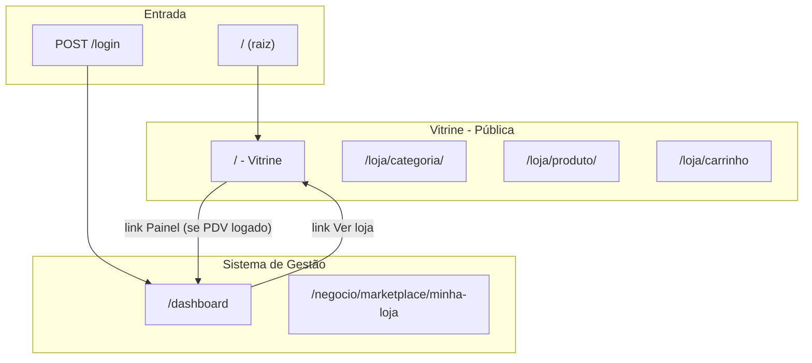

# MAPA DE PADRONIZAÇÃO — PDV e Vitrine (Loja)

**Uso:** Fonte única de verdade para terminologia, hierarquia de rotas e navegação entre Sistema de Gestão (PDV) e Vitrine. Consultar ao implementar alterações que envolvam acesso à loja, fluxos de usuário PDV na vitrine ou links entre painel e loja.

**Última atualização:** 2026-06-18

---

## 1. Glossário

| Termo | Definição |
|-------|-----------|
| **Sistema de Gestão (PDV)** | Backoffice do Ibix: vendas, estoque, fiscal, caixa, marketplace (gestão), relatórios. Rotas em `/dashboard`, `/negocio/*`, `/admin/*`, etc. Template base: `base.html` com sidebar. |
| **Vitrine** | Interface pública de compras. Página onde o consumidor final navega, busca produtos, adiciona ao carrinho e finaliza compra. Rotas em `/` e `/loja/*`. Template base: `base_loja.html`. |
| **Loja** | Entidade no banco (`lojas_marketplace`). Representa a loja virtual de um estabelecimento (CA). Gestão em `/negocio/marketplace/minha-loja`. |
| **Marketplace** | Conceito geral da plataforma multi-vendedor: vitrine central que agrega produtos de todas as lojas dos CAs. |
| **CA (Cliente Administrador)** | Cliente do SaaS, dono da assinatura, gestor de estabelecimentos e da loja. |
| **Consumidor** | Cliente final que compra na vitrine (não é usuário do PDV). Cadastrado em `consumidores_marketplace`. |

---

## 2. Hierarquia de Rotas

| Rota | Descrição | Acesso |
|------|-----------|--------|
| `/` | Vitrine (home da loja) | Público; sempre exibida |
| `/index.html` | Igual a `/` | Público |
| `/login` | Login PDV (CA, Admin, técnico, etc.) | Público; layout vitrine (`base_loja.html`) — **não** confundir com `/loja/login` |
| `/logout` | Logout PDV (GET) | Invalida JWT + remove cookies HttpOnly + redirect `/login` |
| `/dashboard` | Painel do sistema | Usuário PDV autenticado |
| `/loja` | Landing institucional | Público |
| `/loja/categoria/{slug}` | Vitrine por categoria | Público |
| `/loja/produto/{id}` | Detalhe do produto | Público |
| `/loja/busca` | Busca na vitrine | Público |
| `/loja/carrinho` | Carrinho | Público / consumidor |
| `/loja/checkout` | Finalizar compra | Público / consumidor |
| `/loja/login` | Login consumidor | Público |
| `/loja/minha-conta` | Conta do consumidor | Consumidor logado |
| `/loja/meus-pedidos` | Pedidos do consumidor | Consumidor logado |
| `/negocio/marketplace` | Gestão marketplace | PDV com `marketplace:visualizar` |
| `/negocio/marketplace/minha-loja` | Minha loja (config e anúncios) | PDV com `marketplace:visualizar` |

---

## 3. Diagrama de Arquitetura

---

## 4. Navegação Bidirecional

| Origem | Destino | Elemento |
|--------|---------|----------|
| Sidebar PDV | Vitrine (`/`) | Link **"Ver loja"** (abre em nova aba) |
| Header Vitrine | Dashboard (`/dashboard`) | Link **"Painel"** (visível apenas quando usuário PDV está logado) |

**Regra:** A vitrine (`/`) é sempre acessível, inclusive para usuários PDV logados. O redirect para `/dashboard` **não** ocorre ao acessar `/`. O redirect para `/dashboard` ocorre apenas **após o login** (POST de autenticação), e somente se o cookie JWT for válido **e** o middleware resolver o usuário (com RLS: `populate_pdv_user_context` — ver MAPA_MULTIBRAND § 6). Cookie inválido ou usuário não resolvido: `/login` permanece ou limpa cookies stale.

---

## 5. Autenticação

| Contexto | Cookie | Tabela | Observação |
|----------|--------|--------|------------|
| Usuário PDV (gestão) | `pdv_solumatica_token` (+ legado `pdv_automscale_token`) | `usuarios` | **HttpOnly** — JS não lê via `document.cookie`; front usa `credentials: 'include'` e `GET /api/v1/auth/me` |
| Consumidor (vitrine) | `loja_consumidor_token` | `consumidores_marketplace` | Sessão independente do PDV |

São sessões independentes. Um usuário PDV pode estar logado no painel e, ao acessar a vitrine, ver o link "Painel" para retornar. Pode também logar-se como consumidor na vitrine (outro cookie).

**Logout PDV (2026-06-18):**

| Via | Comportamento |
|-----|---------------|
| Dropdown **Sair** | `POST /api/v1/auth/logout` com `credentials: 'include'` → blacklist JWT + `clear_pdv_auth_cookies()` |
| Link **GET /logout** | Mesma invalidação + redirect 302 → `/login` |
| Front | `user-dropdown.js` — não depende de token legível no JS; `certipeso.js` não redireciona cegamente em 401 |

**Rotas distintas — sem conflito técnico:** `/login` (PDV) vs `/loja/login` (consumidor); cookies e APIs separados.

## 5.1 Identidade do comprador no checkout (`tenant_id` NULL e `meus-pedidos`)

`resolve_comprador_para_loja` (em `app/services/marketplace_checkout_pedido_service.py`) reutiliza a sessão JWT do consumidor quando o e-mail do body do checkout coincide com o e-mail da sessão **e** o `tenant_id` da sessão é igual ao `cliente_id` da loja **ou** é NULL (conta legada / cadastro sem `loja_id`). Caso contrário, cai em `get_or_create_consumidor` no modo guest. Isso garante que `GET /api/v1/loja/meus-pedidos` (que filtra por `comprador_id == consumidor.id` do JWT) liste o pedido recém-criado.

**Reparação retroativa:** pedidos criados antes dessa fix podem ter `comprador_id` apontando para um guest duplicado (mesmo `tenant_id` + mesmo e-mail do consumidor registrado). Para repará-los, o Super Admin chama `POST /api/v1/marketplace/admin/reparar-comprador-pedidos` por tenant, primeiro com `dry_run=true` (relatório) e, após validação, `dry_run=false` (aplica + grava `audit_log` e `pedido_status_evento` por pedido). Cancelamento e devolução pelo consumidor (`/api/v1/loja/cancelar`, `/api/v1/loja/devolucao`) só funcionam quando `comprador_id` aponta para o consumidor logado, então a reparação é pré-requisito para o consumidor agir sobre pedidos antigos.

---

## 6. Referências

- **Arquitetura geral:** [MAPA_DO_SISTEMA.md](MAPA_DO_SISTEMA.md)
- **Módulo Marketplace e Vitrine:** MAPA_DO_SISTEMA.md § 12
- **Regras:** [MAPA_DE_REGRAS.md](MAPA_DE_REGRAS.md)
- **Índice:** [INDICE.md](INDICE.md)
