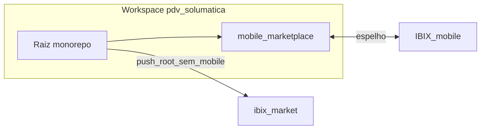

# Repositórios GitHub — PDV Ibix / Ibix Market

Documentação única para não confundir **dois repositórios** com escopos diferentes. Ambientes podem usar SSH ou HTTPS.

## Pré-requisitos no servidor (VPS)

Os repositórios **`IBIX_mobile`** e **`ibix_market`** são privados ou exigem autenticação: sem **chave SSH** ([deploy keys](https://docs.github.com/en/authentication/connecting-to-github-with-ssh/managing-deploy-keys)) ou token configurado, `git clone` / `git push` falham (`Permission denied (publickey)` ou prompts HTTPS).

Scripts na raiz do projeto (executar no VPS **depois** de configurar SSH para `github.com`):

- **GitHub → pasta local:** [`scripts/sync-mobile-from-github.sh`](../scripts/sync-mobile-from-github.sh) (equivalente: `sync_mobile_from_github.sh`)
- **Pasta local → GitHub (espelho mobile):** [`scripts/sync-mobile-to-github.sh`](../scripts/sync-mobile-to-github.sh)
- **Raiz PDV → GitHub (`ibix_market`, sem `mobile_marketplace/`):** [`scripts/push_root_sem_mobile_ibix_market.sh`](../scripts/push_root_sem_mobile_ibix_market.sh)

Variáveis opcionais: `IBIX_MOBILE_SSH`, `IBIX_MOBILE_PUSH_BRANCH`; `IBIX_MARKET_SSH`, `IBIX_MARKET_PUSH_BRANCH`.

Documento canónico de política e avisos (fonte de verdade = VPS): [`../REPOSITORIOS_GITHUB.md`](../REPOSITORIOS_GITHUB.md).

### Fingerprints SSH (duas coisas diferentes)

1. **Host key de `github.com` (servidor)** — aparece na primeira conexão SSH (`git clone`, `ssh -T git@github.com`). Deve bater **exatamente** com a lista oficial do GitHub: [SSH key fingerprints](https://docs.github.com/en/authentication/keeping-your-account-and-data-secure/githubs-ssh-key-fingerprints). Neste ambiente, `ssh-keyscan github.com` combinou com:

   | Algoritmo | SHA256 |
   |-----------|--------|
   | ED25519 | `+DiY3wvvV6TuJJhbpZisF/zLDA0zPMSvHdkr4UvCOqU` |
   | ECDSA | `p2QAMXNIC1TJYWeIOttrVc98/R1BUFWu3/LiyKgUfQM` |
   | RSA | `uNiVztksCsDhcc0u9e8BujQXVUpKZIDTMczCvj3tD2s` |

   Para fixar sem prompt interativo, use as linhas `github.com ssh-ed25519 …` (e opcionalmente ECDSA/RSA) da própria página oficial no `~/.ssh/known_hosts`.

2. **Fingerprint da *sua* chave (deploy key / conta)** — o GitHub mostra um SHA256 para cada chave **que você cadastrou**. Isso **não** é o mesmo que o fingerprint do host acima. Exemplo anotado pela equipe para o fluxo mobile: `SHA256:JaGjE4hLZJc0nFjv2LScAd/0FoABWfN5nCEA5fAChuk` — trate como identificador da **chave permitida no repo** `IBIX_mobile`; confira no GitHub em **Settings → Deploy keys** ou **SSH keys** se bate com a chave `.pub` local (`ssh-keygen -lf ~/.ssh/sua_chave.pub`).

Se ao conectar em **`github.com`** aparecer um SHA256 que **não** está na tabela oficial do item 1, **não aceite** até investigar (host errado, typo ou interceptação).

## Tabela de referência

| Repositório | HTTPS | SSH | Escopo no disco |
|-------------|-------|-----|-----------------|
| **IBIX_mobile** | `https://github.com/jkhons/IBIX_mobile.git` | `git@github.com:jkhons/IBIX_mobile.git` | Só o interior de `mobile_marketplace/`. A **raiz** do repo remoto = raiz do app Expo (sem backend Python). |
| **ibix_market** | `https://github.com/jkhons/ibix_market.git` | `git@github.com:jkhons/ibix_market.git` | **PDV sem pasta `mobile_marketplace/`** — espelho via [`push_root_sem_mobile_ibix_market.sh`](../scripts/push_root_sem_mobile_ibix_market.sh). |

## Estado no disco (importante)

- Na VPS o trabalho costuma ser **monorepo** em `/central_solumatica/pdv_solumatica` (inclui `mobile_marketplace/`).
- Para o GitHub, o conteúdo é **separado por script**: mobile → `IBIX_mobile`; raiz sem mobile → `ibix_market`. Ver [`../REPOSITORIOS_GITHUB.md`](../REPOSITORIOS_GITHUB.md).

## Fonte de verdade

- **Produção / mais atual:** disco na VPS. **Não** fazer `git pull` na raiz sem rever diff e backup — risco de sobrescrever o sistema em curso.

## CI / `.github/`

Não há pasta `.github/` versionada neste projeto (sem GitHub Actions configuradas no repositório). Isso pode ser adicionado depois em `ibix_market` se necessário.

## Segredos

- Raiz: `.gitignore` ignora `.env`, `client_secret*.json`, uploads, etc.
- Mobile: seguir `mobile_marketplace/.env.example`. **Nunca** commitar `.env`, keystores, `google-services.json`, `GoogleService-Info.plist` ou certificados.

## Fluxo contínuo (recomendado)

- **Dia a dia:** editar na VPS no monorepo (backend + `mobile_marketplace/`).
- **Publicar:** `sync-mobile-to-github.sh` → `IBIX_mobile`; `push_root_sem_mobile_ibix_market.sh` → `ibix_market` (sem pasta mobile no remoto).

---

## Trazer GitHub → VPS (`mobile_marketplace/`)

Recomendado (preserva `.env` e roda `npm ci` + typecheck):

```bash
cd /central_solumatica/pdv_solumatica
./scripts/sync-mobile-from-github.sh
```

Equivalente manual quando o código mobile mais atual estiver **apenas** em `IBIX_mobile`:

```bash
cd /central_solumatica/pdv_solumatica
ENV_BKP="$(mktemp)"
test -f mobile_marketplace/.env && cp -a mobile_marketplace/.env "$ENV_BKP"

TMP="$(mktemp -d)"
git clone --depth 1 git@github.com:jkhons/IBIX_mobile.git "$TMP/IBIX_mobile"
cd "$TMP/IBIX_mobile"
COMMIT_HASH="$(git rev-parse HEAD)"

cd /central_solumatica/pdv_solumatica
rsync -a --delete \
  --exclude '.env' \
  "$TMP/IBIX_mobile/" mobile_marketplace/

test -s "$ENV_BKP" && cp -a "$ENV_BKP" mobile_marketplace/.env
rm -rf "$TMP"
rm -f "$ENV_BKP"

cd mobile_marketplace && npm ci && npm run typecheck
```

(Ajuste a branch com `git clone -b <branch> ...` se o default não for `main`.)

---

## Subir PDV (sem `mobile_marketplace/`) → GitHub (`ibix_market`)

```bash
cd /central_solumatica/pdv_solumatica
./scripts/push_root_sem_mobile_ibix_market.sh
```

Evita empurrar o monorepo inteiro com `git push` para o remoto errado. Remotes e avisos: [`../REPOSITORIOS_GITHUB.md`](../REPOSITORIOS_GITHUB.md).

---

## Espelhar VPS → `IBIX_mobile` (após mudanças no monorepo)

Recomendado:

```bash
cd /central_solumatica/pdv_solumatica
./scripts/sync-mobile-to-github.sh
```

Equivalente manual quando `mobile_marketplace/` foi alterado aqui e o repo só-mobile precisa igualar:

```bash
cd /central_solumatica/pdv_solumatica
TMP="$(mktemp -d)"
git clone git@github.com:jkhons/IBIX_mobile.git "$TMP/IBIX_mobile"
rsync -a --delete \
  --exclude '.git' \
  --exclude '.env' \
  --exclude 'node_modules' \
  mobile_marketplace/ "$TMP/IBIX_mobile/"

cd "$TMP/IBIX_mobile"
git status
git add -A
git commit -m "sync: espelha mobile_marketplace do monorepo ($(date -I))"
git push origin HEAD
rm -rf "$TMP"
```

Revise `git status` antes do commit para não publicar arquivos sensíveis. Para subtrees no futuro, ver [Subtree merging](https://git-scm.com/book/en/v2/Git-Tools-Subtree-Merging).

---

## Diagrama



---

**Última atualização:** 2026-05-13 — `ibix_market` sem `mobile_marketplace/` no remoto; script dedicado. Fingerprints de host: ver secção acima.
