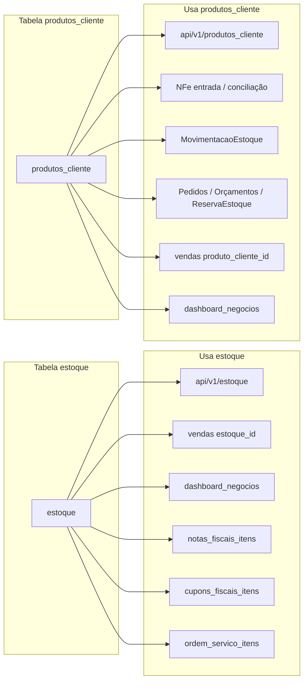

# Colunas e uso das duas tabelas de estoque

Documentação das colunas (com referências) das tabelas `estoque` e `produtos_cliente`, e mapeamento de onde cada uma é usada no sistema, explicando a razão de existirem duas tabelas.

---

## 1. Colunas das duas tabelas (com FKs)

### Tabela `estoque` (modelo [app/models/estoque.py](app/models/estoque.py))

| Coluna | Tipo | Referência (FK) | Observação |
|--------|------|-----------------|------------|
| id | (BaseModel) | — | PK |
| usuario_id_cliente_admin | Integer | **usuarios.id** (RESTRICT) | Tenant: dono do produto = CA |
| codigo | String(50) | — | Único por CA (uq com usuario_id_cliente_admin) |
| nome | String(255) | — | |
| descricao | Text | — | |
| categoria | String(100) | — | |
| tipo_material | Enum | — | lacre, selo, peca, consumivel, servico, outros |
| categoria_id | Integer | **material_categoria.id** | |
| fabricante, fornecedor, numero_serie, lote | String | — | |
| quantidade_atual, quantidade_minima, quantidade_maxima | DECIMAL | — | |
| unidade_medida | String(20) | — | default 'UN' |
| valor_custo, valor_venda, margem_lucro | DECIMAL | — | |
| localizacao, prateleira, posicao | String | — | |
| data_validade, data_fabricacao, tempo_garantia_meses | Date/Integer | — | |
| ativo, controla_estoque, permite_negativo, bloqueado | Boolean | — | |
| especificacoes_tecnicas, dimensoes | JSON | — | |
| peso, cor, material | DECIMAL/String | — | |
| lacre_*, selo_*, numero_serie_peca, data_instalacao, tecnico_instalou_id, foto_peca, comprovante_nf | vários | **usuarios.id** (tecnico_instalou_id) | Campos específicos lacres/selos/peças |
| cliente_id | Integer | **clientes.id** | Opcional, "sub-cliente" (não define dono) |
| quantidade_utilizada, valor_total_utilizado | DECIMAL | — | |
| observacoes, alertas | Text/JSON | — | |
| ncm, cest, origem, cfop_padrao, tributacao_fiscal | String/Integer/Boolean | — | Fiscais |
| cst_icms, aliquota_icms, csosn, cst_pis, aliquota_pis, cst_cofins, aliquota_cofins, ipi_* | vários | — | Tributos |
| created_at, updated_at | (BaseModel) | — | |

**Constraint:** `UNIQUE(usuario_id_cliente_admin, codigo)` — código único por CA.

---

### Tabela `produtos_cliente` (modelo [app/models/produto_cliente.py](app/models/produto_cliente.py))

| Coluna | Tipo | Referência (FK) | Observação |
|--------|------|-----------------|------------|
| id | (BaseModel) | — | PK |
| cliente_id | Integer | **clientes.id** (CASCADE) | Estabelecimento (loja) – obrigatório |
| codigo | String(50) | — | Único por estabelecimento (uq com cliente_id) |
| nome | String(255) | — | |
| descricao | Text | — | |
| ncm | String(10) | — | |
| cfop_padrao | String(10) | — | CFOP padrão (ex: 5102) |
| referencia | String(100) | — | Código de referência do produto |
| unidade_medida | String(20) | — | default "UN" |
| valor_custo, valor_venda | Numeric(10,2) | — | |
| quantidade_atual | Numeric(10,2) | — | default 0 |
| quantidade_minima | Numeric(10,2) | — | |
| ativo | Boolean | — | default True |
| created_at, updated_at | (BaseModel) | — | |

**Constraint:** `UNIQUE(cliente_id, codigo)` — código único por estabelecimento.

---

## 2. Onde cada tabela é usada no sistema

### Uso da tabela **`estoque`**

| Módulo | Arquivo | Uso |
|--------|---------|-----|
| API Estoque | [app/api/v1/estoque.py](app/api/v1/estoque.py) | CRUD completo; listagem/estatísticas/categorias/tipos/alertas por `usuario_id_cliente_admin` (e opcionalmente `cliente_id`) |
| Vendas | [app/api/v1/vendas.py](app/api/v1/vendas.py) | Itens de venda podem ter `estoque_id`; busca produtos para venda e atualiza quantidade (legado) |
| Dashboard Negócios | [app/api/v1/dashboard_negocios.py](app/api/v1/dashboard_negocios.py) | Estatísticas de estoque e joins em vendas (com ProdutoCliente) |
| Notas Fiscais | [app/models/nota_fiscal.py](app/models/nota_fiscal.py) | `NotaFiscalItem` tem FK `estoque_id` → Estoque |
| Cupons Fiscais | [app/models/cupom_fiscal.py](app/models/cupom_fiscal.py) | `CupomFiscalItem` tem FK `estoque_id` → Estoque |
| Ordem de Serviço | [app/models/ordem_servico.py](app/models/ordem_servico.py) | `OrdemServicoItem` relaciona com Estoque |

### Uso da tabela **`produtos_cliente`**

| Módulo | Arquivo | Uso |
|--------|---------|-----|
| API Produtos Cliente | [app/api/v1/produtos_cliente.py](app/api/v1/produtos_cliente.py) | CRUD por `cliente_id` (estabelecimento); códigos de barras |
| NFe Entrada | [app/api/v1/nfe_entrada.py](app/api/v1/nfe_entrada.py), [app/services/fiscal/nfe_entrada_service.py](app/services/fiscal/nfe_entrada_service.py) | Vincular item NFe a produto; conciliação atualiza `quantidade_atual`/`valor_custo` em ProdutoCliente |
| Movimentações | [app/api/v1/movimentacoes_estoque.py](app/api/v1/movimentacoes_estoque.py), [app/models/movimentacao_estoque.py](app/models/movimentacao_estoque.py) | `MovimentacaoEstoque` tem FK `produto_cliente_id` → ProdutoCliente |
| Pedidos / Orçamentos | [app/models/pedido.py](app/models/pedido.py), [app/api/v1/pedidos.py](app/api/v1/pedidos.py), [app/api/v1/orcamentos.py](app/api/v1/orcamentos.py), [app/services/pedido_service.py](app/services/pedido_service.py) | `PedidoItem`, `OrcamentoItem`, `ReservaEstoque` usam `produto_cliente_id` |
| Vendas | [app/api/v1/vendas.py](app/api/v1/vendas.py), [app/models/venda.py](app/models/venda.py) | `VendaItem` pode ter `produto_cliente_id` (Fase 2); baixa de estoque em ProdutoCliente |
| NFe Itens | [app/models/nfe_entrada.py](app/models/nfe_entrada.py) | `NfeItem` tem FK `produto_cliente_id` (vínculo na conciliação) |
| Dashboard Negócios | [app/api/v1/dashboard_negocios.py](app/api/v1/dashboard_negocios.py) | Junta vendas com Estoque e ProdutoCliente (coalesce nome/custo) |
| Tela /negocio/estoque | [app/templates/meu_negocio/estoque/index.html](app/templates/meu_negocio/estoque/index.html) | Passou a usar apenas API produtos-cliente (estabelecimento) |

---

## 3. Por que existem duas tabelas?

- **`estoque`**: modelo **legado por tenant CA** (`usuario_id_cliente_admin`). Um CA pode ter vários estabelecimentos; o produto pertence ao CA, com `cliente_id` opcional. Pensado para estoque "central" do CA, com muitos campos (lacres, selos, peças, fiscal, etc.).
- **`produtos_cliente`**: modelo **Fase 2 por estabelecimento** (`cliente_id` = loja/estabelecimento). Cada loja tem seu próprio catálogo; isolamento loja A vs loja B. Campos enxutos; integra com NFe entrada, pedidos, orçamentos, reservas e movimentações.

Ou seja: **duas visões de "donos" do produto** — por **CA** (estoque) vs por **estabelecimento** (produtos_cliente). O sistema hoje convive com os dois: vendas e dashboard usam `estoque_id` e `produto_cliente_id` em paralelo; a tela /negocio/estoque foi unificada para usar só `produtos_cliente` para não misturar as duas bases na mesma tela.

---

## 4. Resumo

- **Colunas e FKs**: `estoque` tem FKs para `usuarios`, `clientes`, `material_categoria` e muitos campos; `produtos_cliente` tem FK para `clientes` e poucos campos.
- **Quem usa o quê**: `estoque` → API estoque, vendas (legado), NF, cupom, ordem de serviço, dashboard. `produtos_cliente` → API produtos-cliente, NFe entrada, movimentações, pedidos/orçamentos/reservas, vendas (Fase 2), tela /negocio/estoque.
- **Motivo das duas**: escopo diferente (CA vs estabelecimento) e evolução do produto (legado + Fase 2 por loja).
